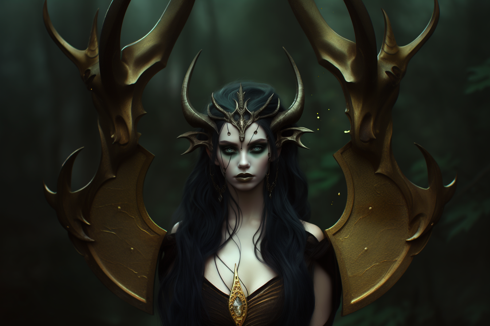

# Valkyrie Dreki

[Link to character sheet](https://docs.google.com/spreadsheets/d/1OW94_PlUuAagz_ABtH1D27frYI7h_97YNRW1XpEweaw/edit?usp=sharing)

## Backstory

Valkyrie hails from a tribe of Nature Dragonkin residing in the ancient expanse of the Old Growth Forest located in eastern Reddland. In their role as forest guardians, her tribe ensures that wandering travelers do not meet their demise, for the dragon-infested woods consume all who venture too deeply.

At a sprightly age of 87, Valkyrie still exudes youthful vitality, although this is considered typical for her kind. Her people adhere to the teachings of Nature, and thus, they do not engage in falsehoods. Instead, they may sometimes employ misdirection.

Valkyrie has perpetually possessed a quick temper. While her people are renowned for their peaceful requests for intruders to depart, Valkyrie doesn't mind employing a touch more assertiveness when dealing with those who threaten her forest. She possesses no tolerance for fools or individuals who disrespect the sanctity of nature.

## Appearance

Age: 87

Race: Leshinkin

Height: 5'6""

Body Type: Athletic

## Disposition

- Loose Canon
- Blunt
- Truthful

## Goals/Aspirations

- To protect Old Growth Forest.
