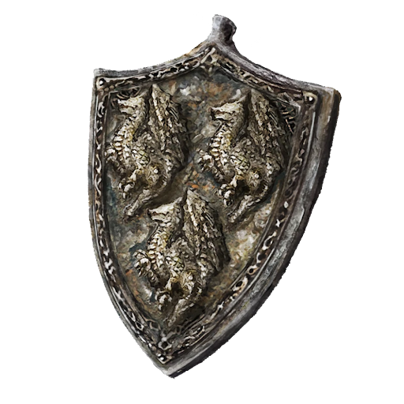

# Steel Dragon Scale Talisman +2

## Desc

A wrought iron talisman made with the visage of three Steel Dragons. This item is quite rare and powerful, requiring a fair amount of labor and wealth to create. As such it is usually only seen worn by Knights of the Nobility and well established mercenary leaders.

## Info

Item Type: Talisman

Tier: Very Rare

## Effects

### Major Physical Defense
