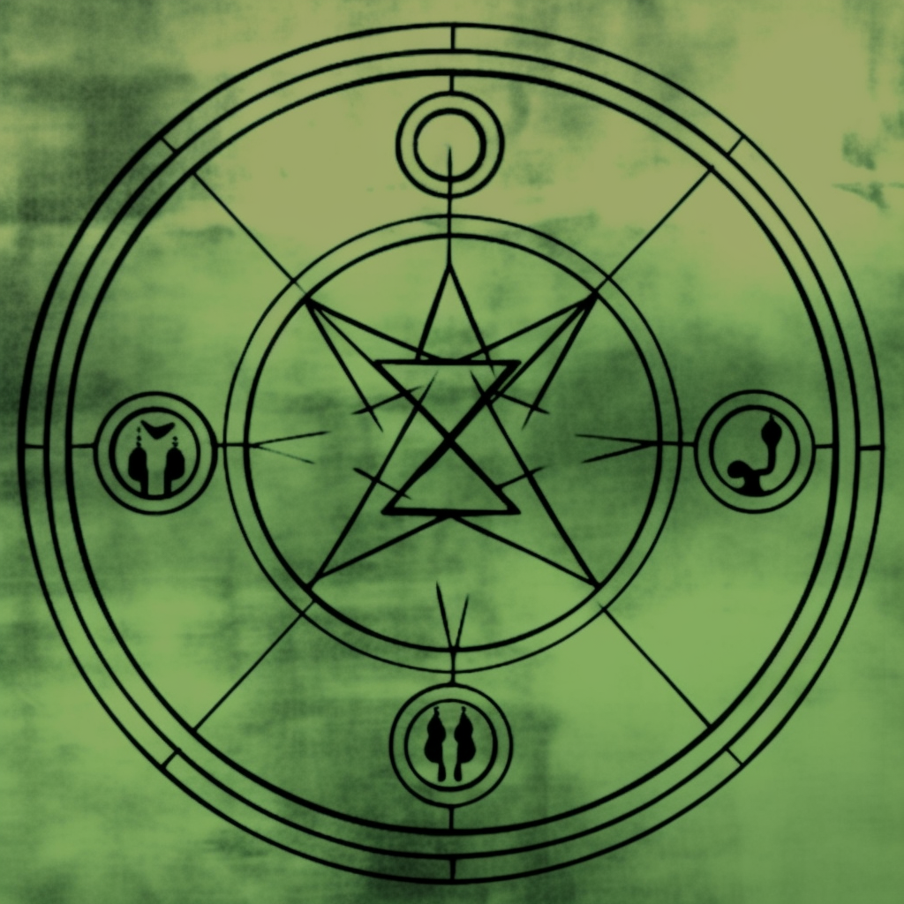

## Runecraft

Runes are symbols that have been discovered, usually via academic endeavors, dreams, meditation and psychedelic experiences, that represent fundamental laws that govern reality. Runesmiths (reffered to as Wizards or Mages in some cultures) use conscious thought to manipulate reality in a favorable direction. Runes can be used to make all kinds of marvels. Scrolls, Potions, Runeforged items are applications of Runecraft. Scrolls are very common due to their ease of creation and affordability.

To draw a rune is not enough to have it take effect. First, a conscious being must create the Rune. Secondly, the user must deeply understand the concept they are trying to invoke and be able to take it into conscious thought. Intelligence seems to be the gateway to Runecraft, as minds that are too weak buckle under the weight of the knowledge of the fabric of reality, leading to horrific accidents, madness, and death.

### Pure Runes

Pure Runes are the most basic states of reality and take raw energy as their inputs. Pure Runes represent a single concept of reality such as Fire, Dark, or Soul. Quick to create and versitile, Pure Runes are only limited by the creativity of their user.

#### [Fire Rune](Runecrafts/PureRunes/FireRune.md)

#### [Earth Rune](Runecrafts/PureRunes/EarthRune.md)

#### [Water Rune](Runecrafts/PureRunes/WaterRune.md)

#### [Air Rune](Runecrafts/PureRunes/AirRune.md)

#### [Electricity Rune](Runecrafts/PureRunes/ElectricityRune.md)

#### [Cold Rune](Runecrafts/PureRunes/ColdRune.md)

#### [Toxins Rune](Runecrafts/PureRunes/ToxinsRune.md)

#### [Blood Rune](Runecrafts/PureRunes/BloodRune.md)

#### [Light Rune](Runecrafts/PureRunes/LightRune.md)

#### [Dark Rune](Runecrafts/PureRunes/DarkRune.md)

#### [Sound Rune](Runecrafts/PureRunes/SoundRune.md)

#### [Body Rune](Runecrafts/PureRunes/BodyRune.md)

#### [Mind Rune](Runecrafts/PureRunes/MindRune.md)

#### [Soul Rune](Runecrafts/PureRunes/SoulRune.md)

#### [Time Rune](Runecrafts/PureRunes/TimeRune.md)

#### [Strength Rune](Runecrafts/PureRunes/StrengthRune.md)

#### [Gravity Rune](Runecrafts/PureRunes/GravityRune.md)

### Compound Runes

Compound Runes are constructed with Pure Runes, some of which are famous and named after their creators. Compound Runes and rare Pure runes are controlled by powerful universities and the Royal families that sponsor them. The length to which these organizations will go to protect their intellectual property is staggering, as an arms race between runes and biological magic develops.

#### [Slow Fall](Runecrafts\CompoundRunes\SlowFall.md)

#### [Oil Spill](OilSpill.md)

#### [Minor Mirage](MinorMirage.md)

#### [Flame Tongued]()

### Crafting a Rune

Three things are required to craft a Rune.

#### Knowledge of Runes

In order for Runes to work, the user must consciously look beyond the mere symbols into the exposed laws of reality, understand the property they are trying to manifest and bind the phenomena that they are trying to control to a symbol. Common symbols have been agreed upon through the ages as a way for scholars and runesmiths to share they're work. In many ways, Runes act as safeguards for the user's consciousness, reducing the infinite laws of reality to a single phenomena. If the user is sufficiently intelligent to understand the complexity of a Rune, they may bind the desired phenomena within the Rune.

If an insufficiently intelligent  person tried to simply draw the shape of the Rune of Fire, nothing would happen. Though if they truly tried to understand the Rune, the concept of fire itself, their mind could be permanently damaged forever.

#### Energy

While anything could hypothetically be used for energy, generally runesmiths lean towards more energy dense sources as they are simply easier to carry.

##### Ichor from Monster or Fellkin blood

Ichor is a plentiful source of energy, common, and very energy dense. It is by far the most commonly used energy for Runecraft.  Requires an Inverse Rune of Blood to output the energy.

##### Charged Electrite

A charged electrite crystal is commonly used to store the required energy, as it is extremely stable. Requires an Inverse Rune of Electricity to output the energy.

#### An object to hold the rune

Most Runesmith use scrolls for simple one time use runes, as they are affordable and easy to write runes on. Usually, the object the rune is located on physically receives damage up to the activation of the rune, as the energy stored within the object is consumed. Some Runesmith will create staves of other conduits inscribed with runes. These are made in a particular way to resist the toll of the rune, though they will eventually need to be repaired.

It is known that the body can be a vessel for runes, though the effect often leads to a reduced life span, bad health, or madness. Though due to the immense power that can be gained, many take on the risk.

### Runecraft Roll

This roll represents your abilities with specific Runecrafts. A minimum of 1 Energy  is required to make a  Runecraft Roll. Energy  up to the level in the user's Runesmith vocation can be consumed, adding an additional d6 to the Runecraft Roll for each Energy consumed.

- Runecraft Roll = 3d6 (base) + Xd6 (Runecraft Skill) + Xd6 (INT) + Xd6 (Energy Consumed capped by Runesmith Vocation)

### Overcharging Runes

When creating a rune, a runesmith can overload a rune with energy, resulting in an additional +1d6 to the effect. However, since the rune was not made properly (as you are going above your Runesmith Vocation energy cap) the rune will have erratic behavior. Roll a d20 to determine the nature of the malfunction.

| d20 | Runecraft Malfunction table                                                                                                                                                                                                                                                             |
| --- | --------------------------------------------------------------------------------------------------------------------------------------------------------------------------------------------------------------------------------------------------------------------------------------- |
| 1   | You suddenly realize that you are nothing more than a fictional character in a game played by other creatures in another plane of existence, which causes you to be stunned. This existential crisis lasts until the start of your next turn, after which you shake it off as nonsense. |
| 2   | You become petrified for 1d10 rounds.                                                                                                                                                                                                                                                   |
| 3   | A clone of the caster appears, desperately claiming to be the original.                                                                                                                                                                                                                 |
| 4   | The one who activated the rune fall asleep                                                                                                                                                                                                                                              |
| 5   | All doors and windows within 60' of the caster fly open.                                                                                                                                                                                                                                |
| 6   | You permanently lose the ability to smell. This sense can be restored with a spell that removes curses such as remove curse.                                                                                                                                                            |
| 7   | The spell's target becomes overwhelmed by a desire to eat the caster.                                                                                                                                                                                                                   |
| 8   | The caster and target are flung 10' in opposite directions.                                                                                                                                                                                                                             |
| 9   | The caster and target are both whisked to the Astral Plane for the next minute.                                                                                                                                                                                                         |
| 10  | A small songbird pops into existence in mid-flight 10 feet above the caster. Roll a d20. On a 1, the bird poops and it lands on the caster. On a 20, the bird poops and it lands on the target of the spell.                                                                            |
| 11  | Rune converts to Shockwave effect                                                                                                                                                                                                                                                       |
| 12  | Rune converts to Water effect                                                                                                                                                                                                                                                           |
| 13  | Rune converts to Bleed effect                                                                                                                                                                                                                                                           |
| 14  | Rune converts to Electric effect                                                                                                                                                                                                                                                        |
| 15  | Rune converts to Cold effect                                                                                                                                                                                                                                                            |
| 16  | Rune converts to Dark effect                                                                                                                                                                                                                                                            |
| 17  | Rune converts to Mental effect                                                                                                                                                                                                                                                          |
| 18  | Rune converts to Spiritual effect                                                                                                                                                                                                                                                       |
| 19  | Rune converts to Fire effect                                                                                                                                                                                                                                                            |
| 20  | The world slows down around the caster. The caster gets to take an additional action.                                                                                                                                                                                                   |

### Runecraft in Combat

Runecraft takes time to do properly, Runesmiths prepare their Runecrafts well ahead of when they would actually need them. Trying to create runes in battle is at best foolish and usually a death sentence.

Simple Pure Runes bound to scrolls are an extremely common way of preparing for combat. When the user creates the scroll, they are able to craft a specific rune, and at the time they choose to use it, they will use their specific Runecraft roll from when it was created as its combat roll.
