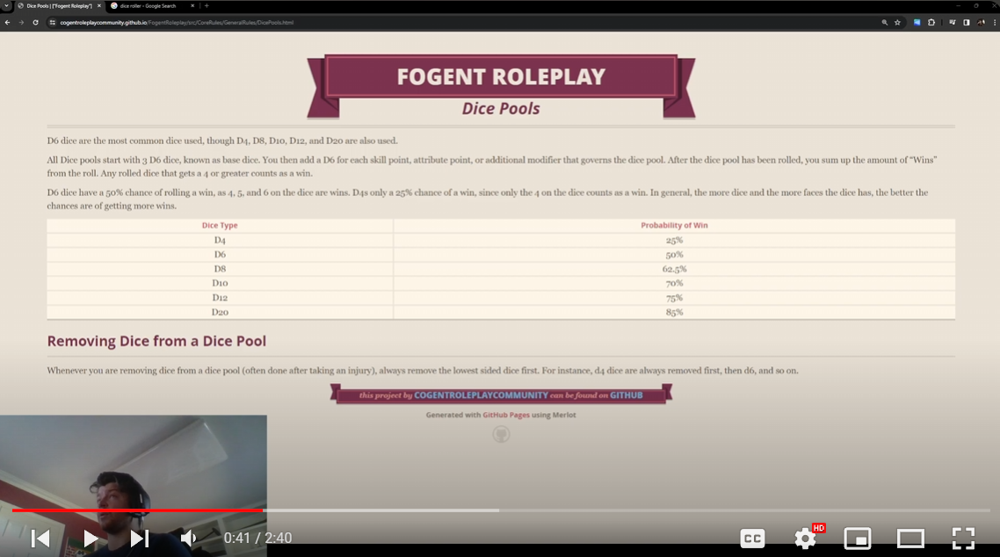

## What is Fogent Roleplay

Welcome to Fogent Roleplay.

Fogent Roleplay is a TTRPG (Table Top Roleplay Game) that is intended to remove unneeded complexity common in many TTRPGs while not sacrificing emergent/tactical gameplay. If you love the simplicity, flexibility, and narrative focus of Cogent Roleplay, but love tactical battle map combat, magic items, campaign progression, and sweet loot of D&D, then you are in the right place.

What makes Fogent Roleplay different then D&D:

- **Simple Rules:** While other TTRPGs require multiple books worth of rules to play, by contrast, Fogent probably has ~15 pages of rules, much of which consist of examples. This makes the game extremely easy for new players to pick up.
- **Narrative Focused:** Most TTRPGs feel very different in and out of combat, with non-combat roleplay having great narrative flow where your character can attempt anything that seems reasonable and combat feeling basically like a video game where characters can only perform the exact actions as described in the rules. Fogent Roleplay handles everything within the narrative flow while still having balanced combat. Combat in Fogent Roleplay feels more like an awesome fight scene in a movie or book, rather than video game characters just trying to get each other to 0 HP.
- **Emergent Complexity:** Fogent Roleplay has very simple rules that when combined can do some amazing things. Examples of emergent complexity include Chess and Minecraft, both of which have fairly simple rules, but are extremely satisfying for veteran players to master!
- **Setting Agnostic:** Unlike most TTRPGs, Fogent Roleplay and it's rules aren't tied any setting. It can easily be used to run games in existing settings or in brand-new ones you create. This way, your group could learn one easy-to-use system to play settings such as medieval fantasy, cyberpunk, galactic warfare, survival horror, etc...

What makes Fogent Roleplay different then Cogent Roleplay:

* **Tactical Battlemap Combat:** Fogent Roleplay has rules to be run on a battlemap. This allows for awesome tactical fight scenes where a character's positioning and surrounding environment factor into combat. While Fogent Roleplay can be run in the theater of the mind, it works even better on a battlemap.
* **Enumerable Improvements:** Whether it be better Core Skills, reworked Vocations, rebalanced weapon classes, advantage/disadvantage system, rebalanced destiny point rules, etc... Fogent Roleplay has continued to innovate.
* **Magic System Template:** The Magic System Template allows for the easy creation of balanced magic systems regardless of the setting.
* **Premade Settings:** If you don't have the time to come up with an entire setting for your player to play in, Fogent Roleplay comes with premade campaign settings. This is an ongoing effort with more becoming available over time.

-Javk Wick, "The Forever Narrator"

## Join our community!

Join the Fogent Roleplay Community Discord or subscribe to the Javk Wick YouTube channel. Your feedback and experience mean a lot!

Discord: [Fogent Roleplay Discord](https://discord.gg/PYNTGqxh6a)

YouTube: [Javk Wick Youtube Channel](https://www.youtube.com/channel/UCIozVe_NJI66urdnVfMkCJg)

## Cogent Roleplay Open License

Fogent Roleplay is developed based on Cogent Roleplay and with appreciation to its creators is under the the Cogent Roleplay Open License.

All game mechanics and game systems built on top of Cogent Roleplay within this document are open and freely available for anyone to re-use, include, adapt or develop, in their projects that are also based on Cogent Roleplay.

Any use of game mechanics and game systems from this document requires attribution to this document for the said mechanics/systems, along with a link back to Fogent Roleplay.

All intellectual property (characters, brands, stories, designs, etc) contained within this document is entirely owned by the creator of this document and is not subject to the Cogent Roleplay Open Source license. However, the creator of this document loves collaboration and encourages people to reach out if they would like to help contribute to this document. He doesn't bite. Long live open-source fun. :)

Link to Cogent Roleplay Website: [https://cogentroleplay.com/](https://cogentroleplay.com/)

## Settings

Fogent Roleplay is designed to be the narrative engine of your game, no matter the setting. Below are the current pre-made settings you can run Fogent Roleplay in. If none of these are to your liking you are encouraged to make your own setting!

- [Fallen](./src/Settings/Fallen/Fallen.md) (Dark Fantasy)
- [Coming soon] Fracture (Post-Apocalypse)

## Core Rules

The Core Rules are the foundation and narrative engine for your game.

Learning any new TTRPG system can feel daunting. Luckily, to make it easy to learn, I created a video playlist breaking down each of the rules in bite-sized digestible chunks , that even your mom who's never played a TTRPG could learn, I know so because mine did.

The rules have been listed in the order of importance to someone learning the game for the first time. Click the video below to be taken to the video walkthrough of the rules.

### General Rules

- [Dice Pools](./src/CoreRules/GeneralRules/DicePools.md)
- [Challenge Levels](./src/CoreRules/GeneralRules/ChallengeLevels.md)
- [Attributes](./src/CoreRules/GeneralRules/Attributes.md)
- [Skills](./src/CoreRules/GeneralRules/Skills.md)
- [Core Skills](./src/CoreRules/GeneralRules/CoreSkills.md)
- [Vocations](./src/CoreRules/GeneralRules/Vocations.md)
- [Tied Contested Checks](./src/CoreRules/GeneralRules/TiedContestedChecks.md)
- [Assists](./src/CoreRules/GeneralRules/Assists.md)
- [Advantage And Disadvantage](./src/CoreRules/GeneralRules/AdvantageAndDisadvantage.md)
- [Destiny Points](./src/CoreRules/GeneralRules/DestinyPoints.md)

### Combat Rules

- [Damage Types](./src/CoreRules/CombatRules/DamageTypes.md)
- [Defense and Penetration](./src/CoreRules/CombatRules/DefenseAndPenetration.md)
- [Range](./src/CoreRules/CombatRules/Range.md)
- [Area Of Effect](./src/CoreRules/CombatRules/AreaOfEffect.md)
- [Engageable Opponents](./src/CoreRules/CombatRules/EngageableOpponents.md)
- [Battle Map](./src/CoreRules/CombatRules/BattleMap.md)
- [Combat Speed](./src/CoreRules/CombatRules/CombatSpeed.md)
- [Weapon Resource Classes](./src/CoreRules/CombatRules/WeaponResourceClasses.md)
- [Weapon Classes](./src/CoreRules/CombatRules/WeaponClasses.md)
- [Weapon Combat Roll](./src/CoreRules/CombatRules/CombatRolls.md)
- [Dodge Roll](./src/CoreRules/CombatRules/DodgeRoll.md)
- [Combat Round](./src/CoreRules/CombatRules/CombatRounds.md)
- [Conditions](./src/CoreRules/CombatRules/Conditions.md)
- [Injury](./src/CoreRules/CombatRules/Injury.md)
- [Victory Levels](./src/CoreRules/CombatRules/VictoryLevels.md)
- [Weakness and Resistance](./src/CoreRules/CombatRules/WeaknessAndResistance.md)
- [Combat Modifiers](./src/CoreRules/CombatRules/CombatModifiers.md)

### Advanced Rules

- [Carry Weight](./src/CoreRules/AdvancedRules/CarryWeight.md)
- [Healing](./src/CoreRules/AdvancedRules/Healing.md)
- [Vision and Light](./src/CoreRules/AdvancedRules/VisionAndLight.md)
- [Weapon Skill Transfer](./src/CoreRules/AdvancedRules/WeaponSkillTransfer.md)
- [Containers](./src/CoreRules/AdvancedRules/Containers.md)
- [Item Class](./src/CoreRules/AdvancedRules/ItemClass.md)
- [Item Tier](./src/CoreRules/AdvancedRules/ItemTier.md)
- [Item Effects](./src/CoreRules/AdvancedRules/ItemEffects.md)

### Magic Rules

- [Magic Systems](./src/CoreRules/MagicRules/MagicSystems.md)
- [Magic Resource](./src/CoreRules/MagicRules/MagicResource.md)
- [Magic Skills](./src/CoreRules/MagicRules/MagicSkills.md)
- [Spells](./src/CoreRules/MagicRules/Spells.md)

### Character Creation Rules

- [Disabling Characteristics](./src/CoreRules/CharacterCreationRules/DisablingCharacteristics.md)
- [Tiers of Play](./src/CoreRules/CharacterCreationRules/TiersOfPlay.md)
- [Character Creation](./src/CoreRules/CharacterCreationRules/CharacterCreation.md)
