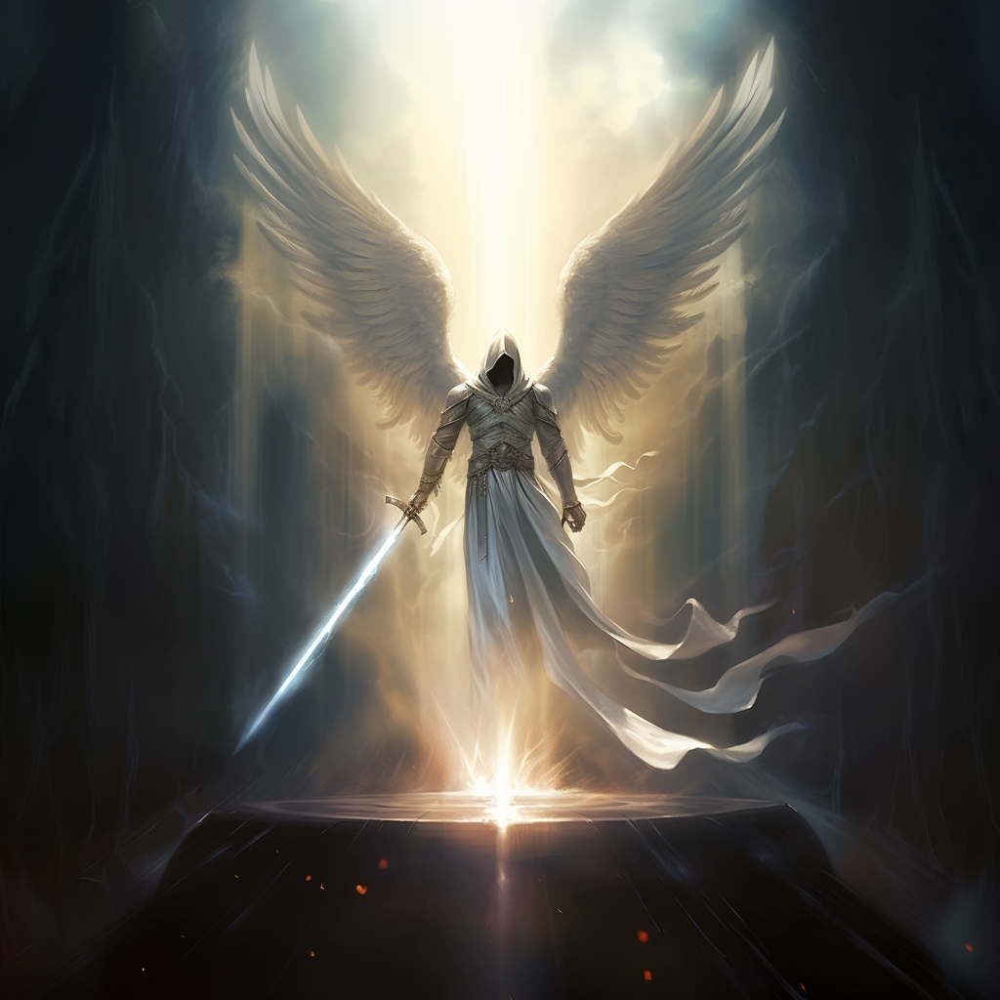
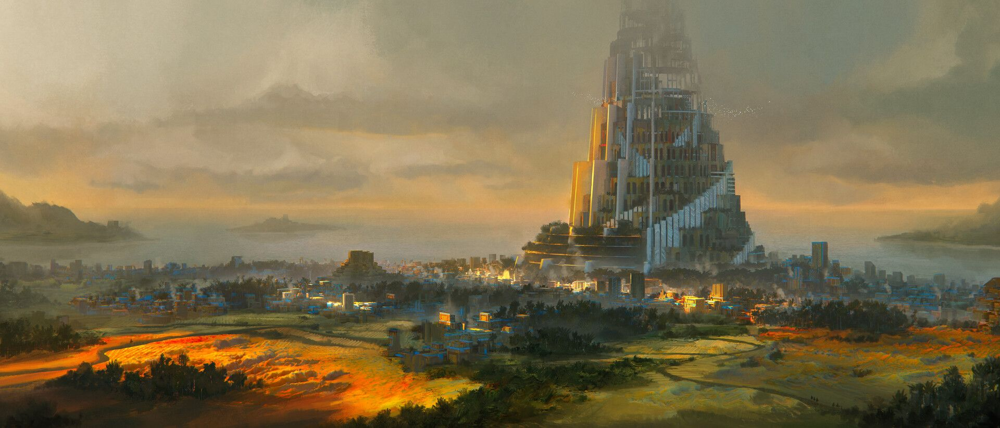
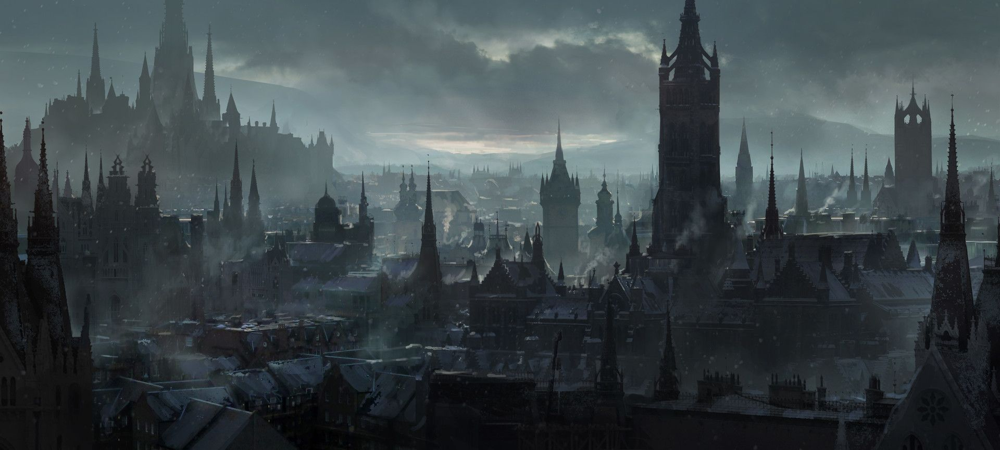

On a dead world, at the end of time, life begins once again...

## Cogent Roleplay Open License

Fallen is developed based on Cognet Roleplay and with appreciation to its creators is under the the Cogent Roleplay Open License.

All game mechanics and game systems contained within this document are open and freely available for anyone to re-use, include, adapt or develop, in their own projects that are also based on Cogent Roleplay.

Any use of game mechanics and game systems from this document requires attribution to this document for the said mechanics/systems, along with a link back to this document.

All intellectual property (characters, brands, stories, desings, etc) contained within this document is entirely owned by the creator of this document and is not subject to the Cogent Open Source license. However, the creator of this document loves collaboration and encourages people to reach out if they would like to help contribute to this document. He doesn't bite.

Long live open source fun. :)

Link to Cogent Roleplay Website: [https://cogentroleplay.com/](https://cogentroleplay.com/)

Map Download: `<!-- Map link here-->`

## Table of Contents

- [Cogent Roleplay Open License](#cogent-roleplay-open-license)
- [Table of Contents](#table-of-contents)
- [Preface](#preface)
- [Special Thanks](#special-thanks)
- [World Lore](#world-lore)
  - [The Awakening](#the-awakening)
  - [The First of Brightkind](#the-first-of-brightkind)
  - [Brightinism](#brightinism)
  - [The Faithful One](#the-faithful-one)
  - [The Great Betrayal](#the-great-betrayal)
  - [The Ascension of the Bright Lord](#the-ascension-of-the-bright-lord)
  - [The Dawn Age](#the-dawn-age)
  - [The High Age](#the-high-age)
- [The Bright Pantheon](#the-bright-pantheon)
  - [The Bright Lord](#the-bright-lord)
  - [The Great Betrayer](#the-great-betrayer)
  - [The Twisting One](#the-twisting-one)
  - [The Bound One](#the-bound-one)
  - [The Beautiful One](#the-beautiful-one)
  - [The Bargainer](#the-bargainer)
  - [The Ravenous One](#the-ravenous-one)
- [Other Deities](#other-deities)
  - [The Moon Presence](#the-moon-presence)
- [Terra](#terra)
  - [The Sun of Terra](#the-sun-of-terra)
  - [The Continent](#the-continent)
- [Countries of Terra](#countries-of-terra)
  - [The Dawn Empire](#the-dawn-empire)
    - [The City of Crossroads](#the-city-of-crossroads)
  - [Reddland](#reddland)
    - [A History of Conquest and Resilience](#a-history-of-conquest-and-resilience)
    - [The Laughing Storm](#the-laughing-storm)
    - [The Redd Blasphemy](#the-redd-blasphemy)
  - [Reddwall](#reddwall)
    - [The Tragedy of Killroy the Fool](#the-tragedy-of-killroy-the-fool)
    - [Tentcity](#tentcity)
  - [The Isles of Crest](#the-isles-of-crest)
    - [Cambria](#cambria)
  - [Uskal](#uskal)
- [Races of Terra](#races-of-terra)
  - [Brightkin](#brightkin)
  - [Dhampires](#dhampires)
  - [Seakin](#seakin)
  - [Beastkin](#beastkin)
  - [Chitinkin](#chitinkin)
  - [Dragonkin](#dragonkin)
  - [Crossbreeds](#crossbreeds)
  - [More Race Ideas](#more-race-ideas)
- [Languages of Terra](#languages-of-terra)
  - [Babelish](#babelish)
  - [Bright-speak](#bright-speak)
  - [Pirish](#pirish)
  - [Deep-speak](#deep-speak)
  - [Primal](#primal)
  - [Kikishi](#kikishi)
  - [Draconic](#draconic)
  - [Demonic](#demonic)
- [Diseases of Terra](#diseases-of-terra)
  - [The Spore](#the-spore)
  - [Shards](#shards)
- [Magic Systems](#magic-systems)
- [Miracles](#miracles)
  - [Miracle Roll](#miracle-roll)
  - [Light](#light)
    - [Generate Light](#generate-light)
    - [Absorb Light](#absorb-light)
  - [Miracle Wonders](#miracle-wonders)
  - [Radiance](#radiance)
    - [Specialization: Hard Light](#specialization-hard-light)
    - [Specialization: Illusions](#specialization-illusions)
    - [Absorb Light: Sun Light](#absorb-light-sun-light)
    - [Radiant Resistance](#radiant-resistance)
  - [Blessing](#blessing)
    - [Buffs](#buffs)
    - [Healing](#healing)
    - [Specialization: Bright&#39;s Heritage](#specialization-brights-heritage)
    - [Absorb Light: Emotion](#absorb-light-emotion)
- [Fellcraft](#fellcraft)
  - [Fellcraft Roll](#fellcraft-roll)
  - [Ichor](#ichor)
    - [Regaining Ichor](#regaining-ichor)
    - [Absorbing Ichor](#absorbing-ichor)
  - [Fellcraft Tricks](#fellcraft-tricks)
    - [Transformation](#transformation)
    - [Polycraft Healing](#polycraft-healing)
    - [Specialization: The Beast](#specialization-the-beast)
    - [Absorbing Ichor: Flesh and Blood](#absorbing-ichor-flesh-and-blood)
    - [Specialization: The Doppelganger](#specialization-the-doppelganger)
    - [Slash Resistance](#slash-resistance)
  - [Blazecraft](#blazecraft)
    - [Specialization: The Fire Dragon](#specialization-the-fire-dragon)
    - [Absorbing Ichor: Fire](#absorbing-ichor-fire)
    - [\[Unfinished\] Specialization: The Phoenix](#unfinished-specialization-the-phoenix)
    - [Fire Resistance](#fire-resistance)
  - [Hydrocraft](#hydrocraft)
    - [Specialization: The Kraken](#specialization-the-kraken)
    - [Specialization: The Sea Serpent](#specialization-the-sea-serpent)
      - [Dragontide](#dragontide)
    - [Absorbing Ichor: Water](#absorbing-ichor-water)
    - [Water Resistance](#water-resistance)
  - [Electrocraft](#electrocraft)
    - [Specialization: The Lightning Dragon](#specialization-the-lightning-dragon)
      - [Dragonlightning](#dragonlightning)
    - [Absorb Ichor: Electricity](#absorb-ichor-electricity)
    - [Electric Resistance](#electric-resistance)
  - [Terracraft](#terracraft)
    - [Specialization: The Terra Dragon](#specialization-the-terra-dragon)
      - [Dragonterra](#dragonterra)
    - [Absorb Ichor: Terra](#absorb-ichor-terra)
    - [Slash, Hew, and Pierce Resistance](#slash-hew-and-pierce-resistance)
  - [Galecraft](#galecraft)
    - [Specialization: The Gale Dragon](#specialization-the-gale-dragon)
      - [Dragongale](#dragongale)
    - [Absorb Ichor: Gale](#absorb-ichor-gale)
    - [Shockwave Resistance](#shockwave-resistance)
  - [Cryocraft](#cryocraft)
    - [Specialization: The Ice Dragon](#specialization-the-ice-dragon)
      - [Dragonfrost](#dragonfrost)
    - [Absorb Ichor: Cold](#absorb-ichor-cold)
    - [Cold Resistance](#cold-resistance)
  - [Naturecraft](#naturecraft)
    - [Specialization: The Nature Dragon](#specialization-the-nature-dragon)
      - [Dragongrowth](#dragongrowth)
    - [Absorb Ichor: Nature](#absorb-ichor-nature)
    - [Bludgeon, Pierce, Slash Resistance](#bludgeon-pierce-slash-resistance)
  - [Toxicraft](#toxicraft)
    - [Specialization: Dragonvenom](#specialization-dragonvenom)
    - [Absorb Ichor: Toxins](#absorb-ichor-toxins)
    - [Toxin/Poison Resistance](#toxinpoison-resistance)
  - [Soulcraft](#soulcraft)
    - [The Way of the Wraith](#the-way-of-the-wraith)
    - [Specialization: The Undead Dragon](#specialization-the-undead-dragon)
      - [Soulfire](#soulfire)
    - [Absorb Ichor: Souls](#absorb-ichor-souls)
    - [Spiritual Resistance](#spiritual-resistance)
  - [Shadowcraft](#shadowcraft)
    - [Shadow Leaping](#shadow-leaping)
    - [Specialization: The Shadow Dragon](#specialization-the-shadow-dragon)
      - [Dragonumbra](#dragonumbra)
    - [Absorb Ichor: Shadow](#absorb-ichor-shadow)
    - [Dark Resistance](#dark-resistance)
  - [Mindcraft](#mindcraft)
    - [Specialization: Dreamcraft](#specialization-dreamcraft)
    - [Absorb Ichor: Thought](#absorb-ichor-thought)
    - [Mental Resistance](#mental-resistance)
  - [Ferracraft](#ferracraft)
    - [Specialization: The Metal Dragon](#specialization-the-metal-dragon)
      - [Dragonsteel](#dragonsteel)
    - [Absorb Ichor: Magnetism](#absorb-ichor-magnetism)
    - [Physical Resistance](#physical-resistance)
  - [Sonocraft](#sonocraft)
    - [Specialization: The Dragon](#specialization-the-dragon)
    - [Absorb Ichor: Sonic Sounds](#absorb-ichor-sonic-sounds)
    - [Shockwave Resistance](#shockwave-resistance-1)
  - [Hemacraft](#hemacraft)
    - [Blood Buffing](#blood-buffing)
    - [Healing Hemacraft](#healing-hemacraft)
    - [Pierce, Slash Resistance](#pierce-slash-resistance)
    - [Specialization: The Healing Blood](#specialization-the-healing-blood)
    - [Absorb Ichor: Blood](#absorb-ichor-blood)
  - [Spidercraft](#spidercraft)
    - [Fellcraft Combination](#fellcraft-combination)
    - [Specialization: The Giant Spider](#specialization-the-giant-spider)
    - [Absorb Ichor: Liquify Prey](#absorb-ichor-liquify-prey)
    - [Spider Climb](#spider-climb)
  - [Plasmacraft](#plasmacraft)
    - [Fellcraft Combination: Plasmacraft](#fellcraft-combination-plasmacraft)
    - [Specialization: The Ancient Dragon](#specialization-the-ancient-dragon)
    - [Absorbing Ichor: Solar and Plasma](#absorbing-ichor-solar-and-plasma)
  - [Stormcraft](#stormcraft)
    - [Fellcraft Combination: Stormcraft](#fellcraft-combination-stormcraft)
    - [Specialization: The Storm Dragon](#specialization-the-storm-dragon)
      - [Control Weather](#control-weather)
  - [Magmacraft](#magmacraft)
    - [Fellcraft Combination: Magmacraft](#fellcraft-combination-magmacraft)
    - [Specialization: The Magma Dragon](#specialization-the-magma-dragon)
      - [Influence Tectonic Plates](#influence-tectonic-plates)
  - [Blizzardcraft](#blizzardcraft)
    - [Fellcraft Combination: Blizzardcraft](#fellcraft-combination-blizzardcraft)
    - [Specialization: The Blizzard Dragon](#specialization-the-blizzard-dragon)
      - [Create Blizzards](#create-blizzards)
  - [Fellcraft Tree](#fellcraft-tree)
- [Runecraft](#runecraft)
  - [Runecraft Roll](#runecraft-roll)
  - [Crafting a Rune](#crafting-a-rune)
  - [Knowledge of Runes](#knowledge-of-runes)
  - [Energy Example](#energy-example)
    - [Ichor of Monster or Fellkin blood](#ichor-of-monster-or-fellkin-blood)
    - [Charged Electrite](#charged-electrite)
  - [An object to hold the rune](#an-object-to-hold-the-rune)
  - [Overcharging Runes](#overcharging-runes)
  - [Runecraft in Combat](#runecraft-in-combat)
  - [Compound Runes](#compound-runes)
    - [Slow Fall](#slow-fall)
      - [Challenge Level](#challenge-level)
      - [Requirement](#requirement)
    - [Oil Spill](#oil-spill)
      - [Challenge Level](#challenge-level-1)
      - [Requirement](#requirement-1)
    - [Minor Mirage](#minor-mirage)
      - [Challenge Level](#challenge-level-2)
      - [Requirement](#requirement-2)
    - [Flame Tongued](#flame-tongued)
      - [Challenge Level](#challenge-level-3)
      - [Requirement](#requirement-3)
  - 
    - [Challenge Level](#challenge-level-4)
    - [Requirement](#requirement-4)
  - [Pure Runes](#pure-runes)
    - [Rune of Fire](#rune-of-fire)
    - [Rune of Earth](#rune-of-earth)
    - [Rune of Water](#rune-of-water)
    - [Rune of Air](#rune-of-air)
    - [Rune of Electricity](#rune-of-electricity)
    - [Rune of Cold](#rune-of-cold)
    - [Rune of Toxins](#rune-of-toxins)
    - [Rune of Blood](#rune-of-blood)
    - [Rune of Light](#rune-of-light)
    - [Rune of Dark](#rune-of-dark)
    - [Rune of Sound](#rune-of-sound)
    - [Rune of Body](#rune-of-body)
    - [Rune of Mind](#rune-of-mind)
    - [Rune of Soul](#rune-of-soul)
    - [Rune of Focus](#rune-of-focus)
    - [Rune of Unfocus](#rune-of-unfocus)
    - [Rune of Time](#rune-of-time)
    - [Rune of Strength](#rune-of-strength)
    - [Rune of Gravity or Mass](#rune-of-gravity-or-mass)
- [Unique Items](#unique-items)
  - [Unique Weapons](#unique-weapons)
    - [Epilogue](#epilogue)
    - [Adversary - Damaged](#adversary---damaged)
    - [Asclepius](#asclepius)
    - [Asher’s Arms Swordbreaker](#ashers-arms-swordbreaker)
    - [Char](#char)
    - [Dancing Moonlight](#dancing-moonlight)
    - [The Spear of Destiny](#the-spear-of-destiny)
    - [Hew](#hew)
    - [Monkey Staff](#monkey-staff)
    - [Talon - Replica](#talon---replica)
    - [Fang - Replica](#fang---replica)
    - [Sirius&#39;s Sword](#siriuss-sword)
    - [Echo](#echo)
  - [Unique Armor](#unique-armor)
    - [Dragonguard](#dragonguard)
    - [Guardian Shield](#guardian-shield)
  - [Potions](#potions)
    - [Vial of Healing Blood](#vial-of-healing-blood)
  - [Misc](#misc)
    - [Petty Brightstone](#petty-brightstone)
    - [Mechanical Heart](#mechanical-heart)
- [Player Characters](#player-characters)

## Preface

Howdy everyone, this is your friendly neighborhood Javk Wick here. Fallen is my attempt at implementing some key mechanics and resources that are present in other popular TTRPGS.

## Special Thanks

I'd like to thank Shad, Dave, Jazza, and anyone else behind the scenes for their work on Cogent Roleplay. Your hard work allowed me to finally bring my own world "Fallen" to life and share it with my friends. I'm very grateful.

## World Lore

### The Awakening

On dead world, at the end of time, life begins once again…

This world, known as Terra, revolves around a faded and dying star. Once, it was a flourishing world teeming with consciousness and vibrant life. However, it has now become a fallen apocalyptic realm, where only malevolent creatures roam. Their ceaseless hunt driven by the hunger for the conscious life that has long since vanished into oblivion. It drifts ceaselessly through the vast expanse of space, an eternal voyage through boundless void and darkness.

However, a turning point emerged when a celestial entity, known as "the Bright Lord," descended upon Terra, accompanied by other ethereal beings referred to as the Brights or gods in various cultures. Moved by the plight of the mindless monstrosities that roamed the planet, the Bright Lord felt compassion for this lifeless realm. With a benevolent touch, he granted consciousness to those creatures that bowed before him, bestowing upon them the humanoid form akin to his own. This pivotal event came to be known as "The Awakening."

To aid the newly awakened beings in their struggle to survive and thrive in this harsh new world, each of the Brights imparted a unique aspect of themselves. These guiding principles, known as the Tenets of the Awakening, became the foundations upon which Fellkind would navigate their existence:

The Beautiful One declared, "Thou has been given the passion of flesh to spread across the land."

The Ravenous One commanded, "Thou shall indulge and consume of the world that I have granted."

The Bargainer proclaimed, "Thou shall seek prosperity in the wealth and secrets of the land."

The Bound One decreed, "Thou shall go without care for the opinions of the world."

The Faithful One vowed, "Thou shall take up arms and seek righteous vengeance upon those who have betrayed and wronged you."

The Twisting One affirmed, "Thou shall recognize the success of one's neighbor and strive to attain greatness for oneself."

And finally, the Bright Lord himself spoke, "Thou are created in the image of greatness, and shall seek strength, knowledge, and greatness to be closer to I, but shall recognize thine greatness is from within thine own labors."

Through this transformative event, a multitude of beings came into existence. The Bright Lord named these being "Fellkin", as they were of a fallen world. Despite assuming humanoid forms, Fellkind retained the ability to tap into the genetic traits inherited from their monstrous origins. Fellkind learned to harness ichor, the potential energy held in the blood of monsters and Fellkind alike. As the gifted and disciplined among them delved deeper into their newfound powers, they shaped and refined these abilities, giving birth to what is now recognized as Fellcraft.

### The First of Brightkind

With a divine touch, the Bright Lord bestowed the blessing upon the most devoted daughters of Fellkind his offspring.These were the first demi-brights or Brightkind. The Bright Lord proclaimed their rightful dominion over Terra and Fellkind to his offspring, though they would have to seize their claim through their own endeavors. Unlike their Fellkind brethren, Brightkind bore no trace of monstrous traits. They possessed the extraordinary ability to perform Miracles, akin to the Bright Lord himself. While Fellcraft adhered to the natural laws of the world, Miracles appeared to regard them as mere suggestions, perplexing scholars to this very day. Immortality coursed through the veins of Brightkin, much like their celestial progenitor, rendering them virtually impervious to permanent demise.

### Brightinism

The Bright Lord imparted his teachings upon both Fellkind and Brightkind, establishing a spiritual path known as Brightinism. Central to this belief system was the solemn warning of the Dead God, an ancient entity responsible for the forsaken state and cataclysmic demise of the previous world. The Bright Lord strictly forbade the worship of the Dead God, for it was prophesied that such reverence would summon the entity back into existence, triggering another devastating rapture. In order to guide his devoted followers, the Bright Lord bestowed upon them profound visions, serving as beacons of enlightenment and direction for his Brightinist followers.

### The Faithful One

Bathed in near endless night resulting from the fading star, the newly created inhabitants of Terra were hunted by the monsters of Terra. The Bright Lord entrusted the protection of his new creations to his most loyal companion, the bright Amon, known as the Faithful One, the bearer of the Mark of the Undying. Amon taught Fellkin and Brightkin how to defend themselves, construct weapons, and dwelled among them. Through his time among them, Amon developed a deep affection for Fellkind.

When the remaining Demon Lords of Terra began preying upon Fellkind, Amon embarked on a relentless war against them. Wielding the formidable Spear of Destiny, he waged a campaign of rampage and pursuit, extinguishing the existence of demons from Terra.

However, unsatisfied with the mere possibility of their return, Amon ventured to the very realm of the demons. There, he unleashed unyielding fury, tearing through their world with unrestrained might. Legends speak of Amon's boundless rage echoing across the demon realm for an eternity, all driven by his unwavering commitment to protecting those he cherished. The demons, recognizing his indomitable power, bestowed upon him the title of "The Demon of the West," for in time they considered him one of their own. Yet, upon his return, Amon had been forever changed.

From that moment forward, the demons never dared to set foot on Terra again, for the only thing they feared was him.

### The Great Betrayal

The motives behind Amon, the Faithful One, attempting to overthrow the Bright Lord remain shrouded in uncertainty. Some believe that he was tainted by the influence of the Dead God, while Brightinist priests often assert that it was a manifestation of the Tenets themselves and a deliberate test of the Bright Lord's will. According to tales passed down through generations, their epic clash was so cataclysmic that it fractured the moon into two distinct celestial bodies.

Ultimately, Amon met his defeat and was imprisoned. In the wake of this treacherous act, the Bright Lord decreed that henceforth, Amon would be forever referred to as "The Great Betrayer." This significant event became known as "The Great Betrayal." In the aftermath, the Bright Lord imparted upon his followers the Tenets of Fear, further shaping their beliefs and guiding their path in the world.

- _"Fear the return of the Dead God"_
- _"Fear the indelible mark of the Undying"_
- _"Fear all tyrants, for true freedom should know no bounds"_

### The Ascension of the Bright Lord

Devoid of light, the people of Terra suffered immensely to the horrors that lurk in the endless darkness. And so, after the Great Betrayal, the Bright Lord ascended to the heavens. High above, the Bright Lord took upon himself the eternal task of tending to the heart of the dying star, infusing it with his own vitality and radiance. From this celestial vantage point, the Bright Lord keeps a vigilant eye over his beloved creations, ever watchful and protective. This act began the Radiant Cycle, the gradual fading over many months towards a red star before being revitalized to a pristine condition in an act of brilliant heavenly radiance.

As the Bright Lord ascended, the remaining Brights on Terra established their own sects within the realm of Brightinism. This diversification led many individuals to embrace the role of priest or priestess,  pursuing a sacred path of devotion and guidance under a particular Bright.

The Bright Lord’s Ascension marked the age, later referred to as the Dark Age, and was the founding of a new age, the Dawn Age.

### The Dawn Age

Thus commenced the Dawn Age, an era spanning 10,000 years during which Fellkin and Brightkin fought a relentless battle against the monstrous inhabitants of the planet. With sheer determination and the strength of their own blood and steel, the Bright Lord’s creations painstakingly carved out the first civilizations of Terra. These were times of conflict, where kingdoms succumbed to the perils of monsters, diseases, internal strife and each other.

### The High Age

Eventually, the Dawn Empire emerged as the dominant power, with its resplendent capital, Crossroad, standing at the heart of the continent. From this mighty seat of power, they asserted their control, compelling the kingdoms of Terra to bow before them or face their furious wrath.

And so, with the founding of the Dawn Empire, came about the High Age, an epoch characterized by a semblance of peace and prosperity. Under the rule of Brightkin Emperor Commudus Lightbringer, the realm experienced a period of relative tranquility.

## The Bright Pantheon

Brights are a group of beings that are most commonly associated with the Bright Lord himself. The term Bright, should not be seen as an indication of the luminosity of the beings, but rather their association with the Bright Lord. In some cultures around Terra, Brights are also referred to as gods.

### The Bright Lord

Aspect: Light, Intelligence, Dominion

Tenet: “Thou are created in the image of greatness, and shall seek strength, knowledge, and greatness to be closer to I, but shall recognize thine greatness is from within thine own labors.”

Aliases:  King of the Brights, The Star of Dawn

Relics:

- Adversary
- The Crown of Thorns

Lore:

The Bright Lord is the chief deity of Brightinism. As the creator of Fellkind and Brightkind, he is worshiped widely across Terra across all walks of life.

It is said that the Bright Lord ascended into the heavens to tend to the heart of the star around which Terra orbits. From his vantage point, he keeps a watchful eye on his creations.

Priests of the Bright Lord are devoutly loyal to the Dawn Empire and Imperial family, which they see as the physical manifestation of the Bright Lords' will on Terra. They occupy high positions within the Imperial senate and are consulted whenever important decisions are made, as their visions said to be given by the Bright Lord himself are rumored to illuminate the very future.

The Inquisition also are fervent worshipers of the Bright Lord, carrying out what they see are the more brutal yet necessary aspects of faith. This includes the hunting of the heretical group known as the Cult of Amon.

### The Great Betrayer

Domain: Vengeance, Fury, Betrayal

Tenet: “Thou shall take up arms and seek righteous vengeance upon those that have wronged you.”

Aliases: Amon (This name is frowned upon, it is considered heresy and a curse), The Faithful One, Demon of the West, Spear of the Brights

Lore:

The Great Betrayer, known as Amon the Faithful One prior to the cataclysmic event that forever tainted his name, stood as the Bright Lord’s most loyal servant. Bestowed with the Spear of Destiny by his master, Amon faithfully served the Bright Lord until his dramatic and sudden betrayal.

The name “Amon” has since become a curse, a foreboding omen not to be uttered lightly. Today, he is widely referred to as “The Great Betrayer” on Terra, with worship strictly forbidden. However, many temples still preserve teachings and house statues of Amon, acknowledging his enduring status within the Bright Pantheon.

By all accounts, Amon was considered the most dangerous of all the Brights, owing to his mysterious ability to adapt his power to match any adversary before him. Scholars are perplexed by the abundance of ancient records chronicling his time living among and protecting the early Fellkind. Some texts even describe him as sharing similarities in stature and strength with Fellkind. Myths recount his legendary battles against the Demon Lords of Terra, depicting him as an unstoppable force of relentless might.

Amon’s Mark, known as “the Mark/Brand of the Undying,” is referenced in numerous ancient texts. While the exact nature of this mark remains elusive, it is believed to render Amon virtually invincible, endowing him with great power.

Amon’s profound affinity for weaponry and equipment is evident, as he is credited with teaching our ancestors the use of many weapons still employed today. Artifacts associated with Amon are closely guarded within the capital of the Dawn Empire, Crossroads. However, whispers persist of lost artifacts, swallowed by the tides of time…

Relics:

- [The Spear of Destiny](https://docs.google.com/document/d/1Ty2EO2MxMxJNGoYT8BQaVelj2p4tK711r90zfWXJfo0/edit?usp=sharing)

### The Twisting One

Aspect: Want, Growth, Change

Tenet: "Thou shall recognize the success of one's neighbor, and labor to obtain success thineself."

Aliases: Leviathan, The Great Circle, Lord of the Deep, Rahab, Progenitor of Dragons, Ouroboros, The Primeval Sea Serpent, The World Serpent, Bright of Chaos, The Shielded One, The Sea Dragon, Serpent of the Abyss

Lore:

The Twisting One, known by different names across various cultures, such as the “World Serpent” of the Isles of Crest, the “Ouroboros” of Leodelphia, and the “Leviathan” of Redwall, represents a singular entity of immense proportions, said to encircle the foundations of the world. Revered for symbolizing want, growth, and change, the Twisting One is worshiped by the Seakin, Saliours, and those seeking radical transformations in their lives.

Legend speaks of the Bright Lord bestowing wings upon certain offspring of the Twisting One, which gave rise to the first dragons.

The massive movements of the Twisting One deep beneath the ocean’s surface are believed to give rise to phenomena such as dry storms and oceanic currents. It is even theorized that earthquakes and fissures on Terra are the result of its movements along the seafloor, leaving gargantuan gashes in the bedrock itself.

Its impenetrable scales are said to render it impervious to physical weapons. Remarkably, a scale from the Twisting One has been discovered deep within the Earth near the Iris Sea in the Dawn Empire, painstakingly harvested to forge exceptional armor and weapons. These scaled artifacts are said to grant longevity and vitality to their wielders.

Description:

Eyewitness accounts of the Twisting One’s immense body, as known in the Dawn Empire, are plentiful. Many mistakenly perceive parts of its body as islands or landmasses.

Dark and colossal scales cover every inch of the creature, rendering it practically indestructible. While sightings of its body parts are relatively common, encounters with its head are rare due to its gargantuan size. Survivors who have witnessed its head describe it as eclipsing the sun itself. Its eyes emit a red glow reminiscent of the dawn’s rays, while smoke billows from its nostrils, occasionally igniting with bursts of light. Direct eye contact with the creature is said to petrify onlookers, and it exhales storms of fire.

Relics:

- The Serpent Staff

### The Bound One

Domain: Rest, Binding, Stagnation, Patience

Tenet: "Thou shall go without care for the opinions of the world."

Aliases: The Shiftless One, The Deep Dreamer, The Still One

Lore:
"With no respite from the outside world, the Bound One could only look within. And there it found the gentle embrace of an infinite dream..."

During the Awakening of Terra, the Bound One introduced the concepts of rest, sleep, and relaxation. Followers of the Bound One seek enlightenment not through worldly concerns but through deep relaxation and dreams. These devotees, known as Bound Apostles, don heavy robes and chains, surrendering themselves to endless slumber. They awaken only to share the secrets and innovations discovered within their dreams. Many of the mystical runes used throughout Terra today were uncovered through this ethereal connection.

Description:
There exist no personal accounts of the Bound One. Depictions of the Bound One in cathedral statues portray a formless figure bound in chains, devoid of distinguishable features. Often depicted slumped forward or lying on the ground, the Bound One’s representation evokes a sense of stillness and tranquility.

Relics:

### The Beautiful One

Aspect: Passion, Fertility, Beauty

Tenet: "Thou has been given the passion of flesh to spread across the land."

Aliases: The Lady of Night, Bright of Fertility, The Rebellious

Lore:

During the Awakening, The Beautiful One bestowed upon Fellkind the gift of passion, fertility, and beauty. The Beautiful One seeks to encourage the expression of physical desire and the cultivation of new life.

Whether it be lovers entwined in amorous embrace, aspiring mothers yearning for the miracle of birth, vain queens adorning themselves with splendor, or even those working within the realms of pleasure, many offer prayers and seek the blessings of The Beautiful One.

Priests and priestesses dedicated to The Beautiful One can be identified by their elegant attire and captivating presence. They are known for embracing their own sensuality and engaging in acts of intimate connection. Through their passions, they seek the favor and patronage of powerful nobles and individuals of great wealth.

Relics:

### The Bargainer

Aspect: Prosperity, Secrets, Knowledge

Tenet: "Thou shall seek prosperity through the acquisition of wealth and the pursuit of knowledge."

Aliases: The Clever One, The Keeper of Secrets, Bright of Trickery, Cleverous

Lore:
"Everything has a price..." - The Bargainer

During the Awakening, The Bargainer bestowed upon Fellkind the insatiable desire for prosperity and the thirst for hidden knowledge. The Bargainer encourages the people of Terra to accumulate wealth and unravel the secrets of the world.

Depicted often as a figure seated at a desk or throne, surrounded by symbols of clandestine knowledge and abundant riches, The Bargainer is revered by merchants, scholars, rogues, mercenaries, and spies.

Priests and priestesses devoted to The Bargainer hold positions of influence within the realms of merchants, scholars, and covert operatives. Membership in their ranks resembles a secret society, accessible only to those who actively seek wealth, possess hidden knowledge, or wield significant power.

Relics:

### The Ravenous One

Domain: Survival, Hunger, Decay

Tenet: "Thou shall embrace the insatiable hunger within and consume the world that surrounds thee."

Aliases: The Voracious One, The Hungry One

Lore:

During the creation of Terra, The Ravenous One bestowed upon Fellkind an unquenchable hunger for life, a primal drive to indulge and devour, lest they wither away. The Ravenous One desires the people of Terra to fully embrace their voracious nature and consume the world around them, for in their consumption lies their survival...

Depicted in various cultures across Terra, The Ravenous One is often represented as an immense maw filled with teeth or mandibles, symbolizing insatiable hunger. Devotees of The Ravenous One include the Chitinkin, hunters, farmers, chefs, starving peasants, and indulgent lords and ladies.

Priests and priestesses of The Ravenous One are known for their plumpness and travel the world, imparting their knowledge of hunting, farming, land clearing, and culinary arts. Wherever they go, abundance and bountiful harvests tend to follow in their wake.

Relics:

## Other Deities

### The Moon Presence

Many inhabitants of Terra hold reverence for the Moon Presence, considering it a primal force that predates even the arrival of the Bright Lord. Legends speak of a time when the Moon Presence was whole, but during the Great Betrayal, the epic clash between Amon and the Bright Lord caused the moon to fracture, splitting it into two separate entities.

The Old One

The larger of the two moons that grace the skies of Terra. Filled with anger and resentment due to its separation from its other half, the Old One is believed to harbor animosity toward the Bright Lord and his followers.

The Younger

The smaller of the two moons that adorn the celestial expanse of Terra. Revered as the gentler aspect of the Moon Presence, the Younger moon is associated with benevolent influences, such as guiding sailors safely home, ensuring the well-being of pregnant mothers, and bringing forth gentle tides.

## Terra

### The Sun of Terra

The radiant Sun of Terra exhibits a mesmerizing cycle of colors. It initiates its celestial journey with a gentle warmth, casting a luminous yellowish glow upon the land. As the cycle progresses, the Sun transitions into captivating shades of orange and red, illuminating the sky with an enchanting radiance. Gradually, it grows in size, commanding a more prominent presence above Terra. At the culmination of its cycle, a magnificent burst of light emanates, drawing the star back together and restoring its initial warm yellow hue. Although the exact duration of this cycle varies, it typically occurs every 3-5 months.

### The Continent

The sprawling Continent stretches across the vast expanse of Terra, its colossal size dominating a large portion of the planet. Legend speaks of the Brights, in their valiant conquest of Terra, harnessing the power of mighty magma dragons and formidable wyrms dwelling deep within the planet's tectonic plates. These creatures, brought under the control of the Brights, played a pivotal role in unifying the fragmented landmasses of Terra, forging a cohesive and interconnected continent. Their subjugation became a testament to the indomitable spirit and dominion of the Brights over the sprawling lands they sought to conquer.

## Countries of Terra

### The Dawn Empire

Atop the hierarchy of nations on the continent stands the Dawn Empire, a formidable superpower governed by the illustrious Lightbringer Imperial family. With its immense influence and military might, the Dawn Empire holds the mantle of unrivaled power in the region, commanding respect and shaping the course of history.

#### The City of Crossroads

Nestled within the heart of the Dawn Empire, the City of Crossroads stands as the majestic capital, radiating splendor and significance. The city's centerpiece is the Tower of Dawn, an architectural marvel that embodies the Empire's unyielding pursuit of greatness. A testament to ceaseless ambition, the tower is in a perpetual state of construction, forever aspiring to ascend to the heavens. As the core around which the city thrives, the Tower of the Bright Lord symbolizes the empire's unwavering devotion to the ideals and dominion of the Bright Lord.

### Reddland

#### A History of Conquest and Resilience

During the Dark Ages, the vast realm now known as Reddland was under the iron grip of a formidable Siren dynasty, led by the infamous Witch Queen Alana. Revered for her mastery of Runecraft and Fellcraft, Alana's unnaturally extended lifespan testified to her involvement in dark rituals and her insatiable thirst for power. The Witch Queen's dominion began with the assassination of the Chitkin Queen of Caraus, where she seized control over the Chitinkin population, bending them to her will. Her unstoppable army of mentally enslaved Chitinkin and Siren loyalist advanced eastward, subjugating vast territories that now form the heart of Reddland. However, the rugged and defiant Crimson Foothills, inhabited by nomadic tribes and city states of Dhampires, proved to be an unconquerable land.

In this enduring stalemate, a pivotal figure emerged. A young Centurion of the Dawn Empire named Serana Reddinton, a former slave and personal attendant of the Witch Queen, defected from the Dawn Empire Legion and embarked on a perilous mission to liberate her people. Denied military aid by the empire, Serana journeyed to the Crimson Foothills, where she rallied the scattered tribes and city states of her Dhampire kin against their common oppressor. Against all odds, she led her army, known as the Redd Legion, to numerous victories, shattering the Witch Queen's forces time and again. The ultimate triumph came as Serana orchestrated a daring covert operation, infiltrating Tearstone Castle, the Witch Queen's capital, while her forces besieged the city. In a fierce and treacherous battle, Serana emerged as the sole survivor, dealing the final blow to the Witch Queen's reign.

In the wake of this hard-fought victory, the people of Reddland acclaimed Serana as their rightful ruler, establishing a new era for the land. To secure peace and stability, Serana humbly pledged allegiance to the Dawn Empire, earning a seat within the imperial senate and favorable terms for Reddland. The nation prospered, thanks to flourishing trade, renowned magical and medical institutions, a formidable naval fleet, and the Redd Legion, renowned as one of the finest military forces in the world. Reddland's prominence and power became undeniable, solidifying its position as one of the most influential countries on the continent.

In recent years, Reddland has been marked by remarkable advancements in medicine, thanks to the brilliant Veronica Reddland, the current ruler and a visionary leader. Encompassing a significant portion of the eastern edge of the continent, Reddland's population is predominantly composed of Dhampires, reflecting their enduring heritage and cultural dominance within the realm.

#### The Laughing Storm

Captain Flint Storm, the Laughing Storm, was an illegitimate child of a noble vampire house called the Daywalkers, hailing from the renowned city of Crossroads. As a pirate, he encountered Victoria Reddington's vessel and, unexpectedly, fell deeply in love with her. Moved by this affection, Flint released her ship along with all its cargo.

#### The Redd Blasphemy

Lord Maxwell Reddington, the designated successor of House Reddington and the Kingdom of Redland, shared his sister Veronica's scholarly pursuits as an academic of Byrgenwerth. Fascinated by the ancient Siren culture that once thrived in Redwall, Maxwell dedicated his time and resources, including his dowry, to funding expeditions into the catacombs that now lay beneath Redwall's foundations. Accompanied by his younger sister, Lady Veronica Reddington, Maxwell embarked on one such expedition, which led them to a remarkable discovery deep within the catacombs. Maxwell returned with a sword of great significance, while Veronica went on to pioneer the development of the first healing bloods of Redwall.

However, following that pivotal day, Maxwell's path took a divergent turn as he became a devout worshipper of the Moon Presence. During a diplomatic mission to Crossroads alongside Veronica, Maxwell experienced a visible mental breakdown. In the presence of the Emperor, he unleashed a torrent of ravings and blasphemies against the Bright Lord, resulting in his condemnation for heresy and a sentence of death. Veronica, held captive as a hostage, nearly ignited a full-scale war between Redland and the Empire. Fortunately, a notorious outlaw pirate lord known as the Laughing Storm intervened by blockading the Iris Sea, issuing a solemn promise to bring chaos and devastation to all vessels until Veronica was safely released.

Ultimately, peace prevailed between the two powers, but it came at a cost. As Veronica was unable to bear children, a binding agreement was reached that the next heir of Redwall would be wedded to the future heir of the Dawn Empire, thereby uniting the countries through blood. This momentous event would later be referred to as "The Redd Blasphemy."

The Laughing Storm, renowned as one of history's most formidable pirate lords and outlaws, willingly surrendered himself to the Reddland navy. Initially condemned to death, he was pardoned by Lady Veronica Reddington in gratitude for his instrumental role in her rescue. However, he remained indebted and obliged to serve Lady Veronica for the remainder of his life. The enigmatic figure known as Flint Storm, also referred to as the Laughing Storm, faithfully served as Veronica's trusted advisor and the Warden of the Sea until their unexpected marriage.

Veronica and Flint attempted to conceive children, but tragedy repeatedly struck. After years of trying, Veronica finally gave birth to an sickly heir, a daughter whose hair bore the ethereal shade of pure white, reminiscent of the full moons that adorned the sky.

In accordance with the pact resulting from the "The Redd Blasphemy", Vex'halia Reddington would eventually be expected to marry Luc Lightbringer, heir to the Dawn Empire, unifying the two kingdoms in blood upon their wedding.

### Reddwall

Reddwall stands as the capital of Reddland, given its name for the massive red granite wall that surrounds it. Sitting atop the ruins of the previous capital of the Witch Queen Alana, Reddwall is littered with gothic superstructures made of varying colors of granite. Further from Castle Tearstone, structures are smaller, constructed of less desirable granite colors such as pale yellow or gray. As the construction nears Tearstone, shades of yellow transition to orange, then almost exclusively red as Tearstone is approached.

Among the many marvels, Byrgenweth school of magic and medicines stands as one of the proments staples of the city, responsible for the creation of the Healing Bloods of Redwall under Lady Veronica Reddington. This discovery was key in halting the rampant Spore disease that affected Terra.

#### The Tragedy of Killroy the Fool

The legend of Killroy the Fool echoes throughout Reddland, encapsulating the events of the Redd Revolution and the humble fool who played a significant role in it. Over time, the name Killroy has become synonymous with ill fortune, leading many to shun its usage.

"Once upon a time, in the now-land of Reddland, the tyrannical Siren Witch Queen Alana ruled with an iron grip, using her malevolent magic to control the minds of her subjects.

During that era, the Siren's worship of the Moon Presence was viewed as heresy by the followers of Brightinist faith across the land of Terra. Serana Reddington, a devout Dhampir centurion serving in the Dawn Empire Legion, fervently sought the Emperor's blessing to liberate the lands from the clutches of the Witch Queen Alana. Although the Emperor granted her his approval, he provided no additional forces for the conquest, believing that if the oppressed people themselves did not rise up for their freedom, they did not deserve it.

Returning to the Crimson Foothills, a region constantly besieged by the Witch Queen and her Siren forces, Serana galvanized her fellow Dhampir kin. Blessed with natural leadership skills, she became their beacon of hope, inspiring them to form the Redd Legion in her honor.

Amidst the enduring conflict between Dhampires and their Siren oppressors, war loomed inevitable. Among the recruits who joined the ranks of the Redd Legion was a young Dhampir peasant named Killroy. Despite his humble upbringing, Killroy was renowned for his quick wit, striking looks, exceptional combat skills, and remarkable proficiency in Fellcraft. He yearned to etch his name into the annals of history, aspiring to become a legend, and the impending war presented him with an opportunity to achieve glory.

During a grand feast held in honor of General Serana Reddington, Killroy audaciously challenged her to a duel. If he emerged victorious, he would lead the Redd Legion into battle. However, if he failed, Serana had the right to execute him on the spot. In Killroy's mind, Serana was just another pampered noble of whom he had bested on numerous occasions before, and this time would be no different. Serana, amused by the proposal, accepted the challenge. Thus, blades clashed, Fellcraft were cast, and blood was spilled. In the end, Serana emerged as the victor, and a defeated Killroy closed his eyes, accepting his fate. But instead of the swoosh of a blade, all he heard was laughter. Rising from the ground, he surveyed the chuckling crowd. Amidst her laughter, Serana revealed what she had just declared to the onlookers.

"That was a bold yet foolish plan. However, it seems I have misplaced my court fool. So, instead of death, you shall be my fool."

And thus, Killroy's torment began as Serana's court fool. Donning ridiculous attire, he remained ever close to Serana, be it in camp or on the battlefield. On the eve of the legendary "Battle of the Wet Dress," Killroy made a sarcastic remark about Serana's feast attire. Consequently, clad in Serana's vibrant red dress, Killroy led the charge across the shallow Lunar River the following morning. It is said that the enemy general, upon witnessing Killroy's daring charge, dropped his telescope in the mud, convinced that he had lost his sanity, resulting in him reliquenshing his command. Throughout the war, Killroy distinguished himself, often serving as Serana's second in command and personal bodyguard on the battlefield, for Serana always fought where the danger was greatest. The bond between the two grew inseparable, both in times of war and in moments of respite.

The war was relentless and brutal, but Serana's unwavering leadership became the deciding factor. The Redd Legion pushed deep into enemy territory, laying siege to the capital of the Witch Queen. During the siege, Serana, Killroy, and a select group of elite soldiers embarked on a covert mission to eliminate the Witch Queen once and for all, severing the head of the oppressive serpent.

Little did they know, the Witch Queen Alana, a master of forbidden runecraft, had crafted a ring with the intent to bring an end to the war and all future conflicts. Into this small blue ring, known as "The Singing Ring," she channeled her cruelty, malice, and unyielding desire for dominion. The ring faintly echoed a Siren lullaby, empowering the Witch Queen's mindcraft to unparalleled heights. As they ventured deeper into the capital, their comrades succumbed to fear, abandoning the mission and leaving only Killroy and Serana to face the treacherous final encounter.

The details of the ensuing battle remain shrouded in mystery, but when the Redd Legion eventually triumphed over the castle, they discovered the decapitated body of the Witch Queen Alana. Serana was found cradling the lifeless form of Killroy the Fool, her loyal companion who had stood by her side until the very end, his chest pierced by Serana's own sword. When questioned about the events that transpired, Serana offered no words, choosing to spend the night alone with Killroy's body in the solemn throne room. Come morning, clutching the head of the blasphemous Witch Queen, Serana declared victory in what is now known as Serana Square within the walls of Reddwall.

News swiftly reached Crossroads, carrying the Emperor's decree that legitimized Serana's right to rule the newly founded land of Reddland, albeit as a member of the Empire. Thus, Reddland came into existence, born from the sacrifices and triumphs of its valiant heroes.

Serana, forever changed by her harrowing battle with the Witch Queen, bore the weight of the years, her youthful energy replaced by the demeanor of someone twice her age. Her first act as ruler was to implement laws banning mind control through mindcraft, and the coerced consumption of unwilling Fellin blood. She extended peace to the remaining Siren population, promising an end to the bloodshed and a chance for peace.

The position of Fool transformed into a revered title within Reddland, an honor bestowed posthumously upon those who had laid down their lives in acts of great valor to protect their comrades. Under Serana's reign, Reddland flourished, and an era of peace descended upon the land. Killroy, the once-forgotten fool, achieved the legendary status he had sought, forever etched into the annals of history.

And so, the tale concludes."

The story served as a testament to the power of loyalty, sacrifice, and the enduring spirit of those who strive to shape their destiny amidst the tides of war and destiny.

#### Tentcity

Located in the southern region of Reddland, Tentcity sprawls across the Everflow River Delta, a realm governed by House Roseblood. As the last descendants of the fabled Siren Witch Queen Alana, their noble lineage resides in the shadow of the illustrious Siren dynasty of yore.

The Sirens, masters of hydrocraft and the water manipulation runecraft, have harnessed their abilities to shape the river delta into a network of waterways that replace conventional streets. Consequently, much of the city's transportation revolves around the use of small boats, deftly navigating these intricate aquatic pathways.

Within the cityscape, thousands of colossal structures resembling tents stand tall, rivaling the size of buildings. While the Sirens possess extraordinary control over water, the unpredictable nature of the sea occasionally disrupts their plans. Consequently, the denizens of Tentcity must remain vigilant, heeding the predictions of the tide masters and relocating their tented abodes in accordance with the ever-shifting tides.

Amidst this tapestry of tents, one can find ancient blue stone structures interspersed throughout. These magnificent edifices trace their origins back to the time of the Witch Queen Alana. It was she who commissioned the construction of this city as a testament to her power upon emerging from the ocean depths with her formidable army. Crafted from exquisite blue, green, and purple marbles reminiscent of the structures that once graced the land where Redwall now stands, these resilient buildings withstand the sea's wrath while harboring sanctuaries of air-tight chambers within. Regrettably, the art of ancient Siren construction was lost during the upheaval of the "Redd Revolution" and the subsequent defeat of the Witch Queen.

At the southern edge of the Delta stands the grandest of these structures, known as "Castle Pitchtent." Its core structure boasts ancient craftsmanship, enabling it to endure the relentless tides. Over the years, various additions in the form of complex collapsible tent-like structures have been integrated, blending tradition with innovation.

Submerged beneath the watery depths lies the enigmatic Wet District, an ethereal realm solely inhabited by Sirens or those gifted with the ability to breathe underwater. This district, though considered of lower social standing, harbors a breeding ground for crime and smuggling, its depths shrouded in secrets.

Tentcity thrives on its principal exports. From the expansive sea, a wealth of marine products grace its markets, captivating the senses of distant shores. Additionally, stone and rock extracted from the upstream reaches near Rock Shatter Fort contribute to the city's economic prosperity, offering valuable resources hewn from the banks of the Everflow River.

### The Isles of Crest

The Isles of Crest are governed by a loose coalition of Beastkin tribes, each holding territorial control over different parts of the various isles. Annually, the leaders of these tribes gather at Starfall, the largest city in the Crest Isles, which was built around a fallen star revered as sacred by the Beastkin. This assembly serves as a forum to discuss matters of trade, defense, and elect a representative who will serve as a senator, representing their collective interests in the Imperial senate.

The islanders tend to keep to themselves, although encounters with young groups of mercenaries from the isles are not uncommon. These aspiring warriors seek to prove their mettle in battle, driven by the pursuit of glory and wealth.

#### Cambria

A year and a half ago, Cambria suffered one of the most severe shard epidemics in recorded history. A coordinated group of sentient monsters descended upon the town during twilight. Out of the 585 residents, only two lost their lives, while the remaining inhabitants were subjected to a fate far worse than death. The entire population of the town was infected with shards, prompting the intervention of the Inquisition of the Dawn Empire. From that point on, Cambria was placed under constant surveillance, and each resident was provided with a hearthstone, a simple enchantment that would alert the authorities upon their demise.

It was expected that all the residents, except for a brother and sister, would succumb to the shards within the first year.

### Uskal

In the far southern reaches, one can find the harsh and unforgiving Uskal Colonies. These colonies were established during the Dark Age when the demand for silver was high in the ongoing battle against the wild monsters that littered Terra. Beneath the icy surface of Uskal, valuable silver and other precious resources were discovered.

The Dawn Empire, in need of silver for their war efforts against the monsters of Terra and seeking a place to dispose of undesirables, offered mudbloods, criminals, and prisoners an alternative to execution. Many individuals seized this opportunity and were transported to the Uskal Colonies to engage in the arduous work of mining and extracting precious resources.

The first lord of Uskal was Leopold Harkon, cousin to Serana Redguard, the founder of Redwall. As the sixth-born son in his family, Leopold had little prospect of acquiring land or status. Viewing Uskal, despite its harsh and inhospitable nature, as his only chance to gain wealth and prestige, Leopold took charge of the colony and successfully managed it for hundreds of years. Eventually, he made a bold move, declaring Uskal to be his family's rightful inheritance. With the support of Reddland and the Dawn Empire's indifference as long as the resource flow remained steady, House Harkon became the new overseers of the Uskalian colonies.

In modern times, not much has changed. The frigid climate of Uskal persists, with an unending influx of monsters from the Frozen Tundra. As of now, the young Lord Albert Harkon assumes the role of Warden, following a tragic mining accident that claimed the lives of his father and older siblings. While his father ruled with an iron fist, Lord Albert is a more compassionate and distant ruler, modeling his laws and governance after his kinsmen in Reddland, who adopt a more progressive stance toward mudbloods. Under his leadership, the burdens and taxes on the people of Uskal have lessened. However, the weight of generations of oppression is not easily forgotten by some...

## Races of Terra

### Brightkin

When the Bright Lord bestowed his divine gift upon the first loyal women of Fellkind, their offspring became Brightkin, also known as Demi-Brights, in the realm of Terra. Regardless of their chosen partners, Brightkin always produce offspring who bear the radiant essence of their lineage. However, the birth of Brightkin children is a rare occurrence, as infertility plagues their people, often requiring couples to wait hundreds of years before conceiving a child.

Brightkin are a resplendent and alluring, with the concept of an unattractive Brightkin being entirely unheard of.

One of the remarkable abilities bestowed upon the Brightkin is their capacity to wield the power of the Bright Lord, known as Miracles. Miracles transcend the boundaries of natural laws, considering them merely suggestions. To perform a Miracle, a Brightkin channels the power of Light through intense emotions or vivid memories, harnessing them to achieve their desired effects. Mastery of Miracles necessitates training and practice in the art of emotional control. While not all Brightkin dedicate themselves to mastering Miracles, they all enjoy the benefits of near-immortality. Following their unnatural demise, as long as a Brightkin possesses an internal reserve of light or their lifeless body is exposed to the rejuvenating rays of sunlight, they will gradually resurrect, basked in a resplendent glow. This process restores their body to its peak condition, healing all wounds.

The Dawn Empire is under the rule of the Imperial family, composed entirely of Brightkin. Their capital city, Crossroads, standing at the heart of the continent. From there, they exercise dominion over the entire continent. While the Legions of Empire wield formidable might, a specialized branch known as "The Inquisition" acts as the Empire's fist, crushing rebellion, the outbreaks of disease, and heritics. Renowned for their intellectual prowess, Brightkin produce some of the finest scholars and keepers of lore on Terra.

Devout followers of the Bright Lord and his pantheon, the Brightkin exhibit fervent worship. Many young Brightkin embark on pilgrimages across Terra, spreading the teachings and message of the radiant deity.

Prominent Miracles: Radiance, Blessings
Lifespan: Indefinite
Languages: Bright-speak, Babelish

### Dhampires

Dhampires trace their monstrous ancestry from the Vampires that bowed to the Bright Lord. Sunlight is deadly to Vampires, meaning those that stood in front of the Bright Lord surely should have perished…

 While Vampires have a powerful aversion to sunlight, Dhampires are unaffected. Also referred to as “Day Walkers”, their distinctive physical attributes include pointy ears, elongated canines, and their distinctive faintly glowing eyes.

Redland is the largest Dhampire kingdom on the eastern edge of Terra. Reddlanians are a fiercely proud people, ruled by house Reddington. Their standing military, “The Red Legion'' is one of the finest armies on Terra and the recent discovery of Blood Healing has made Redland a key player in global politics.

Redland has become a powerful political player as during the Spore pandemic that ravaged the continent, it was their healing bloods that cured the fungal plague that ravaged the continent.

Fellcrafts: Polycraft, Shadowcraft, Mindcraft, Hemacraft, Sonocraft
Life Span: 3000 - 5000 years
Language: Pirish, Babelish

### Seakin

Seakin or Sirens trace their monstrous ancestry from the sea monsters that bowed to the Bright lord. These monsters were grafted consciousness and the humaniod form of the Bright Lord.

Distinctive features of Sirens include their fin-like ears, blue or green skin (though other colors exist), and often distinctive natural markings.

Much of Siren culture exists beneath the water, owing to their inherent abilities to breath the water. Siren culture used to dominate much of the eastern part of Terra under the Witch Queen Alana. After her defeat, Siren culture retreated for the most part back to the seas. The largest land-based settlement, Tentcity, lies in the south of what is now modern day Redland, ruled by House Roseblood.

Sirens worship different gods than the pantheon of the Brights, though they share a god in the Twisting One which they refer to as “The Leviathan”. A prominent deity worshiped is the Moon Presences, the Parent and the Child.

Fellcrafts: Polycraft, Hydrocraft, Mindcraft, Sonocraft, Electrocraft
Life Span: 150 - 200 years
Language: Deep-speak, Babelish

### Beastkin

Beastkin

Beastkin or Lycans trace their monstrous ancestry from Werewolves and other Beastial monsters that bowed to the Bright Lord.

Since Beastkin are highly varied and shapeshifters, their appearances can vary wildly. Beastkin that live on the Isles of Crest live day to day with their beastail traits showing such as fur, claws, and beastial facial features. While in Redland, where showing these features openly is considered a social taboo, Beastkin simply have animalistic eyes and slightly larger canines. The extent to which their Beastial feature shows is completely subconscious and has usually formed by early adolescence.

Beastkin exists in many countries across Terra. Leodelphia and The Isles of Crest have a majority Beastkin population.

Leodelphia is mostly inhabited by feline beastkin centered around the capital of Oasis which is weaved into an  ancient jungle.

The Isles of Crest are mainly inhabited by canine beastkin. They are a tribal people and weary of outsiders. The largest city named Starfall is centered around where a falling star crashed in the far past.

Fellcrafts: Polycraft
Life Span: 150 - 200 years
Language: Primal, Babelish

### Chitinkin

Chitinkin (or Kiki as they call themselves) trace their ancestry from the ancient insectoid monsters that bowed to the Bright lord. These monsters were granted consciousness and the form of the Bright Lord.

Distinctive features of Chitinkin are their exoskin exteriors and insectoid-like traits.

Most Chitinkin dwell deep within the earth in massive colonies that span the massive underground caverns under the surface of Terra. Their societies are heavily influenced by their biology, with their purpose and job dictated by the needs of the collective.

In each Chitinkin city dwells a queen who has powerful Mindcraft that allows her to influence the wills of the non-royal population.  The majority of the Chitinkin are workers that harvest the vast underground mushroom farms and expand the colony. Those that are born into the royal cast are resistant to the queen's influence. They serve as generals, advisors, dukes, and other jobs that require creativity and  self-will.

The largest of these Colonies in the Hive is located in Caurus. The Chitinkin that live on the outskirts of the colonies devoid of the queen’s influence live hard nomadic lives. They stay far away from the colonies as venturing to close might tempt their minds.

Fellcrafts: Polycraft, Webcraft, Mindcraft, Sonocraft, Toxincraft, Terracraft
Life Span: 30 - 50  years (Workers), 300 - 500 (Royals)
Language: Kikish, Babelish

### Dragonkin

Dragonkin trace their monstrous ancestry from the ancient dragons that bowed to the Bright lord. These monsters were grafted consciousness and the form of the Bright Lord.

Distinctive features of Dragonkin include horns, certain scaly sections of their skins, and pointed ears.

Dragonkin are one of the rarest races on Terra, as very few of the ancient dragons bowed to the Bright Lord during the Awakening. Dragons are a proud species and dragonkin seemed to have inherited this trait from their monstrous ancestors. Due to their low population, there is no dragonkin majority country. Instead, they occupy positions of authority in many countries across Terra. They make fine advisors and scholars as their long lives permit the ability to learn thousands of years worth of information.

Dragonkin, much like Brightkin,  appear to have an indefinite lifespan. This appears to be related to the scales across their bodies as upon their removal they begin to age and eventually perish.

Mainy Dragonkin worship the Great Leviathan, as it is said that all dragons came from it. For in a time before the creation of Terra, the Great Leviathan aided the Bright Lord. And thus the Bright Lord bestows wings upon all his descendants.

Fellcrafts (Dependent on dragon ancestor type): Blazecraft, Toxincraft, Hydrocraft, Soulcraft, Galecraft, Terracraft, Mindcraft, Sonocraft, Electrocraft, Shadowcraft, Ferracraft, Naturecraft
Fellcrafts: Sonocraft, Polycraft
Life Span: Indefinite (Unless scales are removed)
Language: Dragonic, Babelish

### Crossbreeds

Crossbreeds trace their monstrous ancestry from the ancient monsters that bowed to the Bright lord. These monsters were grafted consciousness and the form of the Bright Lord. However, due to the dilution and mixing of their ancestral bloodlines, the genetic gifts are lost to them. They are often referred to as mudbloods due to their impure bloodlines.

Some bloodlines become impure in a single generation while others take many generations.

Mudbloods make up a large percentage of the population of Terra. Due to their impure bloodline, they are often of a lower class as many of the aristocratic societies across Terra hold deep seeded prejudice against them. While some rise above the prejudice and obtain wealth, status and fame, most live as mundane farmers and peasants. The only Crossbreeds of aristocratic status were great houses where their bloodlines slowly became impure.

Fellcrafts: None
Life Span: 50 - 100 years
Language: Babelish

### More Race Ideas

- Griffinkin
- Serpentskin
- Griffinkin
- Wraithkin

## Languages of Terra

### Babelish

A gift from the Bright Lord to Fellkind after their creation. Seen as the common tongue across most of Terra. Simple and practical, it is used extensively by the common folk.

### Bright-speak

Said to be the language of the Bright Lord and his Brights. A beautiful language that almost sounds like singing. This language is spoken exclusively in the higher echelons of Brightkin society and at the Imperial senate.

### Pirish

A sophisticated language spoken by Dhampires and in upper class society across Redland. It originates from the Vampires that roamed Terra from before the Bright Lord arrived.

### Deep-speak

Spoken by Sea-folk, sailors, and anyone that does business on or near water. A flowing language, which underwater is much more pleasant to the ear

### Primal

Spoken by Lycans across the Isles of Crest and Leodelphia. A sequence of grunt, snarls, and growls. Words don't really exist in it, as it conveys intention more than specific words. Can be used to roughly communicate with wildlife, though poorly.  No written script.

### Kikishi

Spoken by the Chitinkin (Kiki) and across the Underworld (the giant caverns that stretch beneath the surface of Terra). A series of clicks form the basis of the language.

### Draconic

A very rare and ancient language that has existed since before creation. Since Dragonkin are rare, this language is only used amongst themselves. An almost serpentine like language in sound.

### Demonic

Said to be spoken by demons, no record exists of it, only myths.

## Diseases of Terra

### The Spore

The spore is an insidious parasitic fungus that exerts control over the brainstem of its unfortunate victims. Manifesting as a vibrant, luminous whitish-blue fungus, it releases airborne spores into the environment. Inhalation of even a small quantity of these spores leads to death within 1-3 months, while exposure to a significant amount results in rapid demise within a day to just a few minutes.

Once deceased, there follows a peculiar 36-hour hibernation period, after which the deceased individuals awaken and embark on a relentless quest to infect new victims. Over time, the fungus gradually emerges from the decaying host, seeking a high vantage point from which to disperse its spores far and wide.

During their dormant state, these infected individuals are referred to as carriers, serving as unwitting vessels for the propagation of the spore.

### Shards

## Magic Systems

All of Fallen’s 3 magic systems (Fellcraft, Miracles, and Runecraft) are built of the same rule in combat, which you can refer to over on Fogent Roleplay. Instead of listing this out 3 times. Keep in mind the following while reading the pre-made Fallen magic systems listed further below.

- Magic = Fellcraft/Miracles/Runecraft
- Resource = Ichor/Light/Energy
- Cantrip = Trick/Wonder/Sign
- Magic Vocation = Fellkin/Brightkin/Runesmith

## Miracles

When the Bright Lord gave onto the first loyal women of Fellkind his children, the resulting offspring were the first Brightkin of Terra. Brightkin have the ability to use the power of the Brighlord, known as Miracles. Miracles consider the laws of nature a mere suggestion. To perform a Miracle, Light is channeled through specific strong emotion or memories to receive a desired effect.
Miracles require training and practice to use, harnessing one's emotions. Most Brightkin don't devote themselves to mastering Miracles, though they enjoy the benefits of near immortality.

### Miracle Roll

This roll represents your abilities with Miracles. A minimum of one Light is required to make a non-Wonder Miracle Roll. Light up to the level in the user’s Brightkin vocation can be consumed, adding an additional d6 to the Miracle Roll for each Light consumed.

- Miracles Roll = 3d6 (base) + Xd6 (Miracle Skill) + Xd6 (STR/RFX/INT) + Xd6 (Light consumed capped by Brightkin Vocation)

### Light

Light is the catalyst for all Miracles. It is channeled through an emotion or memory to produce a desired effect.

- +3 Light per Brightkin Vocation

#### Generate Light

All Brightkin have an inner light. Maintaining one's physical health restores Light gradually over time. This can be done by maintaining adequate nutrition, hydration, sleep, and stress levels. For instance a short nap might only regain a single point, whereas a long night's rest with a warm meal could restore full Light. The narrator should take into account the Miracles vocation when granting light from rest.

#### Absorb Light

Brightkin can absorb Light via ample sources of light (such as the Sun) or by drawing on powerful emotion/memories. The ability can be used once for each Brightkin point, resetting on long rests. The points in the specific Miracle skill used dictates how much Light is regained. Flavor and creativity are encouraged.

### Miracle Wonders

Wonders are uses of Miracles that use an insignificant  amount of Light. In general, Wonders should be small and happen close to the user. Making your hand a flashlight, making your eyes grow faintly, or making small illusions are examples of Wonders. Wonders can be used even if the user's Light is completely depleted.

- Unaffected by Brightkin assists (as no Light is consumed)
- Light Requirement: 0 Light (No Light can be used to increase dice)

### Radiance

Radiance users can narratively attempt the following:

- Create light (hard light, illusions, etc...)
- Manipulate light

Users of Radiance focus on the manipulation of light externally. Radiance is extremely versatile and has become a staple of Angland’s way of life.

In warfare, whether it is smiting the enemy from afar, armoring themselves and companions with hard light gear, or creating illusions of calvary charging at the enemies flanks, they are a force to be reckoned with.

#### Specialization: Hard Light

Hard light is light that has been formed into a tangible physical material.

- Hard light maintains its form for roughly 1 hour. The user can choose to mimic the density of a certain material.
- The larger and heavier the object, the more difficult to create and maintain. The density and size of the light is a property controlled by the user.
- Hard light objects can be damaged, leaking light and dramatically reducing their duration.
- Hard light objects can be made to have a fixed position, though they will expire dramatically faster depending on the density/weight of the object.
- Once created, a user does not need to stay close to the objects for it to maintain its form.

#### Specialization: Illusions

Illusions are created by bending light to create a false image.

- Illusions maintain their form for roughly 1 hour. Users can extend this, but require a harder check.
- Illusions can move, either under control of the user or set to a loop by the user.
- Illusions can not produce sound.

#### Absorb Light: Sun Light

Ample sunlight can be used to absorb Light.

#### Radiant Resistance

By achieving a CL 3 check, for the cost of 1 Light a character may gain resistance to this element equal to the points invested in this Fellcraft. This effect has a duration of 1 hour.

### Blessing

Users of Blessing can narratively attempt the following:

- Bind light to themselves and others
- Heal themselves and others

While Radiance focuses on the manipulation of external light, Blessing focuses on the manipulation of light within the body. Blessings can be used to enhance or repair physical characteristics.

When the user is under the effect of a Blessing they will begin to glow with wisps of light.

#### Buffs

When a character attempts a Blessing Buff on themselves or another, they make a Blessing Roll. Depending on the wins achieved, the user gains that benefit and all the benefits below. If the user attempts to perform another Blessing Buff on themselves, they must drop their Blessing Buff.

| Effect                                                                  | Challenge Level | Duration | Light |
| ----------------------------------------------------------------------- | --------------- | -------- | ----- |
| Glow (provides 20 ft radius bright light and 20 ft radius of dim light) | 1               | 24 hr    | 1     |
| Minor Healing Factor                                                    | 2               | 24 hr    | 1     |
| +1 to 1 skill                                                           | 3               | 1 hr     | 1     |
| +1 STR or RFX or INT                                                    | 4               | 1 hr     | 2     |
| Flight (Angelic wings)                                                  | 5               | 1 hr     | 2     |
| +1 STR or RFX or INT(cannot take the same attribute from CL 4 effect)   | 6               | 1 hr     | 2     |

#### Healing

When a character attempts a Blessing heal, they make a Blessing roll  (this can be done while a Blessing buff is active). Depending on the wins achieved, the user or target gains one of the following effects.

| Effect               | Challenge Level | Duration |
| -------------------- | --------------- | -------- |
| Minor Healing Factor | 2               | 24 hr    |
| Minor Heal           | 2               | Instant  |
| Medium Heal          | 3               | Instant  |
| Serious Heal         | 4               | Instant  |
| Fatal Heal           | 5               | Instant  |
| Revival Heal         | 6               | Instant  |

#### Specialization: Bright's Heritage

With sufficient Light, Brightkin can resurrect upon death. The Brightkins body will begin to glow brightly, damaged tissue pulled back together or is  regrown.

- Requires
- Must succeed a check starting at CL 6, decreasing each round of combat or every 10 seconds outside of combat.
- If the user does not have enough light, they can absorb Light given they are exposed to sunlight.
- Resurrection restores the user to peak health. This includes regrowing limbs.
- Objects lodged in the body will remain, and may lead to injury or death upon resurrection.

Known counters to this ability are driving instruments into the brain of a fallen Brightkin and burying them deep underground where no light can reach them.

#### Absorb Light: Emotion

Powerful emotions or memories can be meditated on to regain Light. A user must describe the powerful emotion in detail. If the Narrator agrees the emotion or memory is sufficient, then the user's inner light will surge, regaining Light.

## Fellcraft

The monsters of the Terra are known for their terrifying speed, strength, and strange abilities. They have evolved to achieve this by using the potential energy found in their blood, referred to as Ichor.

Due to their monstrous ancestry, Fellkind carries Ichor in their veins as well. Fellkin are able to express their dormant genes, mimicking the terrifying genetic abilities of their monstrous ancestors. These abilities can often entail rather grotesque restructuring of the user's physiology.

Many of these abilities express themselves in response to extreme stress, which activates dormant genes.

Fellcraft takes training, practice, and study to master. Most Fellkin never follow the path of mastering Fellcraft.

### Fellcraft Roll

This roll represents your abilities with a specific type of Fellcraft. A minimum of one Ichor is required to make a non-Trick Fellcraft Roll. Ichor up to the level in the user’s Fellkin vocation can be consumed, adding an additional d6 to the Fellcraft Roll for each Ichor consumed.

- Fellcraft Roll = 3d6 (base) + Xd6 (Fellcraft Skill) + Xd6 (STR/RFX/INT) + Xd6 (Ichor Consumed capped by Fellkin Vocation)

### Ichor

Ichor is the potential energy found in both monster and Fellkind blood. This energy is responsible for all of Fellcraft.

- +3 Ichor per Fellkin Vocation

#### Regaining Ichor

Maintaining one's physical health restores Ichor over time. This can be done by maintaining adequate nutrition, hydration, sleep, and stress levels. For instance a short nap might only regain a single point, whereas a long night's rest with a warm meal could restore full Ichor. The narrator should take into account the Fellcraft vocation when granting Ichor from rest.

#### Absorbing Ichor

Fellkind can absorb and feed on an ample source of primal elements to regain Ichor. The ability can be used once for each Fellcraft Vocation point, resetting on long rests. The points in the specific Fellcraft skill used dictate how much Ichor is regained. Absorbing or meditating near a large source of the element are acceptable. Flavor and creativity are encouraged.

### Fellcraft Tricks

Tricks are uses of Fellcraft that use an insignificant amount of Ichor. In general, Tricks should be small and happen close to the user. Igniting your fingertips to light a cigar with Blazecraft, stirring a cup of tea with Hydrocraft, or creating a gentle breeze with Galecraft are all examples of Tricks. Trick attacks are considered the weakest form of offense, only used in dire situations or for utility.

- Unaffected by Fellkin assists (as no Ichor is consumed)
- Ichor Requirement: 0 Ichor (No Ichor can be used to increase dice)

Polycraft users can narratively attempt the following:

- Take on physical monstrous traits
- Attack with monstrous traits
- Modify appearance

Polycraft fundamentally is the ability to enhance, heal, and change one's body. The various races have their own variant of this, leading to unique abilities between them.

#### Transformation

When a character attempts a Polycraft transformation, they make a Polycraft Roll. Depending on the wins achieved, the user can gain benefits associated with that CL and all the benefits below. For every effect they must pay the associated ichor cost. If the user attempts to perform another transformation, they must drop their transformed state.

| Effect                                                          | Challenge Level | Duration | Ichor |
| --------------------------------------------------------------- | --------------- | -------- | ----- |
| Dark Vision                                                     | 1               | 24 hr    | 0     |
| Minor Healing Factor                                            | 2               | 24 hr    | 1     |
| +1 to 1 physical core skill                                     | 3               | 1 hr     | 1     |
| +1 STR or RFX                                                   | 4               | 1 hr     | 2     |
| +1 to 2 physical core skill                                     | 5               | 1 hr     | 1     |
| +1 STR or RFX (cannot take the same attribute from CL 4 effect) | 6               | 1 hr     | 2     |

#### Polycraft Healing

When a character attempts a Polycraft heal, they make a Polycraft Roll (this can be done while in a transformation). Depending on the wins achieved, the user gains one of the following effects.

| Effect               | Challenge Level | Duration |
| -------------------- | --------------- | -------- |
| Minor Healing Factor | 2               | 24 hr    |
| Minor Heal           | 2               | Instant  |
| Medium Heal          | 3               | Instant  |
| Serious Heal         | 4               | Instant  |
| Fatal Heal           | 5               | Instant  |
| Revival Heal         | 6               | Instant  |

#### Specialization: The Beast

The many monsters of the Continent such as werebeasts, vampires, kikimora, etc... are known for their remarkable strength, speed, and durability. Those that follow this specialization seek to emulate these features in their own bodies.

#### Absorbing Ichor: Flesh and Blood

Flesh and blood can be consumed to regain Ichor. This generally is done ravenously. An extra point of Ichor should be awarded if a Fellkind of Monster is consumed.

#### Specialization: The Doppelganger

Doppelgangers are devious shapeshifters that take on the appearance of other humanoids, throwing off pursuit or luring victims to their doom with misdirection and disguise. Common practitioners of this are spies, assassins, thiefs, etc… The narrator may give dice bonuses based on the context of the mimicked persona in relation to the creature the user is trying to influence.

| Effect                        | Challenge Level | Duration   |
| ----------------------------- | --------------- | ---------- |
| Maintain form                 | 1               | 1 hr       |
| Mimic similar humanoid        | 2               | 1 hr       |
| Mimic unsimilar humanoid      | 3               | 1 hr       |
| Mimic similar sized species   | 4               | 1 hr       |
| Mimic unsimilar sized species | 5               | 1 hr       |
| Set default humanoid form     | 5               | Indefinite |
| Mimic monster                 | 6               | 1 hr       |
| Mimic greater monster         | 7               | 1 hr       |

#### Slash Resistance

By achieving a CL 3 check, for the cost of 1 Ichor a character may gain resistance to these damage types equal to the points invested in this Fellcraft. This effect has a duration of 1 hour.

### Blazecraft

Blazecraft users can narratively attempt the following:

- Create, manipulate, and extinguish fire, smoke, and ash.
- Resist fire and heat.
- Raise core body heat to resist disease and hypothermia.

Blazecraft is one of the most common Fellcraft learned, owing to its utility and combat effectiveness. It allows the user to create and manipulate fire. While all expressions of Blazecraft come from the same root gene, the most widely taught and used is derived from the Phoenix immolation or Dragonfire.

#### Specialization: The Fire Dragon

Dragonfire is legendary in its destructive capabilities. Dragons channel their from the elemental scales that cover their bodies.

Dragonfire

Allows the user to breathe fire from their mouth. In addition, the fire the user produces has an odd dark coloring to it. This fire has a mind of its own, leaping from fuel to fuel. The raw destructive power is terrifying, as given the right circumstance things can quickly go out of hand.

#### Absorbing Ichor: Fire

Fire and heat can be used to absorb Ichor. This can be done with large fires, volcanoes, smoldering ash, blazing comets, etc...

#### [Unfinished] Specialization: The Phoenix

Phoenix produce fire via the  immolation of one's own flesh as fuel for the fire, a process similar to the Silverburn reaction. Phoenix solved this issue by evolving ways to channel magic into regenerating flesh as fast as they burn it. This produces an immense amount of heat and flame, though it is quite taxing on the user. That being said this isn't a safe process, and can end up backfiring on new users of this Fellcraft.

#### Fire Resistance

By achieving a CL 3 check, for the cost of 1 Ichor a character may gain resistance to this element equal to the points invested in this Fellcraft. This effect has a duration of 1 hour.

### Hydrocraft

Hydrocraft users can narratively attempt the following:

- Create water.
- Absorb water into the body.
- Manipulate water (could also affect tea, milk, coffee, etc).
- Resistance water pressure and cold water.
- Water breathing
- Deep Sense (Assist for Perception checks)

#### Specialization: The Kraken

The way of the Kraken involves using a form of jet propulsion, sucking water into squid-like growths on the body and propelling outward. One of the most popular forms of Hydromancy is to create a water tentacle from yourself. These can assist in movement, defense, or offense.

The most common form of Hydrocraft is derived from the Kraken. The way of the Kraken involves using a form of jet propulsion, sucking water into squid-like growths on the body and propelling outward.

#### Specialization: The Sea Serpent

Dragons channel their from the elemental scales that cover their bodies.

##### Dragontide

Allows the user to breath dragontide from from their mouth. Dragontide the user produces has an odd dark coloring to it. Dragontide has a mind of its own, leaping from thrashing and drowning anything around it. The raw destructive power is terrifying, as given the right circumstance things can quickly go out of hand.

#### Absorbing Ichor: Water

Water can be used to absorb Ichor. This can be done by submerging oneself in water or meditating near a large body of water.

#### Water Resistance

By achieving a CL 3 check, for the cost of 1 Ichor a character may gain resistance to this element equal to the points invested in this Fellcraft. This effect has a duration of 1 hour.

### Electrocraft

Electrocraft craft users can narratively attempt the following:

- Create and manipulate electricity.
- Resist electric damage.
- Use Electrosense (Assist on Perception)

Practitioners of Electrocraft are actually generating electrite, a naturally occuring crystal that has many electrical properties used across Terra in various spellcraft inventions. Naturally occurring electrite can be found underground, glowing if it holds a charge. A user's body can use these crystals to convert the Ichor in one's blood into an electric charge held within the electrite on the user's body. This charge can then be released by the user at will.
A favorite among users of Spellcraft, Electrocraft can aid in constructing Runelcrafts owing to its ability to charge and influence electrite. The most common forms of Electrocraft are derived from Storm Dragons and Thunderbirds. Those of Darkbeast heritage grow specialized hair imbued with electrite, though this form has mainly been lost throughout the bloodlines.

#### Specialization: The Lightning Dragon

Dragonlightning is legendary in its destructive capabilities. Dragons channel their from the elemental scales that cover their bodies.

##### Dragonlightning

Allows the user to breath dragonlightning from from their mouth. In addition, the lightning the user produces has an odd dark coloring to it. This lightning has a mind of its own, leaping on its own volition. The raw destructive power is terrifying, as given the right circumstance things can quickly go out of hand.

#### Absorb Ichor: Electricity

Electricity can be used to absorb Ichor. This can be done with lighting storms, electrite containing electricity, etc...

#### Electric Resistance

By achieving a CL 3 check, for the cost of 1 Ichor a character may gain resistance to this element equal to the points invested in this Fellcraft. This effect has a duration of 1 hour.

### Terracraft

Terracraft users can narratively attempt the following:

- Create and manipulate earth (earth, sand, etc...)
- Earth Sense (Vibriations) to assist Perception Checks

#### Specialization: The Terra Dragon

Dragonterra is legendary in its destructive capabilities. Dragons channel their from the elemental scales that cover their bodies.

##### Dragonterra

Allows the user to spew dragonterra from their mouth. Dragonterra is a gray substance with the consistency of wet concrete. This substance dries to form a super hard material. The user can use Terracraft to form it and quickly dry it into whatever form they desire. This ability allows Terra Dragons to build elaborate and nearly impenetrable nests.

#### Absorb Ichor: Terra

Terra can be used to absorb Ichor. This can be done near exposed earth, rock, geological marvels, etc...

#### Slash, Hew, and Pierce Resistance

By achieving a CL 3 check, for the cost of 1 Ichor a character may gain resistance to this element equal to the points invested in this Fellcraft. This effect has a duration of 1 hour.

### Galecraft

Galecraft craft users can narratively attempt the following:

- Create gales and fog.
- Manipulate gales.
- Attempt to high jump
- Attempt to levitate
- Attempt to fly
- Compress air to create shockwaves

Galecraft generally takes on two forms, derived from the great monstrous birds and Gale Dragons. Those that draw their Galecraft from the great birds suchs as Phoenix or Thunderbird will grow feathers that can be used to influence the gales, some of these feathers will detach, still under the user's influence. These feathers can act as extensions of the user’s will far from their bodies.

#### Specialization: The Gale Dragon

Dragongale is legendary in its destructive capabilities. Dragons channel their from the elemental scales that cover their bodies.

##### Dragongale

Allows the user to breath dragongale from from their mouth. In addition, the dragongale the user produces has an odd smokey coloring to it. Dragongale has a mind of its own, creating small tornadoes. The raw destructive power is terrifying, as given the right circumstance things can quickly go out of hand.

#### Absorb Ichor: Gale

Gale can be used to absorb Ichor. This can be done near storms, tornadoes, places of great height, ect...

#### Shockwave Resistance

By achieving a CL 3 check, for the cost of 1 Ichor a character may gain resistance to this element equal to the points invested in this Fellcraft. This effect has a duration of 1 hour.

### Cryocraft

Terracraft users can narratively attempt the following:

- Create cold (ice)
- Manipulate cold

#### Specialization: The Ice Dragon

Dragonfire is legendary in its destructive capabilities. Dragons channel their from the elemental scales that cover their bodies.

##### Dragonfrost

Allows the user to dragonfrost from their mouth. In addition, the frost the user produces has an odd dark coloring to it. This frost has a mind of its own, leaching of everything around it through a form of entropy. The raw destructive power is terrifying, as given the right circumstance things can quickly go out of hand.

#### Absorb Ichor: Cold

Cold can be used to absorb Ichor. This can be done with blizzards, frigid environments, and large bodies of ice.

#### Cold Resistance

By achieving a CL 3 check, for the cost of 1 Ichor a character may gain resistance to this element equal to the points invested in this Fellcraft. This effect has a duration of 1 hour.

### Naturecraft

Naturecraft users can narratively attempt the following:

- Create plants
- Manipulate plants
- Plant Sense (Vibriations) to assist Perception Checks

#### Specialization: The Nature Dragon

Dragongrowth is legendary in its destructive capabilities. Dragons channel their power from the elemental scales that cover their bodies.

##### Dragongrowth

Allows the user to dragongrowth from their mouth. In addition, the plant growth the user produces has an odd dark coloring to it. This plant growth has a mind of its own, spreading to everything around it. The raw destructive power is terrifying, as given the right circumstance things can quickly go out of hand.

#### Absorb Ichor: Nature

Large amounts of plant life can be used to absorb Ichor. This can be done with forests, crop fields, or large gardens.

#### Bludgeon, Pierce, Slash Resistance

By achieving a CL 3 check, for the cost of 1 Ichor a character may gain resistance to this element equal to the points invested in this Fellcraft. For each resistance point gained, gain a weakness level to Fire damage. This effect has a duration of 1 hour.

### Toxicraft

Toxicraft users can narratively attempt the following:

- Create toxins, venoms, poisons, acid, antivenoms, etc...
- Manipulate toxins, venoms, poisons, acid, antivenoms, etc...
- (Heartbeats) to assist Perception Checks

#### Specialization: Dragonvenom

Dragon Venom is legendary in its destructive capabilities. Dragons channel from the elemental scales that cover their bodies. Any affected by the powerful neurotoxin are instantly paralyzed.

Dragon venom never degrades or dries out. It is tasteless and odorless, making it a preferred tool of assassins. Common antivenoms have zero effect on it. A person affected with the venom has visible black veins visible through their skin as the necrotic effects kill from within.

#### Absorb Ichor: Toxins

Toxins can be used to absorb Ichor. If the toxin is already within the user, they may absorb it.

#### Toxin/Poison Resistance

By achieving a CL 3 check, for the cost of 1 Ichor a character may gain resistance to this element equal to the points invested in this Fellcraft. This effect has a duration of 1 hour.

### Soulcraft

Hydrocraft users can narratively attempt the following:

- Forge souls (Non-conscious souls)
- Manipulate/bind souls
- Animate bodies (organic and non-organic)
- Communicate with Lost Souls
- Feed on souls
- Resit spiritual attacks
- Astral projection and interaction
- Astral Sense (Assist for Perception checks)
- Phase though material objects (non-silver or Spellcraft)
- Posses

Users of Soulcraft learn to consciously control and strengthen their own soul. This allows them to communicate, bend, dominate, and even feed the souls of the Lost and the living. Users learn how to cross the barrier of the material plane into the astral plane.

Depending on the morality and spiritual strength of an individual, their personal spiritual projections appearance will change. Soulcraft users can also see the souls of the living. Generally a bright soul means a person is moral/ethical. Whereas, generally someone with a dark soul that pulls in all the light around them means a person is immoral/unethical. It should be noted that this is only based on how the individual perceives their own actions. A tyrant that fully believes in his cause could have a soul as bright as a saint.

#### The Way of the Wraith

When an individual dies without descendants, their soul wanders aimlessly on the material plane. These ghosts of Fellkind are preyed upon Wraith, monsters that have learned to interact and feed on the lost souls of the continent. Wraiths tend to lurk in places of death. They will not leave their dwellings to hunt for the living. Though, if an unfortunate soul wanders within, the wraith will of course consume the soul of their victim.

#### Specialization: The Undead Dragon

Soulfire is legendary in its destructive capabilities. Soul fire produces cold and is fueled by soul/life energy. It has a greenish/purple appearance and flickers much more slowly than regular fire. Undead Dragons channel this from the elemental scales that cover their bodies.

##### Soulfire

Allows the user to breathe soulfire from their mouth. This energy has a mind of its own, leaping from soul to soul. The raw destructive power is terrifying, as given the right circumstance things can quickly go out of hand.

#### Absorb Ichor: Souls

Souls can be absorbed and feed on to regain Ichor. Victim can not resist. An extra point of Ichor should be awarded if a Fellkin or Brightkin is consumed.

#### Spiritual Resistance

By achieving a CL 3 check, for the cost of 1 Ichor a character may gain resistance to this element equal to the points invested in this Fellcraft. This effect has a duration of 1 hour.

### Shadowcraft

Shadowcraft users can narratively attempt the following:

- Create and manipulate shadow
- Shadowleap
- Improve your stealth

#### Shadow Leaping

Shadow Leaping is a form of short range teleportation. The user must have access to a large shadow near them that is not their own shadow. They can use it as a door to a neighboring shadow, rematerializing there.

#### Specialization: The Shadow Dragon

Dragonumbra is legendary in its destructive capabilities. Dragons channel their from the elemental scales that cover their bodies.

##### Dragonumbra

Allows the user to breath dragonumbra from their mouth. Dragonumbra encroaches on all light sources around it, fading them out. Darksight does not work in dragonumbra. Entities will attack and abduct anyone in the darkness. This dragonumbra has a mind of its own. The raw destructive power is terrifying, as given the right circumstance things can quickly go out of hand.

#### Absorb Ichor: Shadow

Shadow can be used to absorb Ichor. This can be done in pitch black environments.

#### Dark Resistance

By achieving a CL 3 check, for the cost of 1 Ichor a character may gain resistance to this element equal to the points invested in this Fellcraft. This effect has a duration of 1 hour.

### Mindcraft

Mindcraft users can narratively attempt the following:

- Telepathy

Common among Dhampires, Mindcraft is the ability to connect to, influence, or dominate others minds. There are multiple expression of this ability. The most eyes flash using use Mindcraft, generally green.

#### Specialization: Dreamcraft

Dreamcraft users can narratively attempt the following:

- Manipulate and invade dreams

The existence of Dreamcraft is debated among academics and has been relegated to the superstition of old wives tales. The rare few on Terra that have learned this craft have the ability to invade the dreams of sleeping individuals. There they can search through and manipulate the subconscious of the individual. This can be extremely dangerous though, even with an individual one would perceive as weak externally might be harboring something truly dangerous within. Many are driven mad, as they become unable to distinguish reality and the dream.

#### Absorb Ichor: Thought

Thoughts can be used to absorb Ichor. The victim must not be resisting. This can be done with Fellkin, Brightkin, animals, monsters, etc... Extra points should be awarded for Fellkin and Brightkin. Extra points should be awarded if used on a victim's dreams.

#### Mental Resistance

By achieving a CL 3 check, for the cost of 1 Ichor a character may gain resistance to this element equal to the points invested in this Fellcraft. This effect has a duration of 1 hour.

### Ferracraft

Ferracraft users can narratively attempt the following:

- Create and manipulate metals using magnetic waves
- Metal Sense (Vibriations) to assist Perception Checks

#### Specialization: The Metal Dragon

Dragonsteel has legendary properties of strength and durability. Dragons channel their power from the dragonsteel scales that cover their bodies.

##### Dragonsteel

Allows the user to produce dragonsteel from their bodies. In addition, the plant growth the user produces has an odd dark coloring to it. This plant growth has a mind of its own, spreading to everything around it. The raw destructive power is terrifying, as given the right circumstance things can quickly go out of hand.

#### Absorb Ichor: Magnetism

Large amounts of magnetic waves can be used to absorb Ichor. This can be done with near sources of large magnetic energy.

#### Physical Resistance

By achieving a CL 3 check, for the cost of 1 Ichor a character may gain resistance to this element equal to the points invested in this Fellcraft. And for each resistance point gained, gain a weakness level to Electrice damage. This effect has a duration of 1 hour.

### Sonocraft

Sonocraft users can narratively attempt the following:

- Emit sound and concussion waves
- Manipulate sound
- Silence sounds
- Mimic voices and observed sounds
- Echolocation to assist Perception Checks

#### Specialization: The Dragon

#### Absorb Ichor: Sonic Sounds

Large sonic cracks can be absorbed to regain Ichor. This can be done with explosions, objects breaking the sound barrier, etc...

#### Shockwave Resistance

By achieving a CL 3 check, for the cost of 1 Ichor a character may gain resistance to this element equal to the points invested in this Fellcraft. This effect has a duration of 1 hour.

### Hemacraft

Hemacraft users can narratively attempt the following:

- Create and manipulate blood
- Absorb Ichor from living hosts
- Blood Sense (Heartbeats) to assist Perception Checks

#### Blood Buffing

When a character attempts a Blood Buff, they make a Hemacraft Roll. Depending on the wins achieved, the user gains that benefit associated with that CL and all the benefits below. If the user attempts to perform another transformation, they must drop their transformed state.

| Effect                                                                | Challenge Level | Duration |
| --------------------------------------------------------------------- | --------------- | -------- |
| Dark Vision                                                           | 1               | 24 hr    |
| Minor Healing Factor                                                  | 2               | 24 hr    |
| +1 to 1 skill                                                         | 3               | 1 hr     |
| +1 STR or RFX                                                         | 4               | 1 hr     |
| +1 to 2 Physical core skill                                           | 5               | 1 hr     |
| +1 STR or RFX or INT(cannot take the same attribute from CL 4 effect) | 6               | 1 hr     |

#### Healing Hemacraft

When a character attempts a Hemacraft heal, they make a Polycraft Roll (this can be done while in a transformation). Depending on the wins achieved, the user gains one of the following effects.

| Effect               | Challenge Level | Duration |
| -------------------- | --------------- | -------- |
| Minor Healing Factor | 2               | 24 hr    |
| Minor Heal           | 2               | Instant  |
| Medium Heal          | 3               | Instant  |
| Serious Heal         | 4               | Instant  |
| Fatal Heal           | 5               | Instant  |
| Revival Heal         | 6               | Instant  |

#### Pierce, Slash Resistance

By achieving a CL 3 check, for the cost of 1 Ichor a character may gain resistance to this element equal to the points invested in this Fellcraft. This effect has a duration of 1 hour. Bleed resistance keeps blood in the body.

#### Specialization: The Healing Blood

This technique was discovered when Byrgenwerth Scholars found a dark truth deep within the Siren ruins that now lay under Redwall. Protected fervently by House Reddington and the scholars at Byrgenwerth. Healing blood is shelf stable, has antifungal and antibacterial properties.

By performing the following check below, a character may produce enough healing blood for one use of a healing blood vial.

| Effect                                                                                                                          | Challenge Level | Cast Time |
| ------------------------------------------------------------------------------------------------------------------------------- | --------------- | --------- |
| [Vial of Gradual Healing Blood](https://docs.google.com/document/d/1KHjim-gFH6Hyu35oROIbg2Fd8BnUEdeBO1htK586F7w/edit?usp=sharing)  | 1               | 4 hr      |
| [Vial of Healing Blood](https://docs.google.com/document/d/1LQtDDJWHj1L57SLqpRiDt9zPV0GPIi0otCgaotwmu7g/edit?usp=sharing)          | 2               | 4 hr      |
| [Vial of Greater Healing Blood](https://docs.google.com/document/d/1T6bF0RUVZ5qL91WJFtvPSzkkIwnpJnLglYhlkaKYxGk/edit?usp=sharing)  | 3               | 4 hr      |
| [Vial of Superior Healing Blood](https://docs.google.com/document/d/17BEwmmhCPOl4sQX2WSOiQK5IlxJ0G-9WnE8ymsP6q8o/edit?usp=sharing) | 4               | 4 hr      |
| [Vial of Supreme Healing Blood](https://docs.google.com/document/d/1AfygcOVMcKjrdrc7rdwvSomWy2GugHqHnHWW1z7xWpE/edit?usp=sharing)  | 5               | 4 hr      |
| [Vial of Revival Healing Blood](https://docs.google.com/document/d/1tgVnTAvAk-b89AMo1rZc5qA9N3-BmkJiTTzFqW8AU_Y/edit?usp=sharing)  | 6               | 8 hr      |

#### Absorb Ichor: Blood

Blood can be consumed to absorb Ichor. Every time a Hemacraft attack is successfully made, you may regain 1 Ichor.  An extra point of Ichor should be awarded if a Fellkind of Monster blood is consumed. The opponent loses 1 Ichor.

### Spidercraft

Webcraft users can narratively attempt the following:

- Produce webbing of various strength and adhesiveness
- Manipulate webbing
- Stick to surfaces like a spider (Assist with Spider Craft for Climb Checks)

Webs cannot inflict damage. Instead follow the table below.

| Name                            | Effect                                                                               |
| ------------------------------- | ------------------------------------------------------------------------------------ |
| Minor Binding (Lvl 1 Victory)   | -1d6 to physical skills (RFX/STR), -1d6 to Combat (RFX/STR), -¼ of combat movement  |
| Medium Binding (Lvl 2 Victory)  | -1d6 to physical skills (RFX/STR), -1d6 to Combat (RFX/STR), -2/4 of combat movement |
| Serious Binding (Lvl 3 Victory) | -1d6 to physical skills (RFX/STR), -1d6 to Combat (RFX/STR), -3/4 of combat movement |
| Supreme Binding (Lvl 4 Victory) | Target is incapacitated within the binding                                           |
| Fatal Binding (Lvl 5 Victory)   | Target is incapacitated withing binding and begins to suffocate.                     |

#### Fellcraft Combination

This Fellcraft can only be accessed by users with a specialization in Polycraft and Toxincraft. The lowest dice total of the required Fellcraft will be used for this Fellcraft.

#### Specialization: The Giant Spider

#### Absorb Ichor: Liquify Prey

Prey can be absorbed to regain Ichor. This can be done by mummifying the prey and injecting a digestive toxin. After some time, the digested prey can be drunk from, resulting in an extra +1 Ichor. Also gain an additional +1 Ichor if the prey is a monster or Fellkin...

#### Spider Climb

By achieving a CL 3 check, for the cost of 1 Ichor a character may gain the ability to stick to walls like a spider. The user gains automatic wins to climb checks equal to their Spidercraft skill.  This effect has a duration of 1 hour.

### Plasmacraft

Plasmacraft users can narratively attempt the following:

- Create and manipulate plasma.
- Cut through objects using plasma.
- Create solar flare-like attacks.
- Emulate properties of solar energy.

Plasmacraft is the domain of true masters of Fellcraft. Plasmacraft is said to emulate the properties of the Sun, though it exhibits none of the Holy properties of Radiance Miracles.

#### Fellcraft Combination: Plasmacraft

This Fellcraft can only be accessed by users with a specialization in Blazecraft and Galecraft. The lowest dice total of the required Fellcraft will be used for this Fellcraft.

#### Specialization: The Ancient Dragon

Ancient myths tell how when the first dragons were born, they were granted wings. They flew to the Sun and drank it. They breathed light so hot it would cut stone and turn night to day.

#### Absorbing Ichor: Solar and Plasma

Plasma and Sunlight can be used to absorb Ichor.

### Stormcraft

Stormcraft users can narratively attempt the following:

- Create storms.
- Manipulate storms.
- Control the weather

#### Fellcraft Combination: Stormcraft

This Fellcraft can only be accessed by users with a specialization in Galecraft, Hydrocraft, and Electrocraft. The lowest dice total of the required Fellcraft will be used for this Fellcraft.

#### Specialization: The Storm Dragon

Every storm on Terra is said to be started by a Storm Dragon, who dwells deep in the eye of the Great Storm at the edge of the world, far away from the continent of Terra.

##### Control Weather

Like the Dragons of the Great Storm, Stormcraft users may manipulate the weather to their liking. How large and furious the weather event determines the check required. A check to increase the ferocity of a storm already in progress should be far easier than if the user tried to do the same with a calm day.

Though if the legend is true and the storms do come from the Great Storm, then it would be wise for one to influence the storms wisely. As surely dragons do not tolerate the interferences of mere mortals.

### Magmacraft

Stormcraft users can narratively attempt the following:

- Create magma.
- Manipulate magma.
- Melt rock.
- Influence tectonic plates

#### Fellcraft Combination: Magmacraft

This Fellcraft can only be accessed by users with a specialization in Blazecraft and Terracraft. The lowest dice total of the required Fellcraft will be used for this Fellcraft.

#### Specialization: The Magma Dragon

When the horrors of Terra bowed down before the Bright Lord, the Bright Lord conscripted the Great magma dragons of the world who dwell even deeper than the great underground caverns of Terra in infinite seas of lava. The continents that were once separate were brought together, so that Brighkind may rule over all of their new world.

##### Influence Tectonic Plates

The influence of tectonic plates can result in magma geysers and other geological phenomena. If enough masters of Magmacraft were brought together, Terra itself might shift once again…

### Blizzardcraft

Stormcraft users can narratively attempt the following:

- Create blizzards.
- Manipulate blizzards.

#### Fellcraft Combination: Blizzardcraft

This Fellcraft can only be accessed by users with a specialization in Galecraft and Cryocraft. The lowest dice total of the required Fellcraft will be used for this Fellcraft.

#### Specialization: The Blizzard Dragon

In the frigid places of Terra, Blizzard Dragon will bury entire kingdoms in great blizzards to feast on the frozen corpses of the dead. The great blizzards around them act as camouflage to mask their movements.

##### Create Blizzards

Like the Blizzard Dragon, Blizzardcraft users may manipulate the Blizzards to their liking. How large and furious the blizzard determines the check required. A check to increase the ferocity of a blizzard already in progress should be far easier than if the user tried to do the same with a sunny warm day.

### Fellcraft Tree

The only way for Fellkin to obtain new Fellcraft is to emulate the genetic links of the Monsters they originate from.

This tree represents the different path to acquire different Fellcrafts. Each solid line represents a monster whose genes bridge between Fellcrafts. For instance, Vampires represent the links between Hemacraft and Mindcraft as well as Mindcraft and Shadowcraft. While Vampires represent this on the Fellcraft Tree, these genes may exist in other monsters. This tree just shows the natural progression a Fellkin could take to acquire new fellcraft.

Squares represent normal Fellcrafts. These can be accessed if you choose this if your race has access or if you have a neighboring Fellcraft square already at level 1 in that Fellcraft skill. Any newly gained Fellcraft starts at level -1.

Circles represent Fellcraft combinations, which require the Fellcrafts that attach to it in order to use. The level of the combo Fellcraft is equal to the lowest dice roll of the Fellcrafts required.

## Runecraft

Runes are symbols that have been discovered, usually via academic endeavors, dreams, meditation and psychedelic experiences, that represent fundamental laws that govern reality. Runesmiths  use conscious thought to manipulate reality in a favorable direction.
Pure Runes are the most basic states of reality and  take raw energy as their inputs. Compound Runes are more complex runes constructed using pure runes. It should be noted, that at some point the energy within must be converted back to a physical phenomena, else there is no telling what will happen.
Runes can be used to make all kinds of marvels. Scrolls, Potions, Runeforged items are applications of Runecraft. Scrolls are very common due to their ease of creation and affordability.
To draw a rune is not enough to have it take effect. First, a conscious being must create the Rune. Secondly, the user must deeply understand the concept they are trying to invoke and be able to take it into conscious thought. Intelligence seems to be the gateway to Runecraft, as minds that are too weak buckle under the weight of the knowledge of the fabric of reality, leading to horrific accidents, madness, and death.

### Runecraft Roll

This roll represents your abilities with specific Runecrafts. A minimum of 1 Energy  is required to make a  Runecraft Roll. Energy  up to the level in the user’s Runesmith vocation can be consumed, adding an additional d6 to the Runecraft Roll for each Energy consumed.

- Runecraft Roll = 3d6 (base) + Xd6 (Runecraft Skill) + Xd6 (INT) + Xd6 (Energy Consumed capped by Runesmith Vocation)

### Crafting a Rune

Three things are required to craft a Rune.

- The knowledge of the rune.
- The energy required to create the rune.
- An object to hold the rune.

### Knowledge of Runes

In order for Runes to work, the user must consciously  look beyond the symbols into the exposed laws of reality, understand the property they are trying to manifest and bind the phenomena that they are trying to control to a symbol. Common symbols have been agreed upon through the ages as a way for scholars and runesmiths to share they’re work. In many ways, Runes act as safeguards for the user's consciousness, reducing the infinite laws of reality  to a single phenomena. If the user is sufficiently intelligent to understand the complexity of a Rune, they may bind the  desired phenomena within the Rune.

If an insufficiently intelligent  person tried to simply draw the shape of the Rune of Fire, nothing would happen. Though if they truly tried to understand the Rune, the concept of fire itself, their mind could be permanently damaged forever.

### Energy Example

While anything could hypothetically be used for energy, generally runesmiths lean towards more energy dense sources as they are simply easier to carry.

#### Ichor of Monster or Fellkin blood

Ichor is a plentiful source of energy, common, and very energy dense. It is by far the most commonly used energy for Runecraft.  Requires an Inverse Rune of Blood to output the energy.

#### Charged Electrite

A charged electrite crystal is commonly used to store the required energy, as it is extremely stable. Requires an Inverse Rune of Electricity to output the energy.

### An object to hold the rune

Most Runesmith use scrolls for simple one time use runes, as they are affordable and easy to write runes on. Usually, the object the rune is located on physically receives damage up to the activation of the rune, as the energy stored within the object is consumed.
Some Runesmith will create staves of other conduits inscribed with runes. These are made in a particular way to resist the toll of the rune, though they will eventually need to be repaired.

It is known that the body can be a vessel for runes, though the effect often leads to a reduced life span, bad health, or madness. Though due to the immense power that can be gained, many take on the risk.

### Overcharging Runes

When creating a rune, a runesmith can overload a rune with energy, resulting in an additional +1d6 to the effect. However, since the rune was not made properly (as you are going above your Runesmith Vocation energy cap) the rune will have erratic behavior. Roll a d20 to determine the nature of the malfunction.

| d20 | Runecraft Malfunction table                                                                                                                                                                                                                                                             |
| --- | --------------------------------------------------------------------------------------------------------------------------------------------------------------------------------------------------------------------------------------------------------------------------------------- |
| 1   | You suddenly realize that you are nothing more than a fictional character in a game played by other creatures in another plane of existence, which causes you to be stunned. This existential crisis lasts until the start of your next turn, after which you shake it off as nonsense. |
| 2   | You become petrified for 1d10 rounds.                                                                                                                                                                                                                                                   |
| 3   | A clone of the caster appears, desperately claiming to be the original.                                                                                                                                                                                                                 |
| 4   | The one who activated the rune fall asleep                                                                                                                                                                                                                                              |
| 5   | All doors and windows within 60' of the caster fly open.                                                                                                                                                                                                                                |
| 6   | You permanently lose the ability to smell. This sense can be restored with a spell that removes curses such as remove curse.                                                                                                                                                            |
| 7   | The spell's target becomes overwhelmed by a desire to eat the caster.                                                                                                                                                                                                                   |
| 8   | The caster and target are flung 10' in opposite directions.                                                                                                                                                                                                                             |
| 9   | The caster and target are both whisked to the Astral Plane for the next minute.                                                                                                                                                                                                         |
| 10  | A small songbird pops into existence in mid-flight 10 feet above the caster. Roll a d20. On a 1, the bird poops and it lands on the caster. On a 20, the bird poops and it lands on the target of the spell.                                                                            |
| 11  | Rune converts to Shockwave effect                                                                                                                                                                                                                                                       |
| 12  | Rune converts to Water effect                                                                                                                                                                                                                                                           |
| 13  | Rune converts to Bleed effect                                                                                                                                                                                                                                                           |
| 14  | Rune converts to Electric effect                                                                                                                                                                                                                                                        |
| 15  | Rune converts to Cold effect                                                                                                                                                                                                                                                            |
| 16  | Rune converts to Dark effect                                                                                                                                                                                                                                                            |
| 17  | Rune converts to Mental effect                                                                                                                                                                                                                                                          |
| 18  | Rune converts to Spiritual effect                                                                                                                                                                                                                                                       |
| 19  | Rune converts to Fire effect                                                                                                                                                                                                                                                            |
| 20  | The world slows down around the caster. The caster gets to take an additional action.                                                                                                                                                                                                   |

### Runecraft in Combat

Runecraft takes time to do properly, Runesmiths prepare their Runecrafts well ahead of when they would actually need them. Trying to create runes in battle is at best foolish and usually a death sentence.

Simple Pure Runes bound to scrolls are an extremely common way of preparing for combat. When the user creates the scroll, they are able to craft a specific rune, and at the time they choose to use it, they will use their specific Runecraft roll from when it was created as its combat roll.

### Compound Runes

Compound Runes are constructed with Pure Runes, some of which are famous and named after their creators. Compound Runes and rare Pure runes are controlled by powerful universities and the Royal families that sponsor them. The length to which they will go to protect their intellectual property is staggering.

#### Slow Fall

Choose creatures within range. A falling creature’s rate of descent slows to 10 feet per second. If the creature lands before the effect ends, it takes no falling damage and can land on its feet, and the effect for that creature.

##### Challenge Level

**CL 1:** 1 people, 20 sec duration, 30 ft range

**CL 2:** 3 people, 45 sec duration, 45 ft range

**CL 3:** 5 people, 1 min duration, 60 ft range

**+2 people for every level above, + 15 sec duration, +15 ft of range**

##### Requirement

INT Level: 1

Energy Required: 1 energy minimum

Constructed using the Rune of Air, Rune of Gravity, and Rune of Mind.

#### Oil Spill

Slick greasy oil covers the ground in a circle centered on a point within range and turns it into difficult terrain for the duration.

When the oil appears, each creature standing in its area must succeed on an Acrobatics Check or fall prone. A creature that enters the area or ends its turn there must also succeed on a Acrobatics Check or fall prone

##### Challenge Level

**CL 1:** 2 ft radius, 30 sec duration, 30 ft range, Challenge Level 3

**CL 2:** 4 ft radius, 45 sec duration, 45 ft range, Challenge Level 3

**CL 3:** 6 ft radius, 1 min duration, 60 ft range, Challenge Level 3

**+2 ft of radius for every level above, + 15 sec duration, +15 ft of range**

##### Requirement

INT Requirment: 1

Energy Required: 1 energy minimum

Constructed using the Rune of Sound , Rune of Mind, and Rune of Body.

#### Minor Mirage

This spell allows you to conjure a sound or an image of an object within a certain range, and it remains in existence for the duration of the spell. The illusion will also cease to exist if you dismiss it using an action, or if you cast the spell again.

When creating a sound, you have control over its volume, which can range from a soft whisper to a piercing scream. The sound can take the form of your voice, someone else's voice, the roar of a lion, the beating of drums, or any other sound of your choosing. Throughout the spell's duration, the sound will persist continuously, or you can opt to produce discrete sounds at different moments before the spell's conclusion.

If you decide to create an image of an object, such as a chair, muddy footprints, or a small chest, its size cannot exceed that of a 5-foot cube. However, this image lacks the ability to produce sound, light, smell, or any other sensory effect. If someone attempts to interact with the image physically, they will discover it to be an illusion, as objects can pass through it.

Should a creature use its action to closely examine the sound or image, they can potentially discern that it is an illusion by succeeding in an General Knowledge check against your spell save DC. If the creature successfully identifies the illusion, it will appear faint to them.

##### Challenge Level

CL 1: 1 people, 30 sec duration, 30 ft range

CL 2: 3 people, 45 sec duration, 45 ft range

CL 3: 5 people, 1 min duration, 60 ft range

+2 people for every level above, + 15 sec duration, +15 ft of range

##### Requirement

INT Requirment: 1

Energy Required: 1 energy minimum

Constructed using the Rune of Mind.

#### Flame Tongued

You can  speak this magic sword's command word, causing flames to erupt from the blade. These flames shed bright light in a 40-foot radius and dim light for an additional 40 feet. This sword gains the Fire damage type, and loses the Bleed damage type. The flames last until you  speak the command word again or until you drop or sheathe the sword.

The blade can only be ignited as long as it is above 3 durability. The sword can be submerged in fire to repair the blade.

##### Challenge Level

CL 4 and above: Rune is completed.

##### Requirement

- INT Requirment: Level 1
- Energy Required: 2 energy minimum
- Rune slots required: 3
- Rune of Fire: Level 2
- Rune of Sound: Level 0
- Weapon Smithing Skill: Level 1

##### Challenge Level

##### Requirement

INT Requirment:

Energy Required:

### Pure Runes

Compound Runes are constructed with Pure Runes, some of which are famous and named after their creators. Compound Runes and rare Pure runes are controlled by powerful universities and the Royal families that sponsor them. The length to which they will go to protect their intellectual property is staggering, as an arms race between runes and biological magic develops.

#### Rune of Fire

#### Rune of Earth

#### Rune of Water

#### Rune of Air

#### Rune of Electricity

#### Rune of Cold

#### Rune of Toxins

#### Rune of Blood

#### Rune of Light

#### Rune of Dark

#### Rune of Sound

#### Rune of Body

#### Rune of Mind

Some Runes pertaining to consciousness have been discovered such as the Mind Rune. This discovery was groundbreaking, as it not only allowed Runesmith to allow conscious thought to influence Compound Runes, but also validated models that predict hypothetical runes pertaining to higher abstractions of consciousness such as fear, hate, and wrath. The models predict these Forbidden Runes to be so powerful that the Great Runesmiths of Academia search for them relentlessly.

#### Rune of Soul

#### Rune of Focus

#### Rune of Unfocus

#### Rune of Time

#### Rune of Strength

#### Rune of Gravity or Mass

## Unique Items

### Unique Weapons

#### Epilogue

"There is no real ending. It's just a place where you stop the story."

This excellent slender bastard sword is perfectly balanced. Nimble, thin, and razor sharp, this is a fine sword.

A relatively unknown Runecraft to the wider populace, this sword is highly debated by scholars of war and Runecrafts. “Ending”, “Epilogue”, “The Last Word”, “An Ending to things”, ect… are all names for what scholars believe is the same sword recorded across many myths from various cultures, long into the past. Always described as a slender, long, graceful sword as easy to use in one hand as two. This sword seems to end up in the hands of ill fated rogues and rebels.

Killing with this weapon seems to mysteriously decapitate the victim's head from their bodies. In some tales it is only when the user of the sword deals a killing blow, while in older tales a single nick from the blade would lead to instant decapitation. Users report seeing flashes of the life they’ve cut off and all the generations in an instant.

 Appearing in various forms throughout history such as a rapier or slender long sword. This has led some scholars to argue that this sword is in fact multiple swords with similar effects. The Battle Scholars of Angland had this weapon in their great collection in Crossroads long ago, and it was mysteriously lost. They recorded the weapon as only decapitating on a death blow, testing it on condemned criminals. Such a weak effect led to reduced research on the weapon while it was in their possession. However, they never were able to replicate its Runecraft, odd for such a weak effect. No weapon has ever been recorded as having a similar effect, leaving some scholars to ponder if there is more to this Runecraft…

Effect: Ending

Creatures killed with this weapon are instantly decapitated.

#### Adversary - Damaged

This fine golden hilt appears to be damaged from a tremendous impact, leaving the hilt crack and leaking light.

"Awake, arise, or be forever Fallen…" - Words of the Bright Lord

Sword of Luc Lightbringer. The hilt acts as a Miracle focus, allowing for devastating radiant attack. Luc has had this sword his entire life, a mysterious gift from when he was too young to remember. In many ways, this sword and Luc are one in the same. Elegant, bright, and extremely dangerous. Luc has spent his entire entire life learning the abilities of this artifact, though even he does not fully understand the weapon…

This sword was used in the execution of Helena by Uhtred Storm at Luc’s order, though it was only used to subdue her and did not deal the final blow.

Radiance Conduit: Acts as a Radiance focus, meaning it can be used to modify the base dice of all Radiance rolls.

Light Bound: This weapon is physical light, and can be absorbed and summoned by a Brightkin at will.

Hilt Gem: None

#### Asclepius

This mastercrafted 5 foot golden snake was crafted by those that worshiped the Great Leviathan.

Command Asclepius:

By holding and speaking the command word “Asclepius” the user may instruct this Runecraft to perform various simple actions. “Asclepius, turn into a whip, or short spear.” or Asclepius, attack those soldiers.”

Metal Feeding:

To repair, “Asclepius”  must feed on metal. Different amounts result in different levels of repair and time needed to complete these repairs.

#### Asher’s Arms Swordbreaker

A fine swordbreaker purchased from Asher’s Arm, a well regarded establishment in Redwall known for their grayish blue steel. Swordbreakers were a favorite weapon of Lord Flint Reddington. He commissioned many swordbreakers just like this one for use in dueling.

Swordbreakers, often wielded offhand to a main hand sword. They are designed to catch and bind the opponent's blade, leaving the opponent open for a decisive attack from the main hand weapon.

Blade Catch:

Any weapon that could reasonably be caught in the swordbreaker can be caught with a Lvl 1 victory, entering into Close Quarters combat. The opponent's weapon is usable while bound. Your main hand weapon (Small, Medium, or Large) can be used in this Close Quarters combat scenario.

#### Char

“It has been in the family for a bit, passed down from father to son. It’ll be yours one day junior. Who knows, you might need it someday.”  -Destin Shaffer Sr.

“Sometimes, sweet memories sometimes outweigh practicality.” -Mrs. Shaffer

An apperently mundane greatsword with a partially shattered tip “acquired” and used by Destin Shaffer. Destin took this sword when he left his mother and father. Taken because it was the least valuable weapon at his parents' blacksmith shop as his guilt prevented him from taking anything nicer. He always wondered why his step-father kept the hunk of junk leaning up against the wall.

Destin used this blade in his time as a mercenary. He had plenty of opportunities to claim more elegant weapons from fallen opponents, though he could never part with the blade.

During Destin’s confrontation with the Demon Helena, he sacrificed the damaged blade for one more powerful strike to in a desperate attempt defend the fleeing prisoner’s and his friends. The sword shattered, though somehow managed to hold itself together, surging with red heat visible through the cracks. Recently, Destin has discovered that the weapon seems capable of repairing itself under extreme heat.

Shattered and broken, Destin continues to carry this blade.

Fire Repair and Enhancement:

Weapons repairs in intense fires. If the fire is fully repaired and is exposed to increasily intense flames, it will become a higher tier item. Each time it is upgraded, a more intense fire is required upgrade it.

#### Dancing Moonlight

“Ah, you were at my side all along. My true mentor. My guiding moonlight.” - Unknown

A mythic arcane longsword discovered by the first Sirens who first inhabited what is known as Redland today. Said to be a sign of divine favor to those chosen by the Moon Presence of Terra. As a manifestation of the Moon Presence on Terra, the wielder gains access to the wisdom and power of the moon presence.

When moonlight dances around the sword, and it channels the abyssal cosmos, its great blade will hurl a shadowy lightwave. Few have ever set eyes on the great blade, and whatever guidance it has to offer, it seems to be of a very private, elusive sort.

Princess Vex'ahlia Reddinton was gifted this sword upon her return to Redland by her mother, who claimed it was her birth right. Lady Reddington used to tell tales of Vex’ahlia’s birth. Lady Redguard wanted nothing more than a child, so when her medical and academic knowledge failed her, she prayed to the Moon Presence to protect the unborn child within her. Vex’ahlia was born with white hair the color of the full moon. One night when Lady Veronica went to check on the baby Vex’ahlia, this sword was leaning up against her crib playing the most wonderful lullaby she’d ever heard.

Binding of the Moon:

This weapon can only be picked up by those who sing (out loud or in their head) the Lullaby of the Moon. If the weapon is held for a fortnight, the weapon is bound to the users, severing the bond with the previous bearer. The bearer can now dismiss and summon the blade at will.

Blessing of the Moon:

+2 INT while the weapon is bound. User gains level 4 in General Knowledge, Spiritual, and Willpower skills while bound to this weapon. User gains Fellkin level 4 vocation and Mooncraft, Hydrocraft, Hemacraft, and Shadowcraft level 4 while bound to this weapon.

Whispers of the Moon:

While bound to this weapon, gain the following disabling: “I hear the sword whispering its secrets to me, and I must know them”

Indestructible:

This item can’t lose durability.

Moonlight Greatsword:

Just by thought, this ancient sword wreathed in moonlight, becoming a greatsword wreathed in moonlight. This weapon now behaves as a conduit to the Fellcraft listed below.

#### The Spear of Destiny

“Long ago, before the time of Fellkin or Brightkin, this weapon is said to have killed a piece of a god. The Bright Lord bestowed this weapon on his most loyal ally to do the same again.” - Ancient texts

The Spear of Destiny, a massive artifact Swordspear,  is the most famous artifact on the continent. The Spear was first wielded by the Amon, Spear of the Brights, in service of The Bright Lord. Though in time, Amon would use the Spear in an attempt to overthrow The Bright Lord.

Eventually the Spear would end up in the possession of the Royal Family of Angland, passed down to a sibling of the current Emperor. The siblings would wield the Spear as Amon did for their new emperor. For it is said that whoever wields the spear of Destiny influences the destiny of the world.

Whatever their heart truly desires will begin to manifest in the world. This is regardless of what the users think they want, it is what they truly desire.If the spear is claimed from combat or stolen by another, then the loser loses all their power. They will die in the coming days of mysterious causes.

The most famous of these was Booker Twins, the Golden Patriot. Seen as a symbol of strength and honor to the people of Angland. Those that oppose Angland had a much different perspective…

Destiny Strength/Reflex:

Strength and reflex are set to level 3.

Weather Manipulation:

Character gains level 4 in Galecraft, Electrocraft, and Cryocraft.

Destiny Chosen:

Destiny Point Cap set to 6. Gain an additional Destiny Point whenever one is gained. Destiny begins to shape around the user's true desires.

Indestructible:

This item can’t lose durability.

#### Hew

"When you chop wood, splinters fly."  - Anonymous

An unassuming rusty, yet excellent battleaxe both as versatile at chopping wood as chopping skulls.

Runecraft scholars have traced the origin of this axe to the first Fellkin who began harvesting the great iron woods of Redguard. Needing a tool that was both capable of felling the great iron woods and fending back the monstrous Lechens that roamed the forest, this weapon was forged.

Splinter:

Any weapon dice added to a combat roll are considered automatic wins when attacking a plant based creature (Leshens, Nature Dragons) or wooden structures.

#### Monkey Staff

"Monkey see, Monkey do" - Arinoth the Enlightened

A staff from the Jungles of Leodelphia. This is all that remains of Arinoth the Enlightened's home.

Extentable Weapon:

This weapon can shrink to the size of a small weapon, extend up to reach weapon, aswell as any size inbetween.

#### Talon - Replica

Quality shortsword taken from the Despereaux armories by Luzca Despereaux. Made to emulate the Talon short sword, a Despereaux family heirloom.

#### Fang - Replica

Quality karambit knife taken from the Despereaux armories by Luzca Despereaux. Made to emulate the Fang karambit knife, a Despereaux family heirloom.

#### Sirius's Sword

Fine arming sword of Sirius Roseblood, first of his name. A fine sword, marked with the emblem of the dwindling House Roseblood on the Crossguard.

House Roseblood isn't as wealthy as it once was during the height of the witch queen's reign. As a result, they do not have the coin for the finest craftsmen for children’s swords, owing to the more modest nature of this sword.

#### Echo

"What is a myth? An echo of the past in the future. I can hear it dear sister, can’t you…" - Lord Maxwell Reddington

The superior arming sword of Lord Maxwell Reddington, taken from the crypt underneath Castle Tearstone in a long forgotten cache by Dipper Despereaux.

Lord Maxwell Reddington was heir to House Reddington and to the Kingdom of Redland. Maxwell was an academic of Byrgenwerth, like his sister Veronica, and was fascinated by the ancient culture of the Siren’s who used to call Redwall their own. He spent much of his time and dowry funding expeditions into the ancient Siren catacombs that Redwall stand up today. On one of these expeditions with his younger sister Lady Veronica Reddinton, they discovered something deep within the catacombs. Maxwell returned with this sword and Veronica shortly after invented the first healing bloods of Redwall.

After that fateful day, Maxwell began to worship the Moon Presence. On a diplomatic mission to Crossroads with his sister, Maxwell had an apparent mental breakdown. He raved and blasphemed the Bright Lord in front of the Emperor, and was sentenced to death for his heresy. Veronica was held hostage and war between Redland and the Empire almost erupted. However, an outlaw pirate Lord known as the Laughing Storm blockaded the Iris Sea and promised to burn and pillage all vessels until Veronica was safely released.

In the end, peace was agreed upon between the two powers. Veronica was barren, so it was agreed the next heir of Redwall would be bound to the next heir of Angland, unifying countries in blood. The entire event was later known as “The Red Blasphemy”.

The Laughing Storm, one of the greatest pirate lords and outlaws to have ever lived, turned himself over to the Redland navy voluntarily. Sentenced to death, he was pardoned by the now Lady Veronica Reddington for his efforts in her rescue but was indebted to serve Lady Veronica for the rest of his life. Flint Storm served faithfully as Veronica’s advisor and admiral of the Redland Navy, until their eventual unexpected marriage.

Veronica and Flint tried for children many times, but tragedy struck every time. After years of trying, Veronica eventually bore a sickly heir, a daughter with hair as white as the full moons.

### Unique Armor

#### Dragonguard

This superior runecrafted breastplate has a dragon motif etched into its design. Created for Lord Maxwell Reddington for his treks into the catacombs beneath Redwall. This armor provides good protection for the wearer's vital organs.

Dragon Sense:

The bearer of this armor gets an uneasy feeling when there are draconic creatures near…

Dragon Element Resistance:

+1 Defense vs dragon elemental attacks (Dragonfire, Dragontide, Dragonterra, ect)

#### Guardian Shield

A superior medium shield capable of retracting into a small wrist item. This type of retractable shield is common across Terra, surviving as an easy means to always have a shield at one’s disposal.
[Title](LICENSE)
Retractable Shield:

The user can deploy or retract the medium shield at will.

### Potions

#### Vial of Healing Blood

Special blood invented by Veronica Reddington. Heals wounds and can cure a spore infection.

The process of creating Healing blood is a closely guarded secret of House Redington, as it is Redwall's largest export. During the spore epidemic, healing blood was the only known way of curing the spore infection, greatly increasing the political power of House Redington.

Gradual: [Minor Healing Factor](https://cogentroleplaycommunity.github.io/FogentRoleplay/#minor-healing-factor)

Minor: [Minor Heal](https://cogentroleplaycommunity.github.io/FogentRoleplay/#minor-heal)

Greater: [Medium Heal](https://cogentroleplaycommunity.github.io/FogentRoleplay/#medium-heal)

Superior: [Superior Heal](https://cogentroleplaycommunity.github.io/FogentRoleplay/#superior-heal)

Supreme: [Supreme Heal](https://cogentroleplaycommunity.github.io/FogentRoleplay/#supreme-heal)

Revival: [Revival Heal](https://cogentroleplaycommunity.github.io/FogentRoleplay/#revival-heal)

### Misc

#### Petty Brightstone

Brightstone is a rare gem that can hold Light. The only place it can be found is near Crossroads, where it is said that Bright Lord fell after taking a hit from Amon during the Great Betrayal. The finer and more precisely the gem is cut the more light it can hold.

Light Storage:

Holds 1 Light. Light can be drawn from it for use in Miracles. Can be recharged in Sunlight. Light slowly dissipates from this gem.

#### Mechanical Heart

“With this Heart, I will hear many secrets…” - Unknown

Said to have been designed by the lord of Tuntin, who subsequently died in the fire that burned his estate to the ground. A vessel designed to contain a soul, it is used to help uncover runecrafts and other supernatural events throughout Terra.

Phenomena Detection:

Beats and lights up when turned towards supernatural phenomena in an area. Beats faster the closer it is.

Forbidden Whispers:

When one squeezes the Heart, it whispers secrets directly into their mind concerning the current area, as it senses information about the world beyond mortal recognition. When the Heart is pointed at a person, it reveals secrets about them. Roll a destiny roll (a d20) to determine the level of information obtained.

[Link Text](Characters.md)
