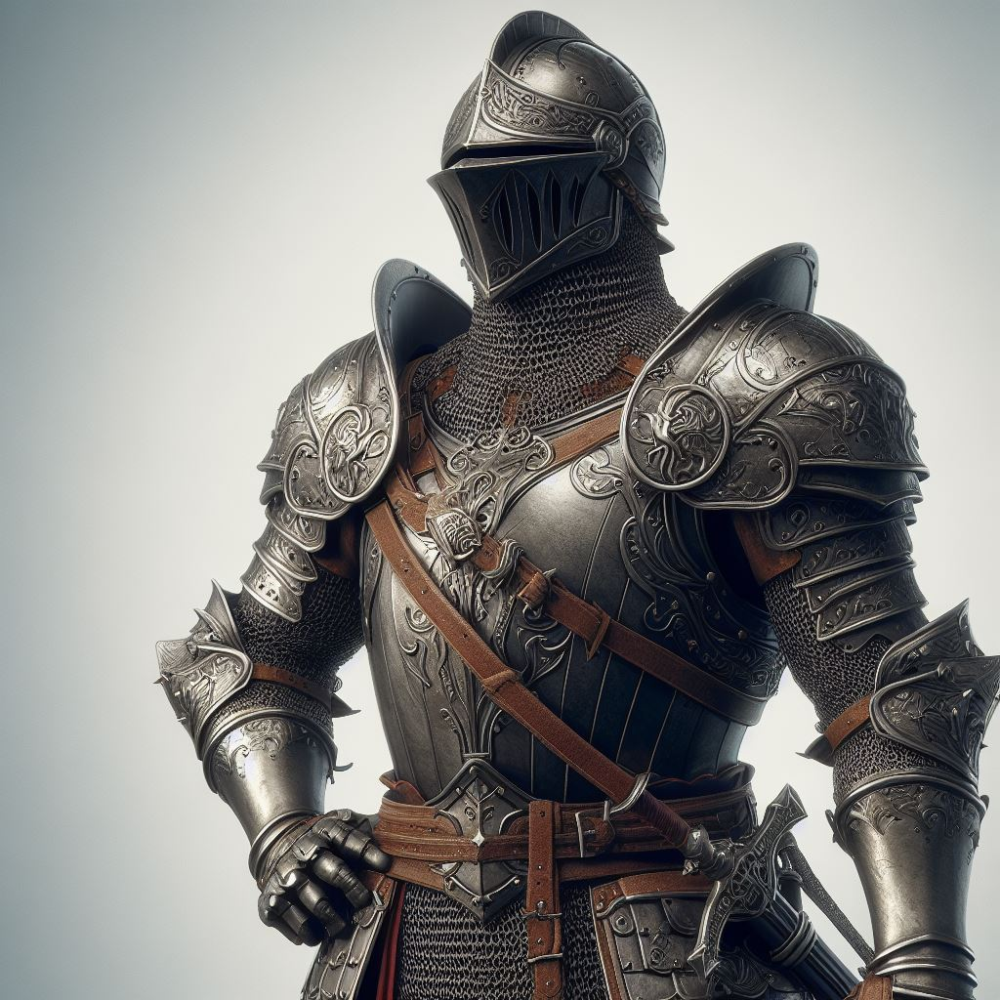

# Knight

## Attributes and Core Skills

| STR       | 1 |    | RFX             | 0 |    | INT               | 0 |    |
| --------- | :-: | :-: | --------------- | :-: | :-: | ----------------- | :-: | :-: |
| Athletics | 2 | 7d6 | Acrobatics      | 0 | 3d6 | Communication     | 2 | 5d6 |
| Climb     | 1 | 6d6 | Perception      | 1 | 4d6 | General Knowledge | 1 | 4d6 |
| Endurance | 1 | 6d6 | Sleight of Hand | 0 | 3d6 | Survival          | 0 | 3d6 |
| Lift      | 3 | 7d6 | Stealth         | 0 | 3d6 | Willpower         | 2 | 5d6 |

## Vocations and Vocational Skills

| Knight {RFX}       | 2 | 7d6 |
| ------------------ | :-: | :-: |
| Large Sword {ALL} | 2 | 7d6 |

## Effects

|          Name          |             Effect             | Duration |                                                    Source                                                    |
| :---------------------: | :-----------------------------: | :------: | :----------------------------------------------------------------------------------------------------------: |
| Physical Defense Level |                7                |          |                                                    Armor                                                    |
|       Medium Size       |      5x5 ft on battle map.      |          |                                                                                                              |
|   Language: Babelish   |       Can speak Babelish.       |          |                                                                                                              |
|    Inventory Weight    |              68 lb              |          |                                                  Equipment                                                  |
|  Humanoid Carry Weight  |             280 lb             |          | 120 lb (Base), +100 lb (per STR above 0), -50 lb (per STR below 0), +/- 20 lb (per Lift above/below 0) |
|      Medium Weight      | -1d6 to STR/RFX governed skills |          |                                          25% - 50% of carry weight                                          |
| Humanoid Movement Speed |              40 ft              |          |                          30 ft (Base), +/-10 ft (per RFX), +/-5 ft (per Athletics)                          |
|   Humanoid Swim Speed   |              35 ft              |          |                           15 ft (Base), +/-5 ft (per STR), +/-5 ft (per Athletics)                           |
|  Humanoid Climb Speed  |              30 ft              |          |                             15 ft (Base), +/-5 ft (per STR), +/-5 ft (per Climb)                             |

## Combat Rolls

|         Name         | One Handed | Two Handed | Dual Wielded | Penetration | Range | Damage Types | Engageable Opponents | Area Of Effect | Resource Class |
| :-------------------: | :-------------: | :-------------: | :---------------: | :---------: | :---: | :---------------: | :-----------------------: | :-----------------: | :-----------------: |
| Large Thrusting Sword | 6d6 (+2d6) | 8d6 (+3d6) |       None       |      3      | Melee |      Pierce      |           Rapid           |        None        |        None        |
| Large Slashing Sword | 6d6 (+2d6) | 9d6 (+2d6) |       None       |      2      | Melee |     Slashing     |           Rapid           |        None        |        None        |

## Equipment:

| Name                         | # |                    Class                    |  Tier  | Durability | LB | Value |
| ---------------------------- | :-: | :-----------------------------------------: | :-----: | :--------: | :-: | :----: |
| Gambeson Coat                | 1 |                 Phy. Def. 1                 | Mundane |   12/12   | 5 |  2 bc  |
| Gambeson Leggings            | 1 |                Phy. Def. 0.5                | Mundane |   12/12   | 3 |  1 bc  |
| Plate Full Helm              | 1 |               Phy. Def. 1.35               | Mundane |   12/12   | 6 | 225 bc |
| Plate Cuirass and Pauldrons  | 1 |                Phy. Def. 1.5                | Mundane |   12/12   | 23 | 450 bc |
| Plate Cuisses and Greaves    | 1 |               Phy. Def. 1.35               | Mundane |   12/12   | 15 | 300 bc |
| Plate Vambrace and Gauntlets | 1 |   Phy. Def. 1.35, Hand Protection Unarmed   | Mundane |   12/12   | 13 | 150 bc |
| Longsword                    | 1 | Large Thrusting Sword, Large Slashing Sword | Mundane |   12/12   | 3 | 15 bc |
