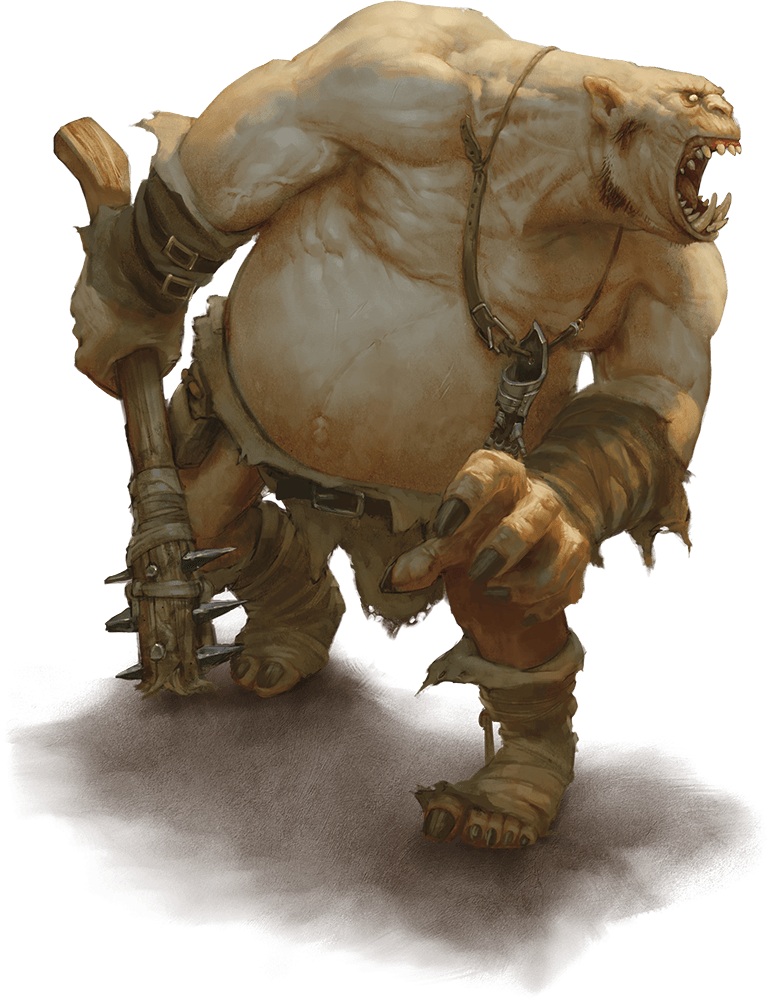

# Ogre

## Attributes and Core Skills

| STR       | 3 |    | RFX             | -1 |    | INT               | -1 |    |
| --------- | :-: | :-: | --------------- | :-: | :-: | ----------------- | :-: | :-: |
| Athletics | 2 | 8d6 | Acrobatics      | 0 | 2d6 | Communication     | 0 | 2d6 |
| Climb     | 0 | 6d6 | Perception      | 0 | 2d6 | General Knowledge | 0 | 2d6 |
| Endurance | 1 | 7d6 | Sleight of Hand | 0 | 2d6 | Survival          | 1 | 3d6 |
| Lift      | 2 | 8d6 | Stealth         | 0 | 2d6 | Willpower         | 0 | 2d6 |

## Vocations and Vocational Skills

| Brute {STR}        | 2 | 8d6 | Fellkin {ALL}   | 0  | 4d6 |
| ------------------ | :-: | :-: | --------------- | -- | --- |
| Reach Hafted {ALL} | 2 | 7d6 | Polycraft {ALL} | -1 | 4d6 |
| Short Spear {ALL}  | 2 | 7d6 |                 |    |     |

## Effects

|          Name          |                            Effect                            | Duration |                                                    Source                                                    |
| :---------------------: | :-----------------------------------------------------------: | :------: | :----------------------------------------------------------------------------------------------------------: |
|  Minor Silver Weakness  | (+1) to the level of injury received from Silver damage. |          |                                                Fellkin blood                                                |
| Physical Defense Level |                               1                               |          |                                                    Armor                                                    |
|       Medium Size       |                     5x5 ft on battle map.                     |          |                                                                                                              |
|   Language: Babelish   |                      Can speak Babelish.                      |          |                                                                                                              |
|     Language: Jotun     |                       Can speak Jotun.                       |          |                                                                                                              |
|    Inventory Weight    |                             30 lb                             |          |                                                  Equipment                                                  |
|  Humanoid Carry Weight  |                            360 lb                            |          | 120 lb (Base), +100 lb (per STR above 0),
-50 lb (per STR below 0), + 40 lb (per Lift above),
- 20 lb (per Lift above/below 0) |
|      Light Weight      |                -0d6 to STR/RFX governed skills                |          |                                           0% - 25% of carry weight                                           |
| Humanoid Movement Speed |                             40 ft                             |          |                            50 ft (Base), +10 ft (per RFX), +5 ft (per Athletics)                            |
|   Humanoid Swim Speed   |                             40 ft                             |          |                          15 ft (Base), +/-5 ft (per STR), +/-5 ft (per Athletics)                          |
|  Humanoid Climb Speed  |                             30 ft                             |          |                             15 ft (Base), +/-5 ft (per STR), +/-5 ft (per Climb)                             |

## Combat Rolls

|           Name           |   One Handed   |   Two Handed   | Dual Wielded | Penetration | Range |      Damage Types      | Engageable Opponents | Area Of Effect | Resource Class |
| :----------------------: | :------------------: | :------------------: | :---------------: | :---------: | :---: | :--------------------------: | :-----------------------: | :-----------------: | :-----------------: |
| Polycraft - Melee Trick |         4d6         |                      |                  |      0      | Melee | Slash, Bludgeon, Hew, Pierce |           Rapid           |                    |        None        |
| Polycraft - Ranged Trick |         4d6         |                      |                  |      0      | Close | Slash, Bludgeon, Hew, Pierce |         Standard         |                    |        None        |
|    Thrown Short Spear    | 6d6, 3d4 (+2d6) | 6d6, 3d4 (+2d6) |       None       |      3      | Short |            Pierce            |         Standard         |        None        |        None        |
|       Short Spear       | 6d6, 3d4 (+2d6) | 7d6, 3d4 (+3d6) |       None       |      3      | Melee |            Pierce            |        Spear Rapid        |        None        |        None        |
|    Reach Hafted Point    |    5d6 (-2)    |   10d6 (+3d6)   |       None       |      4      | Reach |            Pierce            |           Rapid           |        None        |        None        |
|    Reach Hafted Blunt    |    5d6 (-2)    |   9d6 (+2d6)   |       None       |      5      | Reach |           Bludgeon           |           Rapid           |        None        |        None        |

## Ichor: 1/1

## Equipment

| Name                                 | # |                 Class                 |    Tier    | Durability | LB | Value |
| ------------------------------------ | :-: | :------------------------------------: | :---------: | :--------: | :-: | :----: |
| Shoddy Leather Cuirass and Pauldrons | 1 |             Phy. Def. 0.5             |   Shoddy   |    9/9    | 4 |  3 bc  |
| Shoddy Leather Vambrace              | 1 |             Phy. Def. 0.5             |   Shoddy   |    9/9    | 2 | 1.5 bc |
| Crude Wooden Javelin                 | 1 |    Short Spear, Thrown Short Spear    | Compromised |    6/6    | 3 |  1 bc  |
| Greataxe                             | 1 |           Large Hafted Blade           |   Mundane   |   12/12   | 7 | 30 bc |
| Ogre's Spiked Club                   | 1 | Reach Hafted Blunt, Reach Hafted Point |   Mundane   |   12/12   | 14 | 41 cc |
