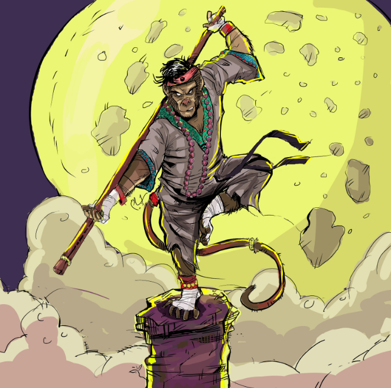

# Arinoth The Enlightened

## Attributes and Core Skills

| STR       | 0 |    | RFX             | 1 |    | INT               | -1 |    |
| --------- | :-: | :-: | --------------- | :-: | :-: | ----------------- | :-: | :-: |
| Athletics | 0 | 3d6 | Acrobatics      | 2 | 6d6 | Communication     | 0 | 2d6 |
| Climb     | 1 | 4d6 | Perception      | 1 | 5d6 | General Knowledge | 0 | 2d6 |
| Endurance | 0 | 3d6 | Sleight of Hand | 0 | 4d6 | Survival          | 0 | 2d6 |
| Lift      | 0 | 3d6 | Stealth         | 1 | 5d6 | Willpower         | 0 | 2d6 |

## Vocations and Vocational Skills

| Monk {RFX}         | 2 | 6d6 | Fellkin {ALL}   | 0  | 4d6 |
| ------------------- | :-: | :-: | --------------- | -- | --- |
| Large Hafted {ALL} | 2 | 5d6 | Sonocraft {ALL} | -1 | 3d6 |

## Effects

|          Name          |                            Effect                            | Duration |                                                    Source                                                    |
| :---------------------: | :-----------------------------------------------------------: | :------: | :----------------------------------------------------------------------------------------------------------: |
|  Minor Silver Weakness  | (+1) to the level of injury received from Silver damage. |          |                                                Fellkin blood                                                |
| Physical Defense Level |                               3                               |          |                                                    Armor                                                    |
|       Medium Size       |                     5x5 ft on battle map.                     |          |                                                                                                              |
|   Language: Babelish   |                      Can speak Babelish.                      |          |                                                                                                              |
|    Language: Primal    |                       Can speak Primal.                       |          |                                                                                                              |
|  Disabling: Dim-witted  |                            -1 INT                            |          |                                                                                                              |
|    Inventory Weight    |                             29 lb                             |          |                                                  Equipment                                                  |
|  Humanoid Carry Weight  |                            120 lb                            |          | 120 lb (Base), +100 lb (per STR above 0), -50 lb (per STR below 0), +/- 20 lb (per Lift above/below 0) |
|      Light Weight      |                -0d6 to STR/RFX governed skills                |          |                                           0% - 25% of carry weight                                           |
| Humanoid Movement Speed |                             40 ft                             |          |                          30 ft (Base), +/-10 ft (per RFX), +/-5 ft (per Athletics)                          |
|   Humanoid Swim Speed   |                             15 ft                             |          |                          15 ft (Base), +/-10 ft (per STR), +/-5 ft (per Athletics)                          |
|  Humanoid Climb Speed  |                             20 ft                             |          |                             15 ft (Base), +/-5 ft (per STR), +/-5 ft (per Climb)                             |

## Combat Rolls

|           Name           |   One Handed   |   Two Handed   | Dual Wielded | Penetration | Range | Damage Types | Engageable Opponents | Area Of Effect | Resource Class |
| :----------------------: | :------------------: | :------------------: | :---------------: | :---------: | :---: | :---------------: | :-----------------------: | :-----------------: | :-----------------: |
| Sonocraft - Melee Trick |         3d6         |                      |                  |      0      | Melee |     Shockwave     |           Rapid           |                    |        None        |
| Sonocraft - Ranged Trick |         3d6         |                      |                  |      0      | Close |     Shockwave     |         Standard         |                    |        None        |
|    Small Hafted Blunt    | 3d8, 2d6 (+0d6) |      (+0d6)     |      (+1d6)      |      2      | Melee |     Bludgeon     |           Rapid           |        None        |        None        |
|   Medium Hafted Blunt   | 3d8, 2d6 (+0d6) | 3d8, 3d6 (+1d6) |      (+1d6)      |      4      | Melee |     Bludgeon     |           Rapid           |        None        |        None        |
|    Large Hafted Blunt    |  3d8, 1d6 (-1)  | 3d8, 3d6 (+1d6) |       None       |      5      | Melee |     Bludgeon     |           Rapid           |        None        |        None        |
|    Reach Hafted Blunt    |    3d8 (-2)    | 3d8, 4d6 (+2d6) |       None       |      5      | Reach |     Bludgeon     |           Rapid           |        None        |        None        |

| Name | Resource Class | Resource Dice | Penetration | Range | Damage Types | Area Of Effect |
| :--: | :-----------------: | :----------------: | :---------: | :---: | :---------------: | :-----------------: |
|      |                    |                    |            |      |                  |                    |

## Destiny Points: 0/3

## Ichor: 0/0

## Equipment:

| Name                         | # |                                                  Class                                                  |   Tier   | Durability |  LB  | Value |
| ---------------------------- | :-: | :-----------------------------------------------------------------------------------------------------: | :-------: | :--------: | :--: | :----: |
| Gambeson Coat                | 1 |                                               Phy. Def. 1                                               |  Mundane  |   12/12   |  5  |  2 bc  |
| Gambeson Leggings            | 1 |                                              Phy. Def. 0.5                                              |  Mundane  |   12/12   |  3  |  1 bc  |
| Leather Cuirass and Pauldron | 1 |                                              Phy. Def. 0.5                                              |  Mundane  |   12/12   |  4  |  3 bc  |
| Leather Cuisses and Greaves  | 1 |                                              Phy. Def. 0.5                                              |  Mundane  |   12/12   |  3  |  2 bc  |
| Leather Vambrace             | 1 |                                              Phy. Def. 0.5                                              |  Mundane  |   12/12   |  2  | 1.5 bc |
| Clothes, Traveler            | 1 |                                                  Misc                                                  |  Mundane  |            |  4  |  5 bc  |
| Shortbow                     | 1 |                                                Light Bow                                                |  Mundane  |   12/12   |  2  | 25 bc |
| Quiver (capacity: 20)        | 1 |                                                  Misc                                                  |  Mundane  |            |  1  |  1 bc  |
| Broadhead Arrow              | 20 |                                             Standard Arrow                                             |  Mundane  |     -     | 0.05 |  1 bc  |
| Monkey Staff                 | 1 | Extentable Weapon, Small Hafted Blunt, Medium Hafted Blunt, Large Hafted Blunt, Reach Hafted Blunt | Excellent |   21/21   |  4  |   ?   |

## Containers

| Name              |  #  |      Class      |  Tier  | Durability | LB | Value |
| ----------------- | :-: | :-------------: | :-----: | :--------: | :-: | :---: |
| Backpack (1 ft^3) |  1  | 30 lb container | Mundane |            |  5  | 2 bc |
| Ring, Exquisite   | 100 |      Misc      | Mundane |            | 0.2 | 3 bc |
| Horn              |  1  |      Misc      | Mundane |            |  2  | 3 bc |
| Lantern, Hooded   |  1  |      Misc      | Mundane |            |  2  | 5 bc |

## Notes

- Ronald McTavish
- Proifessor of Rune Craft
- Burgenwalls magic college
- other side of broken mountain range
- feral tundra --> monsters --> silver!

## Appearance

Age:

Race: Beastkin (Ape)

Height: ?' ?"

Weight: ~ ? lb

Body Type:

Hair Color:

Eyes Color:

Additional Details:

## Disposition

- Disobedience

## Beliefs/Morality

- I worship my ancestors.
- Ancestors live through me.
- I will be strong. Apeling strong together.

## Goals/Aspirations

- Find other apelings. Apeling strong together.

## Additional Art

## Backstory

Arinoth the Enlightened was born in a jungle village. When Arinoth was a young boy, he went out into the jungle to gather food for his community. When he returned, his village was gone. The people and the trees were burnt to the ground. Arinoth suspects a dragon attacked that day, but he can’t say for sure. He will never have that certainty to comfort him.

After leaving his village to start a new life, Arinoth was adopted by monks who incited his desire to find his family and grow strong together again. From them, Arinoth has learned to calm his wild monkey mind and focus on his goals. Arinoth has left the monks to live a more independent life. He has found himself trying out for The Order of Silver to find and take revenge on whatever beast brutally destroyed his livelihood.
