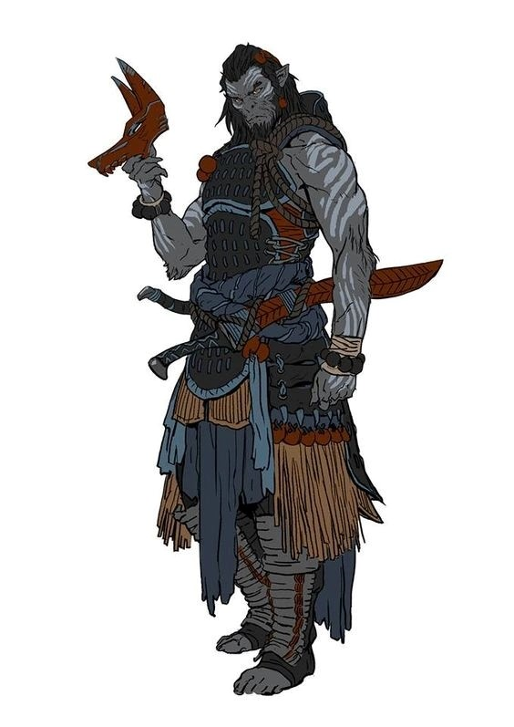

# Malgon Blackiron

## Attributes and Core Skills

| STR       | 1 |    | RFX             | 0 |    | INT               | 0 |    |
| --------- | :-: | :-: | --------------- | :-: | :-: | ----------------- | :-: | :-: |
| Athletics | 2 | 6d6 | Acrobatics      | 0 | 3d6 | Communication     | 0 | 3d6 |
| Climb     | 0 | 4d6 | Perception      | 1 | 4d6 | General Knowledge | 0 | 3d6 |
| Endurance | 0 | 4d6 | Sleight of Hand | 0 | 3d6 | Survival          | 0 | 3d6 |
| Lift      | 0 | 4d6 | Stealth         | 1 | 3d6 | Willpower         | 0 | 3d6 |

## Vocations and Vocational Skills

| Warrior {STR}     | 2 | 6d6 | Fellkin {ALL} | 0  | 4d6 |
| ------------------ | :-: | :-: | ------------- | -- | --- |
| Large Hafted {ALL} | 2 | 6d6 | Cryocraft     | -1 | 3d6 |
| Heavy Bow {ALL}    | 2 | 6d6 |               |    |     |
| War Knowledge      |  | 5d6 |               |    |     |

## Effects

|             Name             |                            Effect                            | Duration |                                                    Source                                                    |
| :---------------------------: | :-----------------------------------------------------------: | :------: | :----------------------------------------------------------------------------------------------------------: |
|     Minor Silver Weakness     | (+1) to the level of injury received from Silver damage. |          |                                                Fellkin blood                                                |
|    Physical Defense Level    |                               4                               |          |                                                    Armor                                                    |
|          Medium Size          |                     5x5 ft on battle map.                     |          |                                                                                                              |
|      Language: Babelish      |                      Can speak Babelish.                      |          |                                                                                                              |
|       Language: Primal       |                       Can speak Primal.                       |          |                                                                                                              |
| Disabling: Incapable of Lying |          His people do not lie and neither does he.          |          |                                                                                                              |
|       Inventory Weight       |                             49 lb                             |          |                                                  Equipment                                                  |
|     Humanoid Carry Weight     |                            220 lb                            |          | 120 lb (Base), +100 lb (per STR above 0), -50 lb (per STR below 0), +/- 20 lb (per Lift above/below 0) |
|         Light Weight         |                -0d6 to STR/RFX governed skills                |          |                                           0% - 25% of carry weight                                           |
|    Humanoid Movement Speed    |                             40 ft                             |          |                          30 ft (Base), +/-10 ft (per RFX), +/-5 ft (per Athletics)                          |
|      Humanoid Swim Speed      |                             35 ft                             |          |                          15 ft (Base), +/-10 ft (per STR), +/-5 ft (per Athletics)                          |
|     Humanoid Climb Speed     |                             25 ft                             |          |                             15 ft (Base), +/-5 ft (per STR), +/-5 ft (per Climb)                             |

## Combat Rolls

|           Name           | One Handed | Two Handed | Dual Wielded | Penetration |    Range    | Damage Types | Engageable Opponents | Area Of Effect | Resource Class |
| :----------------------: | :-------------: | :-------------: | :---------------: | :---------: | :----------: | :---------------: | :-----------------------: | :-----------------: | :-----------------: |
| Cryocraft - Melee Trick |       3d6       |                |                  |      0      |    Melee    |       Cold       |           Rapid           |                    |        None        |
| Cryocraft - Ranged Trick |       3d6       |                |                  |      0      |    Close    |       Cold       |         Standard         |                    |        None        |
|        Heavy Bow        |      None      | 8d6 (+2d6) |       None       |      2      | Sharpshooter |                  |         Standard         |        None        |        Arrow        |
|    Large Hafted Blade    | 6d6 (+0d6) | 9d6 (+3d6) |       None       |      2      |    Melee    |       Slash       |           Rapid           |        None        |        None        |

|      Name      | Resource Class | Resource Dice | Penetration | Range | Damage Types | Area Of Effect |
| :------------: | :-----------------: | :----------------: | :---------: | :---: | :---------------: | :-----------------: |
| Standard Arrow |        Arrow        |  9d6 (+1d6)  |      1      | None |      Pierce      |        None        |

## Destiny Points: 2/3

## Ichor: 0/0

## Equipment: need Thrax Morningstar

| Name                          | # |       Class       |   Tier   | Durability |  LB  |  Value  |
| ----------------------------- | :-: | :----------------: | :------: | :--------: | :--: | :-----: |
| Chainmail Sleeves             | 1 |   Phy. Def. 0.75   | Mundane |   12/12   |  11  | 11.2 bc |
| Chainmail Leggings            | 1 |   Phy. Def. 0.75   | Mundane |   12/12   |  12  | 11.2 bc |
| Chainmail Coif                | 1 |   Phy. Def. 0.75   | Superior |   24/24   |  4  | 11.2 bc |
| Leather Cuirass and Pauldrons | 1 |   Phy. Def. 0.5   | Mundane |   12/12   |  4  |  3 bc  |
| Gambeson Leggings             | 1 |   Phy. Def. 0.5   | Mundane |   12/12   |  3  |  1 bc  |
| Gambeson Coat                 | 1 |    Phy. Def. 1    | Mundane |   12/12   |  5  |  2 bc  |
| Clothes, Traveler's           | 1 |        Misc        | Mundane |            |  4  |  2 bc  |
| Dane Axe                      | 1 | Large Hafted Blade | Mundane |   12/12   |  6  |  11 bc  |
| Longbow                       | 1 |     Heavy Bow     | Mundane |   12/12   |  4  |  50 bc  |
| Quiver (capacity: 20)         | 1 |        Misc        | Mundane |            |  1  |  1 bc  |
| Broadhead Arrow               | 20 |   Standard Arrow   | Mundane |     -     | 0.05 |  1 bc  |

## Containers

| Name              | # |      Class      |  Tier  | Durability | LB | Value |
| ----------------- | :-: | :-------------: | :-----: | :--------: | :-: | :---: |
| Backpack (1 ft^3) | 1 | 30 lb container | Mundane |            |  5  | 2 bc |
| Dice Set          | 1 |      Misc      | Mundane |            | 0.2 | 10 cc |
| Ring, Exquisite   | 2 |      Misc      | Mundane |            | 0.2 | 3 bc |

## Notes

## Appearance

Age:

Race: Yetikin

Height: ?' ?"

Weight: ~ ? lb

Body Type:

Hair Color:

Eyes Color:

Additional Details:

## Disposition

- Tactical

## Beliefs/Morality

## Goals/Aspirations

## Backstory

Born high in the peaks of the Spine of the world, Malgon learned from an early age what it meant to work as a unit to stay alive. Despite the extreme conditions and the constant threat of monster attacks, Malgon's tribe thrived in the mountains. On his 18th birthday, Malgon left his tribe to take the journey of knowledge, in which young members of the tribe descend the mountains to gather knowledge from the low-landers. The quality and usefulness of the skill the return with and teach determines their position in the tribe.

Life among the low-landers was difficult for Malgon to adjust to. On his travels, he made a fast friend named Burrowbard Stoneseeker, an aged molekin business man who took him under his wing. He gave Malgon work guarding ironwood transport wagons which Burrowbard owned. This gave Malgon ample oppertunities to test his mettle against wandering bandits and monsters.
