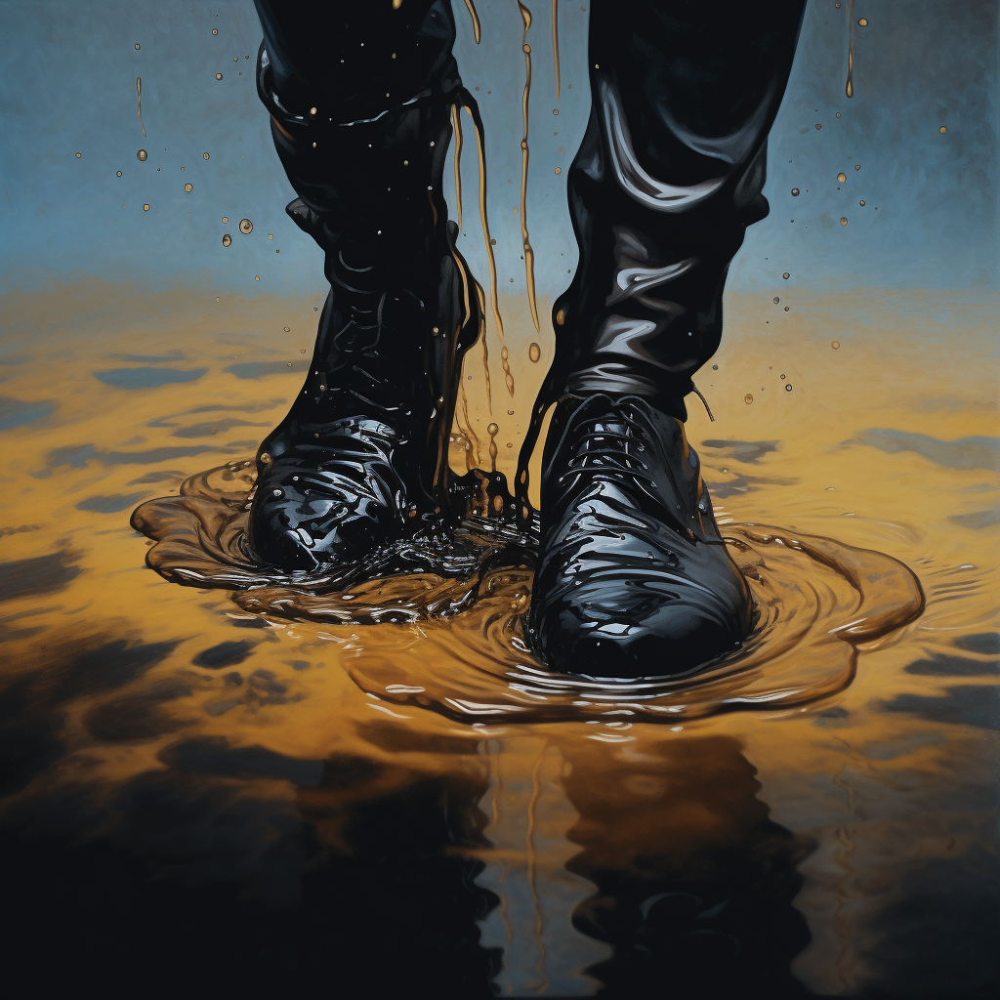

# Oil Spill

Slick flammable greasy oil covers the ground in a circle centered on a point within range and turns it into difficult terrain for the duration.

When the oil appears, each creature standing in its area must succeed on an Acrobatics Check or fall prone. A creature that enters the area or ends its turn there must also succeed on a Acrobatics Check or fall prone.

## Dice Pool Size Effect

0 -  4 dice: 4 ft radius, 30 sec duration, Challenge level 2

5 -  8 dice: 6 ft radius, 60 sec duration, Challenge level 3

9 - 12 dice: 8 ft radius, 90 sec duration, Challenge level 3

13 - 16+ dice: 10 ft radius, 120 sec duration, Challenge level 3

## Info

Range: Melee

Engageable Opponents: Focused

Magic Resource Required: 1

Skills required:

- Earth magic (lvl 1)
- Friction magic (lvl 1)
