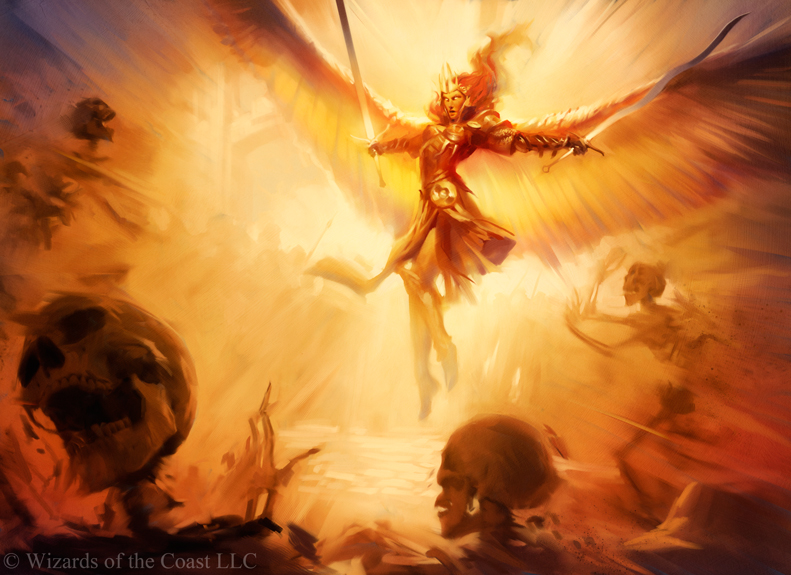
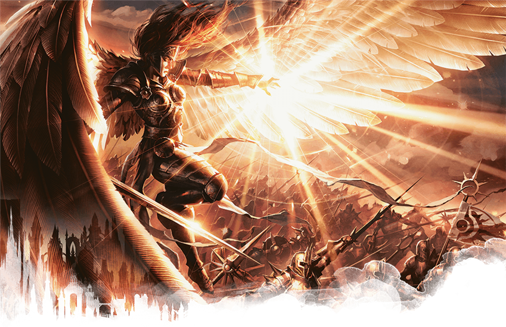

## Brightcraft

Brightcraft is raw divine miracle either created from from a Bright/God or Brightkin/Demigod.

When the Bright Lord gave onto the first loyal women of Fellkind his children, the resulting offspring were the first Brightkin of Terra. Brightkin have the ability to perform miracles like the Bright Lord himself, known as Brightcraft. To perform a Brightcraft, Ichor is channeled through specific strong emotion or memories to receive a desired effect. Brightcraft require training and practice to use, harnessing one's emotions. Most Brightkin don't devote themselves to mastering all aspects of Brightcraft, though they enjoy the benefits of near immortality.

Priests act as divine conduits via their belief, devotion and/or relationship with a divine entity who actually manifest the power of miracles.  Those that are devoted to divine entity can barrow a fraction of their gods power for their own use.

- Magic Name: Brightcraft
- Cantrip Name: Wonder
- Governing Core Skill: Will

If power is from divine heritage:
- Magic Vocation Name: Brightsmith
- Magic Vocation Governing Attributes: STR, RFX, INT
- Magic Resource Name: Ichor

If power is from a divine entity:
- Magic Vocation Name: Divine Conduit
- Magic Vocation Governing Attributes: INT
- Magic Resource Name: Focus

### Ichor/Focus

Ichor is the catalyst for all Brightcraft.

- +3 Ichor per Brightkin/Divine Conduit Vocation

#### Generate Ichor/Focus

Maintaining one's physical health restores Ichor/Focus gradually over time. This can be done by maintaining adequate nutrition, hydration, sleep, and stress levels.

#### Absorb Ichor/Focus

Brightkin can absorb Ichor via ample sources of light (such as the Sun) or by drawing on powerful emotion/memories. They can also regain ichor if mortals worship them.

Divine Conduits can absorb focus from ample sources of their deity's domain.

### Wonders

Wonders are uses of Brightcraft that use an insignificant amount of Ichor/Focus. In general, Wonders should be small and happen close to the user. Making your hand a flashlight, making your eyes grow faintly, or making small illusions are examples of Wonders. Wonders can be used even if the user's Ichor is completely depleted.

### [Radiance](./Radiance/Radiance.md)

### [Blessing](./Blessing/Blessing.md)
