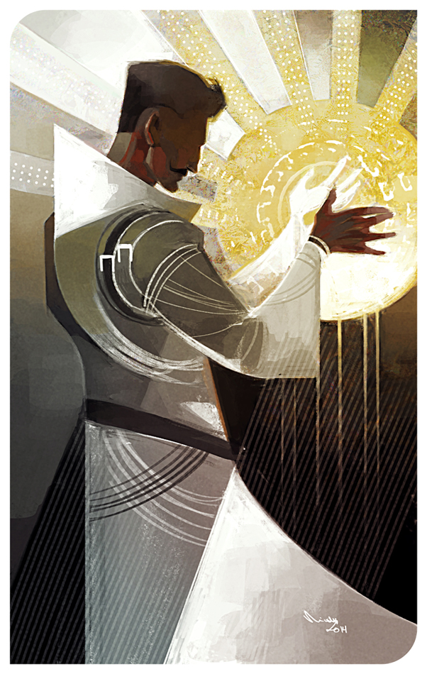

# Radiance

Radiance users can narratively attempt the following:

- Create light (hard light, illusions, etc...)
- Manipulate light

Users of Radiance focus on the manipulation of light externally. Radiance is extremely versatile and has become a staple of the Dawn Empire’s way of life.

In warfare, whether it is smiting the enemy from afar, armoring themselves and companions with hard light gear, or creating illusions of calvary charging at the enemies flanks, they are a force to be reckoned with.

#### Specialization: Hard Light

Hard light is light that has been formed into a tangible physical material.

- Hard light maintains its form for roughly 1 hour. The user can choose to mimic the density of a certain material.
- The larger and heavier the object, the more difficult to create and maintain. The density and size of the light is a property controlled by the user.
- Hard light objects can be damaged, leaking light and dramatically reducing their duration.
- Hard light objects can be made to have a fixed position, though they will expire dramatically faster depending on the density/weight of the object.
- Once created, a user does not need to stay close to the objects for it to maintain its form.

#### Specialization: Illusions

Illusions are created by bending light to create a false image.

- Illusions maintain their form for roughly 1 hour. Users can extend this, but require a harder check.
- Illusions can move, either under control of the user or set to a loop by the user.
- Illusions can not produce sound.

#### Absorb Ichor: Sunlight

Ample sunlight can be used to absorb Ichor.
