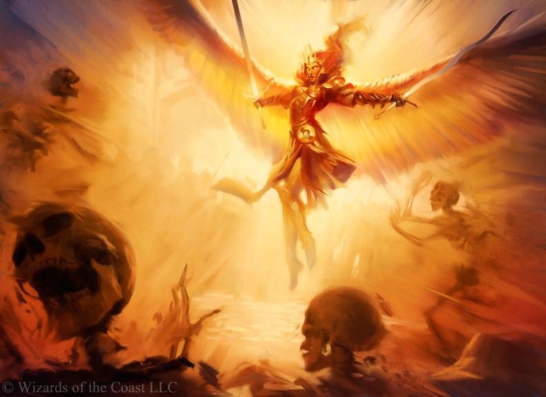

## Miracle

Miracles are the manifestations of a divine entities power on Terra. Those that are devoted to divine entity can barrow a fraction of their gods power for their own use. Miracles consider the laws of nature a mere suggestion.

When the Bright Lord gave onto the first loyal women of Fellkind his children, the resulting offspring were the first Brightkin of Terra. Brightkin have the ability to use the power of the Bright Lord, known as Miracles. To perform a Miracle, Light is channeled through specific strong emotion or memories to receive a desired effect.
Miracles require training and practice to use, harnessing one's emotions. Most Brightkin don't devote themselves to mastering Miracles, though they enjoy the benefits of near immortality.

- Magic Name: Miracles
- Magic Vocation Name: Brightkin
- Magic Vocation Governing Attributes: STR, RFX, INT
- Magic Resource Name: Light
- Cantrip Name: Wonder
- Governing Core Skill: Will
- Spell Name: Hymn

### Light

Light is the catalyst for all Miracles. It is channeled through an emotion or memory to produce a desired effect.

- +3 Light per Brightkin Vocation

#### Generate Light

All Brightkin have an inner light. Maintaining one's physical health restores Light gradually over time. This can be done by maintaining adequate nutrition, hydration, sleep, and stress levels.

#### Absorb Light

Brightkin can absorb Light via ample sources of light (such as the Sun) or by drawing on powerful emotion/memories.

### Miracle Wonders

Wonders are uses of Miracles that use an insignificant  amount of Light. In general, Wonders should be small and happen close to the user. Making your hand a flashlight, making your eyes grow faintly, or making small illusions are examples of Wonders. Wonders can be used even if the user's Light is completely depleted.

### [Radiance](./Radiance/Radiance.md)

### [Blessing](./Blessing/Blessing.md)
