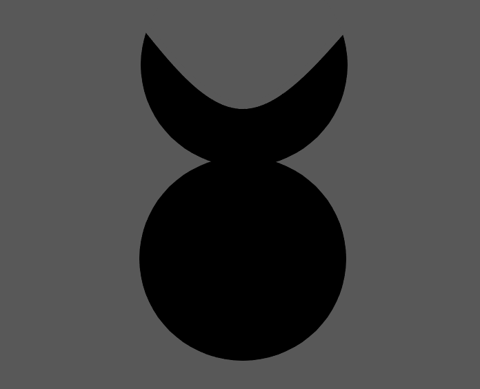

# Runecraft

Runes are symbols that have been discovered, via academic endeavors, dreams, meditation and psychedelic experiences, that represent fundamental laws that govern reality. Runesmiths (referred to as Wizards or Mages in some cultures) use conscious thought to manipulate reality in a favorable direction.

To draw a rune is not enough to have it take effect.

First, a conscious being must create the Rune. For many this takes the form of staffs, wands, scrolls, or other arcane objects that rune can be embedded within. Since activating a rune generally puts strain on the object that holds it, these items themselves are generally runecrafted to ensure reliable use.

Secondly, the user must deeply understand the rune's concept they are trying to invoke and be able to take it into conscious thought. Intelligence and mental energy seems to be the gateway to Runecraft, as minds that are too weak buckle under the weight of the knowledge of the fabric of reality, leading to horrific accidents, madness, and death.

Runes can be used to make all kinds of marvels. Scrolls, Potions, Runeforged items are applications of Runecraft. Scrolls are very common due to their ease of creation and affordability.

- Magic Resource: Focus
- Magic Vocation: Runesmith
- Magic Skills: Fire Rune, Shadow Rune, Oil Spill Rune
- Cantrip: Sign
- Vocation Attributes: INT
- Governing Core Skill: Willpower

## Crafting a Rune

Two things are required to craft a Rune.

### Knowledge of Runes

In order for Runes to work, the user must consciously look beyond the mere symbols into the exposed laws of reality, understand the property they are trying to manifest and bind the phenomena that they are trying to control to a symbol. Common symbols have been agreed upon through the ages as a way for scholars and runesmiths to share they're work. In many ways, Runes act as safeguards for the user's consciousness, reducing the infinite laws of reality to a single phenomena. If the user is sufficiently intelligent to understand the complexity of a Rune, they may bind the desired phenomena within the Rune.

If an insufficiently intelligent  person tried to simply draw the shape of the Rune of Fire, nothing would happen. Though if they truly tried to understand the Rune, the concept of fire itself, their mind could be permanently damaged forever.

### An object to hold the rune

Most Runesmith use scrolls for simple one time use runes, as they are affordable and easy to write runes on. Usually, the object the rune is located on physically receives damage up to the activation of the rune. Some Runesmith will create staves of other conduits inscribed with runes. These are made in a particular way to resist the toll of the rune, though they will eventually need to be repaired.

It is known that the body can be a vessel for runes, though the effect often leads to a reduced life span, bad health, or madness. Though due to the immense power that can be gained, many take on the risk.

## Pure Runes

Pure Runes are the most basic states of reality. Pure Runes represent a single concept of reality such as Fire, Dark, or Soul. Quick to create and versatile, Pure Runes are only limited by the creativity of their user.

### Fire Rune

### Earth Rune

### Water Rune

### Air Rune

### Electricity Rune

### Cold Rune

### Poison Rune

### Blood Rune

### Light Rune

### Dark Rune

### Sound Rune

### Body Rune

### Mind Rune

### Soul Rune

### Time Rune

### Strength Rune

### Gravity Rune

### Nature Rune

### Acid Rune

## Compound Runes

Compound Runes are constructed with Pure Runes, some of which are famous and named after their creators. Legendary compound runes are controlled by powerful universities and the Royal families that sponsor them. The length to which these organizations will go to protect their intellectual property is staggering.

Some Runes pertaining to consciousness have been discovered. This discovery was groundbreaking, as it validated models that predict hypothetical runes pertaining to higher abstractions of consciousness such as fear, hate, and wrath. The models predict these Forbidden Runes to be so powerful that the Great Runesmiths of Academia search for them relentlessly.

See Spell list.

## Creating Runecraft scrolls
