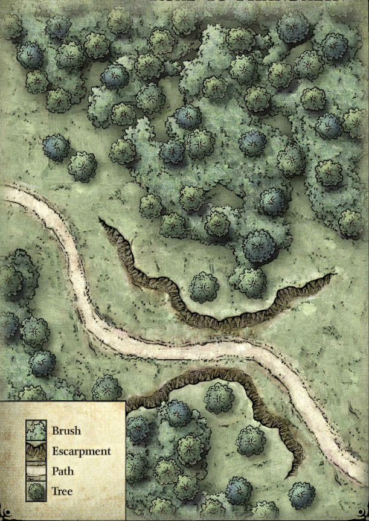
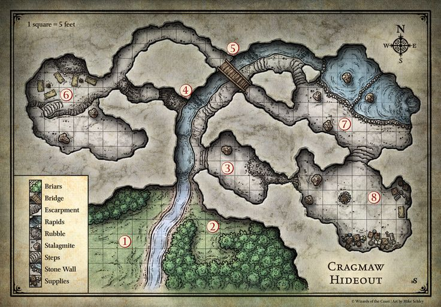
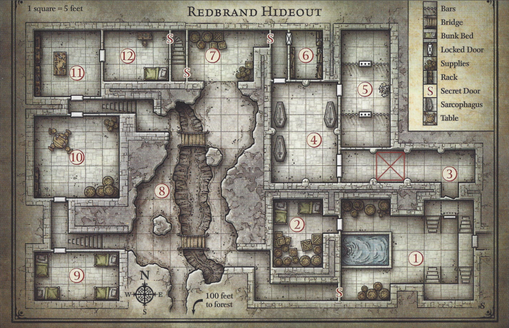

## **Overview**

The "Lost Mine of Tundelver" unfolds across four distinct sections.

In Part 1, known as "Vermkin Arrows," the adventurers find themselves en route to the town of Tuntin when they inadvertently become embroiled in a Vermkin ambush. They soon learn that these Vermkins, members of the Mountainmaw tribe, have captured their molekin comrade, Burrowbard Stoneseeker, and his escort, a mudblood warrior named Ulfric Warwinter. The characters must confront the ambush and subsequently follow the Vermkins' trail back to their hidden hideout. There, they must rescue Ulfric and receive word from him that Burrowbard and his brothers stumbled upon fabled lost tunnels of an old mine. Ulfric knows nothing more than that Burrowbard and his map have been taken to a place referred to as "Mountainmaw Castle."

Part 2, titled "Tuntin," finds the characters arriving in the troubled town of Tuntin, beleaguered by the Lavender Lancers, a gang of outlaws led by the enigmatic figure known as Glassmith. The town is also home to a range of intriguing NPCs, laying the groundwork for short adventures in Part 3. The Lavender Lancers seek to drive the adventurers out of Tuntin, and in return, the characters launch an assault on the Lavender Lancer hideout. Beneath an old manor's, they discover a hidden hideout that Sylas "Glassmith" Alabaster, the Lavender Lancers' shadow leader, receives orders from someone known as the Black Spider, who desires the adventurers' removal.

Part 3, aptly titled "The Spider's Web," presents the characters with several short adventures within the vicinity of Tuntin. These quests revolve around acquiring additional information concerning the Black Spider and the lost molekin mine. The clues the characters gather in Tuntin lead them to spying on a mysterious wizard at the Old Mole Well ruins, seeking advice from a perilous banshee, confronting a band of ogrekins lurking at Wyrm Tor, and investigating the ruins of Lumgrove town. Several of these leads guide them towards Mountainmaw Castle, the stronghold of King Grom, leader of the Mountainmaw Feralkin. Here, the characters make a startling discovery: the Black Spider is a spiderkin mastermind named Nezznar, and the Mountainmaw Vermkins serve her. Spiderkin, for context, are a subterranean chitinkin race. Most importantly, the characters either retrieve Burrowbard Stoneseeker's map to the lost mine or uncover the mine's location through one of the leads from Part 3.

Following the map or the directions to the lost mine takes the characters to Part 4, "Tide Echo Tunnels." This once-forgotten subterranean complex is now overrun by undead and bizarre creatures. Nezznar the Black Spider and her loyal followers are present, exploring the mines and hunting for the legendary Forge of Runes. The adventurers have the opportunity to avenge Burrowbard Stoneseeker, secure the prosperity and safety of Tuntin by clearing the valuable mine of its menacing inhabitants, and put an end to the Black Spider's troublemaking - if they can survive the perils of the "Lost Mine of Tundelver."

## Villainous Synopsis

The Black Spider, our shrewd and alluring Spiderkin villain, has positioned herself to take control of the Lost Tunnels of Tundelver and the Forge of Runes within. She has brokered an alliance between the more unscrupulous factions surrounding the town of Tuntin, promising each a share of the power the forge will grant.

She asked the Mountainmaw Feralkin to capture Burrowbard Stoneseeker in exchange for the restoration of Mountainmaw Castle. She asked the Lavender Lancers to subdue the town of Tuntin and prevent any kind of resistance or pleas of help from reaching Reddwall, in exchange for sovereignty over the town. She even asked the Ogrekin bandits of Wyrm Tor to patrol and to keep interlopers out of the region in exchange for a portion of the rune forged weapons once the Forge of Runes is operational. For herself, she just wants ownership over the Forge of Runes, which she plans to use to become a magical arms dealer.

Now that she has Burrowbard's map, there's no problem, well there's one problem. She needs the players' mysterious puzzle box to appease the Forge of Runes' guardian...

The Black Spider is a reoccurring villain within the story. She will show up from time to time to spy and talk to the players while concealing her identity.

She has a Doppler ally named Monteith, who acts as his mistresses butler and personal spy.

## **THE FORGOTTEN REALMS**

Much like a setting in a fantasy novel or movie, an adventure unfolds within a larger world, limited only by the imagination of the Narrator and the players. The setting can range from a primitive swords-and-sorcery world where barbarians clash with malevolent sorcerer's to a post-apocalyptic fantasy realm inhabited by elves and molekin who wield magic among the ruins of a technologically advanced civilization. Most D&D settings typically fall somewhere between these two extremes, portraying medieval high fantasy worlds featuring knights, castles, dhampir cities, molekin mines, and formidable monsters.

The adventure detailed here unfolds in the world of the Forgotten Realms, a prime example of the latter type of setting. In the Realms, knights venture into the crypts of the long-fallen molekin kings of Delzoun in search of glory and treasure. Rogues navigate the dimly lit alleyways of bustling cities like Reddwall and Baldur's Gate. Clerics, devout servants of the gods, wield both mace and spell to combat the ominous threats that plague the land. Wizards delve into the ruins of the collapsed Netherese empire, exploring secrets that exist in the shadows. Within dungeons, caverns, ancient cities, and vast untamed wilderness, dragons, giants, demons, and other horrifying monstrosities lie in

# Chapter 0: Prologue

The sections acts as a session 0 to start the campaign on the right foot. This is where you manage player expectations for the campaign, set some personal boundaries, and you make characters.

## Making Characters

If any of your players are brand new to Table Top Role Play Games, than I'd encourage you to steer them towards these pre-generated character sheets:

- [Grimwald Thornhelm](./../../Characters/PC/GrimwaldThornhelm/GrimwaldThornhelm.md)
- [Nivix](./../../Characters/PC/Nivix/Nivix.md)
- [Valkyrie Dreki](./../../Characters/PC/ValkyrieDreki/ValkyrieDreki.md)
- [Seraphina Roseblood](./../../Characters/PC/SeraphinaRoseblood/SeraphinaRoseblood.md)
- [Javk Wick](./../../Characters/PC/JavkWick/JavkWick.md)

If you player's do want to make their own characters, take a look at the [Character Creation](./../../GeneralRules/NonCombatRules/CharacterCreation.md) guide.

## Connections to Burrowbard Stoneseeker

Burrowbard Stoneseeker, the old Molekin who has lived a full life, is a central character and plot hook for the adventure. All players are good old friends of Burrowbard. They should specify as part of their backstories how Burrowbard is integral to their some element of their past.

Burrowbard is an unquestionably kind person, someone who has come through for the player characters countless times. A true friend who likes and empowers the player characters. Beyond this, Burrowbard is a blank slate for you to tie the party together and give them someone to fight to save. By establishing Burrowbard as a sympathetic character, the party should actually care when he goes missing. They need to like him and needs to be spotless in the parties eyes.

Example of connections to Burrowbard:

- For bard characters, Burrowbard met said player character while learning the ropes, becoming fast friends
- For any character, Burrowbard is a family friend, possibly their as they grew up.
- For any character, Burrowbard helped them recover after they lost their memory
- For magic characters, Burrowbard was at one point an adventurer and steered the player character away from the darker aspects of their magic
- He was a father figure who helped a character relearn their self worth

## Planning for Special player moments

I want you to think about how you can incorporate each players' backstory into the campaign for some special player moments. Every character should have one moment, one opportunity in the story that's specific to their character. If there is an important NPC in their past (you could add them in) or important item, bring it on in. Get creative and plan to give each of your players one big moment!

## Prologue Roleplay (No dice just yet)

Roleplay a scene set around a table in a Reddwall tavern, where Burrowbard imparts the following information in a soft Scottish accent.

```
Thank you for joining me everyone. I value everyone that sits at this table and I hope you all will become as fast friends. I want to share a secret with, I need you all to retrieve an important trinket critical to a new business venture I have been investigating, which I'd like to bring each of you in on.

There is a mysterious puzzle box in the which is currently being fixed by a young tinker named Killroy, who should have it done in the next 1-2 days. He will deposit within a safety deposit box at the local bank, were you will retrieve it. Once acquired, I need you to bring it along with the a wagon full of mining supplies to Bart at the Bedrock Inn in Tuntin. Each of you will receive 10 bc upon completing this task. This is just a taste of the wealth this business venture holds. After that, find me in Tuntin and deliver the puzzle box.

I must hurry on ahead to meet my two brothers, Tharden and Nundro, in Tuntin as time is of the essence and have complete trust in all of you to accomplish this. It pains me to have to be so tight lipped about the whole thing, but it is for our own safety.
```

At this point Burrowbard gestures to an older mudblood who has been quietly sitting since the party arrived.

```
Accompanying you is my dear old friend Ulfric Warwinter, who has been a faithful companion since I was a much younger person. He will accompany you on your journey to Tuntin when you depart, as he also has business in Tuntin.
```

If Ulfric is questioned he mentions in a pompous English accent that he needs to check in on a colleague named Sylas who's gone missing in the area.

After Burrowbard and Ulfric have departed on the road, the young mudblood tinker Killroy will find the players and in a stuttered voice inform them that he was able to get done sooner than expected. He gives the party the lockbox key and number, before wishing them safe travels.

Contained within the puzzle box is an runesmithed blue crystalline key which both Burrowbard and the Black Spider needs to get past the creature that guards the Forge of Runes. The puzzle box acts as a mcguffin and give the Black Spider a reason to harass the party. If any player wants to open the box, let a single player make a CL 3 General Knowledge check whenever they take a long rest as it takes lots of time to solve. Or they could decide to break it open very easily.

At the end of session 0 and the prologue, describe the following scene.

```
 In the dead of night, light footsteps echo across the vault that you had visited earlier, there is the sound of a scuffle and a guard collapses to the ground in a heap, strangled marks visible around his neck. His silent attacker appears to be one of his compatriots, but the disguised flesh morphs, to reveal a translucent alien-like body. Mouthless, the creature approaches the lock box, opening it easily and notices the mysterious puzzle box is missing.

Behind it a cloaked figure with red eyes shakes it's head. In a womanly elegant soft French voice "Well Montheith, it appears that someone has beat us to the punch aye, we might have to get a little creative after all."

```

# Chapter 1: Feral Arrows



[Talespire Map](https://talestavern.com/slab/goblin-ambush-on-the-triboar-trail/)

To commence this adventure, the player characters find themselves on a mission to safeguard a wagon laden with essential provisions and supplies. Their journey unfolds as they navigate the route from the bustling city of Reddwall towards the quaint town of Tuntin. This expedition leads them on a southward course along the well-trodden Crimson Road, eventually intersecting with the eastward-bound Trident Trail, depicted on the accompanying overland map. As they make their way through this picturesque landscape, with Tuntin tantalizingly close—just a half-day's march away—trouble rears its head in the form of a raiding party comprised of Vermkins hailing from the notorious Mountainmaw tribe.

Now, when you're ready to initiate the adventure, read the enclosed text. Should you choose to devise an alternative story hook, proceed to the subsequent paragraph, and adapt the particulars to suit your narrative, disregarding any references to guiding the wagon.

```
Within the bustling urban sprawl of Reddwall, a stout and bearded molekin by the name of Burrowbard Stoneseeker entrusted you with a significant task. He implored you to transport a wagon laden with vital supplies to the rugged settlement of Tuntin, located several days' journey to the southeast of the city. Burrowbard's demeanor was a curious blend of enthusiasm and secrecy, and he disclosed very little about the true nature of this venture. He merely divulged that he and his brothers had uncovered something of immense import. He promised a generous reward of ten bronze coins to each of you for ensuring the safe delivery of his provisions to Barton's Provisions, a trading post nestled in the heart of Tuntin.

Intriguingly, Burrowbard and his warrior companion, Ulfric Warwinter, embarked on their journey ahead of your group, mounted on horses, and claimed they needed to arrive early to "attend to certain matters."

Your expedition has seen you trekking through the past few days, tracing the well-trodden path along the Crimson Road, venturing south-westward from Reddwall. As of late, you've taken a turn westward onto the Trident Trail. Thus far, your journey has been relatively uneventful, though this terrain is notorious for its perils. Bandits and outlaws are known to lurk along these very trails, making vigilance and caution imperative.
```

Before delving further into the adventure, take a few moments to engage the players in the following activities:

- **Character Introductions:** Encourage the players to introduce their characters to one another if they haven't done so already. This is an excellent opportunity for the players to share their characters' backgrounds, personalities, appearances, and motivations. It can help build a stronger sense of camaraderie within the party.
- **Character Connections to Burrowbard Stoneseeker:** Have the players consider how their characters came to know their molekin patron, Burrowbard Stoneseeker. Encourage them to create their own stories, but offer suggestions if someone is struggling with ideas. For instance, Burrowbard could be a childhood friend, a mentor, or someone who aided the character in a difficult situation. This exercise allows players to contribute to the adventure's backstory and provides a more personalized connection to the quest.
- **Party's Marching Order:** Ask the players to determine the party's marching order and how their characters are traveling. Identify who's at the front and who's at the rear, and if the characters are escorting Burrowbard's wagon, clarify who's driving it. The remaining characters can decide whether they're riding on the wagon, walking alongside, or scouting ahead. This helps establish the group dynamics and tactics for the journey.

#### Driving the Wagon

Any character within the party can take the reins and drive the wagon. No specific skill is required to do so. The wagon is pulled by two sturdy oxen, and if no one holds the reins, the oxen will come to a halt.

The wagon's cargo is a diverse assortment of mining supplies and foodstuffs, including a dozen sacks of flour, several casks of salted pork, two kegs of strong ale, as well as shovels, picks, and crowbars (about a dozen of each), along with five lanterns and a small barrel of oil (approximately fifty flasks in volume). The total value of this cargo is estimated at 100 bronze coins.

When you're prepared, proceed to the next section, "Vermkin Arrows," to initiate the adventure.

## Feral Ambush

To initiate the encounter, please read the following text aloud.

```
Having journeyed along the Trident Trail for approximately half a day, you round a bend and are confronted by a grim sight. There, about fifty feet ahead, lie two lifeless horses sprawled across the path, each of their legs missing. Each animal bears the unmistakable mark of several black-feathered arrows embedded in their flesh. The forest presses closely to the trail at this point, flanked by a steep embankment and thickets that seem impenetrable on either side.
```

For those adventurers using the 'Meet Me in Tuntin' adventure hook, a more detailed examination of the scene yields troubling discoveries. The deceased horses can be identified as the property of Burrowbard Stoneseeker and Ulfric Warwinter. Regrettably, they have been deceased for a day, their demise brought about by the very arrows that now pierce them.

```
As you inspect the area more closely, you find the saddlebags have been pillaged, and nearby rests an abandoned leather map case.
```

Amidst this eerie scene, concealed within the woods, lie four cunning Feral Vermkins. Two lurk on each side of the road, biding their time until a curious soul approaches the horses, at which point they will launch a sudden attack.

Prepare for what may well become the initial skirmish in a series of battles within this adventure. Here are the guidelines to ensure a smooth encounter:

- Feral Vermkin Stat Block: Refer to the [Feral Vermkin](./../../Characters/Humanoids/FeralVermkin/FeralVermkin.md) character sheet. Make a note of their Stealth skill of 5d6.
- Determine Surprise: Players could surprise the Feral Vermkin if they were scouting ahead, but the Feral Vermkins may be able to surprise some or all of the characters. Roll a Stealth check for the Vermkins and comparing the result to the characters perception skill checks. Any character whose score is lower than the Vermkins' Stealth check result is surprised and loses their turn during the first round of combat.
- Initiative: Use the initiative rules from the general rules to determine the order in which all characters and Vermkins act. Keep track of everyone's initiative count in the margins of your adventure book or on a separate piece of paper.
- Vermkin Actions: When it's the Vermkins' turn to act, two of them should rush forward and make melee attacks, while the other two Vermkins stand about 30 feet away from the party and make ranged attacks taking advantage of the high ground. The Vermkin character sheet contains the necessary information to resolve their combat rolls.
- Fleeing Vermkin: If three Vermkins are defeated, the last remaining Vermkin may attempt to flee, heading for the Vermkin trail.

#### Developments

In the unlikely event that the Vermkins manage to defeat the adventurers, they will leave them unconscious and loot both the party and the wagon. The Vermkins will then return to their Mountainmaw hideout. The characters can choose to continue on to Tuntin, purchase new gear at Barton's Provisions, and later return to the ambush site to find the Vermkins' trail.

Characters may decide to capture one or more Vermkins by knocking them unconscious rather than killing them. To do so, a character can use the "Render Unconscious" combat manuever or sum up 5d6 worth of injury. After a few minutes, a captured Vermkin regains consciousness and can be convinced to share what it knows (see "What the Vermkins Know" sidebar). Additionally, the party can persuade the captured Vermkin to lead them to the Mountainmaw hideout while avoiding traps (see "Vermkin Trail" section).

If the characters don't find the Vermkin trail or choose to continue to Tuntin, you can skip ahead to Part 2, "Tuntin." There, Elmer Barton, the owner of Barton's Provisions, will inform the characters that Burrowbard Stoneseeker never arrived in Tuntin and suggest they return to the ambush site to investigate further after resting. Barton can also point the party to Linett Graymane of the Beastshield Coster for more information on the Feralkin attacks.

```
Resting:

After the Vermkin ambush, the party may require a rest depending on the outcome of the battle.
```

### **Vermkin Trail**

If the characters defeat the Feral Vermkins and inspect the area, they will discover signs that the Vermkins have used this location for staging ambushes. A hidden trail behind thickets on the north side of the road leads northwest. A character who succeeds on a CL 2 Survival check can determine that about a dozen Vermkins have traveled along this trail, along with signs of two humanoid-sized bodies being hauled away from the ambush site. The party can guide the wagon off the road and secure the oxen while pursuing the Vermkins down the trail, which leads five miles northwest to the Mountainmaw hideout.

Ask the players to determine the party's marching order as they move down the trail, as the order is vital. The Vermkins have set two traps to hinder pursuers:

**Snare.** About 10 minutes after heading down the trail, the party may encounter a hidden snare. The character must succeed on a CL 2 Perception check to notice the trap. If not noticed, the character triggers the snare and must succeed on a CL 2 Acrobatics check. Failure results in the character being suspended upside down 10 feet above the ground, restrained until damage is dealt to the snare's cord, which causes it to drop. A character lowered down without care takes a Minor Injury from the fall.

**Pit.** Another 10 minutes down the trail is a camouflaged pit. They must succeed on a CL 3 Perception check to spot the pit. If the trap isn't detected, the lead character must succeed on a CL 2 Acrobatics check to avoid falling in, taking a Minor Injury from bludgeoning damage. The pit's walls are not steep, so no ability check is required to climb out.

### Awarding Destiny Points

Overcoming the Vermkin ambush and finding the Mountainmaw hideout nets each the player's 1 destiny point.

## Mountainmaw Hideout

The Feral clan known as the Mountainmaw has established a hidden base strategically positioned to harass and plunder traffic traversing the Trident Trail or the route to Tuntin. The name "Mountainmaw" stems from the tribe's practice of sharpening their teeth, giving them a menacing and jagged appearance. Leading the bandits in this lair is Thrak, a feral beastkin who takes orders from the chief of the Mountainmaws, tasked with plundering any vulnerable caravans or travelers in the area. Recently, a messenger from Mountainmaw Castle delivered new directives: Intercept the molekin Burrowbard Stoneseeker and anyone accompanying him. After completing his task, Thrak and his clan are celebrating their victory with some delicious horse leg meat...



### General Features

The Mountainmaw cave ascends steeply, situated at the base of a substantial hill, with its caverns and passages embedded within the hill itself.

**Ceilings.** Ceilings throughout the complex are characterized by steep slopes, forming stalactite-laden vaults that reach heights of 20 to 30 feet above the ground.

**Lighting.** Lighting is absent in most areas, except for Locations 1 and 2, which are outdoors. Unless otherwise specified, the remainder of the complex is shrouded in darkness. The provided text for these locations assumes that characters possess either darkvision or a light source.

**Rubble.** Navigating through areas with crumbling rock and gravel poses a challenge, as they are classified as difficult terrain (refer to "Difficult Terrain").

**Sound.** The ambient sound of water within the cave serves to muffle noises, requiring attentive listening for creatures to detect activity. A CL 3 Perception Check enables creatures to attempt hearing nearby chamber sounds.

**Stalagmites.** Upthrust spires of rock, can offer cover as outlined in the general rules "Cover" section.

**Stream.** A shallow stream courses  through the complex, measuring only 2 feet in depth. The cold, slow-moving water facilitates easy wading for creatures moving through it.

```
What the Vermkins know:

In the event that the characters successfully capture or charm any of the Vermkins in this vicinity, they can coerce the Vermkins into revealing valuable details:

- The lair currently houses fewer than twenty Vermkins.

- The leader of the Vermkins is a Feral Beastkin named Thrak, who answers to King Grom, the chief of the Mountainmaw tribe. King Grom resides in Mountainmaw Castle, located approximately twenty miles northeast of the Mountainmaw hideout within Highmount Wood.

- Thrak received a messenger Vermkin from King Grom a few days ago. The messenger conveyed that an entity known as the Black Spider was compensating the Mountainmaws to monitor and apprehend the molekin Burrowbard Stoneseeker. The orders were to capture Burrowbard along with any possessions and deliver them to King Grom. Thrak adhered to these instructions, resulting in Burrowbard's ambush and subsequent capture, including a map in his possession.
 
- The molekin and his map were successfully handed over to King Grom as per instructions. The molekin's mudblood companion is currently held captive in the "eating cave" (area 6).
```

### 1. Cave Mouth

The path from the Vermkin ambush site guides you to the entrance of the Mountainmaw hideout.

```
Tracing the Vermkins' path, you stumble upon a sizable cave nestled within a hillside, situated five miles from the ambush location. A meager stream emerges from the cave mouth, concealed by dense briar thickets. On the right side of the stream, a narrow dry path leads into the cave.
```

The thicket in area 2 proves impassable from the west side of the stream.

#### Developments

The Vermkins stationed in area 2 are tasked with keeping a vigilant watch on this vicinity, yet their attention appears to waver. (Vermkins, being somewhat indolent, have a tendency to be lax in their duties.) However, should the characters generate considerable noise—such as engaging in heated debates, establishing a camp, clearing brush, and the like—the Vermkins in area 2 become alert and launch an attack through the thicket. The thicket provides the Vermkins with three-quarters cover, as detailed in the rulebook's section on cover rules.

### 2. Vermkin Blind

Upon crossing to the east side of the stream, characters gain a view beyond the screening thickets into area 2. This serves as a Vermkin guard post, though the occupants display signs of boredom and inattention.

```
On the eastern bank of the stream flowing from the cave mouth, a small section within the briar thickets has been carved out to create a lookout post or blind. Wooden planks flatten the briars, offering space for guards to conceal themselves while surveilling the area—a pair of Vermkins currently lurk in this makeshift hideout.
```

If the two Vermkins become aware of intruders in area 1, they swiftly engage with their bows, shooting through the thickets and likely catching the characters off guard. In case the Vermkins remain oblivious to the adventurers in area 1 but spot them while crossing the stream, neither side gains the element of surprise.

Characters adopting a cautious approach or engaging in scouting may have an opportunity to surprise the Vermkin lookouts. For each character advancing ahead, a Stealth check can be made, contested by the Vermkins' Perception checks to avoid being caught off guard. Refer to the rulebook for detailed information on ability check contests.

**Thickets.** Thickets within the clearing function as difficult terrain, causing inconvenience without posing any direct danger. They grant half cover to creatures attacking through them, as explained in the "Difficult Terrain" and "Cover" sections of the general rules.

### 3. Kennel

Just inside the cave mouth, a set of uneven stone steps ascends to a small, dank chamber on the east side of the passage.

```
The cave gradually narrows into a steep fissure at its far end, permeated by the unmistakable stench of animals. The discordant symphony of savage snarls and the clinking of chains fills the air as two wolves, tethered by iron chains to rods embedded in stalagmites, guard the entrance.
```

The room houses three wolves in total. While they cannot reach targets standing on the steps, all three wolves aggressively attack any creature, except a Vermkin, that enters the room (refer to the "Developments" section). Nearby Vermkins, accustomed to the constant snapping and snarling of the wolves, pay little attention to the sounds of internal strife.

Any character attempting to calm the animals can make a CL Survival 3 check. Character's with that can speak Primal can reduce the CL by 1. If the wolves are provided with food, the CL is reduced by 1. A successful check allows the character to move freely within the room.

**Fissure.** An opening in the east wall leads to a narrow chimney that ascends 30 feet to area 8. The base of the fissure is cluttered with discarded rubbish from the opening above. Climbing or descending the chimney shaft requires a CL 2 Climb check. On a successful check, the character moves at once with their climbing speed. A result of CL 1 results in no gain or loss of ground, while a result of CL 0 causes the character to fall, incurring a bludgeon Minor Injury for first 10 feet fallen, with the injury increasing to a higher tier for ever additional 10 feet and landing prone at the base.

#### Developments

If the wolves are taunted by adversaries beyond their reach, they enter a frenzied state, attempting a single CL 3 Lift check each round any character remains in sight. Upon the first success, they loosen the rod, reducing the CL to 2. On a second success, they pull the rod free, bending it to liberate themselves. A Vermkin or Feral Beastkin can use its action to release one wolf from its chain.

### 4. Steep Passage

Beyond this point, characters without darkvision require a light source to navigate their surroundings.

```
The primary passage leading from the cave's entrance ascends steeply. On the west side, a lively stream cascades and gurgles down. Within the dim shadows, an adjacent passage extends westward, crossing over to the other side of the stream.
```

```
Adventure Maps:

Maps found within this adventure are intended exclusively for the Narrator's reference. These maps not only depict the entirety of an adventure location but also reveal concealed doors, hidden traps, and other elements meant to remain hidden from the players. Thus, the need for maintaining secrecy. Maps are particularly useful when presenting multi room lairs and other expansive locales with numerous areas to explore. Consequently, not every locale necessitates a map.

When players reach a location indicated on a map, you can choose between providing a verbal description to help them form a mental image of the area or sketching what they see on a separate piece of graph paper, mirroring your map but selectively omitting details as needed.

Scale and Grid:
An established scale enables precise measurement of distances and dimensions, vital for combat encounters, magical effects, and light sources, among other aspects. Indoor maps are designed with grid squares that measure either 5 feet or 10 feet on each side.

Compass Rose:
A compass rose proves valuable when you need to describe locations. For instance, it aids in directing players to "barrels situated along the north wall" or "a staircase descending to the west."
```

Characters who employ light sources or rely on darkvision to peer further up the passage will discern the presence of a bridge at area 5. You can include this additional information:

```
In the shadows of the ceiling to the north, you can just make out the dim shape of a rickety bridge constructed from wood and rope, extending over the passage ahead of you. Another passage intersects with this one, situated twenty feet above the floor.
```

Any character capable of spotting the bridge in area 5 may also detect the presence of a Vermkin guarding the bridge. Doing so involves a Perception check pitted against the Vermkin's Stealth check result.

The Vermkin will become aware of the characters if they carry a light source or approach the bridge without using stealth. However, the Vermkin doesn't initiate an attack. Instead, it endeavors to slip away to the east to notify its companions in area 7 about the need to release a flood (refer to the "Flood!" section of area 5). The Vermkin manages to move without detection if its Stealth check surpasses the Perception check of any character who might otherwise notice its movements.

**Western Passage.** This passage is obstructed by rubble and features steep escarpments. Consider the area as difficult terrain, as described in "Difficult Terrain" in the rulebook.

The ledge between the two escarpments is fragile. Any weight exceeding 100 pounds destabilizes the entire mass, sending it tumbling to the east. Any creature on the ledge during its collapse must attempt a CL 2 Acrobatics Check. Failure results in taking a bludgeon Medium Injury, with a successful save reducing it to a bludgeon Minor Injury. On a failed save, the creature also becomes prone, as outlined in "Prone" in the General Rules.

### 5. Overpass

In a section where an elevated tunnel intersects with the larger cavern beneath, Vermkins have established a guard post on a makeshift bridge.

```
The stream passage continues upward, navigating another set of uneven steps and veering eastward. The distant echoes of a waterfall resonate from a larger cavern up ahead.
```

If the characters missed the bridge in area 4, they now notice its presence. Here's the additional information:

```
A precarious bridge spans the passage, connecting two tunnels positioned 20 feet above the stream.
```

A Vermkin, currently hiding, stands watch on the bridge. Characters can spot it by succeeding on a Perception check contested by the Vermkin's Stealth check. This guard is lethargic and inattentive. In the absence of light sources, each character can attempt a Stealth check against the Vermkin's passive Perception score to slip by unnoticed.

If the Vermkin detects the adventurers, it signals the Vermkins in area 7 to initiate a flood (refer to the "Flood!" section) and then hurls arrows down at the characters.

**Bridge.** The bridge spans the passage 20 feet above the stream. It's feasible to climb from the lower passage to the bridge by scaling the rough, spray-slicked 20-foot-high walls, requiring a successful CL 3 Climb Check. The bridge is connected by ropes which can be cut. If the ropes are cut, it collapses. Creatures on the collapsing bridge must succeed on a CL 2 Acrobatics Check or fall, taking bludgeon Medium Injury from and landing prone (refer to "Prone" in the general rules). Successful characters must then climb to safety.

Flood Alert! The large pools in area 7 have collapsible walls that can be dislodged to release a surge of water down the main passage. In the round after the Vermkins in area 7 receive the signal from the lookout in area 5, they begin removing supports. On the Vermkins' initiative count in the subsequent round, a water surge rushes from area 7 down to area 1.

```
The tunnel resounds with a powerful roar as a substantial surge of water cascades from above.
```

All creatures in the tunnel are endangered. Characters on the bridge at area 5 or successfully climbing the cavern walls are exempt. Within 10 feet of the disused passage at area 4 or the steps leading to area 3, creatures can attempt a Acrobatics check to evade being swept away. A creature that fails can then attempt a CL 3 Climb check to cling on. On a failed save, the character is knocked prone and carried down to area 1, sustaining a bludgeon Minor Injury along the way. The Vermkins in area 7 can unleash a second flood by opening the second pool, but they refrain from doing so unless instructed by the Vermkin on the bridge. The Vermkin on the bridge waits to ascertain if the first flood has eliminated all intruders before signaling for the second release.

### 6. Vermkin Den

The hideout serves as a communal space and barracks for the Mountainmaw raiders.

```
Within this expansive cave, a ten-foot-high escarpment divides it into upper and lower sections. A natural staircase ascends from the lower portion to the upper ledge, where the air is thick with the smoke of a cooking fire and tainted by the scent of poorly cured hides and unwashed Vermkins.
```

Six Vermkins inhabit this cavern, with one serving as their leader. The ordinary Vermkins tend to the cooking fire in the lower part, near the entrance passage, while the leader rests in the upper section.

Ulfric Warwinter, a captive mudblood warrior, is held securely bound on the southern ledge, with 4 Minor Injuries from the Vermkins' relentless beatings.

The Vermkin leader, Yeek, holds the second-in-command position in the hideout. If he perceives the characters gaining the upper hand, he seizes Ulfric and drags him to the edge of the upper level, demanding a truce. Expressing his desire to overthrow Thrak and become the new boss, Yeek proposes a parley. If the adventurers agree, he urges them to eliminate Thrak in area 8, promising Ulfric's release upon returning with the Beastkin's head. However, Ulfric warns against trusting the Vermkin, and rightly so. If the characters accept the deal, Yeek attempts to coerce them into paying a hefty ransom for Ulfric even after fulfilling their end of the bargain.

Should the characters refuse to parley, Yeek forcefully shoves Ulfric over the edge and proceeds with the fight. Ulfric sustains a bludgeon Minor Injury from the fall, rendering him unconscious. Quick-thinking characters can try to stabilize him before he succumbs to death.

Ulfric Warwinter, a kindhearted mudblood male with a place of honor in Reddwall's famed cavalry, is nearly fifty years old. As a member of the Eastern Alliance, he is dedicated to ensuring the safety of cities and settlements. Accompanying Burrowbard Stoneseeker to Tuntin, Ulfric seeks to investigate the disappearance of Sylas Alabaster, a fellow Alliance member. He provides valuable information to the characters, including details about the Stoneseeker brothers' discovery of Tide Echo Tunnels, Thrak's orders to waylay Burrowbard, and the missing map indicating the secret location of the cave.

Additionally, Ulfric reveals that Burrowbard's gear, along with his own, was taken to Mountainmaw Castle. As an NPC party member, Ulfric, if rescued and healed, remains with the party with the goal of reaching Tuntin as swiftly as possible. Although he lacks weapons or armor, he can wield a weapon taken from a defeated Vermkin or provided by a character.

Yeek carries a pouch with three small bronze teeth (1 bc each) and 150 cc. The gear of Ulfric and Burrowbard Stoneseeker is located at Mountainmaw Castle. For guidance on running NPC party members, refer to the "NPC Party Members" sidebar.

```
Guidelines for NPC Party Members:

- Grant the characters the authority to make significant decisions as they are the central figures in the adventure. If the characters seek advice or direction from an NPC party member, bear in mind that NPCs can make mistakes too.

- An NPC won't willingly put themselves in harm's way unless there's a valid reason to do so.

- Not all party members will be treated the same by an NPC, introducing enjoyable dynamics. As the NPC becomes acquainted with the characters, consider which ones they favor more and which ones they may not, allowing these preferences to influence interactions.

- Keep the NPC's actions in combat clear and straightforward. Additionally, explore non-combat roles for the NPC, such as stabilizing a dying character, guarding a prisoner, or assisting in barricading a door.

- NPCs possess their own lives and objectives. Therefore, an NPC should accompany the party only as long as it aligns with their goals and makes sense within the context of their story.
```

### 7. Twin Pools Cave

This cavern, altered by the Vermkins' actions, now features two large pools of water occupying half its space. A narrow waterfall descends from the eastern wall, feeding one pool, while the other drains out through the western end, forming the stream that exits the cave mouth below. Low fieldstone walls act as dams, controlling the water levels. Character's who pay attention to the pools can attempt a CL 3 Perception check to notice a clam under the water, which contains a Pearl (100 bc).

An expansive exit lies to the south, and two smaller passages lead west. The constant noise of the waterfall reverberates, creating challenges for auditory perception. In this chamber, three Vermkins stand guard. If the Vermkin in area 5 has alerted the Vermkins here to the characters' presence, they are prepared for potential conflict. The waterfall's sound isolates this area from the adjacent one (area 8), preventing them from hearing each other. Thus, if combat erupts here, one Vermkin hastens to area 8 to warn Thrak.

**Rock Dams.** The Vermkins ingeniously constructed simple dams to manipulate the water flow through the heart of their complex. Should the Vermkin sentry in area 5 signal for the release of a flood, one or both pools may be nearly empty, allowing the stream to flow unimpeded.

### 8. Thrak's Cave

Within the heart of the Beastkin hideout, Thrak, the leader, insists on hoarding the majority of the raiders' ill-gotten gains. The spoils from the Mountainmaws' recent month of raiding and ambushing caravans are stockpiled in this den.

To the south end of this expansive cave, sacks and crates brimming with pilfered provisions form towering stacks. The floor slopes westward towards a narrow opening that descends into darkness, while a larger opening leads north down a set of natural stone steps, with the distant roar of falling water filling the air. Amidst the cavern's center, the coals of a smoldering fire pit linger. Thrak, the Feralkin warlord, shares this space with his mangy pet wolf, Ripper, and two Vermkins. Filled with grandiose delusions, Thrak perceives himself as a burgeoning conqueror. His eccentricity extends to referring to himself in the third person, declaring threats such as, "Who dares defy Thrak?" or "Thrak will build a throne from your bones, puny ones!" The Vermkins under his command, however, resent his tyrannical behavior.

**Fire Pit.** Stepping into the central fire pit inflicts a fire Minor Injury damage to any creature, or fire Medium Injury if they fall prone. Each type of damage can only occur once per round.

**Natural Chimney.** A niche in the western wall marks the top of a shaft descending 30 feet to area 3. Refer to that section for details on climbing the natural chimney.

**Supplies.** Piles of sacks and crates offer partial cover to creatures using them for fighting or hiding. Most bear the symbol of a blue lion, representing the Beastshield Coster, a merchant company in Tuntin. Among the supplies, a hidden, unlocked treasure chest belonging to Thrak can be found (see the "Treasure" section). Characters searching the supplies will discover the chest.

#### **Developments**

If warned by the Vermkins in area 7 about the hideout being under attack, Thrak and his wolf take cover behind stalagmites while the Vermkins hide behind the supply piles, hoping to ambush the intruders.

If Thrak is unaware of potential attackers, the characters have an opportunity to surprise him, particularly by climbing the chimney from area 3, an unexpected direction for an assault.

If the wolf is slain, Thrak attempts to descend the chimney to area 3 and flee the cave complex.

#### Treasure

The captured stores are voluminous, requiring a wagon for transportation. Returning the supplies to the Beastshield Coster in Tuntin (see part 2, "Tuntin") results in a reward of 50 bc and the friendship of Linett and her company.

Additionally, Thrak's treasure chest holds:

| Name                                                    | #   | Class            | Effect     | Tier      | Durability | LB   | Value |
| ------------------------------------------------------- | --- | ---------------- | ---------- | --------- | ---------- | ---- | ----- |
| Chest                                         | 1   | 300 lb container |            | Mundane   |            | 25   | 5 bc  |
| Copper Coin                                             | 600 |                  |            | Mundane   |            | 0.02 | 1 cc  |
| Bronze Coin                                             | 11  |                  |            | Mundane   |            | 0.02 | 1 bc  |
| Jade statuette of a frog with tiny golden orbs for eyes | 1   |                  |            | Excellent |            | 1    | 50 bc |
| Vial of Minor Healing Blood                             | 2   |                  | Minor Heal | Fine      |            | 0.25 | 50 bc |

### What Comes Next?

The following leg of the journey unfolds in Tuntin, offering the adventurers several compelling reasons to visit the town:

* For those who embarked on the "Meet Me in Tuntin" adventure hook, the characters can receive payment from Barton's Provisions for delivering the wagon load of supplies.
* In the event of rescuing Ulfric Warwinter, the wounded warrior expresses gratitude and seeks an escort to Tuntin, offering a reward of 50 bc for the service.
* Personal backgrounds of the characters may lead them to specific NPCs in the town, adding layers to their individual narratives.

Players might also decide on alternative actions, such as pursuing Mountainmaw Castle in part 3 of the adventure. In such cases, proceed directly to that section.

#### **Awarding Skill & Destiny Points**

The exploration of the Mountainmaw hideout, along with the defeat of Thrak and his allies, marks a significant story milestone. Each character is granted 1 skill & destiny points.

At the end of session 1, describe the following cut away scene.

```
A day and a night back on the road kicking up red dust, listening to Sildar's stories, brings you to an old scarecrow, loose clothes hanging off a cross made from an old pitchfork and pickaxe with a sign nailed to its chest. "Welcome to Tuntin" it reads.

In town, a barkeeper looks into a mirror and washes some blood off his knuckles before applying a salve to his black eye.

Elsewhere, a cowardly mayor hastily closes the shutters of his office to avoid being seen by thugs in the streets all dressed in purple.

And all the while, underground, in that deep dark place a creature with a single great green eye cackles quietly to itself as it sorts through it's collection of bones. It sense your arrival, an whispers "Welcome to Tuntin..."
```

# **Part 2: Tuntin**

Tuntin, a frontier town, is perched atop the remnants of a much older settlement. Centuries ago, the former Tuntin thrived as a bustling mudblood town, firmly allied with the molekin and serpentkins of the Tundelver's Pact. However, the same horde of ogrekin marauders who plundered the mines at Tide Echo Tunnels razed the settlement, causing Tuntin to be abandoned and left in ruins for ages.

Over the past three or four years, resilient settlers from the cities of Reddwall and Emerald Falls embarked on the challenging mission of resurrecting the Tuntin of old. Out of these efforts, a thriving frontier town now stands, attracting a diverse array of inhabitants such as farmers, woodcutters, fur traders, and prospectors, all enticed by tales of gold and platinum hidden within the nearby foothills of the Spine of the World Mountains.

Regrettably, the lack of a local lord or authority to maintain order has also drawn its share of bandits and brigands. For the past two months, a gang known as the Lavender Lancers has held sway over Tuntin, intimidating and coercing the town's populace. The gang's enigmatic leader is a figure known to the townsfolk as Glassmith.

Upon the characters' initial arrival in Tuntin, present the following scene:

```
Your journey along the rutted track reveals the first glimpse of Tuntin. The town comprises around forty to fifty modest log buildings, some of which rest on ancient fieldstone foundations. The newer structures encircle the town's outskirts, intermingled with remnants of old ruins—crumbling stone walls now adorned with ivy and entwined in briars. These remnants are a testament to Tuntin's grandeur during past centuries.

Most of the contemporary buildings flank the cart track, which expands into a somewhat muddy main street as it ascends toward a dilapidated manor house situated on the eastern hillside of the town. As you draw near, you observe children at play on the town green, while townsfolk are preoccupied with their daily tasks, darting to and from shops. Many eyes briefly rise to acknowledge your presence but then return to their duties as you pass by.
```

If Ulfric Warwinter accompanies the party, add:

```
Ulfric appears visibly more relaxed.

"My friends," he comments, "let's secure lodgings. I hear the local inn is quite charming."
```

Ulfric's intention is to obtain some rest at the Bedrock Inn and subsequently launch an investigation throughout Tuntin in search of the missing wizard, Sylas Alabaster. When his inquiry reaches an impasse, he organizes a meeting with Townmaster Harbin Wester (see the "Townmaster's Hall" section).

Throughout this phase of the adventure, the characters have the liberty to explore various locations in Tuntin and engage with the NPCs they encounter (see the "Town Description" section for more information). The town is small enough that one can traverse its length within a few minutes. However, given that the characters arrive late in the day, they won't have enough time to visit more than one or two locations before they must seek accommodations for the night.

Among the places the characters should consider visiting are:

**Barton's Provisions.** If the characters bear the wagonload of supplies from the "Meet Me in Tuntin" adventure hook, they are directed to deliver it to this establishment.

**Beastshield Coster.** If the characters have retrieved the stolen goods from the Mountainmaw hideout, they may wish to return them to their rightful owner.

**Bedrock Inn.** If Ulfric Warwinter accompanies the party, he recommends heading to this inn to secure lodgings. If the characters are in search of a place to dine and rest, they will find that the Bedrock Inn offers the best available options.

## Encounters in Tuntin

As the characters explore the town of Tuntin, you don't need to meticulously account for the time spent at each location. Instead, envision yourself as the director of an old-style western movie. Your aim is to depict various scenes where the adventurers enter a store or saloon and interact with the individuals present. Through these interactions, the adventurers uncover what the NPCs require or what information they are willing to share, allowing them to move on to the next location. These scenes represent a series of role-playing encounters that take place over a couple of days of in-game time.

To initiate, inquire where the players wish to go and what they intend to do in town. You might say, "There's an inn, a town hall, a shrine, general stores, and trading posts, along with a few other residences and businesses. Where would you like to visit?" Once the players have selected a location, reference the description in the following section, introduce the NPCs present, and initiate the interaction.

**The Bedrock Inn.** If the players are unsure about their characters' next steps, encourage them to commence at the Bedrock Inn. The NPCs here serve as guides, steering the characters towards various adventure opportunities and essential rumors accessible in other parts of the town. By patronizing the inn, the characters gain insight into other places they should explore.

**Lavender Lancer Ruffians.** Sooner or later, the adventurers will cross paths with the toughs who dominate Tuntin. Your role is to determine when these ruffians make their appearance. Once the characters have had an opportunity to explore several locations in town and converse with the townsfolk, they may decide to track down the Lavender Lancers. In such an event, you can execute the "Lavender Lancer Ruffians" encounter. Alternatively, if the characters seem hesitant to confront the ruffians, the Lavender Lancers may decide to seek them out at a moment of your choosing.

**Finding Mountainmaw Castle.** The characters may express a desire to locate Mountainmaw Castle to rescue Burrowbard Stoneseeker. The majority of the townsfolk are preoccupied with the Lavender Lancers, and no one in town possesses knowledge of Mountainmaw Castle's whereabouts. Qelline Alderleaf, Ulfric Warwinter, and Helga Wispbrook can provide guidance on how the party might connect with someone who possesses knowledge about the castle's location.

## Important NPCs

Here is a brief summary of the most important NPCs in Tuntin and their relevance to the adventure:

1. **Toblen Bedrock (Innkeeper):** The proprietor of the Bedrock Inn, a central location in Tuntin where adventurers can gather information and secure lodging.Operates Bedrock Provisions trading post and owes money to the party if you are using the "Meet Me in Tuntin" adventure hook.
2. **Levi Gemwerth (Brotherhood of Silver Member):** A member of the Brotherhood of Silver who has a quest for the party, providing an opportunity for adventurers to become involved in the order's activities.
3. **Linett Graymane (Trader):** Operates a trading post and offers a reward for retrieving her stolen supplies, motivating the party to engage with the town's troubles.
4. **Helga Wispbrook (Bargainers Member):** A member of the Bargainers with a quest for the party, introducing intrigue and opportunities to work with or against this faction.
5. **Qelline Alderleaf (Helpful Halfling Farmer):** A kind-hearted mousekin farmer whose son, Carp, possesses knowledge of a secret entrance into the Lavender Lancers' hideout, potentially aiding the party's efforts to deal with this troublesome gang.
6. **Sister Garaele (dhampir Cleric of Tymora):** An dhampir cleric of Tymora and Harper agent with a quest for the party, furthering the adventurers' involvement with the Harper organization.
7. **Harbin Wester (Townmaster of Tuntin):** The townmaster of Tuntin who provides a quest for the party, prompting them to engage in town governance and security.
8. **Ulfric Warwinter (Eastern Alliance Member):** A member of the Eastern Alliance who offers two quests for the party, linking them with this influential faction and the search for the missing wizard, Sylas Alabaster.

### Roleplaying Tuntin NPCs

If you're uncertain about how to portray an NPC, a great way to begin is to have the character introduce themselves, extend a warm welcome to the adventurers as they enter Tuntin, and inquire about their identities and intentions. You don't need to be a professional actor or a stand-up comedian to breathe life into your NPCs. However, if you'd like to add some flair, here are some helpful tips:

* **Relax:** Don't stress about impressing your players with your acting skills or humor. A natural portrayal of the character is often more engaging.
* **Understanding the NPCs:** Put yourself in the shoes of the NPCs. Consider how they might react to the characters and aim for realism in your responses.
* **Physical Expressions:** Utilize physical gestures and expressions to make your NPCs more vibrant. You can frown, grin, sneer, bat your eyelashes, pout, cross your eyes, or use other suitable body language to bring your NPCs to life.
* **Variety of Voices:** Experiment with different voices and speech patterns for your NPCs. You can draw inspiration from real-life accents, movie characters, or TV personalities. Adjust the volume and tone as needed to match the character's personality.
* **Player-Led Interactions:** Allow the players to take the lead in their interactions with the NPCs. This empowers them to shape the conversation and ask questions, promoting their engagement in the story.
* **Keep things moving:** It's important to note that the characters should have no reason to engage in combat with ordinary townsfolk. As a result, there's no need to provide game statistics for them. In the rare event that statistics become necessary, the commoner stat block can represent an adult NPC of any race.

## **Description of Tuntin**

Tuntin is a small town, which means the characters can explore various locations and interact with different NPCs throughout a single day. If the players decide to split up their characters, they can cover more ground, but you'll need to take turns managing interactions for each player. It's important to be aware that splitting the party can increase the potential danger of the "Lavender Lancer Ruffians" encounter.

The subsequent sections provide specific details about various locations within the town.

### Bedrock Inn

```
At the heart of Tuntin stands a recently constructed roadhouse made of bedrock and rough-hewn timbers. Inside, the common room buzzes with locals enjoying mugs of ale or cider, their curious eyes following your arrival.
```

This unassuming inn provides six rooms for rent, with one already occupied by Ulfric Warwinter. If the characters opt to stay at the Bedrock Inn, you can reference the [Inns](./../../Items/ItemShop.md#inns) section in item shop for pricing. Alternatively, they could camp outside of town or attempt to secure lodgings with farmers like Levi Gemwerth or Qelline Alderleaf.

The innkeeper is a friendly, short young mudblood named Toblen Bedrock. Originally from the town of Emerald Falls to the west, he came to Tuntin seeking mining opportunities. However, he soon discovered his true calling was innkeeping. Toblen holds mixed feelings about the Lavender Lancers' reign of terror in the town and the lack of action from the townmaster, Harbin Wester. Despite his concerns, he refrains from stirring up trouble to protect his wife and children from potential Lavender Lancer retaliation.

**Rumors at Bedrock Inn.** In the common room of the inn, characters can gather several useful leads by mingling with the townspeople and striking up conversations. The rumors circulating within the Bedrock Inn include:

* Narth, an elderly farmer, shares that "Sister Garaele, the overseer of the Shrine of Luck, recently returned to town, injured and fatigued."
* Elsa, a talkative barmaid, reveals that "Levi Gemwerth, the ogrekin innkeeper, is a former adventurer."
* Lanar, a miner, reports that "Ogrekin raiders have been sighted at the east end of Trident Trail, and the town master is searching for someone to handle the situation."
* Trilena, the innkeeper's wife, discloses the tragic story of Thel Dendrar, a local woodcarver who confronted the Lavender Lancers and was subsequently murdered. She also reveals that Thel's family has gone missing. Unbeknownst to Trilena and the townsfolk, the Lavender Lancers have taken Thel's wife and children to their hidden hideout.
* Pip, Toblen's young son, recounts Carp, Qelline Alderleaf's son, who discovered a secret tunnel in the woods, barely escaping the Lavender Lancers' pursuit.
* Freda, a weaver, mentions that the Lavender Lancers harass all the businesses in town, except for the Tuntin Miner's Exchange, as they don't want to provoke Helga Wispbrook, who runs it.

These rumors serve as valuable clues, guiding the characters toward various adventure opportunities in Tuntin. Furthermore, any of the inn's patrons can inform the characters that the Lavender Lancers frequent the Napping Giant tap house on the town's eastern end, emphasizing the danger posed by these ruffians.

### **Barton's Provisions**

Barton's Provisions is the largest trading post in Tuntin, counting as a Rural [General Store](./../../Items/ItemShop.md#general-store). Its shelves are stocked with a wide range of everyday goods and supplies, including backpacks, bedrolls, rope, and rations. The store is open from sunrise to sunset and does not carry weapons or armor, but adventurers can find other essential gear here.

The shop's proprietor is Elmer Barton, a kind and slim mudblood male shopkeeper who is around fifty years old. He employs two young clerks, Ander and Thistle, who assist with loading and unloading wagons and attending to customers when Barton is absent.

**Delivering the Supplies.** If the characters initiated the adventure with the "Meet Me in Tuntin" hook, their task is to deliver a wagon filled with supplies to Barton's. Upon arrival, Barton pays the agreed-upon amount of 10 bc to each character and takes possession of the wagon and its supplies. Informed of Burrowbard Stoneseeker's abduction, Barton is deeply saddened and encourages the party to rescue the molekin. He views Burrowbard as a friend and was enthusiastic about the prospect of uncovering the lost tunnels mentioned in the introduction. If the characters haven't already learned about the mine from Ulfric Warwinter, a character who passes a CL 3 General Knowledge check can provide information found in the first two paragraphs of the "Background" section.

Additionally, Barton mentions that two more Stoneseeker brothers, Nundro and Tharden, have been camping outside of town. However, he hasn't seen them in the past ten days and anticipates their return to resupply at any moment. Unbeknownst to Barton, Tharden has passed away, and Nundro is held captive within the mine.

**Barton's News.** If the characters inquire about the state of business in Tuntin, Barton mentions that the Lavender Lancers are making life difficult for everyone. They are extorting local businesses and defying the authority of the townmaster. If the characters express a desire to take action, he informs them that the Lavender Lancers are regular patrons at the Napping Giant tap house.

### Gemwerth Orchard

Levi Gemwerth, a retired adventurer, resides in a charming cottage adjacent to an apple orchard. He is a robust dhampir, over a century old with striking silver hair. Levi served as a Brotherhood of Silver hunter in the Dawn Empire, located far to the west. Upon retiring, he returned to the Reddwall region, his place of origin.

Levi is a ex member of the Brotherhood of Silver, an organization dedicated to protecting others from the wrongdoings of evildoers. The Order is committed to maintaining vigilance, upholding justice, and ensuring retribution against those who seek to oppress or harm the innocent. Although he no longer actively serves the Order, Levi keeps a watchful eye on Tuntin's happenings. He readily exchanges information with fellow adventurers, particularly those who embody these virtues.

Levi expresses concern regarding the Lavender Lancers and yearns for a group of adventurers to confront them. He believes it is time to challenge the Lavender Lancers' leader, Glassmith. Levi discloses to the characters that the Lavender Lancers frequent the Napping Giant tap house but also reveals that their primary safe house is beneath Rozen Manor on the town's eastern fringe.

**Quest: Old Mole Trouble.** Levi has learned through the stories of prospectors in the hills northeast of Tuntin that someone is excavating the ruins known as Old Mole Well. Even more disconcerting, several prospectors have reported being chased away by undead entities in the area. Levi urges the characters to visit the ruins, which are a couple of days' march to the northeast of Tuntin. Their task is to determine who is behind this activity and their intentions. Levi's concern lies with the ruins, an ancient watchtower of the Netheril magical empire, and the potential danger dormant within. If the party decides to pursue this quest, consult the "Old Mole Well" section for further details.

#### Joining the Brotherhood of Silver

For characters who engage with the Lavender Lancers and explore Old Mole Well, Levi Gemwerth privately approaches certain members of the group, urging them to consider joining the Brotherhood of Silver. He targets those who align with the Brotherhood's values of honor, vigilance, and the extermination of monsters. If a character accepts, Levi bestows the title of initiate upon them.

### Beastshield Coster

```
A wooden shield bearing a painted red tiger emblem hangs above the entrance of this unpretentious trading post.
```

This establishment belongs to the Beastshield's, a merchant company headquartered in Oasis, on the other side of the Continent. They supply finished goods to Tuntin and other smaller settlements in the region. Unfortunately, this particular outpost has suffered from bandit attacks. The most recent Beastshield caravan, destined for Tuntin, was waylaid and its cargo captured by Mountainmaw Vermkins.

The head of the Tuntin post is Linett Graymane, a sharp-tongued gray Leodelphian felinekin in her mid-thirties. Linett is aware of the banditry affecting Beastshield caravans but remains uncertain about the responsible parties.

In a back room, Linett maintains an inventory of armor and weapons available for sale to interested customers. This shop is a rural [Armory](./../../Items/ItemShop.md#armory), [Weaponsmith](./../../Items/ItemShop.md#weaponsmith), and [Adventuring Supplies](./../../Items/ItemShop.md#adventuring-supplies) store. However, Linett has her principles and refuses to sell weapons to those she believes could threaten the town, including the Lavender Lancers. She advises the characters to steer clear of the Napping Giant tap house.

**Recovered Goods.** If the characters successfully recover the stolen goods located in area 8 of the Mountainmaw hideout (or if they left the goods but revealed their whereabouts), Linett rewards them with 50 bc and pledges her assistance to the adventurers in any way possible.

### Tuntin Miner's Exchange

The Miner's Exchange operates as a trading post where local miners have their valuable discoveries weighed, measured, and compensated. In the absence of local governance, the exchange serves as an unofficial records office, recording claims to various streams and excavations throughout the region. While Tuntin isn't experiencing a full-scale gold rush, hidden wealth in nearby streams and valleys supports numerous independent prospectors.

The guildmaster is Helga Wispbrook, a determined and strategic mudblood woman. Her aspirations extend beyond mere commerce, and she acts as a de facto governing authority within the town. Additionally, Halia is an agent of the Bargainers, an influential organization aiming to exert clandestine control over the North by means of wealth and influence. Halia works progressively to assert her influence in Tuntin and can become a valuable patron to the characters if they avoid conflicting with her.

Halia is unaware of Mountainmaw Castle's location but has heard rumors that the Lavender Lancers employ a Vermkin minion. She suggests the Vermkin might hold information about the castle's whereabouts. She leverages this information to persuade the characters to help her deal with the Lavender Lancers.

**Quest: Halia's Job Offer.** In the event that characters she deems controllable approach her, Halia discloses the Lavender Lancers' disruptive influence in town. She explains that the ruffians frequently loiter at the Napping Giant tap house and have an operational base underneath Rozen Manor on the town's eastern border. She offers the characters 100 bc to eliminate the Lavender Lancer leader, known as Glassmith, and to secure any correspondence discovered in his quarters. Halia keeps her true intentions hidden, as she aims to take over the Lavender Lancer operation herself. A successful CL 3 Communications check reveals her ulterior motives.

#### Joining the Bargainers

Should the party successfully eliminate the Lavender Lancer leader, Helga Wispbrook takes the opportunity to approach specific members of the group and encourages them to consider joining the Bargainers. She engages with those who share the Bargainers' ambitions, which revolve around the pursuit of wealth, secrets, and power. Even if the party completely dismantles the Lavender Lancer gang, Halia may still make this offer with the intention of fostering allies and informants within the party. If a character agrees to join, Halia bestows upon them the title of Ear.

### Alderleaf Farm

Qelline Alderleaf, a wise and practical female mousekin aged forty-five, is an astute farmer who seems to be privy to all the town's ongoings. She provides hospitable accommodation, offering the characters the option to stay in her hayloft if they prefer not to lodge at the Bedrock Inn.

**Carp's Tale.** Qelline's ten-year-old son, Carp, is a spirited and curious young mousekin. Carp is captivated by the idea of becoming an adventurer and shares a fascinating story. He mentions that while he was playing in the woods near Rozen Manor, he stumbled upon a concealed tunnel in a thicket. During his discovery, a couple of "big, menacing bandits" emerged from the tunnel, engaging with Lavender Lancers in the vicinity. Thankfully, Carp managed to remain concealed from their view, but the situation was precarious. Carp believes that the bandits maintain a hidden lair beneath the old manor house. He can either guide the characters to the tunnel's entrance or provide them with directions. This tunnel leads directly to area 8 in the Lavender Lancer hideout.

**Quest: Reidoth the Druid.** Qelline and Reidoth, a druid, share a longstanding friendship. If Qelline deduces that the characters are in search of specific locations such as Mountainmaw Castle or Tide Echo Tunnels, she suggests they visit Reidoth for assistance since he possesses extensive knowledge of the land. Qelline informs the characters that Reidoth recently embarked on a journey to the Lumgrove ruins, located just west of the Highmount Wood. These ruins are situated approximately fifty miles northwest of Tuntin. She provides detailed directions to help the characters locate this place. If the party pursues this quest, refer to the "Ruins of Lumgrove" section for further information.

#### Joining the Silver Watchers

Should the party assist Sister Garaele in uncovering the fate of Bowgentle's runebook, she privately approaches specific members of the group, encouraging them to consider joining the Harpers. She focuses on individuals who embody the network's values and express a desire to bring about positive change through information and secrecy. If a character chooses to join, Sister Garaele confers upon them the title of Watcher.

### The Napping Giant

This dilapidated tap house is a grimy and perilous watering hole situated at the end of Tuntin's main street. It's a favorite haunt of Lavender Lancer thugs and is managed by a cantankerous female molekin named Grista. If the characters decide to visit this establishment, initiate the "Lavender Lancer Ruffians" encounter.

### **The Town Master's Hall**

```
The town master's hall is a solid structure, adorned with sturdy stone walls, a sloping wooden roof, and a bell tower at the rear. A public notice, written in Common, is affixed to a board next to the front door. It announces, "REWARD - ogrekins near Wyrm Tor! Those willing to confront the ogrekin threat should inquire within." The notice is stamped with the town's seal and features an inscrutable signature.
```

Tuntin does not have a functioning government, but the residents elect a town master annually. The town master serves as an arbiter in minor disputes and manages any essential records. The present town master is Harbin Wester, a rotund and pompous elderly mudblood who works as a banker. However, he is entirely cowed by the Lavender Lancers and dismisses them as "just a group of mercenaries, not much trouble, really."

The town master's hall includes a small yet functional jail in its cellar, featuring two cells. Harbin holds the keys to these cell doors.

**Quest: Ore Trouble.** Harbin seeks a group willing to venture east on the Trident Trail, as travelers have reported issues with a band of ogrekins near Wyrm Tor. He offers a 100 bc reward to any party capable of resolving the problem. For further details about this quest, consult "Wyrm Tor" on page 35.

**Quest: Finding Mountainmaw Castle.** After resting at the Bedrock Inn, Ulfric Warwinter takes up residence at the town master's hall. In his role as a representative of the Eastern Alliance, his aim is to restore law and order to Tuntin. He intends to locate the lost mine of Tide Echo Tunnels and assist the Stoneseeker brothers in bringing it back into operation, believing that this would foster prosperity in the region and civilize the town.

Ulfric also encourages the characters to maintain pressure on the Mountainmaw Vermkins. He offers a 500 bc reward to the party if they can locate Mountainmaw Castle and defeat or expel the tribe's chieftain. Ulfric suggests that the party could find the castle by scouting the lands surrounding the Trident Trail for further raiding parties (refer to "Wilderness Encounters" in the "Trident Trail" section of part 3).

**Quest: Finding Sylas.** Upon questioning several locals, Ulfric learns that Sylas Alabaster, another member of the Eastern Alliance, vanished while exploring the area around Rozen Manor approximately two months ago, shortly after arriving in Tuntin. Ulfric enlists the characters' help in investigating the manor and its surroundings to locate and retrieve Sylas, or whatever remains of him if something has befallen him. Ulfric describes Sylas as "a short, dark-bearded mudblood runesmith in his thirties."

Unknown to Ulfric, Sylas established the Lavender Lancers, became their leader, and adopted the alias Glassmith to conceal his true identity (a moniker earned due to his glass staff). Upon discovering the truth about Sylas, Ulfric expresses a desire to have the wizard apprehended and transported to Reddwall to face judgment by higher authorities. Regardless of Sylas's fate, Ulfric rewards the party with 200 bc for eliminating the Lavender Lancer threat.

#### **Joining the Eastern Alliance**

If the party successfully deals with the Vermkin threat from Mountainmaw Castle or uncovers Sylas's deception, Ulfric Warwinter discreetly approaches certain members of the group, urging them to consider joining the Eastern Alliance. He engages with individuals who aspire to uphold civilization through proactive measures. If a character decides to join, Ulfric Warwinter confers upon them the title of Cloak.

### **Rozen Manor**

More fortress than residence, Rozen Manor stands at the eastern outskirts of town, positioned atop a low hill amid woods and thickets. Although the ancient manor has been abandoned for a long time, its cellars have been converted into a stronghold for the Lavender Lancers. If the characters decide to investigate this location, they will find the entrance to the Lavender Lancer hideout.

## **Lavender Lancer Ruffians**

It's almost inevitable that a confrontation with the Lavender Lancers occurs within a day or two of the adventurers' arrival in Tuntin. Several scenarios can trigger this confrontation:

1. If the characters decide to confront the Lavender Lancers at the Napping Giant tap house after speaking with several NPCs in town.
2. If the characters choose to investigate Rozen Manor.
3. If the party shows no interest in the Lavender Lancers, a gang of ruffians seeks them out and provokes a fight in the street, often as they are leaving a location in town.

### **Confrontation**

If the characters decide to confront the Lavender Lancers at the Napping Giant, you can describe the scene as follows:

"The Napping Giant is a dilapidated tavern at the eastern end of town. Four surly mudblood ruffians loiter on the covered porch, sitting on empty ale barrels or leaning against the wall. They are all adorned in grimy lavender cloaks, and their scowling gazes are fixed on you as you approach.

One of the thugs spits on the ground. "Well, well," he sneers. "Here's a whole bunch of little pups. What's your business here, pups? Did you come to yap at us?"

If the Lavender Lancers confront the characters in the street, describe it as follows:

```
As you step back into the street, you notice four armed ruffians waiting for you. They are all mudbloods dressed in filthy lavender cloaks, their hands on their weapons as they observe you.

One of the ruffians spits on the ground. "It's time to clear out, strangers. Hand over your belongings and be on your way."
```

Continue the insults and provocations as long as you see fit. The Lavender Lancers will attack within a round or two if the characters do not initiate combat. Neither side should be surprised, given the tension and the clear signs of an impending confrontation.

The group consists of four Lavender Lancer ruffians. If three of them are defeated, the last one will flee toward Rozen Manor.

#### **Developments**

Lavender Lancers who are captured or charmed by the characters can provide valuable information (see "What the Lavender Lancers Know" sidebar on page 20). While Townmaster Harbin Wester may not want to retain Lavender Lancer prisoners until he is certain the entire gang has been eradicated, the characters can persuade or intimidate him into detaining any captured Lavender Lancers for at least a few days.

If the characters kill the ruffians, most of the townspeople will be appreciative. An exception is the town master, who is concerned about the possibility of Lavender Lancer retaliation. Harbin will not punish the characters but will caution them against causing further trouble.

#### **Awarding Skill & Destiny Points**

Each character is awarded a skill point upon their successful defeat of the ruffians.

> **Guiding the Players**
>
> Following the "Lavender Lancer Ruffians" encounter, the players should sense the necessity of addressing the remaining gang. If it appears the characters are uncertain about their next course of action, one of the NPCs they've previously encountered in town should take the initiative. This NPC can explicitly suggest investigating the Lavender Lancer hideout and direct them toward Rozen Manor.
>
> However, if the players express a preference for pursuing alternative leads wain the region, it's acceptable to proceed to part 3 of the adventure and allow the ruffians to remain a pending matter. Upon the characters' return to Tuntin, ensure it's evident that the Lavender Lancers are creating escalating issues, underscoring the urgency of dealing with them.

## Lavender Lancer Hideout

The Lavender Lancers' headquarters in Tuntin occupies an underground complex beneath the now-dilapidated Rozen Manor. Originally, the manor's cellars were designed for the safe storage of provisions, including food and water, in case the estate came under attack. Adjacent to the cellars was a crypt intended for interring deceased members of the Rozen family. The Lavender Lancers, however, have substantially expanded the cellars to serve their own needs, modifying them to accommodate slave pens, workshops, and barracks. Should the characters initiate their search from Rozen Manor, their entry point into the dungeon is in area 1. Alternatively, if they opt to follow Carp Alderleaf through the secret tunnel he discovered, they gain access to the dungeon via area 8.



### **General Features**

The hideout boasts well-constructed dungeon chambers featuring flagstone floors and walls made of dressed stone blocks. The western end of the complex is situated at a lower level than the eastern end, and staircases guide the characters as they explore.

**Ceilings.** The height of passages and chambers is typically 10 feet, unless otherwise specified.

**Doors.** All doors within the complex are crafted from wood and equipped with iron handles, hinges, and built-in locks. By default, the doors are unlocked, unless the text states otherwise. Both Sylas Alabaster (area 12) and a Feralkin named Mosk (area 9) carry an iron key that can be used to lock or unlock every door within the complex. Lock-picking is possible with thieves' tools and a successful CL 2 Sleight of Hand check, and doors can be forcefully broken down with a successful CL 4 Lift check.

**Secret Doors.** The map for the Lavender Lancer Hideout is marked with an "S" to indicate the placement of secret doors. These doors are constructed from stone and blend seamlessly with the surrounding walls. If a character is within 10 feet, the narrator should promt a environmental CL 3 Perception Skill check to detect the secret door. A character who actively searches the wall can uncover the secret door with a successful CL 2 Perception Check. These secret doors swing open on concealed iron hinges and are not locked.

**Light.** Most areas within the hideout are illuminated by oil lamps affixed to wall sconces, which are refilled every few hours as necessary.

> **What the Lavender Lancers Know**
>
> If the characters charm or successfully interrogate any of the Lavender Lancers, they can acquire valuable information, including the hideout's location under Rozen Manor and the following insights:
>
> 1. The leader of the Lavender Lancers here in Tuntin is a mudblood runesmith named Glassmith, whose nickname originates from his staff, made entirely of glass.
> 2. The Black Spider, a mysterious figure, has hired the Lavender Lancers to deter adventurers and intimidate the local population. The reasons behind these actions remain unknown. Feralkin have been dispatched by the Black Spider to reinforce the Lavender Lancers and provide additional strength.
> 3. The lower section of the complex is guarded by a grotesque "eye monster."
> 4. The Lavender Lancers hold several captives in a location "near the old crypts," which are safeguarded by skeletons.

### **1. Cellar**

Upon exploring the manor grounds, the characters discover the abandoned building. Tracks lead to a stone staircase near a dilapidated kitchen, and at the bottom of these stairs is an unlocked door leading to the cellar. Upon opening the door, provide the following description:

"The door opens onto a five-foot-wide landing fifteen feet above a large cellar, with stone steps descending to the floor in two short flights. Another door stands beneath the stairs to the north. A large stone cistern occupies the western part of the room, whose walls are lined with kegs and barrels."

This room is a spacious storage cellar, well-suited to the underhanded activities of the Lavender Lancers. Although barrels contain fresh provisions, there is nothing in this room that suggests the Lavender Lancers' presence.

The barrels house supplies like salted pork and beef, flour, sugar, apples, and ale. Vigilantly searching the barrels is a noisy endeavor that could alert the Lavender Lancers in area 2.

 **Cistern** : The rectangular cistern holds cold, fresh water, is 10 feet deep, and features a rim 2 feet higher than the surrounding floor. Drain pipes from the manor's roof provide the cistern with water. A waterproof satchel, hidden from plain sight underwater, is attached to a submerged rope along the south cistern wall. It can be discovered with a successful CL 3 Perception Skill Check or by a character probing the cistern with a pole or jumping in. The satchel contains valuable items detailed in the "Treasure" section.

 **Secret Door** : A secret door can be found in the southwest corner of the room, as indicated on the Lavender Lancer Hideout map.

**Developments**

This area does not feature any monsters or villains. However, the ruffians in area 2 will become aware of any excessive noise here. They may sneak into the room, gaining the element of surprise if the characters are unaware of their presence. If the player take to long in this room or make to much noise, the three ruffians come out of area 2. Pointing at the players "You townies need to learn your place. We're gonna have to chuck you in the cage with that other fella."

If a confrontation occurs in this area, and two of the ruffians are defeated, the last ruffian may reveal the secret door as they flee in that direction. If he escapes into room 8, the party hear a yelp as the Nothic kills and drags the ruffian into the pit.

**Treasure**

The waterproof satchel concealed in the cistern contains a potion of healing, a potion of invisibility, 50 bc, and a clean set of ordinary travel clothing. This is a getaway kit that Sylas keeps in the cellar for emergencies.

| Name                        | # | Class |         Effect         |   Tier   | Durability |  LB  | Value |
| --------------------------- | :-: | :---: | :---------------------: | :-------: | :--------: | :--: | :----: |
| Bronze Coin                 | 11 |      |                        |  Mundane  |            | 0.02 |  1 bc  |
| Vial of Minor Healing Blood | 1 |      |       Minor Heal       |  Mundane  |            | 0.25 | 50 bc |
| Clothes, Traveler's         | 1 |      |                        |  Mundane  |            |  4  |  2 bc  |
| Potion of Invisibility      | 1 |      | Single-use Invisibility | Excellent |            | 0.25 | 250 bc |

### 2. Barracks

The Lavender Lancers in Tuntin have their lodgings scattered throughout the town. These quarters serve as a hideaway, ideal for taking refuge after intimidating the local miners and fur traders.

```
This chamber appears to have been converted from a storage room into makeshift living quarters. Two double bunks are neatly arranged against the wall near the entrance, while barrels and crates occupy the room's southern half.
```

Within the room, three Lavender Lancer ruffians are taking a break. If they detect significant commotion from area 1, such as loud voices or the sound of barrels being moved, they prepare themselves for a potential confrontation and attempt to catch intruders off guard.

The barrels in this area contain similar supplies to those found in area 1.

#### Treasure

All three Lavender Lancers possess belt pouches containing various treasures. The first holds 60 copper coins and 8 bronze coins; the second, 120 copper coins and 5 bronze coins; and the third, 50 copper coins, 7 bronze coins and two garnets, each valued at 10 bronze coins. Furthermore, three worn, Lavender cloaks hang from the bunks.

#### Awarding Destiny Points

Award each of the player's 1 destiny point for defeating the ruffians.

### 3. Trapped Hall

This corridor was originally a segment of Rozen Manor's ancient cellars. The Lavender Lancers, however, excavated beneath the stone floor, fashioning a concealed pit trap.

```
A thick layer of dust obscures the flagstone tiles in this gloomy hallway. Every ten feet, faux columns decorate the walls, while the double doors at the western end display copper plating that has now turned green with age. These doors feature an intricately carved depiction of a sorrowful angel.
```

Concealed in the middle of the corridor is a perilous pit trap, concealed beneath a facade of loose stone tiles supported by breakaway timbers. When subjected to a weight of 100 pounds or more, the tiles and timbers collapse. Characters scrutinizing the hallway for traps can discern the hidden pit with a successful CL 3 Perception Skill Check. Such a check also reveals narrow ledges running along the northern and southern edges of the pit. A character attempting to maneuver around the pit by using one of these ledges must successfully complete a CL 2 Acrobatics Skill check.

A character who triggers the trap or fails the Acrobatics Skill check while attempting to bypass the pit must make a CL 3 Acrobatics Skill Check to clutch the edge. On a failed save, the character tumbles 20 feet into the pit, enduring a minor bludgeoning injury and landing prone.

#### Awarding Destiny Points

Award each of the player's 1 destiny point for defeating the ruffians.

### 4. Rozen Crypts

The mausoleum was the final resting place of the long-forgotten Rozen family elders.

```
Within the dimly lit crypt, three substantial stone sarcophagi occupy the space, their surfaces veiled in layers of dust. Resting against each sarcophagus are skeletons garbed in fragments of corroded mail. The chamber's walls feature faux columns carved to resemble expansive oak trees, and the double doors in the southeastern corner are covered with aged copper plates.
```

When any creature approaches within 10 feet of the door leading to area 5 or the door leading to area 6, the three skeletons animate, instinctively attacking unless the intruder wears the distinct Lavender cloak of the Lavender Lancers or utters the password "Illefam," which references an ancient dhampir realm that once spanned a significant part of the Sword Coast.

The stone lids of each sarcophagus bear carvings of the individuals interred within—two noble male dhampir and one noble female dhampir. Should the tombs be opened, they reveal mostly decayed bones and remnants of clothing, detailed in the "Treasure" section.

#### Developments

Combat in this chamber will serve as a warning to the Lavender Lancers in area 5, alerting them to the impending threat.

#### Treasure

Within the remnants of each sarcophagus, a jeweled signet ring (50 bc) can be found among the bones.

#### Awarding Skill & Destiny Points

Distribute 150 XP equally among the characters if the party successfully vanquishes the skeletons.

### 5. Slave Pens

For the last two months, the Lavender Lancers have been seizing travelers in the vicinity, imprisoning them within these cells for eventual sale into slavery.

```
This elongated chamber is sectioned into three parts, featuring iron bars that partition the north and south areas. Filthy straw litters the floors of these cells, while their hinged doors are secured by chains and padlocks. In the southern cell, two disheveled mudblood women are confined, while a young mudblood boy is isolated in the northern one. All three individuals are clad in simple gray tunics, and iron collars are affixed around their necks.
```

A pile of discarded clothing is carelessly strewn against the far wall.

Two Lavender Lancer ruffians donned in Lavender cloaks serve as guards in this place. However, they mostly occupy their time by mocking the hapless prisoners, as detailed in the "Captives" section. If they hear commotion originating from area 5, they position themselves against the wall near the door and attempt to catch intruders by surprise. The captives, plagued by fear, remain too cowed to issue warnings or seek assistance.

The heap of garments belongs to the numerous captives held in this cell over the past couple of months, likely numbering more than a dozen people based on the size of the collection.

Cell Doors: The cell doors are equipped with basic locks that can be picked using thieves' tools with a successful CL 2 Sleight Of Hand Skill check. Alternatively, they can be forcefully torn open through sheer strength with a successful CL 4 Lift Skill check.

#### Captives

The three commoner prisoners here are Mirna Dendrar and her two adolescent children: thirteen-year-old Nars and eighteen-year-old Nilsa. A few days ago, the Lavender Lancers brutally murdered Mirna's husband, Thel, for resisting their demands. (His body can be found in area 8.) That same night, the gang stormed their home in Tuntin, abducting the family. The gang intends to sell the family into the bonds of slavery.

The Dendrars hold deep gratitude toward the rescuing characters, although they have limited information concerning the Lavender Lancer hideout. Their knowledge only extends to the fact that the leader is a wizard, whose name they're unaware of since they haven't encountered him. The Dendrars mention "tall, furry creatures with large ears" (Feralkin) in the employ of the Lavender Lancers.

**Side Quest: Mirna's Heirloom.** Although the Dendrars have nothing to offer as a reward, Mirna suggests that she might possess information about a valuable family heirloom. In her youth, her family fled from the town of Lumgrove following a spore onslaught that overran the place. Her family operated an herb and alchemy shop where a case containing an emerald necklace was concealed beneath a section of storage shelves. She never dared to return and retrieve it. The shop was situated in the southeastern part of Lumgrove. If the characters opt to explore the Lumgrove ruins, consult part 3 of the adventure.

#### Awarding Skill & Destiny Points

Divide 200 XP equally among the characters if the party overcomes the ruffians. Divide 100 XP equally among the characters if the Dendrars return safely to town.

### 6. Armory

The entrance to this room is secured with a lock, and it can only be opened from the exterior. Situated opposite the locked door is a concealed entrance leading to area 7. For more details regarding locked doors and secret doors, refer to the "General Features" section on page 20.

```
The walls of this chamber are adorned with racks filled with an array of weaponry, encompassing spears, swords, crossbows, and bolts. A total of twelve grimy red cloaks are suspended on hooks near the door.
```

The Lavender Lancers have grand aspirations for bolstering their ranks in the near future, which has prompted them to amass an arsenal of arms and armor.

They can find any light armor or simple weapons they wish in this room.

The weapon racks contain twelve spears, six shortswords, four longswords, six light crossbows, and eight quivers, each stocked with twenty crossbow bolts.

### 7. Storeroom and Work Area

In this space, the Lavender Lancers meticulously catalog their pilfered possessions, making preparations for their transportation through the southern cave passage or arranging them for safekeeping within the stronghold.

```
This portion forms the northern extremity of a capacious, naturally formed cavern. The walls are artfully constructed using dressed stone blocks, and the floor is fashioned from durable flagstones. You'll notice a collection of barrels neatly positioned against the cavern's walls. Adjacent to these are numerous vacant crates, bundles of straw used for packing, as well as tools like hammers, pry bars, and nails.

As you peer southwards, the cavern stretches ahead for quite some distance, revealing multiple passageways branching off from the larger chamber. You also spot what appears to be a substantial pit or crevasse embedded within the floor.
```

Within this chamber, concealed from plain sight, lie two secret doors: one grants access to area 6, while the other leads to area 12. For more details regarding secret doors, please consult the "General Features" section on page 20.

#### Treasure

In terms of valuable contents, the majority of the items here are of modest worth. However, among them, you discover thirty beaver pelts, each worth 2 bronze coins. These pelts were recently plundered from a convoy traveling along the Trident Trail just a few days ago.

### 8. Crevasse

The characters find themselves in this area through one of three different routes: the tunnel connecting to area 1, the storeroom in area 7, or the rough-hewn passage to the south. This southern passage extends beyond the map for about a hundred feet, eventually leading to an exit in the woods south of Rozen Manor. It provides an ideal clandestine means of smuggling individuals or goods in and out of Tuntin, keeping them concealed from prying eyes, making it a suitable choice for a group of slavers and thieves.

```
Within this vast and chilling cavern, a peculiar, cold draft drifts through, carrying with it a faint, ominous aroma of decaying flesh. A rift cleaves the cavern in two, flanked by two roughly hewn stone columns that serve as support for the twenty-foot-tall ceiling. Two wooden bridges, each fashioned with arches, traverse the chasm.
```

This cavern's guardian is a nothic—an unhinged subterranean monstrosity with an insatiable appetite for flesh. The creature was originally drawn here by a faint magical aura emanating from the crevasse. When the Lavender Lancers took over, their leader, Sylas, struck an agreement with the nothic. In exchange for treasure and a regular supply of fresh meat, the nothic was persuaded to assist in guarding the stronghold. However, its loyalty remains unpredictable.

The nothic lurks close to the western ends of the two bridges. Upon noticing intruders entering the cave, it conceals itself behind one of the large stone columns and surveils them. The creature tries to use its unique ability, Weird Insight, to extract secrets from the characters.

The nothic communicates telepathically, favoring negotiation over aggression, and is willing to betray the Lavender Lancers if the right incentive is offered, such as food. When role-playing the nothic, adopt a whispering tone with sporadic fits of mad cackles and incoherent mutterings. It doesn't actually speak but rather implants its unsettling thoughts and demands in the characters' minds. The nothic possesses all the knowledge the Lavender Lancers have; refer to the "What the Lavender Lancers Know" sidebar on page 20.

As for the bridges, they consist of wooden planks without any railing. The southern one is intentionally designed to collapse when a creature weighing over 50 pounds moves across it. Any character next to the bridge can recognize its subpar construction with a successful CL 3 General Knowledge check. Additionally, any creature can use an action to dislodge one end of either bridge, causing it to plunge into the crevasse.

The crevasse itself is steep-sided, measuring 5 to 10 feet in width and 20 feet in depth. Its rugged walls can be easily climbed without requiring an ability check. A character unfortunate enough to fall into the crevasse sustains 2d6 bludgeoning damage and lands prone amid a mass of rubble, which becomes difficult terrain.

Notably, the bottom of the crevasse has an eerie chill. When viewed with a detect magic spell, the area emits a faint necromantic aura. This magical presence causes organic matter within the crevasse to age and decompose at half the usual rate. At the bottom, among the broken and gnawed bones, lies the partially devoured corpse of Thel Dendrar, the Tuntin woodcarver who met his end at the hands of the Lavender Lancers, and whose body they left for the nothic to consume.

#### Treasure

As for the treasure, the nothic safeguards its riches in a battered wooden chest secreted in a niche beneath the north bridge, at the crevasse's bottom. The chest remains out of sight when observed from the crevasse's edge, but any character descending into the chasm can readily spot it. The chest contains 1600 copper coins, 120 bronze coins, five malachite gems, each worth 15 bronze coins, two potions of healing, and a scroll of augury.

Additionally, the chest houses a +1 longsword enclosed within a silver-chased scabbard. The sword bears the inscription "Talon," and its hilt takes on the form of a bird of prey with its wings outstretched. It once belonged to a renowned knight named Aldith Rozen, who was known as the Black Hawk. Any character who succeeds on a CL 3 General Knowledge Skill check can identify the sword's significance and recollect this historical lore. Sir Aldith lost his life defending against an ogrekin assault through the concealed caverns below his manor, and his prized blade, Talon, was left behind until it was found by the nothic.

### Awarding Skill & Destiny Points

In terms of Skill & Destiny Points, divide 450 XP equally among the characters if the party manages to either defeat the nothic or negotiate a truce with it.

### 9. Guard Barracks

A character who listens at this door with a successful CL 2 Perception Skill Check can discern several gruff voices speaking derogatory commands in the Vermkin tongue, such as "Lick the floor!" and "Roll like a dog!" The Ferralkins in this room are tormenting their Vermkin captive.

```
This chamber serves as a barracks, furnished with four rudimentary wooden bunks, topped with rumpled blankets, and littered with soiled dishes. An unpleasant odor of unwashed bodies and decaying food permeates the air. Among the chaos, three tall, furry humanoids lounge, sadistically issuing orders to a pitiful Vermkin who debases itself for their entertainment. The sudden appearance of your party startles the Vermkin to the point of fainting.
```

Present in the room are three Feralkin and one Vermkin, known as Droop. The sight of your party causes Droop to lose consciousness, although another character can use an action to rouse him. Otherwise, Droop remains incapacitated for 1d10 minutes.

These Ferralkins work under the command of the Black Spider and were dispatched here to assist Sylas in maintaining control over both the Lavender Lancers and Tuntin's citizens. The Ferralkin leader, Mosk, peculiarly sports a jeweled eye patch, despite having both his eyes intact. He wears it purely because he finds it to be a fancy and distinctive accessory.

The Ferralkins steer clear of the mudblood members of the Lavender Lancers. If your characters are adorned in Lavender cloaks taken from elsewhere, the Ferralkins will assume they serve Sylas. Resourceful characters may even manage to persuade the Ferralkins to assist in dealing with supposed "traitors" or "impostors" elsewhere in the dungeon. If you feel the players' deception role-play could be improved, have the primary spokesperson make a Communication Skill Communication Skill check to convince the Ferralkins to comply with the party's wishes.

#### Roleplaying Droop

Droop, the Vermkin, poses no threat to the party, as he has been cowed by the Ferralkins and follows their orders until someone stronger takes command. If he regains consciousness during combat, Droop hides and avoids the fray. He is such a coward that if compelled to fight, he does so with disadvantage.

Droop possesses knowledge of the general layout of the Lavender Lancer hideout, including the locations of secret doors and traps. However, he doesn't spontaneously offer this information but will reveal it if prompted, though his details might be somewhat confusing or muddled. After the Ferralkins are dispatched, Droop seeks to endear himself to the party and help in any way possible.

#### Developments

Regarding developments, the Ferralkins are the only individuals in the Lavender Lancer hideout who are privy to the location of Tide Echo Tunnels. They won't voluntarily divulge this information due to their greater fear of the Black Spider than of your characters. Additionally, the Ferralkins know the whereabouts of Mountainmaw Castle but won't readily share this knowledge either. To extract this information from a captured Ferralkin, a character must succeed in a CL 3 Communication Skill check.

#### Treasure

In terms of treasure, Mosk carries a belt pouch containing 330 copper coins and wears an eye patch fashioned from black leather and adorned with semiprecious stones (worth 50 bronze coins). He also possesses an iron key capable of locking and unlocking all doors in the Lavender Lancer hideout.

#### Awarding Skill & Destiny Points

For Skill & Destiny Points, divide 600 XP equally among the characters if the party manages to defeat the Ferralkins.

### 10. Common Room

This area functions as the Lavender Lancers' central command and gathering space. When official business isn't in session, it transforms into a common area where the fortress's guards can unwind during their off hours.

If a character listens at the door with a successful CL 2 Perception Skill Check, they can overhear the villains inside immersed in a knucklebones game. This results in a mysterious clinking noise, followed by exclamations, moans, and a sudden chatter of voices as bets are settled. If the party abruptly enters the room, they automatically take the occupants by surprise.

```
The room features numerous worn tables and chairs, with wooden benches lining the walls adorned with drapes of brown and red. Several kegs of ale are propped up and tapped.

Four burly mudblood warriors, donned in Lavender cloaks, have gathered around one of the tables. A stack of coins and trinkets is piled on the tabletop among them.
```

They're engaged in drinking and playing knucklebones, and the game is on the verge of turning heated, as most games do. The dice are rigged, with the ruffian who owns them naturally winning. All four have been consuming copious amounts of alcohol, leaving them poisoned (refer to the rulebook's appendix for the effects of being poisoned).

Upon the party's entrance, the Lavender Lancers instantly identify any characters wearing Lavender cloaks as impostors. Nonetheless, articulate characters might still attempt to pass themselves off as "new recruits," particularly if they express interest in joining the game. If you feel the players' deception role-play could be enhanced, have the primary spokesperson make a CL 2 Communication Skill check to hoodwink the Lavender Lancers.

#### Treasure

As for treasure, all the wealth on the table has been wagered in the game. (Knocking over the table or mixing up their loot is an effective way to momentarily distract them.) The total value includes 625 copper coins, 26 bronze coins, and a gold earring adorned with a small ruby (worth 30 bronze coins).

#### Awarding Skill & Destiny Points

For Skill & Destiny Points, divide 400 XP equally among the characters if the party manages to vanquish the Lavender Lancers in this room.

### 11. Runesmith's Workshop

Through either door of this room, faint bubbling and dripping sounds can be discerned with a successful CL 3 Perception Skill Check.

```
This chamber takes the form of a wizard's workshop, with a rat darting across the floor and finding refuge under a large worktable, adorned with alembics, retorts, distillation coils, and other alchemical devices, all actively bubbling and simmering away. The bookshelves in the room are brimming with piles of parchment and peculiar-looking tomes.
```

Sylas has entrusted his rat familiar with the duty of keeping an eye out for intruders. The rat shares a telepathic link with its master, sending a quick alert message to Sylas as soon as it detects intruders. The rat moves at a pace of 20 feet and boasts an AC of 10, possesses 1 hit point, and lacks effective attack abilities. If the rat is eliminated, it vanishes.

If the characters opt to leave the rat unharmed, it will follow them around as if driven by curiosity or hunger. It might even pretend to be affectionate towards a character who feeds it, but its loyalty remains firmly with Sylas.

**Books and Notes.** Within the room, you'll find books and notes scattered about, as Sylas is striving to master the art of brewing potions and creating alchemical mixtures. These books and notes primarily consist of basic texts on alchemy. Any character with proficiency in Arcana can observe that Sylas's setup seems to be geared toward crafting potions of invisibility, although he has yet to achieve success.

Among the books, there's a tome penned in Tunnel-tongue. It's the journal of an adventurer named Urmon, detailing the history of the Lost Mine of Tundelver and the Forge of Runes (Information in the first and second paragraphs of the "Background" section). In addition, Urmon's journal recounts that a magical mace named Lightbringer was commissioned by Lathander, the god of dawn, from the mages collaborating with serpentkins and molekin from Tundelver's Pact. This mace went missing when Tide Echo Tunnels and its mine vanished from history. (Characters might find the mace in part 4, "Tide Echo Tunnels.")

#### Developments

In terms of developments, since Sylas and his rat familiar maintain a telepathic bond, the runesmith (in area 12) becomes aware that the characters are approaching and thus has time to make preparations.

#### Treasure

Regarding treasure, most of the materials in this room lack value, but three small bottles contain rare reagents: mercury, dragon bile, and powdered nightshade. These reagents are worth 25 bronze coins each to an apothecary or alchemist.

### 12. Glassmith's Quarters

If the characters approach this room via the secret passage from area 7, they can catch the leader of the Lavender Lancers, Sylas "Glassmith" Alabaster, off guard. Otherwise, if they approach through area 11, his rat familiar alerts him to their presence, and he hastily flees before they arrive.

```
This room features walls adorned with Lavender cloth drapes, and its furnishings include a small writing desk with a matching chair, a comfortable-looking bed, and a wooden chest located at the bed's foot.
```

If Sylas is taken by surprise, include the following paragraph:

```
Sitting at the desk is a short, dark-bearded mudblood male dressed in robes, engrossed in the study of a tome. He sports an ermine-trimmed princely mantle and keeps a splendid glass staff leaning against his chair, within easy reach.
```

However, if the rat in area 11 alerts him to the approaching danger, Sylas, the malevolent runesmith, swiftly retrieves his staff of defense (see the appendix) and the scrolls from his chest (see the "Treasure" section) before making his escape through the secret door in the northeast corner of the room. In his rush, Sylas inadvertently leaves a letter from the Black Spider behind (see the "Developments" section), and fails to secure the secret door completely. Characters gain an advantage on ability checks when trying to locate the slightly ajar secret door (see "Advantage and Disadvantage" in the rulebook). For additional information on secret doors, refer to the "General Features" section (page 20).

If he successfully escapes, Sylas flees to area 1 (through areas 7 and 8) and retrieves the satchel hidden in the cistern there. If the nothic in area 8 is still alive, Sylas instructs it to waylay any pursuers. If the characters manage to catch up to him, Sylas drinks the potion of invisibility from the satchel and makes a hasty exit from the hideout. Depending on your discretion, he may reappear later in the adventure.

#### Roleplaying Sylas

In terms of roleplaying, a former member of the Eastern Alliance, Sylas seized the opportunity in Tuntin to enrich himself. Originally assigned to establish a constabulary, he decided to gather a band of outlaws and local ruffians instead to secure his own position in town. Sylas was already familiar with the Black Spider through his contacts in the Eastern Alliance and brokered a meeting. The spiderkin offered to share the secrets and riches of the Forge of Runes with the wizard in exchange for his assistance and loyalty.

Sylas tries to maintain an air of gentility and courtesy, addressing his ruffians as "my good gentlemen," and referring to deplorable acts such as kidnapping or arson as "that unpleasant little business" or "those unfortunate events." He calls the characters "guests" and expresses regret that he can't offer proper entertainment for their visit. However, beneath this façade, Sylas is just as thuggish and arrogant as any Lavender Lancer outlaws.

If he feels threatened, Sylas uses his staff of defense to cast physical protection on himself and proceeds to cast offensive spells at enemies he can see. His stat block includes a list of the spells he has prepared. For descriptions of those spells and their effects, refer to the rulebook. Sylas employs the shield power of his staff for extra protection.

Should he take 3 injury dice with no means of escape, Sylas surrenders, valuing his life above all else, hoping that his model behavior as a prisoner might lead the Black Spider to secure his release.

If questioned while in captivity, Sylas provides the following information, all of which is accurate:

* The Black Spider is a spiderkin.
* The Black Spider sent three Ferralkins to assist Sylas in controlling the population of Tuntin, but the Lavender Lancers have managed without them. The Ferralkins know the way to Tide Echo Tunnels, but Sylas does not.
* The Black Spider is searching Tide Echo Tunnels for the Forge of Runes. molekin and serpentkins of the Tundelver's Pact used the magical forge to create powerful magic items.
* No other members of the Eastern Alliance are aware of Sylas's betrayal.

### Developments

In terms of developments, various papers and notes are neatly stacked on the desk, primarily consisting of Sylas's written orders to apothecaries and alchemists in nearby settlements for additional materials for his workshop. Among these documents, the characters also discover a letter marked with the Black Spider's symbol.

```
Lord Alabaster,

Reports from my sources in Reddwall indicate that unknown individuals are en route to Tuntin. These individuals may be in the employ of the molekin. If possible, apprehend them. If necessary, eliminate them, but do not permit them to disrupt our operations. Ensure that any molekin maps within their possession are swiftly delivered to me. I am relying on you, Sylas. Do not let me down.
```

In the event that Sylas is apprehended, Ulfric Warwinter takes measures to have the wizard confined within the townmaster's hall until safe transportation back to Reddwall can be arranged. The question of whether Sylas faces a trial for his crimes falls outside the scope of this adventure. The Black Spider is too engrossed in his own concerns to interfere with the wizard's fate.

#### Treasure

Positioned at the foot of Sylas's bed is an unlocked and robust wooden chest. It contains the most valuable items amassed by the Lavender Lancers over the last two months, including 1800 copper coins, 130 bronze coins, and a silk pouch containing five carnelians (valued at 10 bronze coins each), two peridots (each worth 15 bronze coins), and one pearl (with an estimated worth of 100 bronze coins). The chest also contains two magical items brought to Tuntin by Sylas from Reddwall: a scroll of charm person and a scroll of fireball. Additionally, Sylas wields a staff of defense (refer to appendix A).

For Skill & Destiny Points, distribute 200 XP evenly among the characters if the party eliminates Sylas Alabaster. Double the XP award if they successfully capture Sylas and deliver him to Ulfric Warwinter in Tuntin.

#### Awarding Experience

In terms of what's next, the adventure proceeds to the next phase, part 3, titled "The Spider's Web." During this segment, the characters engage in several short adventures that propel the storyline forward. It is likely that at some point in part 2, the characters will reach 3rd level, so it's important for players to keep track of their XP.

# Part 3: The Spider's Web

In this phase of the adventure, the characters embark on a quest to follow up on existing leads and lines of inquiry. The town of Tuntin has yielded all the information it can offer, and now the characters must venture into the surrounding forests and hills to unravel the greater plots they have become entangled in. It's not mandatory for the characters to visit every location mentioned in this section.

Depending on which NPCs the characters have interacted with and the clues or quests they've undertaken, they may possess the following information:

* Sister Garaele has requested that the characters visit the banshee Agatha in the ruined town of Conyberry to inquire about Bowgentle's spellbook.
* Levi Gemwerth has expressed interest in discovering who lurks near the ruins at Old Mole Well.
* Qelline Alderleaf has suggested that the characters journey to the dilapidated town of Lumgrove and consult with the druid Reidoth, who might possess knowledge regarding the whereabouts of Mountainmaw Castle, Tide Echo Tunnels, or both.
* Townmaster Harbin Wester desires the characters to investigate an ogrekin encampment near Wyrm Tor and remove the ogrekins from the area.
* Ulfric Warwinter's mission is to locate Mountainmaw Castle, search for Burrowbard Stoneseeker, rescue the molekin, and recover his map.

Each of these potential quests corresponds to a section in this phase of the adventure. The characters can take their time in Tuntin to rest and acquire supplies. Afterward, they must choose one of these storylines to investigate and set out for the appropriate destination.

## Trident Trail

Tuntin is located in a region known as "the Trident Trail," "the Trident Cutoff," or "the Cony Gap." This expanse of foothills and rolling, sparsely wooded plains lies between the Spine of the World Mountains to the south and Highmount Wood to the north. The name is derived from an ancient trail that extends from the distant town of Trident to the east, winding westward for about one hundred miles through the abandoned village of Conyberry before heading north of Tuntin and connecting with the Crimson Road along the coast.

Feel free to describe the party's overland journeys as richly as you wish, but ensure the narrative keeps advancing. Statements such as "You travel for several miles and encounter nothing of interest" are far less evocative and memorable compared to more vivid descriptions like, "A light drizzle moistens the rolling plains as you journey north. Around midday, you pause for lunch beneath a solitary tree. There, the rogue discovers a small rock with a grinning visage. Besides this, you observe nothing out of the ordinary."

### Using the Overland Map

During this section of the adventure, the characters will frequently travel overland from one point of interest to another. As shown on the regional map on page 5, some of these locations are forty to fifty miles apart, necessitating several days of overland travel to reach the next adventure site.

**Travel Time.** Assume the party covers twenty-four miles each day, with a period of ten hours spent traveling. The characters are required to rest for eight hours each day, with the remaining six hours allotted to setting up and breaking down camp, meal preparation, and potentially some foraging or hunting.

### Wilderness Encounters

Request that the players specify the party's marching order so you know which characters are leading and which are trailing behind. When the party camps, inquire about the characters responsible for standing watch. This information is crucial if the party confronts a perilous situation.

The Trident Trail is fraught with danger. While journeying through this region, the characters may stumble upon ravenous creatures, avaricious bandits, or ferocious monsters. To check for encounters, roll a d20 once during the day and once at night. An encounter takes place if the result falls between 17 and 20. Roll a d12 and consult the Wilderness Encounters table to determine the nature of the encounter.

Upon encountering foes, the characters earn XP for defeating them. The XP value for one creature of a particular type is provided in each creature's stat block. Multiply this value by the number of creatures faced, then divide the total XP among the characters evenly.

### Wilderness Encounters

Day Roll Night Roll Result
1-2 1-3 Stirges (1d8 + 2)
4 Ghouls (1d4 + 1)
3-4 Ogre (1)
5-6 5 Vermkins (1d6 + 3)
7-8 6 HobVermkins (1d4 + 2)
9-10 7-8 Ores (1d4 + 2)
11 9-10 Wolves (1d4 + 2)
12 11-12 Owl bear (1)

**Stirges.** These airborne predators feast on the blood of their victims and are attracted to the light of campfires at night.

**Ghouls.** These undead were once fellkin and now hunger for living flesh.

**Ogre.** The ogre is searching for an easy meal and is too dimwitted to flee once combat commences.

**Vermkins.** The Vermkins hold knowledge of Mountainmaw Castle and can provide directions if they are captured and confronted. Each Vermkin carries a pouch containing 1d10 copper coins.

**HobVermkins.** This group of hobVermkins actively seeks the adventurers in hopes of collecting a bounty. They possess information about the location of Mountainmaw Castle but won't share directions unless charmed. One of the hobVermkins carries a roughly drawn sketch of one of the party members, along with the text "25 bronze coins for this one" and a black spider symbol beneath it.

**ogrekins.** These scouts are affiliated with the band currently established at Wyrm Tor. As they patrol the area, they search for travelers to ambush and homesteads to plunder.

**Owlbear.** This ravenous predator catches wind of the characters' scent and relentlessly pursues them.

## Conyberry and Agatha's Lair

The town of Conyberry fell victim to barbarian attacks several years ago and now lies in ruins. The Trident Trail passes directly through the abandoned town, making it a convenient reference point for locating the lair of the banshee Agatha. Agatha's lair is a few miles away from the town.

```
The forest grows progressively darker and quieter as the trail continues deeper into the woods. Thick vines and layers of moss drape the tree branches, and the air becomes noticeably colder compared to the ruined village. As the trail bends, the characters encounter a shelter formed from the twisted branches of closely spaced trees, woven into a dome-like structure in the shadows. An entrance of reduced height leads into the structure.
```

If the characters exercise caution and remember their purpose, they will be able to communicate with the banshee. Upon entering the shelter, narrate the following:

```
A semblance of a dwelling is nestled within the branches' dome. It contains sparse furnishings, including chests, shelves, a table, and a reclining couch, all crafted in ancient dhampir style.
```

Agatha senses the intrusion of the characters and materializes shortly after they enter her abode.

```
The air turns cold, and an intense feeling of dread grips you. A chilly, pale light forms in the air, swiftly assuming the shape of a female dhampir. Her hair and robes sway in a spectral breeze. Though she might have once been beautiful, a malevolent expression now twists her features. "Foolish mortals," she hisses. "What brings you here? Are you unaware that seeking me out leads to death?"
```

If the characters behave rudely, show disrespect, or pose threats, Agatha scowls and vanishes. She does not engage in combat or return if the characters call out to her.

### Dealing with Agatha

In the event that the characters maintain respect and politeness, Agatha can be convinced to assist them with a successful CL 3 Communication Check check. The player leading the conversation with the banshee makes the check, with the potential for advantage if the role-playing of the encounter is particularly well done. Should any character possess Sister Garaele's silver comb and offer it as a gift to Agatha, the check automatically succeeds.

```
The spectral figure flashes a cold, amused smile and utters, "Very well," in an ethereal tone. "I sense your multifaceted quests. Pose one query to me, and I shall impart my answer."
```

If the characters inquire about Bowgentle's spellbook, Agatha reveals that she traded the tome to a necromancer named Tsernoth in the city of Iriaebor over a century ago. She remains oblivious to the book's subsequent fate. Her response is accurate, furnishing Sister Garaele and the Harpers with the information needed to continue their search.

Alternatively, the characters may choose to inquire about another matter, such as the whereabouts of Mountainmaw Castle, Tide Echo Tunnels, the identity of the Black Spider, or Hamun Kost's question regarding Old Mole Well (refer to that section). Agatha is well-informed and skilled in divination, enabling her to address almost any single question pertaining to the adventure that the characters decide to pose. However, the banshee will answer only one question, compelling the characters to select their query carefully.

#### Awarding Skill & Destiny Points

The characters receive Skill & Destiny Points for persuading Agatha successfully to answer a question. If they achieve this, allocate 200 XP equally among the characters.

## Old Mole Well

Constructed by a long-lost empire thousands of years ago, Old Mole Well now stands as the ruins of a watchtower, consisting mainly of deteriorated walls and the remnants of a broken tower. Within the tower's courtyard stands an ancient well that still offers clean, fresh water. Old Mole Well is situated in the untamed, rugged hills south of the Trident Trail. The location is relatively easy to find, and any NPC in Tuntin can provide directions to these ruins.

In recent times, prospectors have observed that an encampment has been established at Old Mole Well. They've also noted that undead guardians have been stationed there to deter intruders.

```
As the party ascends a low ridge, they lay eyes on the decaying remnants of an ancient watchtower, situated amidst the rugged hills. The structure's walls have crumbled away, leaving behind a rudimentary courtyard adjacent to the shattered remains of an old tower. A vibrant, multicolored tent is set up in the center of the courtyard, but there is no sign of its occupant.
```

The camp is currently occupied by a runesmith who is fervently exploring the site, hoping to discover ancient arcane knowledge left behind by its creators. The characters have various options to access the site, either by following old trails or ascending the slope to find an opening in the encircling walls of rubble.

There are twelve zombies concealed within the shattered shell of the former watchtower, unseen from the outside. However, any character with a passive Wisdom (Perception) score of 10 or higher detects a putrid scent wafting from the direction of the tower. When the characters approach the tower or the tent, the zombies emerge from within the structure.

If a conflict arises, Hamun Kost, the malevolent runesmith, emerges from his tent and inquires, "What is the meaning of this?" Kost is a robust figure clad in red robes, sporting pallid skin, a shaven scalp, and a black tattoo on his forehead. A character who successfully passes a CL 2 General Knowledge skill check recognizes Kost's tattoo as a necromantic symbol. A successful CL 2 General Knowledge Skill check confirms that the attire is typical of Thay, a far-eastern land where wizards adorn their flesh with tattoos. The tattoo on Kost's forehead denotes his school of magic as necromancy.

If any character tries to initiate a dialogue with Kost, even through a greeting or by responding to his questions during combat, he momentarily halts his zombies. The Red Wizard is not overtly aggressive and is willing to negotiate a deal that serves both his interests and the party's.

Kost remains guarded regarding the reason for his presence in the area. Nevertheless, he is prepared to offer information that the party requires if they perform a favor for him. If the characters indicate their desires to Kost, he presents one or both of the following requests:

• He wishes for the removal of the ores located at Wyrm Tor since they have been scouting his camp and appear likely to cause trouble.
• Kost desires to ask a question to Agatha the banshee: "What is the name of the wizard who built the tower at Old Mole Well?" Kost will not risk incurring the banshee's wrath, but the characters can pose the question on his behalf. (Agatha knows the name: Arthindol).

#### Treasure

Within Hamun Kost's tent lies a well-appointed traveling suite, including a cot, a chair, a writing desk with supplies, and a clothing chest. Inside the chest, there is a leather bag containing 500 copper coins, 83 bronze coins, one pearl (100 bronze coins), a potion of healing, a scroll of darkness enclosed in a bone tube, and a small jeweled box (valued at 25 bronze coins) containing an ancient Netheril ring of protection—the Red Wizard's most intriguing discovery thus far.

#### Awarding Skill & Destiny Points

Discovering the presence of the Red Wizard at Old Mole Well fulfills a quest given to the party by Levi Gemwerth in Tuntin. If the party parleys with Hamun Kost and reports back to Levi, divide 200 XP equally among the characters.

If the party confronts and defeats Hamun Kost and his zombies, divide 800 XP equally among the characters.

## Ruins of Lumgrove

Close to the point where the Reddwall River emerges from Highmount Wood stands the abandoned village of Lumgrove. In the past, it was a thriving community on the edge of the forest, its prosperity stemming from the efforts of woodcutters and trappers. However, three decades ago, the eruption of Mount Hotenow to the north brought devastation to Lumgrove. In the aftermath of this natural catastrophe, an unusual plague of zombies swept through the area, either killing or driving away those who survived the eruption.

While most of the zombies have since disintegrated into dust, the area's peculiar magic has transformed the local vegetation into new and perilous forms.

Few individuals dare to venture into the desolated village, and those who do rarely stay for long, except for two notable exceptions. The druid Reidoth (see area 4) periodically visits Lumgrove, cautiously keeping an eye on the area's dangers. Additionally, a group of cultists has recently arrived (see area 13) to negotiate with a dragon that asserts Lumgrove as its territory (see area 7).

As the party approaches the ruins, describe the scene as follows:

```
As you advance along the trail, it gradually transforms into an ancient, overgrown lane that winds through dilapidated structures consumed by vines and overgrown foliage. In the center of the settlement, a steep hill rises, crowned by a stone tower with a partially collapsed roof, and an adjacent cottage. A dirt road snakes around the base of the hill, threading its way through aged stone houses. Many of these structures have roofs in disrepair, appearing more like ruins with weather-exposed interiors. However, some structures are in a relatively intact state. The entire village is eerily silent.
```

A wooden sign affixed to a nearby post reads: "DANGER! Plant monsters AND zombies! Turn back now!" This sign was placed by Reidoth to discourage groups of treasure hunters from awakening the region's monsters.

### General Features

Lumgrove's structures have largely crumbled or are gradually being reclaimed by nature.

**Buildings.** In Lumgrove, buildings are either in a state of ruin or still intact, as depicted on the map.

Ruined buildings consist of empty stone shells with walls ranging from 5 to 8 feet high. Their roofs have long vanished, leaving behind piles of debris within the walls. The debris makes movement challenging, as per "Difficult Terrain" rules in the rulebook.

Intact buildings are deteriorated, makeshift stone cottages that remain standing. Their wooden doors are swollen, requiring a successful CL 2 Lift Skill check to fogrekine open. These buildings feature narrow windows covered by wooden shutters containing 6-inch wide arrow slits, providing three-quarters cover to creatures on one side against attacks from the other side (as per "Cover" in the rulebook). Dusty furnishings, such as simple wooden chairs and tables, are present in most intact buildings.

**Trees and Brush.** Trees reach an average height of 30 to 40 feet and offer cover. Brush consists of large bushes that create difficult terrain.

### **1. Westernmost Cottage**

This ruined stone cottage bears the weight of time.

```
Nestled in the shadow of an ancient tree, a crumbling stone cottage devoid of its roof stands amid rampant weeds.
```

Among the weeds, two twig blights are hidden near the cottage's open doorway. A RFX (Stealth) check should be rolled for the blights, and the result should be compared against the passive Wisdom (Perception) scores of the characters to determine whether the blights are spotted.

These blights do not initiate attacks on their own (unless acting in self-defense) but rush to aid the twig blights in area 2 if combat breaks out.

#### Awarding Experience Pionts

Divide 50 XP equally among the characters if the party defeats the twig blights.

### **2. Blighted Cottages**

Wind and weather have taken their toll on these structures, leaving behind very little.

```
These two ruined cottages, situated side by side, appear as though they might have been the homes of prosperous shop owners or well-to-do farmers in the past. Now, all that remains are crumbling walls and heaps of debris. Several young trees have sprouted amid the ruins.
```

Camouflaged among the ordinary foliage, there is a deadly menace - six twig blights. Detecting them necessitates a successful Perception Skill Check contested by the blights' RFX (Stealth) check.

These plant creatures are hungry and will fight until they are destroyed. In the event of an attack, the twig blights in area 1 will join the combat one round later.

#### Treasure

A former resident, who used to live here, had stashed a chest filled with coins beneath the flagstone floor of his residence. A comprehensive search of the interior of the eastern cottage and a successful CL 2 Perception Skill Check will reveal the old chest nestled amid the roots of a tree growing through the house. The chest holds 2300 copper coins, and 90 bronze coins.

#### Awarding Skill & Destiny Points

Divide 50 XP equally among the characters if the party overcomes these twig blights.

### **3. The Brown Horse**

This establishment used to be the renowned Brown Horse tavern, celebrated for its excellent ale.

```
A worn signboard near the entrance to this large structure displays the faded image of a workhorse holding a flagon of ale. The building appears dilapidated and sagging, but it's more intact compared to the nearby ruins.
```

In this building, shadows conceal four ash zombies (refer to the "Ash Zombies" sidebar). These undead creatures are slumped against the walls or lurking under the bar. Upon the arrival of living beings, the zombies groan and begin to stir, slowly getting to their feet (moving at half their speed to do so, as described in the "Being Prone" section in the rulebook). They relentlessly pursue any characters they spot, attacking until they are ultimately destroyed.

The eastern part of the building used to serve as the old common room, while the western portion housed the kitchens and brewer's vats. Massive wooden tuns are situated to the west, and a faint hint of yeast still lingers in the air. However, the ale is long gone.

#### Awarding Skill & Destiny Points

Divide 200 XP equally among the characters if the party successfully vanquishes the ash zombies.

```
ASH ZOMBIES

These abominations were born from the magical calamity caused by Mount Hotenow's eruption three decades ago. They share the same characteristics as standard zombies but possess an additional trait as follows:

Ash Puff: When a zombie sustains damage for the first time, any living creature within 5 feet of the zombie must make a CL 2 Endurance Skill check. Failing the saving throw results in disadvantage on attack rolls, saving throws, and ability checks for one minute. The affected creature can repeat the saving throw at the end of each of its turns to end this effect prematurely with a successful save.
```

### **4. Druid Watch**

This modest house is where Reidoth sets up his camp when he visits Lumgrove.

```
In contrast to the nearby dilapidated structures, this small house seems to be in relatively better shape. Reinfogrekined with heavy iron bands, the doors and thick shutters protect the windows.
```

Reidoth is a lean, white-bearded mudblood who prefers brevity in his speech. Although he doesn't receive many visitors, he offers a reasonable level of hospitality.

Reidoth excels at avoiding the ash zombies that now inhabit the village and navigating the mutated plant life that thrives there. He's well aware of the perilous spiders lurking in the ruins at the base of the hill and suspects the presence of individuals hiding on the town's eastern side—individuals he describes as "folk in black masks and cloaks" (referring to the cultists). However, he is most concerned about the recent arrival of a green dragon in the tower (area 7). He forewarns the characters about all these dangers and advises them to depart Lumgrove before they inadvertently meet their doom.

#### Developments

If the characters inquire about Mountainmaw Castle, Reidoth readily offers directions. As a member of the Emerald Enclave, a widely-spread organization of wilderness survivalists dedicated to preserving the natural balance and addressing threats to it, he is well-aware of the need to protect this equilibrium. The Enclave strives to maintain harmony between the elemental fogrekines of the world, prevent the excesses of civilization and wilderness from clashing, and support those facing the dangers of the wilds. Reidoth considers the Vermkins as a perilous threat to this delicate balance.

Regarding Tide Echo Tunnels, Reidoth refuses to disclose its location but offers to guide the party there in exchange for a favor. His request is for them to confront the dragon in area 7. If they succeed in this daunting task, Reidoth will uphold his end of the bargain but will not accompany the party inside the mine.

Should the characters turn hostile and attack him for any reason, Reidoth takes the form of a gray squirrel and darts out of the cottage through a crack in the wall, disappearing into the woods. His watch post contains nothing of material value.

#### Joining the Emerald Enclave

Should the party assist Reidoth in driving away Venomfang, the druid privately approaches specific members of the group and encourages them to join the Emerald Enclave. He discusses this proposition with those who exemplify the ideal of preserving the natural order. A character who agrees is bestowed with the title of Springwarden.

**5. BLIGHTED FARMHOUSE**

To the south, this farm stands adjacent to a field with dense patches of gorse and briars.

```
The ruin in front of you appears to have been a farmhouse at one time, now only half-buried by a thick thicket. Trees have sprouted through its crumbling foundations. The lane stretches a short distance to the south, ending in an overgrown field.
```

The thicket to the east of this ruin harbors eight twig blights. Any disturbance within the ruined farmhouse, such as characters sifting through rubble, rouses the anger of the blights. In response, two twig blights head for the south doorway leading into the farmhouse, while two others head for the north doorway for three rounds. The blights aggressively attack until they are vanquished.

#### Awarding Skill & Destiny Points

Divide 200 XP equally among the characters if the party successfully eliminnates the twig blights.

### **6. Ruined Store**

This former general store has not yet succumbed to complete ruin, with sections of its tiled roof still intact.

```
At the crossroads near the center of the village, a narrow lane ascends the steep hillside to the north. Directly to the south lies a ruined building that may have functioned as a store or workshop. Webs extend across the lane, reaching from the building to the trees on the northern side of the road.
```

Inside this ruined building, two giant spiders lie in wait on the inner walls, concealed from view outside. The spiders utilize trailing lines from the webs spanning the lane, allowing them to sense the movement of potential prey. They nimbly scuttle over the walls and launch a surprise attack against any character with a passive Wisdom (Perception) score below 17.

The webs, which extend two squares north of the doorway, pose a hindrance. Characters attempting to traverse them must succeed in a CL 2 Climb Skill check. Failure leads to entanglement in the webs, resulting in the restrained condition (see the rulebook for details on the restrained condition). A restrained character can use an action each round to attempt to break free through a CL 2 Lift Skill check or try to cut themselves free using a light slashing weapon. The webs possess AC 10, 5 hit points, vulnerability to fire damage, and immunity to bludgeoning, poison, and psychic damage.

Circumventing the webs is made difficult by the dense thickets on the north side of the road. Bypassing the ruined building to the south will lead to the twig blights in area 5.

#### Treasure

In the western half of the building, the corpse of an unfortunate adventurer is ensnared in spider silk. The body, a shriveled male dhampir, is sucked dry and decomposed but still clad in studded leather armor with a shortsword in its scabbard. A thorough search also reveals a potion of healing in a belt pouch, along with 26 bc and 50 cc.

Skill & Destiny Points

Divide 400 XP equally among the characters if the party manages to defeat the giant spiders.

### 7. Dragon's Tower

This tower was previously the dwelling of a mudblood runesmith who perished while combating the ash zombies that overran Lumgrove three decades ago.

```
Atop the hill, you find a round tower with an attached cottage, although half of the tower's roof is missing. A door provides access to the cottage, and numerous arrow-slit windows are visible in the tower. You notice a peculiar stillness in the area, coupled with an unusual, acrid odor in the air.

The lifeless bodies of two grotesque giant spiders lie near the edge of the pathway, evidently dragged there. Their distended corpses appear puckered and blistered, indicating they were mauled by a larger creature.
```

In the tower, a youthful green dragon named Venomfang recently claimed dominion. During its search for an ideal lair in the Highmount Wood, Venomfang chose this location. Prior to the dragon's occupancy, the tower was infested with giant spiders, evidenced by the lifeless arachnids scattered about. Venomfang eliminnated them by crashing through the tower's roof. Ever since, the dragon has maintained a vigilant watch.

**Tower.** The tower features a single, spacious room with a soaring 40-foot-high ceiling. A narrow, 5-foot-wide spiral staircase winds through the interior, granting access to the open rooftop, which enables the dragon to come and go at will. Sturdy wooden beams and stair supports crisscross the tower's insides. If the characters manage to reduce Venomfang's hit points to half, the dragon ascends to the tower's pinnacle and departs, preserving the lair for another time.

**Cottage.** Within the cottage, dusty furniture lies ensnared in webs, but nothing of value can be found. Any substantial commotion within the cottage will alert the dragon, prompting it to prepare for a confrontation.

#### Treasure

An aged wooden chest, its lid broken open and resting on the tower floor, safeguards the last remnants of a deceased wizard's wealth. The chest contains 230 bc, four silver goblets adorned with moonstones (valued at 60 bc each), a scroll of misty step, and a scroll of lightning bolt. Venomfang takes great delight in surveying its hoard.

Remarkably, the most intriguing item in the hoard is often overlooked by the dragon. Beneath the coins lies a rustic battleaxe of molekin craftsmanship. Runes on the axe head read "Hew," and the rust obscures its true nature. Hew is a +1 battleaxe that deals maximum damage when used against plant creatures or wooden objects. The axe's creator, a molekin smith, had a long-standing feud with the forest's dryads, from whom he gathered firewood. Anyone wielding this axe feels discomfort while traversing a forest.

#### Awarding Skill & Destiny Points

Divide 2,000 XP evenly among the characters if they succeed in driving Venomfang away. While slaying the dragon at their current level is unlikely, the creature is worth 3,900 XP.

### **8. The Abandoned Smithy**

This smithy was abandoned many years ago.

```
Indications of its past functionality include a wide chimney and untidy woodpiles outside the walls.
```

Upon entering, two ash zombies (refer to the "Ash Zombies" sidebar) sprawl on the floor. As the characters step inside, the zombies laboriously rise to their feet, using half their speed to do so. They then relentlessly assault the intruders, regardless of their movements. The building is scattered with various old tools like tongs, bellows, hammers, and a pair of iron anvils.

#### Awarding Skill & Destiny Points

For Skill & Destiny Points, divide 100 XP equally among the characters if the party successfully defeats the ash zombies.

### **9. The Herbalist's Shop**

In the past, this establishment served as an herb and alchemy shop owned by Mirna Dendrar's family, who now resides in Tuntin (see encounter 5 in the "Lavender Lancer Hideout" section).

```
The ruined shop is replete with dilapidated storage shelves and broken furniture. Among the weeds and rubble, you'll spot fragments of glass and pottery, alongside decaying books and casks.
```

All the reagents and mixtures have long perished, and the books are now indecipherable masses of decay. However, a small wooden case can be found hidden beneath a compartment beneath the storage shelves. A character conducting a thorough search through the wreckage may uncover the case with a successful CL 3 Perception Skill Check. The check is automatically successful if Mirna dispatched the party to retrieve the heirloom.

#### Treasure

As for the treasure, the case itself has no value but safeguards a gold necklace with an exquisite emerald pendant, valued at 200 bc.

### **10. The Town Square**

The square remains free from encroaching underbrush.

```
At the eastern side of the town, a lane expands, creating a modest square. The southern edge of the square is encircled by several dilapidated buildings, while to the north, a larger, well-preserved structure resembling a barracks stands. Three paths diverge: one leads southeast, another curves southwest around the central hill, and a third meanders north. At the square's center, slightly leaning, a time-worn wooden statue of a warrior gripping a spear and shield catches the eye.
```

This ten-foot-tall, base included, statue honors an old Reddwall hero named Palien, who, as legends tell, vanquished numerous creatures in Highmount Wood during Lumgrove's earliest days. A character who studies the statue can identify the depiction with a successful CL 3 General Knowledge Skill check. If one wishes, the statue can be toppled with a successful CL 4 Lift Skill check.

### **11. The Old Garrison**

For the Lumgrove residents, their proximity to the Highmount Wood demanded constant vigilance.

```
The barracks appears to have weathered the years better than most town buildings. A simple battlement crowns its rooftop, and arrow-slit windows confirm its intended use as a small keep during emergencies.
```

Five ash zombies, former members of the garrison, still wear tattered remnants of rusted mail and soldier's surcoats, though these scraps do not enhance their Armor Class. The zombies rouse and attack any living creature that disturbs their rest.

Furnishings are still found within the building, including a ladder in the main room leading to the roof. The northern chamber contains two double bunks, while the southern chamber holds three double bunks, offering accommodations for ten soldiers in total. To the northwest, a kitchen and pantry now hold piles of decayed sacks and barrels that once stored salted meat. However, vermin have long since devoured all the foodstuffs.

#### Awarding Skill & Destiny Points

Divide 250 XP equally among the characters if the party eliminnates the ash zombies.

### **12. The Weaver's Cottage**

This fallen cottage serves as a lure for the nearby lairing creatures, attracting heaps of wreckage inside.

```
Large heaps of wreckage are visible within the ruin. In one corner stands a shattered loom.
```

Six twig blights skulk in the thicket south of the ruin. Allow each character to attempt a Perception Skill Check, contested by the blights' RFX (Stealth) check, to avoid being taken by surprise.

Notably, any loud noises in this area will alert the cultists in area 13, who will proceed cautiously to investigate.

#### Awarding Skill & Destiny Points

Divide 150 XP equally among the characters if the party eradicates the twig blights.

### **13. Dragon Cultists**

A faction known as the Cult of the Dragon seeks to forge alliances with the mighty dragons of the Sword Coast. To achieve this, four cultists have recently tracked a green dragon to Lumgrove (see area 7) and await the opportune moment to approach the dragon and negotiate an alliance. They have been spying on the dragon from a distance, attempting to gauge its disposition and requirements.

```
Initially, this small farmhouse may appear as another uninhabited dwelling. However, all doors are shut, and windows remain shuttered.
```

The cottage's doors are securely barred from the inside, demanding a successful CL 4 Lift Skill check to fogrekinibly open. Similarly, the shutters are barred from within, and they can be fogrekined open with a successful CL 3 Lift Skill check.

Inside the house, six mudblood cultists are hidden. Four of them stand guard, with two in each room, while the rest rest in the larger chamber. These cultists wear black cloaks fashioned to resemble dragon wings and don black leather masks with stylized dragon horns. They are fluent in Common as well as Draconic.

The interior of the house is dusty and draped with cobwebs. The sole furnishings include a small stove, a table, two chairs, and a shared bunk for the cultists.

#### Roleplaying the Cultists

The cultists harbor no interest in engaging in combat and would rather be left undisturbed. The group's leader is Favric, an evil and ambitious young man aspiring to ascend the ranks quickly by securing the allegiance of the green dragon in area 7. His fellow cultists lack Favric's ambition and will flee if he is captured or killed.

If the characters decide to converse with the cultists, Favric explains that they have come to negotiate with the green dragon (whose name he doesn't know). If the characters express a similar interest, Favric suggests forming an alliance. However, his true intent is to offer the characters as tribute to the dragon, and if a conflict arises, the cultists side with the dragon.

#### Treasure

Favric keeps a small coffer in the main room, containing tribute for the green dragon: three diamonds (valued at 100 bc each). He also carries a potion of flying in a stoppered vial around his neck.

#### Awarding Skill & Destiny Points

Divide 150 XP equally among the characters if the party successfully defeats or drives away the cultists.

## Wyrm Tor

Wyrm Tor, a prominent landmark in the rugged hills northeast of the Spine of the World Mountains, is visible from up to twenty miles away. Travelers along the Trident Trail near Conyberry catch glimpses of Wyrm Tor to the south. In the past, Wyrm Tor was home to a formidable nest of wyverns, but years ago, a brave group of adventurers eradicated the creatures. While the wyverns have never returned, other creatures occasionally take up residence here. The current occupants of Wyrm Tor include a band of ogrekins and their ogre ally.

The ogrekins are scouts from the Many Arrows tribe and are often found prowling the more civilized regions of the North. They engage in spying on settlements, ambushing travelers, and looting when opportunities present themselves. Stories of new settlers near Tuntin and increased activity along the old Trident Trail drew this group to the area. Their leader is Brugore Axe-Catcher, a savage brute more inclined toward murder and looting than scouting.

### Ogrekin Camp

Wyrm Tor is a sizable hill with rugged terrain across its slopes and flanks. Locating the hidden ogrekin camp takes time. The party can attempt one CL 3 Perception Skill Check or CL 2 Survival Skill check per hour to find the camp, led by the character taking the lead.

Once the characters find the camp, describe the following:

```
As you ascend a rugged ridge on the lower slopes of the hill, a faint smell of smoke lingers in the air. About fifty yards away, a cave entrance opens at the base of a ravine. Hunkered down by a boulder twenty yards outside the cave, keeping watch, is a solitary ogrekin.
```

If the characters can quietly and efficiently eliminnate the lone ogrekin, they have the chance to surprise the ogrekins inside the cave. If the sentry spots the characters sneaking up or is not silenced during the surprise round, the ogrekin will retreat back into the cave to warn the others.

The marauders within the cave consist of Brugore Axe-Catcher (an ogrekin with 30 hit points), six ordinary ogrekins, and a filthy ogre named Gog. Gog fights until slain, while the ogrekins fight until Brugore is killed, at which point any remaining ogrekins will flee.

#### Treasure

Brugore's band plundered several homesteads to the north on their way to Wyrm Tor. In the cave, an unlocked treasure chest holds 2550 copper coins, 61 bronze coins, and three vials of perfume (each worth 10 bc).

#### Awarding Skill & Destiny Points

For Skill & Destiny Points, completing the quest and fulfilling a promise from Old Mole Well, divide 1,250 XP equally among the characters if the party handles the ogrekins and the ogre at Wyrm Tor.

## **Mountainmaw Castle**

The Mountainmaw tribe consists of marauding bands and rival Vermkin strongholds scattered throughout the region encompassing the Trident Trail and the Highmount Wood. Nevertheless, one chieftain reluctantly acknowledged by all others as supreme is King Grom, who resides in Mountainmaw Castle.

Mountainmaw Castle is not the work of Vermkins, nor is that its original name. Constructed by a skilled wizard-noble of ancient Phalorm, a once-dominant realm in the North, this stronghold comprises seven interconnected towers, although its upper stories have long since succumbed to decay, forming heaps of crumbling masonry. Only the ground floor remains stable enough for habitation.

**General Features**

The centuries have not treated Mountainmaw Castle kindly. The Vermkins have attempted to fortify the weakest areas beneath its collapsing towers with crude timbers, but it's merely a matter of time before the entire structure collapses.

* **Ceilings.** Ceilings are 15 feet high unless otherwise noted.
* **Doors.** Interior doors consist of wood reinfogrekined with iron bands and lack locks or keyholes. A successful CL 3 Lift Skill check is needed to fogrekine open a door barricaded shut.
* **Floors.** Cracked and uneven flagstones conceal a dirt floor underneath.

 **Light.**  A minimal amount of natural light filters through the arrow slits around the castle, providing dim light in most areas during the day. At night, all areas are dark.

 **Walls.**  Exterior walls and load-bearing interior walls measure 5 feet thick, featuring 3 feet of mortared fill between 1-foot-thick courses of hard stone blocks. Interior walls are 1-foot-thick worked stone. Arrow slits in the castle walls are situated 10 feet above the outside ground level, 4 feet above the interior floor level, measuring 8 inches in width and 4 feet in height. A creature on one side of an arrow slit gains three-quarters cover against attacks from the other side.

### **1. Castle Entrance**

The primary gates that separate areas 1 and 2 are constructed of bronze-covered wood, but they have corroded and collapsed.

```
The castle comprises seven deteriorating towers of varying sizes and heights, with the upper stories in various states of collapse. A brief flight of steps leads to a terrace before the main entrance. Beyond the remains of two broken doors lies a dimly lit hall. Round towers loom over the entrance, boasting dark arrow slits that oversee the terrace.
```

No monsters currently occupy this area, although Vermkin sentries in area 3 are tasked with keeping watch. However, they peer out of the arrow slits only occasionally, so characters who move stealthily might have the opportunity to slip past them. Each character should make a Stealth Skill check, with the lowest check representing the CL for the Vermkins' Perception Skill checks to notice the party.

#### **Developments**

If the Vermkins spot the characters (or if the characters approach openly), the Vermkins will launch arrows from behind the arrow slits. However, they cannot shoot directly at foes at or beyond the broken gate. The Vermkins will also loudly shout, which is enough to alert their comrades in areas 4 and 6 that the castle is under attack.

```
**Disguised Characters**

Instead of assaulting Mountainmaw Castle, clever characters might attempt to gain entry through diplomacy. For example, they could don Lavender cloaks resembling those of the Lavender Lancers and claim to be emissaries sent by Sylas "Glassmith" Alabaster, the Lavender Lancer leader, to meet with King Grom. The Narrator may reward this sort of cunning with an opportunity for success. It is acceptable if the characters bypass combat by talking their way past the castle defenders, as both the Mountainmaw tribe and the Lavender Lancers work for the Black Spider, making it unlikely that the Beastkins will attack the party if they assert that they are acting in the Black Spider's interest. If the characters attempt to deceive the monsters as a group, have each character make a Communication Skill check contested by the monsters' Wisdom (Insight) checks. Award XP for any monsters deceived by the ruse. Additional checks may be required as the party proceeds deeper into the castle.
```

### **2. Trapped Hall**

Once a grand foyer, this wide hall has now turned into a treacherous battleground.

```
Doors to the north and south are closed, with a pile of crumbling rubble partially obscuring the southern passage. To the east, a broad corridor ends in two more doors leading south and east. The corridor is cluttered with dusty debris and fallen plaster due to a partial ceiling collapse.
```

Should the Vermkin sentries in area 3 have raised the alarm, the Vermkins and hobVermkins in areas 4 and 6 will quickly rush out from the north and south doors simultaneously. They will attempt to attack from both directions, aiming to overwhelm the adventurers and drive them out of the castle.

 **Trap.** Dusty plaster and rubble in front of the door leading to area 8 conceal a copper tripwire connected to linchpins hidden in the ruined ceiling. Detecting the tripwire requires a passive Wisdom (Perception) score of at least 20, or a successful CL 2 Perception Skill Check when actively searching for traps in the area. Once spotted, the tripwire can be easily avoided and disarmed (no ability check required).

Anyone who steps over or through the rubble without avoiding the tripwire will trigger a cave-in of wooden beams and heavy stones. (The area of the collapse is marked on the map.) Any creature within the area when the trap triggers must succeed on a CL 2 Acrobatics Skill Check or take 3d6 bludgeoning damage from falling debris (half damage on a successful save). The noise from the collapse puts the monsters in areas 3, 7, 8, and 9 on high alert.

 **Awarding Skill & Destiny Points.** Divide 100 XP equally among the characters if the party detects or survives the trap.

### **3. Archer Post**

Mountainmaw Castle's primary defenses rely on its concealed location and the appearance of abandonment. Additionally, King Grom stations sentries to repel intruders who venture too close.

```
This small room is strewn with debris. The arrow slit opposite the door provides a clear field of fire over the terrace in front of the castle gates.
```

Two Vermkins occupy each of these two rooms. They take turns firing arrows and withdrawing, enabling both archers to shoot each round at targets outside. When characters enter the room, the Vermkins will drop their shortbows and draw their melee weapons.

 **Awarding Skill & Destiny Points.** Divide 100 XP equally among the characters for each pair of Vermkin archers the party defeats.

### **4. Ruined Barracks**

The Mountainmaw Vermkins are resourceful and use every available inch of space within the castle.

```
In the southwest tower of the castle, what remains is mostly rubble. Several tattered bedrolls are strewn across the remaining floor area, and a narrow, twisting passage extends eastward through the debris.
```

This chamber houses three Vermkins, and despite the rubble appearing treacherous, the tower is surprisingly stable, and the eastern passage is safe.

#### **Developments**

Any loud commotion in this area draws the attention of the Vermkins in area 7. One Vermkin will come to inspect the disturbance. If it fails to return or detects trouble and sounds the alarm, the others will investigate.

#### **Awarding Skill & Destiny Points**

Divide 150 XP equally among the characters if the party overcomes these Vermkins.

### **5. Storeroom**

The Mountainmaws have been raiding caravans along the Crimson Road and the Trident Trail to stockpile provisions for the castle.

```
Old casks of salted meat and sacks of decaying grain fill this storage space. Among the supplies, you see a bloodied suit of chain mail, a heavy crossbow, and a drawn longsword bearing the emblem of Reddwall on its hilt. While the stored goods here are inedible by civilized standards, the Vermkins can endure them when fresher food is unavailable.
```

One small cask contains an exceptional molekin brandy, overlooked by the Vermkins due to its size. The cask holds the equivalent of twenty servings. Consuming a glass of this brandy restores 1 hit point, but drinking two glasses within an hour results in being poisoned for one hour.

**Ulfric's Gear.** The chain mail and longsword belong to Ulfric Warwinter. Ulfric will be appreciative if at least his longsword is returned to him.

### **6. HobVermkin Barracks**

The Mountainmaws are a mixed tribe of Beastkins, with a few Ferralkins dominating larger numbers of miserable Vermkins and a handful of hobVermkins. The hobVermkins aspire to eliminnate the Ferralkins and seize control someday, but for now, the Ferralkins present too significant a threat.

```
Four plain straw pallets and bedrolls are arranged on the floor of this barracks. Brackets on the walls hold an assortment of weapons, including spears, swords, morningstars, and more. The north wall displays signs of damage, but the floor is free from debris.
```

This room accommodates four hobVermkins who, due to the constant brawls among their Vermkin neighbors, tend to disregard noise from areas 2 or 3. However, they are quick to defend their tower if any intruders appear or to respond to an alarm raised by the Vermkin sentries.

#### **Treasure**

Mounted on the walls are five spears, four longswords, three morningstars, two greatswords, and a finely crafted quarterstaff. The quarterstaff is engraved with stylized feathers, surprisingly light (11 pounds), and valued at 10 bc.

#### **Awarding Skill & Destiny Points**

Divide 400 XP equally among the characters if the party defeats the hobVermkins in this room.

### **7. Banquet Hall**

Once a place of grand feasts and celebrations hosted by the castle's lord, this chamber now serves as a wretched Vermkin mess hall.

```
The western portion of this expansive hall terminnates in a rubble-strewn wall, but the remainder remains intact. This must have been the castle's grand banquet hall, featuring a lofty 25-foot ceiling. Two large wooden tables with plain benches are situated in the center of the room, and a brass brazier filled with glowing coals is tucked into one corner. The tables are strewn with dirty dishes, half-empty stew pots, moldy bread remnants, and gnawed bones.
```

This hall is inhabited by seven miserable Vermkins and their leader, a corpulent, irritable Vermkin named Yegg, who possesses 12 hit points. Yegg is the Mountainmaw's head cook, cruelly bossing around his unwilling assistants as they prepare food for the tribe. If Yegg is eliminnated, any surviving Vermkins will flee to the east or west, avoiding the north door due to the trap in area 2.

#### **Awarding Skill & Destiny Points**

Divide 400 XP equally among the characters if the party overcomes the Vermkins in this room.

### **8. Shadowed Chapel**

Even in daylight, this chamber remains shrouded in darkness. The following text assumes that the characters possess darkvision or a light source.

```
This narrow, lofty hall appears to have served as a chapel or shrine long ago. Angelic figures are sculpted into the upper reaches of the room, gazing down upon the floor below. To the north, heavy curtains obscure a pair of matching archways. Between these archways stands a cracked yet ornately carved stone brazier.
```

Within this chamber resides a grick, the personal pet of the Vermkin Lhupo from area 9. The grick takes pleasure in climbing up to a hidden ledge concealed in the shadows amidst the statuary in the upper reaches of the room. It silently observes intruders entering the area before suddenly dropping to strike. Determine who among the party is caught by surprise by comparing the grick's RFX (Stealth) check to the characters' Perception Skill Checks or their passive perception scores. The grick refrains from attacking Vermkins, as they are not to be consumed without Lhupo's consent.

Other Mountainmaws are deeply apprehensive of Lhupo's pet and swiftly cross this room, preferably in small groups. Any cleric who examines the chapel's decorations may attempt a CL 2 General Knowledge check to identify the deities once revered here: Oghma (god of knowledge), Mystra (goddess of magic), Lathander (god of dawn), and Tymora (goddess of luck). This suggests that the castle's builders were dhampir.

#### **Developments**

If combat breaks out here, the Vermkins in area 9 cannot be taken by surprise.

#### **Treasure**

The stone brazier conceals a mound of coal, beneath which rests a gold statuette of a sun dhampir (worth 100 bc) swathed in lavender fabric. A Vermkin concealed the figurine here in the hope that their fellow Vermkins would not pilfer it.

A detect magic spell will reveal that the statuette is imbued with divination magic. When held by any non-evil creature, the figurine can be used to ask a question, receiving a telepathic response as though the caster had employed augury (consult the rulebook for this spell's description). Once a creature has asked its question and received a response, the statuette can never be activated again.

#### **Awarding Skill & Destiny Points**

Divide 450 XP equally among the characters if the party conquers the grick.

### **9. Vermkin Shrine**

The Mountainmaws have rededicated this area to Maglubiyet, the Vermkin and hobVermkin god, as Vermkins have no use for deities of the civilized world.

```
This room, located within the northern tower of the castle, is dominated by a stone altar standing in its center, draped with bloodstained black cloth. On top of the altar, you find carefully arranged golden ritual implements, including a chalice, a knife, and a censer. Heavy curtains shroud two archways to the south.
```

This shrine is presided over by Lhupo, a Vermkin boasting 12 hit points, and two ordinary Vermkins who act as his "acolytes." Though they don filthy robes over their armor, none of them possess actual divine powers, even though Lhupo claims to hear Maglubiyet communicating with him. In case the Vermkins heard the party fighting the gricks in area 8, they will hide behind the altar and attempt to spring a surprise attack on the intruders. If not, the three Vermkins kneel before the altar, deep in prayer to their malevolent god.

The bloodstained cloth fully envelops the stone altar, with engravings of the same deities depicted in the décor of area 8 on its sides.

#### **Treasure**

The golden chalice, knife, and censer are mudblood-crafted art objects worth 150 bc, 60 bc, and 120 bc, respectively.

#### **Awarding Skill & Destiny Points**

Divide 150 XP equally among the characters if the party vanquishes the Vermkins.

### **10. Postern Gate**

This side entrance to the castle is securely locked and unguarded.

```
Located on the south side of the old castle, an overgrown path leads to a passageway that ascends into the wall. An imposing iron door stands here, protected from direct attacks from outside. Arrow slits positioned ten feet above ground level overlook the path.
```

The iron door is locked, but it can be unlocked with the aid of thieves' tools and a successful CL 3 Sleight Of Hand Skill check, or simply fogrekined open with a successful CL 5 Lift Skill check.

**Arrow Slits.** If any character stops to listen near the arrow slits, they will hear occasional clattering noises from area 7. These sounds suggest Vermkins quarreling over cleaning dishes. The Vermkins are not keeping a watch through these arrow slits. However, if the party makes a considerable racket or disturbance, such as breaking down the door, the Vermkins will come to investigate. If they spot intruders outside, they will raise an alarm.

### **12. Guardian Barracks**

The creatures in this room maintain a vigilant watch through the arrow slits. Therefore, any characters attempting to move stealthily around the east side of the castle are at risk of being detected and subsequently attacked.

```
A stone brazier filled with burning coals radiates warmth at the center of this small barracks. Four straw pallets are arranged along the eastern wall. The southern wall has collapsed, yet a barred wooden door leading in that direction remains accessible. A curtain drapes across a northern archway.
```

In this chamber, two hobVermkin sentinels stand guard. These hobVermkins are sharp, tenacious, and fiercely loyal to King Grom. At the start of a skirmish, one of the hobVermkins dashes off to alert King Grom in area 14 and returns to rejoin the battle two rounds later.

Once a parlor for the castle's dhampir occupants, this area now displays the remnants of rotted furnishings, which were broken up by the Mountainmaws and repurposed for firewood.

#### **Awarding Skill & Destiny Points**

Divide 200 XP equally among the characters if the party overcomes the hobVermkins.

### 13. Owlbear Tower

The entrance to this room is secured by a massive wooden bar, serving as an ominous warning of potential danger beyond. When the bar is lifted, the creature dwelling inside stirs and unleashes a fearsome roar.

 The arrow slits in this room are closed off, casting the chamber into darkness. The following description assumes that the characters have access to darkvision or a source of illumination.

```
The upper levels of this tower have crumbled, creating a vast, hollow silo reaching a height of at least thirty feet, with the upper portions of the room disappearing into obscurity. The floor is strewn with debris, dust, and shards of broken glass. Along the southern wall, old worktables and bookshelves lie in disarray. In the room's center stands a monstrous creature resembling a mangy bear with the head of an owl, rearing up and bellowing as it spots the intruders.
```

The Mountainmaws have captured an owlbear and confined it within this tower. The room is intentionally kept dark to prevent the creature from becoming agitated, but King Grom is uncertain about what to do with it. If a character tosses fresh meat to the owlbear, it will devour the offering. However, if not provided with sustenance, it attacks the first being it perceives in the doorway.

Once serving as a library and workshop, this room now lacks any trace of its original contents.

#### **Developments**

If the characters open the door and remain out of the owlbear's path, it will flee the castle, most likely through area 11. The owlbear will attack anything obstructing its escape.

#### **Treasure**

All that remains of the tower's second level is a jagged ledge, on which rests a battered wooden chest. The chest is inconspicuous from the floor and requires a successful CL 3 Perception Skill Check to be spotted. It is unlocked and contains 165 bc, a potion of healing, a scroll of silence, and a scroll of revivify.

#### **Awarding Skill & Destiny Points**

Divide 700 XP equally among the characters if the party subdues the owlbear or releases it.

#### **14. King's Quarters**

When a character listens at the door, they discern the sounds of two voices locked in a heated conversation. One voice, a growling and assertive tone, demands payment for something, while the other responds in a silky, smooth manner.

```
This chamber has been crudely arranged as a living space, with thick furs serving as makeshift carpets, ancient trophies adorning the walls, and a large bed situated in the north. A brazier filled with glowing coals emits a warm light. To the south of the room stands a round table surrounded by several chairs. Near the table, on the floor, lies an unconscious and severely beaten molekin.
```

King Grom, an elderly yet formidable Ferralkin with 45 hit points, presides over the Mountainmaws through sheer fogrekine and intimidation. Though age has bent his shoulders and stooped his back, his agility and strength are still impressive. Grom is relentless and unforgiving, and none of the Mountainmaw tribe dare cross him.

Grom is accompanied by Snarl, a wolf with 18 hit points, and a doppelganger posing as a female spiderkin. This doppelganger, Vyerith, serves as a messenger from the Black Spider and has come to obtain Burrowbard Stoneseeker and the map to Tide Echo Tunnels from King Grom. However, Grom is more inclined to sell the map rather than hand it over, leading to negotiations between him and the spiderkin. Vyerith initially wishes to question Burrowbard to ascertain if anyone else possesses knowledge of the mine's location before planning to eliminnate the molekin and destroy the map.

In the event that the villains have been forewarned of an impending attack, Vyerith conceals herself behind the northeastern door, leaving it slightly ajar in anticipation of ambushing intruders from behind. King Grom holds Burrowbard as a hostage and is prepared to execute the molekin if the characters don't withdraw.

**Arrow Slits.** The arrow slits are located 15 feet above ground level outside, and the occupants within are not actively keeping watch. Consequently, they are unlikely to detect intruders moving around the exterior of the castle.

**Northwest Room.** This partly collapsed room once functioned as a luxurious bathroom, with a large tile bathtub still intact but unused by the present inhabitants.

**Unconscious molekin.** In the southwestern corner of the room lies Burrowbard Stoneseeker, a molekin commoner, unconscious and stable at 0 hit points.

#### **Developments**

If King Grom is defeated, Vyerith will attempt to eliminnate Burrowbard and escape with the map, heading toward area 11 and making her exit through the concealed canvas door. If cornered, the doppelganger will fight to the death rather than be captured.

Should Burrowbard regain consciousness, he expresses his gratitude to the party for coming to his rescue but insists on not leaving Mountainmaw Castle without his map. Unfortunately, he is unaware of King Grom's map's hiding place, as detailed in the "Treasure" section.

#### **Treasure**

Concealed beneath Grom's bed mattress is a sewn leather sack containing 20 cc, 82 bc, three potions of healing, and Burrowbard's map to Tide Echo Tunnels.

#### **Awarding Skill & Destiny Points**

Divide 950 XP equally among the characters if they overcome King Grom, the wolf, and the doppelganger.

Provide an additional 200 XP to the party if they successfully rescue Burrowbard Stoneseeker and accompany him safely back to Tuntin.

### **Returning War Band**

As an additional twist, you can introduce a complication in the form of a hobVermkin war band returning to the castle as the characters are preparing to depart. This war band is composed of three hobVermkins led by Targor Bloodsword, a hobVermkin with 20 hit points. Targor is accompanied by two pet wolves.

These hobVermkins possess no treasure, but 1d4 of them carry bloodied sacks, each containing a severed dhampir head. These severed heads serve as trophies from the recent triumph of the hobVermkins over an dhampir hunting party.

Clever characters might attempt to reason with Targor by encouraging him to regard himself as Grom's successor rather than his avenger. Targor has long aspired to lead the Mountainmaw tribe, and thus, he may refrain from killing the adventurers, provided one or more characters can achieve a CL 3 Communication Check check.

#### **Awarding Skill & Destiny Points**

Divide 500 XP equally among the characters if they conquer the hobVermkin war band or negotiate a truce with Targor.

### **What's Next?**

Should Burrowbard Stoneseeker survive his ordeal in Mountainmaw Castle, he expresses his gratitude to the party and requests that they accompany him back to Tuntin. He further urges the characters to embark on a quest to Tide Echo Tunnels to determine the fate of his brothers, Nundro and Tharden. Burrowbard is aware that an individual known as the Black Spider ogrekinhestrated his capture and hopes that the adventurers will thwart the antagonist's plans. Upon their return to Tuntin, Burrowbard rewards the characters with 25 bc each for their assistance and promises them a 10 percent share of the mine's wealth once his operation there is operational.

With the revelation of the location of Tide Echo Tunnels, the characters are now prepared to set forth in search of the ancient molekin mine. Their objective is to uncover the identity of the Black Spider and ascertain the reasons behind the villain's intense interest in the Lost Mine of Tundelver

## **Part 4: Tide Echo Tunnels**

Situated fifteen miles to the east of Tuntin, in the deep valleys of the Spine of the World Mountains, Tide Echo Tunnels hides the rich mine of Tundelver's Pact, which was lost five centuries ago during ogrekin invasions that ravaged this part of the North. Over the centuries, numerous prospectors and adventurers have sought the mine, but none succeeded until the Stoneseeker brothers found its entrance just a month ago. However, they were unaware they were trailed by spies in the service of Nezznar, the Black Spider, who followed them to their discovery. The spiderkin villain dealt with the two Stoneseeker guardians, arranged for Burrowbard's ambush, and upon learning of the adventurers' association with Burrowbard and their exploits in Tuntin, the Black Spider has given orders to eliminnate the characters. Meanwhile, Nezznar commences his exploration of Tide Echo Tunnels.

Nezznar seeks the Forge of Runes, where runesmiths from old Tuntin enchanted molekin weapons and serpentkin contraptions. However, Nezznar's progress has been impeded by restless undead and perilous monsters within Tide Echo Tunnels, fogrekining him to proceed with extreme caution.

The adventurers now have an opportunity to assist Burrowbard, avenge his kin, and thwart the Black Spider's sinister plans. Furthermore, the rumored hoard of potent magic hidden within the mines promises a valuable prize.

## **Character Level**

This part of the adventure is designed for characters who are at least 4th level and have earned a minimum of 2,700 XP. If the adventurers have skipped many of the optional investigations and encounters in part 3, they may not yet be 4th level, and several encounters in this section could prove challenging.

## **Experience Point Awards**

In this section of the adventure, XP is granted for overcoming monsters, as in parts 2 and 3. However, XP rewards for monsters are not explicitly provided in the encounter descriptions. Instead, each monster's XP value is indicated in its stat block (refer to appendix B). Players calculate the award by summing the values of the monsters they conquer. Additional XP awards and the rationale for them are described in the text under the "Awarding Skill & Destiny Points" heading.

## **Wandering Monsters**

Monsters are known to roam throughout the entire mine. Random encounters serve as a reminder that monsters aren't restricted to specific areas and that no part of the dungeon is completely safe. Encounters with wandering monsters are a useful means of keeping players and characters alert, alleviating potential player boredom, and testing party resources. Nonetheless, overusing random encounters can become tedious, so they should be employed judiciously.

Should the characters spend an extended period in a particular area, the Narrator can check for wandering monsters by rolling a d20. An encounter occurs on a roll of 17-20. Conversely, if the players seem restless, the Narrator can decide that an encounter takes place. By rolling a d12 and referring to the Wandering Monsters table, the nature of the encounter can be determined.

**Wandering Monsters Table**

1-3 Sti rges (2d4)

4-5 Ghouls (1d4)

6 Gricks (1d4)

7-8 Ferralkins (1d4)

9 Skeletons (1d6)

10 Zombies (1d6)

11-12 Ochre Jelly (1)

## **General Features**

The mine is characterized by its cold, damp atmosphere and surprising drafts. A noticeable breeze moves through many of the passages, flowing from area 1 to area 16.

***Ceilings.*** Tunnels generally feature 10-foot-high ceilings unless otherwise noted. Rooms possess 20-foot-high ceilings, while natural caverns are endowed with 30-foot-high ceilings adorned with stalactites.

***Doors.*** With the exception of specific notes, doors are 6 feet tall, 4 feet wide, and constructed from six-inch-thick stone slabs with iron handles and hinges. These doors are low and wide, ideal for molekin.

***Walls.*** The walls are constructed from hewn stone. In certain areas (14, 15, 19, and 20), they are adorned with well-fitted stone blocks.

***Floors.*** All floors are fashioned from smooth, natural stone.

***Light.*** Unless otherwise indicated, there is no light. The boxed text assumes that characters possess light sources or darkvision.

***Stalagmites.*** These rocky spires, found in many natural caverns, rise from the ground and can serve as cover (see the "Cover" rules in the rulebook).

## Keyed Encounters

All the encounters in this part of the adventure correspond to the map of Tide Echo Tunnels.

```
BOOMING WAVES

Every exceptional dungeon has distinguishing features that make it unique, and Tide Echo Tunnels is no exception. Throughout the mine, there is a rhythmic sound of thunderous waves that reverberates, causing the very ground beneath to shudder. These waves come roughly every two minutes, intensifying as one moves northeast.

While Tide Echo Tunnels is far from the ocean, a water-filled cavern deep within the mine is connected to an underground hot spring. This spring continuously overflows, creating a surge that slams into a narrow funnel, producing a noise resembling crashing waves. On occasion, you should describe this sound to the players. It will pique their curiosity and draw them towards its source, naturally enticing them to venture deeper into the mine.
```

**1. CAVE ENTRANCE**

Whether the characters are following Burrowbard's map or have received directions to Tide Echo Tunnels from another source, their initial approach leads them to a narrow tunnel concealed within the Spine of the World Mountain foothills.

```
The entrance tunnel opens into a large cavern supported by a natural rock pillar and containing three stalagmites. Behind the rock column in the western part of the cave are three bedrolls and an assortment of everyday supplies such as sacks of flour, bags of salt, casks of salted meat, lanterns, flasks of lamp oil, pickaxes, shovels, and other equipment. Amidst these supplies lies the body of a deceased molekin miner, who has been lifeless for at least a week.

The northeastern section of the cavern has collapsed, creating a ten-foot-wide, twenty-foot-deep pit. A sturdy hemp rope is tethered around a nearby stalagmite, hanging down the side of the pit. At the pit's base, a rough-hewn tunnel stretches northwest and east.
```

This area used to serve as the campsite for the Stoneseeker brothers. The deceased molekin is Tharden, Burrowbard's brother, who was killed by the Black Spider. Burrowbard's other brother, Nundro, was also here and is now a prisoner of the Black Spider in area 20. While the molekin' supplies may be potentially useful, they aren't particularly valuable.

***Open Pit.*** Climbing up or down the pit's wall without a rope necessitates a successful CL 3 Climb Skill check. A character who fails this check by a margin of 5 or more will fall, taking 1d6 bludgeoning damage per 10 feet fallen and ending up prone at the pit's bottom. The tunnel at the pit's base leads northwest towards area 2 and east towards area 3.

#### **Treasure**

Tharden wears a pair of boots of striding and springing. In his hurry to explore the rest of Tide Echo Tunnels, Nezznar missed them.

### **2. Mine Tunnels**

This intricate network of passages constitutes an old section of the original Tide Echo Tunnels mine.

```
This area is characterized by multiple intersecting passageways with ceilings that are only six feet high, and some of these passages lead to partially excavated rock faces.
```

These dead-end passages mark areas where the miners abandoned their efforts, opting to move on to other locations. In one of these passages, an ochre jelly patiently lurks, waiting for an opportunity to attack a solitary target as the party enters this section of the mine.

### **3. Old Entrance**

The southern tunnel once served as the original entrance to Tide Echo Tunnels but was buried during the destruction that shook the mines centuries ago. This was the site of a fierce battle when ogrekins laid siege to the mines. The fallen still lie where they perished.

```
In this naturally formed, thirty-foot-high cavern, the walls are adorned with simple reliefs depicting hardworking molekin and serpentkin miners. Below these carvings, the cavern floor is strewn with the remains of almost two dozen skeletons, some of molekin and others ogrekins, all in rusted, scant armor. Several large brass lanterns are situated in niches or on ledges around the cavern, but none of them are lit.
```

Clutching the ceiling like bats are ten stirges. These creatures find little living prey in the mines and are ravenous. If the characters are looking down at the skeletons on the floor, the stirges are likely to catch them by surprise. Characters not watching the ceiling will be surprised, unless their passive Wisdom (Perception) score exceeds the total of the stirges' RFX (Stealth) check (roll once for all of them). Characters who avoid surprise will hear a flapping noise as the stirges descend to attack.

The lanterns and carvings of miners at work were originally meant to welcome newcomers.

**4. Old Guardroom**

This chamber once functioned as a guardroom protecting the nearby mine entrance, but it was overrun early in the fighting when the ores launched their attack.

```
The room is now filled with shattered stone benches and heaps of rubble from a partially collapsed ceiling. Among the rubble are the bones of several molekin and ogrekins.
```

The round after any living creature enters this chamber, the bones begin to stir and reassemble, forming nine skeletons. They will fight until destroyed.

### **5. ASSAYERS' OFFICE**

This room, formerly the domain of the mine's assayers, was once a hub for weighing ore samples and compensating the diligent miners for their toil.

Within this chamber, the remnants of its past purpose are evident. A substantial stone counter divides the room, adorned with three dusty iron balance scales. On the north wall, cubbyholes have been carved out, filled with aged, dusty paper scraps. Several lifeless bodies, serpentkins and ores from the looks of them, lie sprawled across the floor.

The paper within the cubbyholes, ancient and brittle, disintegrates upon contact. However, a character well-versed in Tunnel-tongue can discern faint markings on a few surviving scraps, which record weigh-ins and disbursements.

#### **Treasure**

Behind the counter, a securely locked iron strongbox can be found, requiring the skills of a proficient thief with the proper tools. To unlock it, one must succeed in a CL 4 Sleight Of Hand Skill check. This pay chest, overlooked during the turmoil of past battles, 2400 copper coins, and 105 bronze coins.

### **6. South Barracks**

This room served as a miners' barracks, providing rest for the skilled delvers working within Tide Echo Tunnels between their shifts. Anyone who listens at the partially open door can faintly discern crunching and splintering sounds, making a CL 2 Perception Skill Check to do so.

```
Inside this chamber, old stone bunks are neatly arranged along the walls, while a corroded iron brazier filled with cold coals sits near the room's center. The floor is strewn with the bones of half a dozen molekin and ogrekins, all adorned with fragments of their armor. Amongst the remains, three gray, hunched figures squat, pawing at the scraps and gnawing on the bones.
```

Three ghouls from the pack in area 9 are present, cracking and gnawing at the ancient bones in the hopes of finding some remaining morsels of marrow. Eager for a fresh meal, the ghouls attack immediately.

### **7. Ruined Storeroom**

Despite the widespread destruction, the northern part of this storage area remains relatively intact.

```
The eastern wall of this chamber has collapsed into a mass of rubble. To the north, a door stands slightly ajar, leading to a moderately-sized storeroom. Dusty kegs are neatly stacked against the walls, all of which are cracked and split open from age.
```

While it may not be the most comfortable resting place, the storeroom is secure and safe from monsters. No threats will come through this area, and the storeroom door, despite its age, can be easily barricaded from the inside.

The contents of the kegs have long since evaporated.

### **8. FUNGI CAVERN**

This cave has been a thorn in the side of Nezznar's explorations. The spiderkin has reason to believe that the mine's magical workshops are in close proximity, but he's wary of engaging with the resident monsters in this area.

The cavern floor is blanketed by an expanse of peculiar fungi, covering extensive sections of the terrain. This fungal growth encompasses various forms, including foot-wide puffballs, bizarre shelf fungi adorning stalagmites, and towering stalks and caps, reaching up to five feet in height. Notably, some of these puffballs emit an eerie green phosphorescent glow.

For the most part, the fungi is innocuous. Interestingly, the green-glowing fungi provide adequate illumination throughout the entire cavern, making the use of darkvision or light sources unnecessary.

**Poison Gas:** However, when any entity attempts to traverse this cavern, the fungal carpets carpeting the floor unleash toxic gases into the air. Each creature present in the cavern must succeed in a CL 2 Endurance Skill check to avoid suffering a poison injury, with every level the check was missed by representing a higher level injury starting at a minor injury. The poison gas dissipates within a minute. Until that occurs, any living creature concluding its turn within the cavern must reattempt the Endurance Skill check.

### **9. Great Cavern**

This expansive chamber once functioned as the miners' communal area, serving as both a banquet hall and meeting place where they'd unwind after a hard day's labor.

```
The cavern is divided into three distinct sections: elevated ledges at either end, and a central lower area. Stone stairs are carved into the sides, leading up to the ledges. In the middle section, you'll find two substantial tables accompanied by old braziers. There's a smaller table on the eastern ledge. A somber display of skeletal remains sprawled across the floor bears witness to the intense conflicts that transpired here, involving molekin, serpentkins, ogrekins, and ogres.
```

In the shadows on the western ledge, seven ghouls hide, vigilant for any light or sound elsewhere in the cave. When alerted, they swiftly descend to engage their prey, their ravenous hunger driving them to battle until they are vanquished.

The 10-foot-high escarpments require a successful CL 2 Climb Skill check to climb. A fall or fogrekineful push from the top results in minor bludgeoning injury, with the unfortunate individual landing in a prone position.

### **10. Dark Pool**

This water-filled cave conceals valuable treasures.

```
Most of this cavern is occupied by a calm, dark pool. The water is enigmatic, offering little visibility into its depths. The pool's edge is adorned with a thin layer of pale mussel shell fragments, emitting a slight fishy odor.

A passage leads southward from this area, while a set of steps ascends to the east. A languid stream flows out of the cave to the northeast.
```

The pool's central region reaches a depth of 20 feet. The northeast stream measures 3 feet in depth, and the passage's ceiling hovers 2 to 3 feet above the water's surface. Characters can wade through the stream effortlessly, reaching area 18.

Upon examining the pool's depths, an adventurous character stumbles upon the well-preserved skeleton of a mudblood runesmith from ancient Tuntin. The wizard met his demise while defending the mines against ogrekin invaders, and his ribcage still clutches several ogrekin arrows.

#### Treasure

The wizard's remains bear two platinum rings (valued at 75 bc each) and clasp a wand of magic missiles in its bony grasp.

### **11. North Barracks**

The eastern door is barricaded from within, necessitating a CL 4 Lift Skill check to fogrekine it open. A character who listens at either door and passes a CL 2 Perception Skill Check can hear gruff voices engaged in a conversation conducted in the Vermkin language, expressing their growing hunger.

```
This chamber houses old stone bunks lining the walls, with a warm glow emanating from a central iron brazier.
```

If the party enters from the west, an additional description is needed:

```
On the opposite side of the room, there is another door, obstructed by a makeshift barricade constructed from the remnants of a wooden table.
```

Five Ferralkins inhabit this room, faithfully serving Nezznar. This room marks the front line in the Black Spider's assault on Tide Echo Tunnels, and the Ferralkins are tasked with deterring any ghouls, zombies, or other undead from disturbing their master in his lair (area 19). Like area 6, this chamber was once a miner's barracks. Nezznar's Ferralkins removed the corpses they found and constructed the barricade.

#### Treasure

The most sizeable Ferralkin carries a pouch containing 15 cc, 7 bc, and a potion of vitality.

**12. Smelter Cavern**

Similar to area 8, this cavern represents a significant hindrance for Nezznar's progress. The spiderkin senses that the mine's magical forges are close, but he is hesitant to confront the guardians present in this region.

```
The cavern boasts a massive blast furnace accompanied by a mechanical bellows, powered by a dry waterwheel. The furnace currently stands dormant and devoid of light. The room is filled with piles of coal and carts loaded with unprocessed ore. Two passages extend west and south, while another set of stairs climbs to the east. The dry channel leading out of the cave exits to the north and east.

Numerous lifeless corpses of molekin and ogrekins, still adorned in tattered armor, are scattered throughout the room. Hovering over them is a skull, enshrouded in an eerie green flame.
```

Among the fallen molekin warriors, eight of them become reanimated as zombies, emerging to pursue any living intruders within the room. However, they do not venture beyond this area for more than one round. In addition to these, a more intelligent undead entity, a flameskull, stands guard over this location. This entity was originally a servant of the mudblood runesmith allied with the Tundelver molekin and serpentkins, and it continues to act upon ancient directives aimed at obstructing any unauthorized passage.

This impressive chamber previously served as the hub of Tide Echo Tunnels's mining operation. Here, molekin smelted ore to yield silver, gold, and platinum ingots. The dry channel is where the molekin diverted the stream from area 18 to power the waterwheel located here, in turn, operating the bellows responsible for feeding the furnace. The channel's bottom lies 5 feet below the floor level, and no specific skill checks are required to enter or exit it. Characters inside the channel can follow it to the north or east, although the ceiling drops to a mere 5 feet in height after leaving this chamber.

### 13. Starry Cavern

The remnants of a fierce magical battle waged centuries ago between ogrekins and their hired wizards can still be witnessed in this area, evident in the structural damage and the scattered skeletal remains. This cavern, once the target of their conflict, now offers an awe-inspiring spectacle.

```
The cavern's ceiling sparkles with dazzling minerals, reflecting light in such a way that it emulates a starry night sky. Dozens of skeletons, some crushed beneath fallen debris, litter the cavern floor.

This spacious cavern accommodates two standalone structures, unlike the molekin-sized architecture found elsewhere in the mines. Both of these stone buildings are designed for mudblood-sized inhabitants. The masonry walls of these structures appear battered and scogrekinhed, with their double doors cracked and marred. A rugged escarpment divides the cavern, with a flight of stairs chiseled into it. Passageways branch out to the north, south, and west.
```

For a detailed description of the damaged buildings, please refer to sections 14 and 15. While the minerals in the ceiling may be visually captivating, they possess neither magical nor monetary value.

Characters proficient in Arcana may sense a subtle undercurrent of magic in the cavern, which intensifies as they approach the northern building (area 15).

### 14. Wizard's Quarters

The entrance doors to this room exhibit visible signs of wear, with their iron hinges partially melted. Opening them forcefully requires a CL 3 Lift Skill check.

```
Within, the room bears the marks of destruction, evident in the ash, dust, fire-blackened walls, and heaps of debris under the sagging ceiling. The furnishings, including tables, chairs, bookshelves, and beds, have been charred or shattered, but they remain surprisingly intact. An iron chest, scogrekinhed by the flames, rests near the base of one of the beds.
```

The spirit of Mormesk, the last wizard to perish in this room, still haunts the area. Initially unseen, Mormesk materializes when a living being enters the room. Once a formidable runesmith, his existence was snuffed out during the climactic battle that devastated the mines. Centuries of resentment have warped his soul into a malevolent apparition.

Mormesk presides over the undead that haunt Tide Echo Tunnels. He lingers here because his wealth from life resides within the scogrekinhed chest (see the "Treasure" section). Lacking a physical form, he is unable to touch or possess the riches he cherished while alive.

This building formerly served as guest quarters for visiting wizards collaborating in the Forge of Runes (area 15), most of whom were mudblood. The furnishings reflect their mudblood-sized proportions.

#### Roleplay Mormesk

Mormesk speaks in somber, whispering tones. Upon rising from the floor, the wraith utters, "Your presence is offensive to me, your life forfeit. My treasures are mine alone, not yours to plunder!" If the characters make no effort to negotiate, the wraith will attack.

If the characters attempt to reason with the wraith, it will listen, provided they haven't harmed it or taken any of its possessions. The wraith is inherently malevolent, so the only way to stay its spectral hand is to offer something it considers valuable in exchange for their lives. Mormesk prizes magic items, particularly scrolls, spellbooks, and arcane knowledge. Regardless of the offering, a character must succeed in a CL 2 Communication Check check to convince the wraith of its value.

However, the wraith will never relinquish the wooden pipe from the scogrekinhed chest. It will, though, part with the coins and gems in exchange for the characters slaying the spectator in the Forge of Runes (area 15). The wraith doesn't provide details about what a spectator is but simply points in the direction of area 15. Once the wraith receives its desired gift, it allows the characters to peruse its books and retain the secret map found in one of them (refer to the "Treasure" section).

#### Treasure

The scorched chest is unlocked and contains 2700 copper coins, 25 bronze coins, three diamonds (each worth 100 bronze coins), and a wooden pipe adorned with platinum filigree (valued at 150 bronze coins).

Several magically preserved tomes remain on the shelves, primarily historical in nature, but one conceals a map sewn into its cover. The presence of the map can be detected with a successful CL 2 General Knowledge check. The map indicates the location of a custom dungeon, offering a lead to the characters' next adventure upon completion of their explorations.

### Runecraft Forge

In this chamber, the collaboration between the wizards allied with the molekin and serpentkins of Tundelver's Pact allowed them to harness the mystical energies found within these caverns. The northernmost door bears the scars of intense heat, its iron hinges partially melted; opening it requires a successful CL 3 Lift Skill check. The western double doors have suffered similar damage but stand slightly ajar.

```
This expansive workshop has been marred by the remnants of an ancient spell battle that ravaged the mine. Scogrekinhed worktables occupy two corners of the room, and the plaster has been seared off the stone walls. In the room's center, a stone pedestal cradles a small brazier, from which an eerie green flame dances and crackles. Strangely, the brazier and its pedestal have remained untouched by the destructive fogrekines that swept through this area.

Hovering behind the brazier with its green flame is a spherical entity, roughly four feet in diameter. Four eyestalks extend from its central mass, two on each side, with a large, unblinking eye at the creature's core.

"Greetings," utters a thick, gurgling voice within your mind.
```

The wraith in Area 14 is determined to drive off or eliminnate the spectator, but thus far, the creature has easily fended off the assaults of Mormesk's zombies and ghouls, seemingly oblivious to the undead roaming the mine. Should the party attempt to remove anything from this area, the spectator will attack. If somehow blinded, the creature retreats to its home plane, convinced that it can no longer fulfill the purpose for which it was summoned.

By succeeding in a CL 3 Communication Skill check, a character can trick the spectator into believing that one or more party members are wizards or miners employed by the overseers of Tide Echo Tunnels, dispatched to terminnate the spectator's service. If the deception is convincing, the spectator will believe it is free from its obligations, vanishing and returning to its home plane.

**The Brazier of Green Flame.** A successful CL 3 General Knowledge skill check identifies the brazier as the source of the magic permeating the surrounding caverns. This magic has waned over the years, rendering it unable to permanently enchant magical items. However, any nonmagical weapon or armor immersed in the green flame for at least 1 minute temporarily becomes a +1 weapon or +1 armor, respectively, for 1d12 hours (see appendix A). The brazier cannot be removed from the Forge of Enchantment.

**The Northern Chamber.** This small, separate workspace was utilized for the final touches on items being prepared for enchantment, including polishing, lacquering, and other finishing touches. Like the primary workshop, it has sustained severe damage.

#### **Treasure**

On the worktable in the southeast corner of the room, you find the last items that the spectator was tasked to protect: Lightbringer and Dragonguard.

**Lightbringer.** This +1 mace, crafted for a cleric of Lathander, the god of dawn, boasts a head shaped like a radiant sunburst, made from solid brass. Dubbed Lightbringer, this weapon illuminnates as brightly as a togrekinh upon command. While glowing, the mace inflicts an additional 1d6 radiant damage to undead creatures.

**Dragonguard.** This +1 breastplate, adorned with a gold dragon motif in its design, was made for a dhampir hero of Reddwall named Tergon. It grants its wearer advantage on saving throws against the breath weapons of creatures with the dragon type.

### 16. Booming Cavern

The unmistakable sound of pounding surf, which has christened Tide Echo Tunnels, finds its origins in this water-filled cavern.

```
A narrow ledge affords a view of the expansive chamber, wherein a turbulent and frothing body of water resides. The rhythmic thunders that resonate throughout the mines reach their crescendo here. Periodically, a fresh surge of water rushes into this chamber, crashing against the wall just beneath the ledge. The echoes suggest that this cavern may be one arm of a much grander chamber to the northeast.
```

The ledge, running alongside the southern wall, sits 15 feet above the water's surface. However, every two minutes, when the water surges into the cave, it raises the water level by 10 feet. After a minute, the water level reverts to its standard depth of 20 feet.

### 17. Old Streambed

The stream that previously flowed from Area 10 to Area 18 once continued its journey through this low passageway, eventually spilling into Area 16.

```
This passage barely reaches a height of four feet and is cluttered with rounded boulders and pebbles. In its time, it might have served as a streambed, though no water courses through it today.
```

The molekin diverted the stream into the channel leading to Area 12 to power the waterwheel in the smelter. Subsequently, the earthquakes during the final spell battle of the ogrekin invasion rocked Tide Echo Tunnels, causing the floor in Area 18 to collapse, re-routing the stream once more. The old streambed endures as a viable passage that circumvents the undead lurking in Area 12, although Nezznar remains unaware of this alternate route.

### 18. Collapsed Cavern

This cavern is under occupation by Nezznar's subordinnates, serving as both a guard against undead intrusions and a hub for carefully sifting through the debris. The Black Spider's divinations suggest that valuable treasure lies hidden at the rift's bottom, which was created when this area was devastated.

```
A wide rift occupies the eastern half of this cavern. A stream emerges from the western wall, cascades into the rift, and resumes its course northward. Several ropes are anchored to iron stakes along the western edge of the rift, leading down to the chasm floor.
```

Three Ferralkins are stationed here, two of them diligently clearing rubble on the rift floor, while the third stands sentinel in the western portion of the cavern. A doppelganger, masquerading as a male spiderkin named Vhalak, oversees the operation. In the event of a confrontation in the main cavern, the two Ferralkins in the rift ascend the ropes to join the skirmish.

**Rift.** The rift plunges to a depth of 20 feet. Climbing up or down without using a rope necessitates a successful CL 2 Climb Skill check. Should a creature fail the check by a margin of 5 or more, they plummet and sustain 1d6 bludgeoning damage for every 10 feet fallen, ultimately landing prone at the rift's base.

#### **Developments**

If two or more Ferralkins meet their end, the doppelganger endeavors to withdraw to Area 19 to warn Nezznar.

#### **Treasure**

Nezznar's divinations prove accurate. Concealed beneath the weighty debris at the rift's bottom lies the crushed skeleton of a molekin, donning gauntlets of ogre power. The remains remain concealed but can be discovered with a successful CL 4 Perception Skill Check. Each character searching can attempt one check per hour.

### **19. The Sanctum of Dumathoin**

Nezznar has claimed this chamber as his base of operations while he delves into the depths of the mines in search of the Forge of Runes.

```
This hall is adorned with six weathered marble pillars lining its walls. At the north end, a nine-foot-tall statue of a molekin, seated regally upon a throne, holds a massive stone warhammer upon its lap. Glistening emeralds catch the light in the statue's eyes.

The floor, once hidden beneath a layer of dust and debris, has been swept clear and now hosts an improvised campsite before the statue. Half a dozen bedrolls and packs are neatly arranged around a rudimentary fire pit. A wooden table stands to the west between two of the marble pillars.
```

Should the chamber's occupants remain unaware of the characters' presence upon their arrival, consider the following addition:

```
Two Ferralkins flank a spiderkin dressed in black leather armor and robes as they stand near the table. The spiderkin clutches a dark staff crowned with a carved spider and regards you with a frown.

"It appears I must handle you personally. Regrettably, it must conclude this way."
```

Nezznar the Black Spider is accompanied by four formidable giant spiders who defend their master to the death. If they anticipate trouble, the spiders conceal themselves behind the pillars while Nezznar cloaks himself in invisibility, positioning near the table. Roll a RFX (Stealth) check for the spiders. As intruders appear, the spiders will attempt to ensnare them in webs before closing in for melee combat. Nezznar joins the fray the round following the spiders' attack.

Should the doppelganger from Area 18 have retreated to this location, it assumes the appearance of Nundro Stoneseeker, a molekin, providing Nezznar with a facade to exploit as leverage for fogrekining the party's surrender (although the spiderkin does not intend to harm the doppelganger). Refer to the "Roleplaying Nezznar" section for additional insight into the spiderkin villain.

**Statue.** The statue represents Dumathoin, the molekin god of mining. Any character proficient in Religion can readily identify the deity. The statue is masterfully carved, and the emerald eyes appear exceedingly valuable. However, a close examination and a successful CL 3 General Knowledge check reveal that the gems are clever imitations crafted from worthless glass. Nevertheless, they are safeguarded by a potent spell, and a detect magic spell exposes a strong abjuration magic aura surrounding the statue. A character can scale the statue with ease and extract a jewel with a successful CL 2 Lift Skill check. Yet, removing either eye triggers a calamity: the pillars lining the walls shatter, setting off a ceiling collapse. Every creature within the room must make a CL 3 Acrobatics Skill Check. Failure results in suffering 4d10 bludgeoning damage from falling debris and being knocked prone. Success entails taking only half the damage.

**Table.** The table is strewn with notes and maps, showcasing Nezznar's exploration efforts within the mine. Amid the paperwork lies a black leather sack containing treasure (see the "Treasure" section).

#### Roleplaying Nezznar

Despite his intentions to eliminnate the characters, Nezznar is intrigued by them. If given the opportunity, he engages in extensive conversations with the characters to learn about their identities, allegiances, interests, and goals. He retains this information in his memory in the hopes of using it to his advantage in the future. Nezznar acknowledges being the Black Spider and confesses to using the Mountainmaw Vermkins and the Lavender Lancers to maintain Tide Echo Tunnels's secrecy. He will employ any means necessary to put the characters at ease, including making promises of surrender or proposing cooperation against the threats hindering his progress toward the Forge of Runes. However, he betrays the characters once they outlive their usefulness.

#### **Developments**

The creatures from Area 18 become aware of combat noises in this room. If they have not already been dealt with, they arrive after 3 rounds and act immediately after Nezznar's giant spiders in the initiative order.

If the characters capture Nezznar and deliver him to the town master's hall in Tuntin, the spiderkin is imprisoned until Ulfric Warwinter or another representative of the Eastern Alliance can escort him to Reddwall for justice and interrogation. However, unless the characters assign guards outside Nezznar's cell, Helga Wispbrook (see page 17) frees him from captivity, smuggles him out of Tuntin, and delivers him to the waiting hands of the Bargainers. The Zhents are eager to learn everything Nezznar knows about Tide Echo Tunnels. Subsequent events involving Nezznar are at your discretion.

#### **Treasure**

Nezznar possesses a potion of healing and a spider staff. Additionally, he carries an iron key featuring an anvil-shaped head that unlocks the door to Area 20. Nezznar's explorations have yielded treasure, which is stored in the sack on the wooden table. The sack contains 35 bronze coins (bc), 2 bc gold coins (gc), nine small gemstones (each valued at 10 bc), and a molekin ale mug crafted from hammered electrum (valued at 1 gc).

#### **Awarding Skill & Destiny Points**

If Nezznar is captured alive and handed over to Ulfric Warwinter or Townmaster Wester in Tuntin, award the party double his XP value.

### **20. Quarters of the Priests**

The entrance to this room is securely locked, necessitating the use of thieves' tools and a successful CL 3 Sleight Of Hand Skill check to open. Nezznar (from Area 19) possesses the key.

Unless the characters are maintaining a stealthy approach, any activity at the door catches the attention of Nezznar and his comrades in Area 19, prompting the spiderkin to dispatch his giant spiders to investigate.

```
The room is adorned with dusty draperies hanging along the walls. It also contains a bed and a brazier. On the cold stone floor lies a molekin, his form badly disheveled, bound, and unconscious.
```

This chamber once belonged to the priest responsible for Dumathoin's temple (from Area 19), but Nezznar has seized it and repurposed it into a makeshift cell. The figure on the floor is Nundro, a molekin commoner, and the youngest of the three Stoneseeker brothers. Nezznar spared him due to suspicions that the molekin might possess more knowledge about the mine than he was revealing. The spiderkin has subjected Nundro to harsh interrogations once or twice daily since his capture.

**Developments**

If the adventurers successfully rescue Nundro, he expresses his gratitude and offers to accompany them during their stay in Tide Echo Tunnels. However, Nundro possesses limited knowledge of the mine's layout and can provide little useful information. Refer to the "NPC Party Members" sidebar (page 11) for guidance on role-playing Nundro.

Should the characters deal with Nezznar and his allies, this area provides a secure and comfortable place for them to rest before continuing their explorations within the mine.

**Awarding Skill & Destiny Points**

If Nundro is rescued and survives the adventure, distribute 200 XP equally among the party members.

## **Conclusion**

Through their tireless efforts and a touch of luck, the adventurers have vanquished the Black Spider, thwarted his malevolent schemes, rid Tuntin of the threats posed by the ruffians, and reclaimed the long-lost mine of Tide Echo Tunnels. Their valorous deeds will be enshrined in the annals of this corner of the Sword Coast. In the years to come, the revitalized mines of the Tundelver's Pact will bring substantial wealth to Tuntin, fostering peace and prosperity in the region.

Burrowbard and Nundro Stoneseeker take charge of the new mine's management. In gratitude for the adventurers' service to their family, they generously reward the party with a 10 percent share of the mine's profits. Whether the characters opt to settle in Tuntin, restore Rozen Manor, or seek new adventures elsewhere, the local populace welcomes them with open arms.

By the culmination of this adventure, the characters should have reached the 5th level. If your players wish to continue with their characters, you can utilize the contents of this set to craft your adventures. The mysterious map found in Area 14 of Tide Echo Tunnels offers a potential adventure hook, but feel free to explore alternative ideas by leveraging the monsters, magic items, and locales within this adventure. If you intend to devise adventures for characters beyond the 5th level, you will require the basic rules online or the advanced rulebooks: the Player's Handbook, Narrator's Guide, and Monster Manual.
