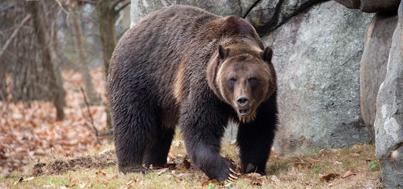

# Brown Bear

## [Attributes](./../../../../../CoreRules/GeneralRules/Attributes.md) and [Core Skills](./../../../../../CoreRules/GeneralRules/CoreSkills.md)

| [STR](./../../../../../CoreRules/GeneralRules/Attributes.md#strength-str)    | 3 |    | [RFX](./../../../../../CoreRules/GeneralRules/Attributes.md#reflex-rfx)                  | 0 |    | [INT](./../../../../../CoreRules/GeneralRules/Attributes.md#intelligence-int)                | -1 |    |
| ------------------------------------------------------------------------- | :-: | :-: | ------------------------------------------------------------------------------------- | :-: | :-: | ----------------------------------------------------------------------------------------- | :-: | :-: |
| [Athletics](./../../../../../CoreRules/GeneralRules/CoreSkills.md#athletics) | 0 | 6d6 | [Acrobatics](./../../../../../CoreRules/GeneralRules/CoreSkills.md#acrobatics)           | 0 | 3d6 | [Communication](./../../../../../CoreRules/GeneralRules/CoreSkills.md#communication)         | 0 | 2d6 |
| [Climb](./../../../../../CoreRules/GeneralRules/CoreSkills.md#climb)         | 1 | 7d6 | [Perception](./../../../../../CoreRules/GeneralRules/CoreSkills.md#perception)           | 3 | 6d6 | [General Knowledge](./../../../../../CoreRules/GeneralRules/CoreSkills.md#general-knowledge) | 0 | 2d6 |
| [Endurance](./../../../../../CoreRules/GeneralRules/CoreSkills.md#endurance) | 1 | 7d6 | [Sleight of Hand](./../../../../../CoreRules/GeneralRules/CoreSkills.md#sleight-of-hand) | 0 | 3d6 | [Survival](./../../../../../CoreRules/GeneralRules/CoreSkills.md#survival)                   | 2 | 4d6 |
| [Lift](./../../../../../CoreRules/GeneralRules/CoreSkills.md#lift)           | 2 | 8d6 | [Stealth](./../../../../../CoreRules/GeneralRules/CoreSkills.md#stealth)                 | 0 | 3d6 | [Will](./../../../../../CoreRules/GeneralRules/CoreSkills.md#will)                           | 1 | 3d6 |

## [Vocations](./../../../../../CoreRules/GeneralRules/Vocations.md) and [Vocation Skills](./../../../../../CoreRules/GeneralRules/Vocations.md#vocation-skills)

| Beast       |   STR, RFX   | 1 | 7d6 |
| ----------- | :-----------: | :-: | :-: |
| Large Claw  | STR, RFX, INT | 1 | 6d6 |
| Large Bite  | STR, RFX, INT | 1 | 6d6 |
| Large Stomp | STR, RFX, INT | 1 | 6d6 |

## Info

|                                                  Name                                                  |                          Info                          | Duration |                      Source                      |
| :-----------------------------------------------------------------------------------------------------: | :----------------------------------------------------: | :------: | :----------------------------------------------: |
|                          [Language](./../../../Languages/Languages.md): Babelish                          |                  Can speak Babelish.                  |          |                                                  |
|                           [Language](./../../../Languages/Languages.md): Primal                           |                   Can speak Primal.                   |          |                                                  |
|                                                                                                        |                                                        |          |                                                  |
|         [Minor Weakness](./../../../../../CoreRules/CombatRules/WeaknessAndResistance.md): Silver         | +1 to the level of injury received from Silver damage. |          |                     Fur Coat                     |
| [Physical Defense Level](./../../../../../CoreRules/CombatRules/DefenseAndPenetration.md#physical-defense) |                           1                           |          |                      Armor                      |
|                                                                                                        |                                                        |          |                                                  |
|                  [Size](./../../../../../CoreRules/CombatRules/BattleMap.md#size): Large                  |                10x10 ft on battle map.                |          |                                                  |
|      [Terrestrial Combat Speed](./../../../../../CoreRules/CombatRules/CombatSpeed.md#combat-speeds)      |                         60 ft                         |          | +10 ft (per Athletics Dice), +/-10 ft (per RFX) |
|          [Swim Combat Speed](./../../../../../CoreRules/CombatRules/CombatSpeed.md#combat-speeds)          |                         30 ft                         |          |  +5 ft (per Athletics Dice), +/-5 ft (per RFX)  |
|         [Climb Combat Speed](./../../../../../CoreRules/CombatRules/CombatSpeed.md#combat-speeds)         |                         35 ft                         |          |    +5 ft (per Climb Dice), +/-5 ft (per RFX)    |
|                                                                                                        |                                                        |          |                                                  |
|                      [Injury](./../../../../../CoreRules/CombatRules/Injury.md): None                      |             – 0 dice to all dice checks.             |          |                      Damage                      |

## [Combat Rolls](./../../../../../CoreRules/CombatRules/CombatRolls.md)

- [Victory Levels link](./../../../../../CoreRules/CombatRules/VictoryLevels.md)

### [Weapons](./../../../../../CoreRules/CombatRules/WeaponClasses.md)

|        Name        | [One Handed](./../../../../../CoreRules/CombatRules/WeaponClasses.md#one-handed) | [Two Handed](./../../../../../CoreRules/CombatRules/WeaponClasses.md#two-handed) | [Dual Wielded](./../../../../../CoreRules/CombatRules/WeaponClasses.md#dual-wielded) | [Penetration](./../../../../../CoreRules/CombatRules/DefenseAndPenetration.md#penetration) | [Range](./../../../../../CoreRules/CombatRules/Range.md) | [Damage Types](./../../../../../CoreRules/CombatRules/DamageTypes.md) | [Engageable Opponents](./../../../../../CoreRules/CombatRules/EngageableOpponents.md) | [Area Of Effect](./../../../../../CoreRules/CombatRules/AreaOfEffect.md) | [Weapon Resource](./../../../../../CoreRules/CombatRules/WeaponClasses.md#weapon-resources) |
| :-----------------: | :--------------------------------------------------------------------------------: | :--------------------------------------------------------------------------------: | :------------------------------------------------------------------------------------: | :-------------------------------------------------------------------------------------: | :---------------------------------------------------: | :---------------------------------------------------------------------: | :-------------------------------------------------------------------------------------: | :------------------------------------------------------------------------: | :-------------------------------------------------------------------------------------------: |
| Large Piercing Claw |                                        +1d6                                        |                                        None                                        |                                          +1d6                                          |                                            2                                            |                         Melee                         |                                 Pierce                                 |                                          Rapid                                          |                                    None                                    |                                             None                                             |
| Large Slashing Claw |                                  +2d6 (8d6)                                  |                                        None                                        |                                    +1d6 (9d6)                                    |                                            0                                            |                         Melee                         |                             Slash, Bludgeon                             |                                          Rapid                                          |                                    None                                    |                                             None                                             |
|     Large Bite     |                                        None                                        |                                  +3d6 (9d6)                                  |                                          None                                          |                                            3                                            |                         Melee                         |                            Pierce, Bludgeon                            |                                       Spear Rapid                                       |                                    None                                    |                                             None                                             |
|     Large Stomp     |                                  +0d6 (6d6)                                  |                                        None                                        |                                    +1d6 (7d6)                                    |                                            4                                            |                         Melee                         |                                Bludgeon                                |                                          Rapid                                          |                                    None                                    |                                             None                                             |
