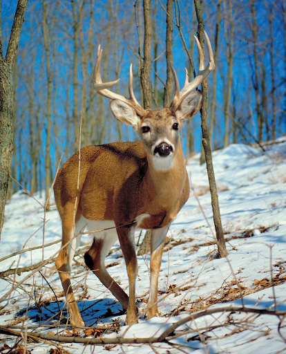

# Deer

## Attributes and Core Skills

| STR       | 0 |    | RFX             | 1 |    | INT               | -1 |    |
| --------- | :-: | :-: | --------------- | :-: | :-: | ----------------- | :-: | :-: |
| Athletics | 3 | 6d6 | Acrobatics      | 0 | 4d6 | Communication     | 0 | 2d6 |
| Climb     | 0 | 3d6 | Perception      | 1 | 5d6 | General Knowledge | 0 | 2d6 |
| Endurance | 0 | 3d6 | Sleight of Hand | 0 | 4d6 | Survival          | 2 | 4d6 |
| Lift      | 0 | 3d6 | Stealth         | 0 | 4d6 | Will              | 0 | 2d6 |

## Vocations and Vocational Skills

| Beast {STR, RFX}           | 1 | 5d6 |
| -------------------------- | :-: | :-: |
| Small Bite {STR, RFX, INT} | 0 | 3d6 |
| Horn {STR, RFX, INT}       | 1 | 4d6 |

## Effects

|           Name           |        Effect        | Duration |                          Source                          |
| :----------------------: | :-------------------: | :------: | :-------------------------------------------------------: |
|  Physical Defense Level  |           0           |          |                           Armor                           |
|       Medium Size       | 5x5 ft on battle map. |          |                                                          |
|     Language: Primal     |   Can speak Primal.   |          |                                                          |
| 4-Legged Movement Speed |        75 ft        |          | 50 ft (Base), +/-10 ft (per RFX), +/-5 ft (per Athletics) |
|   4-Legged Swim Speed   |         30 ft         |          | 15 ft (Base), +/-5 ft (per STR), +/-5 ft (per Athletics) |
|  4-Legged Climb Speed  |         0 ft         |          |    0 ft (Base), +/-5 ft (per STR), +/-5 ft (per Climb)    |

## Combat Rolls

|    Name    | One Handed | Two Handed | Dual Wielded | Penetration | Range | Damage Types | Engageable Opponents | Area Of Effect | Resource Class |
| :--------: | :-------------: | :-------------: | :---------------: | :---------: | :---: | :---------------: | :-----------------------: | :-----------------: | :-----------------: |
| Small Bite | 3d6 (+0d6) |      None      |       None       |      0      | Melee | Pierce, Bludgeon |          Focused          |        None        |        None        |
|   Horns   | 4d6 (+1d6) |      +1d6      |       None       |      2      | Melee |      Pierce      |           Rapid           |        None        |        None        |
