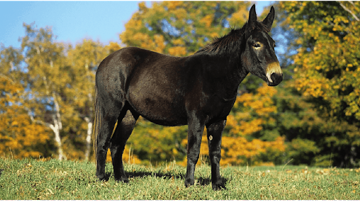

# Mule

## Attributes and Core Skills

| STR       |   2   |       | RFX             |   0   |       | INT               |  -1   |       |
| --------- | :---: | :---: | --------------- | :---: | :---: | ----------------- | :---: | :---: |
| Athletics |   2   |  7d6  | Acrobatics      |   0   |  3d6  | Communication     |   0   |  2d6  |
| Climb     |   2   |  7d6  | Perception      |   2   |  5d6  | General Knowledge |   0   |  2d6  |
| Endurance |   3   |  8d6  | Sleight of Hand |   0   |  3d6  | Survival          |   1   |  3d6  |
| Lift      |   2   |  7d6  | Stealth         |   0   |  3d6  | Will         |   1   |  3d6  |

## Vocations and Vocational Skills

| Beast {STR, RFX}  |   2   |  7d6  |
| ----------------- | :---: | :---: |
| Large Stomp {ALL} |   2   |  7d6  |
| Bite {ALL}        |   0   |  4d6  |

## Effects

|          Name           |             Effect              | Duration |                                                                  Source                                                                  |
| :---------------------: | :-----------------------------: | :------: | :--------------------------------------------------------------------------------------------------------------------------------------: |
| Physical Defense Level  |                0                |          |                                                                  Armor                                                                   |
|       Large Size        |     10x10 ft on battle map.     |          |                                                                                                                                          |
|    Inventory Weight     |              33 lb              |          |                                                                Equipment                                                                 |
|  4-Legged Carry Weight  |             600 lb              |          | 120 lb (Base), +200 lb positive STR, -50 lb negative STR, + 80 lb positive Lift, - 20 lb negative Lift |
|      Light Weight       | -0d6 to STR/RFX governed skills |          |                                                         0% - 25% of carry weight                                                         |
| 4-Legged Movement Speed |              60 ft              |          |                                          50 ft (Base), +/-10 ft (per RFX), +/-5 ft (per Athletics)                                           |
|   4-Legged Swim Speed   |              35 ft              |          |                                         15 ft (Base), +/-5 ft (per STR), +/-5 ft (per Athletics)                                         |
|  4-Legged Climb Speed   |              30 ft              |          |                                           0 ft (Base), +/-5 ft (per STR), +/-5 ft (per Climb)                                            |

## Combat Rolls

|    Name     | One Handed | Two Handed | Dual Wielded | Penetration | Range | Damage Types | Engageable Opponents | Area Of Effect | Resource Class |
| :---------: | :-------------: | :-------------: | :---------------: | :---------: | :---: | :---------------: | :-----------------------: | :-----------------: | :-----------------: |
| Large Stomp | 7d6 (+1d6) |     (+1d6)      |       None        |      5      | Melee |     Bludgeon      |           Rapid           |        None         |        None         |
|    Bite     | 5d6 (+1d6) |     (+1d6)      |       None        |      2      | Melee | Pierce, Bludgeon  |          Focused          |        None         |        None         |

## Equipment

| Name            |   #   | Class |  Tier   | Durability |  LB   | Value |
| --------------- | :---: | :---: | :-----: | :--------: | :---: | :---: |
| Saddle - Riding |   1   |   | Mundane |            |  25   | 10 bc |

## Containers

| Name       |   #   |      Class      |  Tier   | Durability |  LB   | Value |
| ---------- | :---: | :-------------: | :-----: | :--------: | :---: | :---: |
| Saddlebags |   1   | 50 lb container | Mundane |            |   8   | 4 bc  |

## Appearance

Age:

Race:

Height: ?' ?"

Weight: ~ ? lb

Body Type:

Hair Color:

Eyes Color:

Additional Details:

## Disposition

## Backstory
