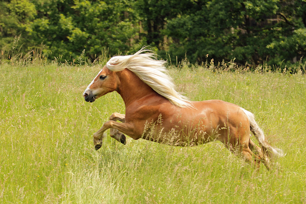

# Pony

## [Attributes](./../../../../../CoreRules/GeneralRules/Attributes.md) and [Core Skills](./../../../../../CoreRules/GeneralRules/CoreSkills.md)

|  [STR](./../../../../../CoreRules/GeneralRules/Attributes.md#strength-str)  | 1 |    |    [RFX](./../../../../../CoreRules/GeneralRules/Attributes.md#reflex-rfx)    | 0 |    |        [INT](./../../../../../CoreRules/GeneralRules/Attributes.md#intelligence-int)        | -2 |    |
| :-----------------------------------------------------------------------: | :-: | :-: | :-------------------------------------------------------------------------: | :-: | :-: | :---------------------------------------------------------------------------------------: | :-: | :-: |
| [Athletics](./../../../../../CoreRules/GeneralRules/CoreSkills.md#athletics) | 2 | 6d6 |  [Dexterity](./../../../../../CoreRules/GeneralRules/CoreSkills.md#dexterity)  | 0 | 3d6 |     [Communication](./../../../../../CoreRules/GeneralRules/CoreSkills.md#communication)     | 0 | 1d6 |
|                               (Deprecated)                               | -1 | 4d6 | [Perception](./../../../../../CoreRules/GeneralRules/CoreSkills.md#perception) | 2 | 5d6 | [General Knowledge](./../../../../../CoreRules/GeneralRules/CoreSkills.md#general-knowledge) | 0 | 1d6 |
| [Endurance](./../../../../../CoreRules/GeneralRules/CoreSkills.md#endurance) | 2 | 6d6 |                                (Deprecated)                                | 0 | 3d6 |                                       (Deprecated)                                       | 1 | 2d6 |
|      [Lift](./../../../../../CoreRules/GeneralRules/CoreSkills.md#lift)      | 2 | 6d6 |    [Stealth](./../../../../../CoreRules/GeneralRules/CoreSkills.md#stealth)    | 0 | 3d6 |              [Will](./../../../../../CoreRules/GeneralRules/CoreSkills.md#will)              | 1 | 2d6 |

## [Vocations](./../../../../../CoreRules/GeneralRules/Vocations.md) and [Vocation Skills](./../../../../../CoreRules/GeneralRules/Vocations.md#vocation-skills)

| Beast        |   STR, RFX   | 1 | 5d6 |
| ------------ | :-----------: | :-: | :-: |
| Primal Melee | STR, RFX, INT | 1 | 3d6 |

## Effects

|                                             Name                                             |                Desc              | Duration |                      Source                      |
| :-------------------------------------------------------------------------------------------: | :---------------------------------: | :------: | :----------------------------------------------: |
|      [Equipment Weight](./../../../../../CoreRules/AdvancedRules/CarryWeight.md#equipment)      |                33 lb                |          |                    Equipment                    |
|       [Carry Weight](./../../../../../CoreRules/AdvancedRules/CarryWeight.md#carry-weight)       |               300 lb               |          |        +50 lbs Carry Weight per Lift dice        |
|  [Weight Class](./../../../../../CoreRules/AdvancedRules/CarryWeight.md#weight-classes): Light  | -0d to STR/RFX governed Dice Pools |          |  0% =< Equipment Weight <= 25% of Carry Weight  |
|                                                                                              |                                    |          |                                                  |
|   [Physical Defense Level](./../../../../../CoreRules/CombatRules/Defense.md#physical-defense)   |                  0                  |          |                  Armor & Shield                  |
|                                                                                              |                                    |          |                                                  |
|             [Size](./../../../../../CoreRules/CombatRules/BattleMap.md#size): Medium             |        5x5 ft on battle map.        |          |                                                  |
| [Combat Speed](./../../../../../CoreRules/CombatRules/CombatSpeed.md#combat-speeds): Terrestrial |                60 ft                |          | +10 ft (per Athletics Dice), +/-10 ft (per RFX) |
|    [Combat Speed](./../../../../../CoreRules/CombatRules/CombatSpeed.md#combat-speeds): Swim    |                30 ft                |          |  +5 ft (per Athletics Dice), +/-5 ft (per RFX)  |
|    [Combat Speed](./../../../../../CoreRules/CombatRules/CombatSpeed.md#combat-speeds): Climb    |                20 ft                |          |  +5 ft (per Athletics Dice), +/-5 ft (per RFX)  |
|                                                                                              |                                    |          |                                                  |
|                 [Injury](./../../../../../CoreRules/CombatRules/Injury.md): None                 |    – 0 dice to all dice checks.    |          |                 Damage Received                 |

## [Combat Rolls](./../../../../../CoreRules/CombatRules/CombatRolls.md)

- [Victory Levels link](./../../../../../CoreRules/CombatRules/VictoryLevels.md)

### [Weapons](./../../../../../CoreRules/CombatRules/Weapons.md)

| Name | [One Handed](./../../../../../CoreRules/CombatRules/Weapons.md#one-handed) | [Two Handed](./../../../../../CoreRules/CombatRules/Weapons.md#two-handed) | [Dual Wielded](./../../../../../CoreRules/CombatRules/Weapons.md#dual-wielded) | [Penetration](./../../../../../CoreRules/CombatRules/Penetration.md) | [Range](./../../../../../CoreRules/CombatRules/Range.md) | [Uses Per Round](./../../../../../CoreRules/CombatRules/UsesPerRound.md) | [Area Of Effect](./../../../../../CoreRules/CombatRules/AreaOfEffect.md) | [Ammo Type](./../../../../../CoreRules/CombatRules/Ammunitions.md#ammo-type) | [Ammo Per Use](./../../../../../CoreRules/CombatRules/Weapons.md#ammo-per-shot) | [Damage Types](./../../../../../CoreRules/CombatRules/DamageTypes.md) |
| :--: | :--------------------------------------------------------------------------: | :--------------------------------------------------------------------------: | :------------------------------------------------------------------------------: | :---------------------------------------------------------------: | :---------------------------------------------------: | :-------------------------------------------------------------------------------------: | :------------------------------------------------------------------------: | :----------------------------------------------------------------------------: | :-------------------------------------------------------------------------------: | :---------------------------------------------------------------------: |
| Slam |                               +0d6 (3d6)                               |                                     None                                     |                                 +1d6 (4d6)                                 |                                 2                                 |                         Melee                         |                                          Swift                                          |                                                                            |                                      None                                      |                                                                                  |                                Bludgeon                                |

## [Equipment](./../../../../../CoreRules/AdvancedRules/CarryWeight.md#equipment)

| Name            | # | [Effects](./../../../../../../README.md#effect-rules) | [LB](./../../../../../CoreRules/AdvancedRules/CarryWeight.md) | [Value](./../../../Items/ItemShop.md#currency) | Description |
| --------------- | :-: | ------------------------------------------------------------------ | :--------------------------------------------------------: | :-----------------------------------------: | ----------- |
| Saddle - Riding | 1 |                                                                    |                             25                             |                    10 bc                    |             |

## [Containers](./../../../../../CoreRules/AdvancedRules/Containers.md)

| Name       |        #        | [Effects](./../../../../../../README.md#effect-rules) | [LB](./../../../../../CoreRules/AdvancedRules/CarryWeight.md) | [Value](./../../../Items/ItemShop.md#currency) | Description |
| ---------- | :-------------: | ------------------------------------------------------------------ | :--------------------------------------------------------: | :-----------------------------------------: | ----------- |
| Saddlebags | 50 lb container |                                                                    |                             8                             |                    4 bc                    |             |

## Appearance

Age:

Race:

Height: ?' ?"

Weight: ~ ? lb

Body Type:

Hair Color:

Eye Color:

Additional Details:

## Disposition

## Backstory
