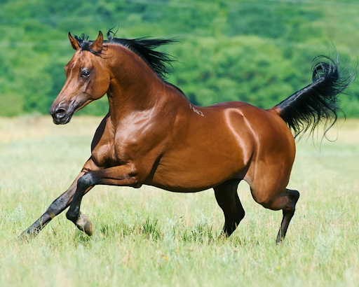

# Riding Horse

## Attributes and Core Skills

| STR       | 2 |    | RFX             | 0 |    | INT               | -1 |    |
| --------- | :-: | :-: | --------------- | :-: | :-: | ----------------- | :-: | :-: |
| Athletics | 4 | 9d6 | Acrobatics      | 0 | 3d6 | Communication     | 0 | 3d6 |
| Climb     | 0 | 5d6 | Perception      | 1 | 4d6 | General Knowledge | 0 | 3d6 |
| Endurance | 2 | 6d6 | Sleight of Hand | 0 | 3d6 | Survival          | 0 | 3d6 |
| Lift      | 0 | 5d6 | Stealth         | 0 | 3d6 | Will              | 0 | 3d6 |

## Vocations and Vocational Skills

| Beast {STR, RFX}            | 2 | 7d6 |
| --------------------------- | :-: | :-: |
| Large Stomp {STR, RFX, INT} | 2 | 6d6 |

## Effects

|          Name          |             Effect             | Duration |                                                       Source                                                       |
| :---------------------: | :-----------------------------: | :------: | :-----------------------------------------------------------------------------------------------------------------: |
| Physical Defense Level |                0                |          |                                                        Armor                                                        |
|       Large Size       |     10x10 ft on battle map.     |          |                                                                                                                    |
|    Equipment Weight    |              33 lb              |          |                                                      Equipment                                                      |
| Carry Weight |             520 lb             |          | +50 lbs Max Carry Weight per Lift dice |
|      Light Weight      | -0d6 to STR/RFX governed skills |          |                                              0% - 25% of carry weight                                              |
| Terrestrial Combat Speed |              80 ft              |          |                              +10 ft (per Athletics Dice), +/-10 ft (per RFX)                              |
|   4-Legged Swim Combat Speed   |              30 ft              |          |                              +5 ft (per Athletics Dice), +/-5 ft (per RFX)                              |
|  4-Hooved Climb Combat Speed  |              10 ft              |          |                                 +2.5 ft (per Climb Dice), +/-2.5 ft (per RFX)                                 |

## Combat Rolls

|    Name    | One Handed | Two Handed | Dual Wielded | Penetration | Range | Damage Types | Engageable Opponents | Area Of Effect | Resource Class |
| :---------: | :-------------: | :-------------: | :---------------: | :---------: | :---: | :---------------: | :-----------------------: | :-----------------: | :-----------------: |
| Large Stomp | 6d6 (+0d6) |      None      |  7d6 (+1d6)  |      5      | Melee |     Bludgeon     |           Rapid           |        None        |        None        |

## Equipment

| Name            | # | Class | Effect |  Tier  | Durability | LB | Value |
| --------------- | :-: | :---: | :----: | :-----: | :--------: | :-: | :---: |
| Saddle - Riding | 1 |      |        | Mundane |            | 25 | 10 bc |

## Containers

| Name       | # |      Class      | Effect |  Tier  | Durability | LB | Value |
| ---------- | :-: | :-------------: | :----: | :-----: | :--------: | :-: | :---: |
| Saddlebags | 1 | 50 lb container |        | Mundane |            | 8 | 4 bc |

## Appearance

Age:

Race:

Height: ?' ?"

Weight: ~ ? lb

Body Type:

Hair Color:

Eyes Color:

Additional Details:

## Disposition

## Backstory
