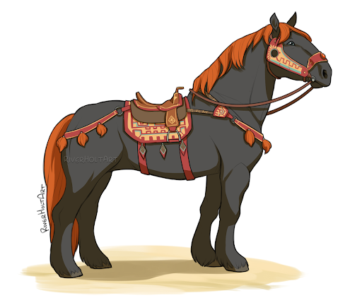

# Warhorse

## Attributes and Core Skills

| STR       | 3 |    | RFX             | 0 |    | INT               | -1 |    |
| --------- | :-: | :-: | --------------- | :-: | :-: | ----------------- | :-: | :-: |
| Athletics | 3 | 9d6 | Acrobatics      | 0 | 3d6 | Communication     | 0 | 2d6 |
| Climb     | 0 | 6d6 | Perception      | 2 | 5d6 | General Knowledge | -1 | 1d6 |
| Endurance | 2 | 8d6 | Sleight of Hand | 0 | 3d6 | Survival          | 1 | 3d6 |
| Lift      | 1 | 7d6 | Stealth         | 0 | 3d6 | Will              | 1 | 3d6 |

## Vocations and Vocational Skills

| Beast {STR, RFX}            | 2 | 8d6 |
| --------------------------- | :-: | :-: |
| Large Stomp {STR, RFX, INT} | 2 | 7d6 |

## Effects

|             Name             |             Effect             | Duration |                                                       Source                                                       |
| :--------------------------: | :-----------------------------: | :------: | :-----------------------------------------------------------------------------------------------------------------: |
|    Physical Defense Level    |                0                |          |                                                        Armor                                                        |
|          Large Size          |     10x10 ft on battle map.     |          |                                                                                                                    |
|       Equipment Weight       |              33 lb              |          |                                                      Equipment                                                      |
|    4-Legged Carry Weight    |             720 lb             |          | 120 lb (Base), +200 lb positive STR, -50 lb negative STR, + 80 lb positive Lift, - 20 lb negative Lift |
|         Light Weight         | -0d6 to STR/RFX governed skills |          |                                              0% - 25% of carry weight                                              |
| 4-Legged Movement Speed |              80 ft              |          |                               50 ft (Base), +/-5 ft (per Athletics Modifier), +/-10 ft (per RFX)                               |
|     4-Legged Swim Speed     |              45 ft              |          |                              15 ft (Base), +/-5 ft (per Athletics Modifier), +/-5 ft (per RFX)                              |
|     4-Hooved Climb Speed     |              15 ft              |          |                                 0 ft (Base), +/-5 ft (per Climb Modifier), +/-5 ft (per RFX)                                 |

## Combat Rolls

|    Name    | One Handed | Two Handed | Dual Wielded | Penetration | Range | Damage Types | Engageable Opponents | Area Of Effect | Resource Class |
| :---------: | :-------------: | :-------------: | :---------------: | :---------: | :---: | :---------------: | :-----------------------: | :-----------------: | :-----------------: |
| Large Stomp | 7d6 (+0d6) |      None      |  8d6 (+1d6)  |      5      | Melee |     Bludgeon     |           Rapid           |        None        |        None        |

## Equipment

| Name            | # | Class | Effect |  Tier  | Durability | LB | Value |
| --------------- | :-: | :---: | :----: | :-----: | :--------: | :-: | :---: |
| Saddle - Riding | 1 |      |        | Mundane |            | 25 | 10 bc |

## Containers

| Name       | # |      Class      | Effect |  Tier  | Durability | LB | Value |
| ---------- | :-: | :-------------: | :----: | :-----: | :--------: | :-: | :---: |
| Saddlebags | 1 | 50 lb container |        | Mundane |            | 8 | 4 bc |

## Appearance

Age:

Race:

Height: ?' ?"

Weight: ~ ? lb

Body Type:

Hair Color:

Eyes Color:

Additional Details:

## Disposition

## Backstory
