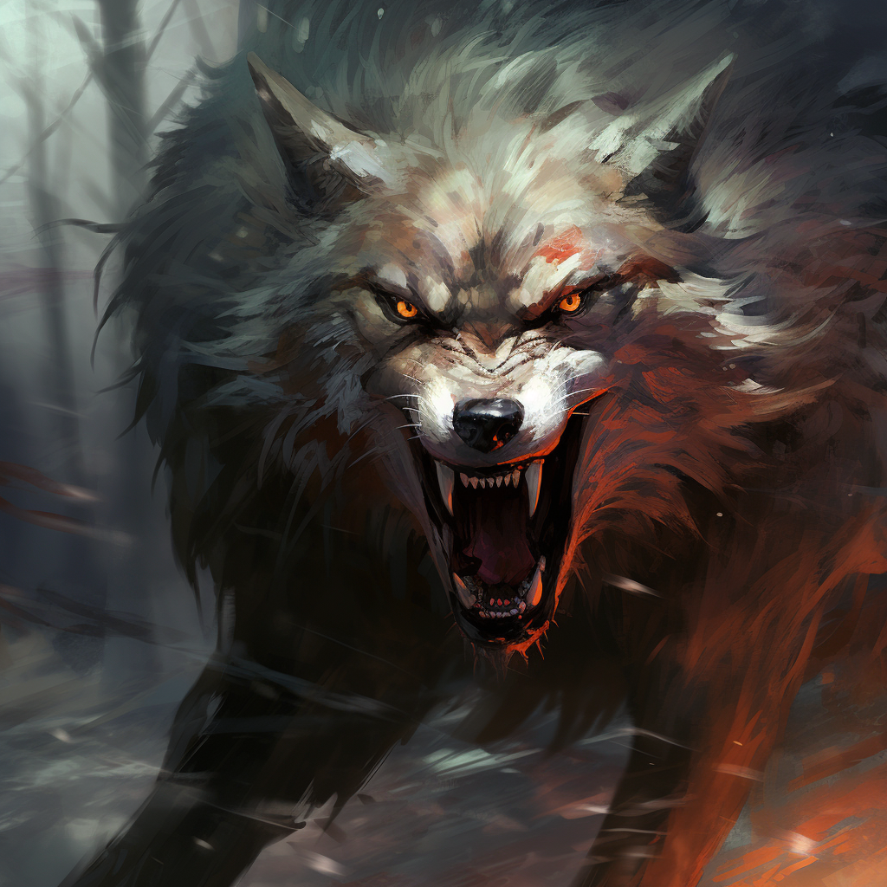

# Wolf

## [Attributes](./../../../../../CoreRules/GeneralRules/Attributes.md) and [Core Skills](./../../../../../CoreRules/GeneralRules/CoreSkills.md)

|  [STR](./../../../../../CoreRules/GeneralRules/Attributes.md#strength-str)  | 0 |    |    [RFX](./../../../../../CoreRules/GeneralRules/Attributes.md#reflex-rfx)    | 1 |    |        [INT](./../../../../../CoreRules/GeneralRules/Attributes.md#intelligence-int)        | -2 |    |
| :-----------------------------------------------------------------------: | :-: | :-: | :-------------------------------------------------------------------------: | :-: | :-: | :---------------------------------------------------------------------------------------: | :-: | :-: |
| [Athletics](./../../../../../CoreRules/GeneralRules/CoreSkills.md#athletics) | 3 | 6d6 |  [Dexterity](./../../../../../CoreRules/GeneralRules/CoreSkills.md#dexterity)  | 0 | 4d6 |     [Communication](./../../../../../CoreRules/GeneralRules/CoreSkills.md#communication)     | 0 | 1d6 |
|                               (Deprecated)                               | 0 | 3d6 | [Perception](./../../../../../CoreRules/GeneralRules/CoreSkills.md#perception) | 1 | 5d6 | [General Knowledge](./../../../../../CoreRules/GeneralRules/CoreSkills.md#general-knowledge) | 0 | 1d6 |
| [Endurance](./../../../../../CoreRules/GeneralRules/CoreSkills.md#endurance) | 1 | 4d6 |                                (Deprecated)                                | 0 | 4d6 |                                       (Deprecated)                                       | 2 | 3d6 |
|      [Lift](./../../../../../CoreRules/GeneralRules/CoreSkills.md#lift)      | 1 | 4d6 |    [Stealth](./../../../../../CoreRules/GeneralRules/CoreSkills.md#stealth)    | 1 | 5d6 |              [Will](./../../../../../CoreRules/GeneralRules/CoreSkills.md#will)              | 0 | 1d6 |

## [Vocations](./../../../../../CoreRules/GeneralRules/Vocations.md) and [Vocation Skills](./../../../../../CoreRules/GeneralRules/Vocations.md#vocation-skills)

|    Beast    |   STR, RFX   | 2 | 6d6 |
| :----------: | :-----------: | :-: | :-: |
| Primal Melee | STR, RFX, INT | 2 | 4d6 |

## Effects

|                                            Name                                            |                      Desc                      | Duration |                      Source                      |
| :----------------------------------------------------------------------------------------: | :--------------------------------------------: | :------: | :----------------------------------------------: |
|                                         Keen Smell                                         |  Advantage on smell based Perception checks.  |          |                                                  |
|                                        Keen Hearing                                        | Advantage on hearing based Perception checks. |          |                                                  |
|                                                                                            |                                                |          |                                                  |
| [Physical Defense Level](./../../../../../CoreRules/CombatRules/Defense.md#physical-defense) |                       0                       |          |                  Armor & Shield                  |
|                                                                                            |                                                |          |                                                  |
|           [Size](./../../../../../CoreRules/CombatRules/BattleMap.md#size): Medium           |             5x5 ft on battle map.             |          |                                                  |
| [Combat Speed](./../../../../../CoreRules/CombatRules/BattleMap.md#combat-speed): Terrestrial |                     60 ft                     |          | +10 ft (per Athletics Dice), +/-10 ft (per RFX) |
|    [Combat Speed](./../../../../../CoreRules/CombatRules/BattleMap.md#combat-speed): Swim    |                     30 ft                     |          |  +5 ft (per Athletics Dice), +/-5 ft (per RFX)  |
|    [Combat Speed](./../../../../../CoreRules/CombatRules/BattleMap.md#combat-speed): Climb    |                     15 ft                     |          |  +5 ft (per Athletics Dice), +/-5 ft (per RFX)  |
|                                                                                            |                                                |          |                                                  |
|          [Injury](./../../../../../CoreRules/CombatRules/InjuryAndHealing.md): None          |         – 0 dice to all dice checks.         |          |                 Damage Received                 |

## [Combat Rolls](./../../../../../CoreRules/CombatRules/CombatRolls.md)

- [Victory Levels link](./../../../../../CoreRules/CombatRules/VictoryLevels.md)

### [Weapons](./../../../../../CoreRules/CombatRules/Weapons.md)

|      Name      | [One Handed](./../../../../../CoreRules/CombatRules/Weapons.md#one-handed) | [Two Handed](./../../../../../CoreRules/CombatRules/Weapons.md#two-handed) | [Dual Wielded](./../../../../../CoreRules/CombatRules/Weapons.md#dual-wielded) | [Penetration](./../../../../../CoreRules/CombatRules/Penetration.md) | [Range](./../../../../../CoreRules/CombatRules/Range.md) | [Uses Per Round](./../../../../../CoreRules/CombatRules/UsesPerRound.md) | [Area Of Effect](./../../../../../CoreRules/CombatRules/AreaOfEffect.md) | [Ammo Type](./../../../../../CoreRules/CombatRules/Ammunitions.md#ammo-type) | [Ammo Per Use](./../../../../../CoreRules/CombatRules/Weapons.md#ammo-per-shot) | [Damage Types](./../../../../../CoreRules/CombatRules/DamageTypes.md) |
| :-------------: | :--------------------------------------------------------------------------: | :--------------------------------------------------------------------------: | :------------------------------------------------------------------------------: | :---------------------------------------------------------------: | :---------------------------------------------------: | :------------------------------------------------------------------------: | :------------------------------------------------------------------------: | :----------------------------------------------------------------------------: | :-------------------------------------------------------------------------------: | :---------------------------------------------------------------------: |
| Shredding Bite |                                     +1d6                                     |                                     None                                     |                                       +1d6                                       |                                 0                                 |                         Melee                         |                                   Swift                                   |                                                                            |                                      None                                      |                                                                                  |                              Slash, Pierce                              |
|  Piercing Bite  |                                     +0d6                                     |                                     None                                     |                                       +1d6                                       |                                 2                                 |                         Melee                         |                                   Swift                                   |                                                                            |                                      None                                      |                                                                                  |                            Pierce, Bludgeon                            |

## Disposition

- Pack oriented
- Feral
