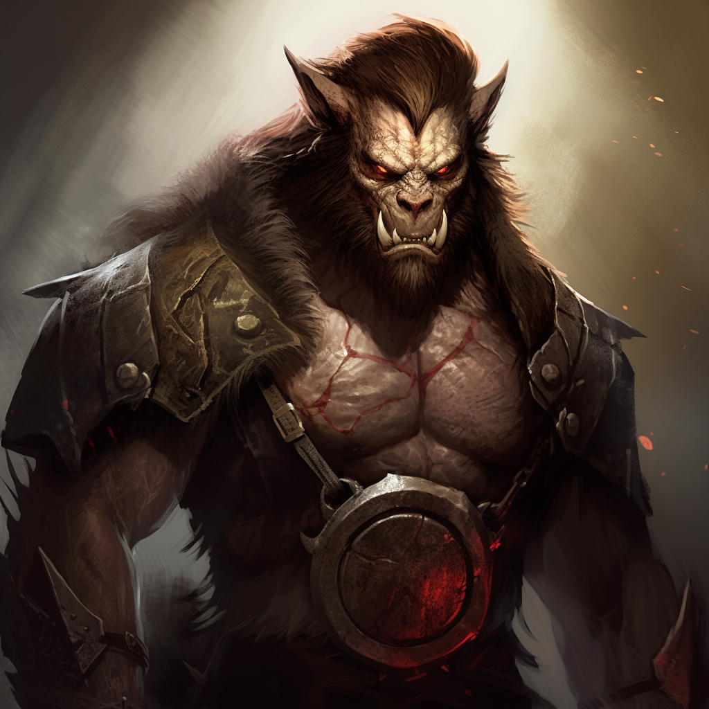

# Feral Beastkin

## [Attributes](./../../../../../CoreRules/GeneralRules/Attributes.md) and [Core Skills](./../../../../../CoreRules/GeneralRules/CoreSkills.md)

|  [STR](./../../../../../CoreRules/GeneralRules/Attributes.md#strength-str)  | 1 |    |    [RFX](./../../../../../CoreRules/GeneralRules/Attributes.md#reflex-rfx)    | 1 |    |        [INT](./../../../../../CoreRules/GeneralRules/Attributes.md#intelligence-int)        | 0 |    |
| :-----------------------------------------------------------------------: | :-: | :-: | :-------------------------------------------------------------------------: | :-: | :-: | :---------------------------------------------------------------------------------------: | :-: | :-: |
| [Athletics](./../../../../../CoreRules/GeneralRules/CoreSkills.md#athletics) | 0 | 4d6 |  [Dexterity](./../../../../../CoreRules/GeneralRules/CoreSkills.md#dexterity)  | 0 | 4d6 |     [Communication](./../../../../../CoreRules/GeneralRules/CoreSkills.md#communication)     | -1 | 2d6 |
|                               (Deprecated)                               | 0 | 4d6 | [Perception](./../../../../../CoreRules/GeneralRules/CoreSkills.md#perception) | 0 | 4d6 | [General Knowledge](./../../../../../CoreRules/GeneralRules/CoreSkills.md#general-knowledge) | -1 | 2d6 |
| [Endurance](./../../../../../CoreRules/GeneralRules/CoreSkills.md#endurance) | 0 | 4d6 |                                (Deprecated)                                | -1 | 3d6 |                                       (Deprecated)                                       | 0 | 3d6 |
|      [Lift](./../../../../../CoreRules/GeneralRules/CoreSkills.md#lift)      | 1 | 5d6 |    [Stealth](./../../../../../CoreRules/GeneralRules/CoreSkills.md#stealth)    | 1 | 5d6 |              [Will](./../../../../../CoreRules/GeneralRules/CoreSkills.md#will)              | 0 | 3d6 |

## [Vocations](./../../../../../CoreRules/GeneralRules/Vocations.md) and [Vocation Skills](./../../../../../CoreRules/GeneralRules/Vocations.md#vocation-skills)

|   Warrior   | STR, RFX, INT | 1 | 6d6 |
| :----------: | :-----------: | :-: | :-: |
| Medium Melee | STR, RFX, INT | 1 | 6d6 |
| Close Melee | STR, RFX, INT | 1 | 6d6 |

| [Fellcaster](./../../../MagicSystems/Fellcraft/Fellcraft.md) | STR, RFX, INT | 0 | 5d6 |
| :-------------------------------------------------------: | :-----------: | :-: | :-: |
|                         Polycraft                         | STR, RFX, INT | -1 | 4d6 |
|                         Sonocraft                         | STR, RFX, INT | -1 | 4d6 |

## Info

|                                                  Name                                                  |                                                          Info                                                          | Duration |                      Source                      |
| :-----------------------------------------------------------------------------------------------------: | :---------------------------------------------------------------------------------------------------------------------: | :------: | :----------------------------------------------: |
|                          [Language](./../../../Languages/Languages.md): Babelish                          |                                                   Can speak Babelish.                                                   |          |                                                  |
|                           [Language](./../../../Languages/Languages.md): Primal                           |                                                    Can speak Primal.                                                    |          |                                                  |
|            [Darkvision](./../../../../../CoreRules/AdvancedRules/VisionAndLight.md#darkvision)            | Within 60 feet, sees dim light as if it were bright light and darkness as if it were dim light, though devoid of color. |          |                                                  |
|                                                                                                        |                                                                                                                        |          |                                                  |
|           [Equipment Weight](./../../../../../CoreRules/AdvancedRules/CarryWeight.md#equipment)           |                                                          30 lb                                                          |          |                    Equipment                    |
|            [Carry Weight](./../../../../../CoreRules/AdvancedRules/CarryWeight.md#carry-weight)            |                                                         250 lb                                                         |          |        +50 lbs Carry Weight per Lift dice        |
|       [Weight Class](./../../../../../CoreRules/AdvancedRules/CarryWeight.md#weight-classes): Light       |                                           -0d6 to STR/RFX governed Dice Pools                                           |          |  0% =< Equipment Weight <= 25% of Carry Weight  |
|                                                                                                        |                                                                                                                        |          |                                                  |
| [Physical Defense Level](./../../../../../CoreRules/CombatRules/DefenseAndPenetration.md#physical-defense) |                                                    2, 4 with Shield                                                    |          |                  Armor & Shield                  |
|                                                                                                        |                                                                                                                        |          |                                                  |
|         [Minor Weakness](./../../../../../CoreRules/CombatRules/WeaknessAndResistance.md): Silver         |                                  +1 to the level of injury received from damage type.                                  |          |                                                  |
|                                                                                                        |                                                                                                                        |          |                                                  |
|                  [Size](./../../../../../CoreRules/CombatRules/BattleMap.md#size): Medium                  |                                                  5x5 ft on battle map.                                                  |          |                                                  |
|      [Combat Speed](./../../../../../CoreRules/CombatRules/CombatSpeed.md#combat-speeds): Terrestrial      |                                                          50 ft                                                          |          | +10 ft (per Athletics Dice), +/-10 ft (per RFX) |
|         [Combat Speed](./../../../../../CoreRules/CombatRules/CombatSpeed.md#combat-speeds): Swim         |                                                          25 ft                                                          |          |  +5 ft (per Athletics Dice), +/-5 ft (per RFX)  |
|         [Combat Speed](./../../../../../CoreRules/CombatRules/CombatSpeed.md#combat-speeds): Climb         |                                                          25 ft                                                          |          |  +5 ft (per Athletics Dice), +/-5 ft (per RFX)  |
|                                                                                                        |                                                                                                                        |          |                                                  |
|            [Magic Resource](./../../../../../CoreRules/MagicRules/MagicResource.md): Fellblood            |                                                           3/3                                                           |          |       Vocation/Magic Governing Core Skill       |
|                      [Injury](./../../../../../CoreRules/CombatRules/Injury.md): None                      |                                              – 0 dice to all dice checks.                                              |          |                 Damage Received                 |

## [Combat Rolls](./../../../../../CoreRules/CombatRules/CombatRolls.md)

- [Victory Levels link](./../../../../../CoreRules/CombatRules/VictoryLevels.md)

### [Weapons](./../../../../../CoreRules/CombatRules/Weapons.md)

|        Name        | [One Handed](./../../../../../CoreRules/CombatRules/Weapons.md#one-handed) | [Two Handed](./../../../../../CoreRules/CombatRules/Weapons.md#two-handed) | [Dual Wielded](./../../../../../CoreRules/CombatRules/Weapons.md#dual-wielded) | [Penetration](./../../../../../CoreRules/CombatRules/DefenseAndPenetration.md#penetration) | [Range](./../../../../../CoreRules/CombatRules/Range.md) | [Engageable Opponents](./../../../../../CoreRules/CombatRules/EngageableOpponents.md) | [Area Of Effect](./../../../../../CoreRules/CombatRules/AreaOfEffect.md) | [Weapon Resource](./../../../../../CoreRules/CombatRules/Weapons.md#weapon-resources) | [Ammo Per Use](./../../../../../CoreRules/CombatRules/Weapons.md#resource-per-shot) | [Damage Types](./../../../../../CoreRules/CombatRules/DamageTypes.md) |
| :-----------------: | :--------------------------------------------------------------------------------: | :--------------------------------------------------------------------------------: | :------------------------------------------------------------------------------------: | :-------------------------------------------------------------------------------------: | :---------------------------------------------------: | :-------------------------------------------------------------------------------------: | :------------------------------------------------------------------------: | :-------------------------------------------------------------------------------------------: | :----------------------------------------------------------------------------------------------: | :---------------------------------------------------------------------: |
|       Unarmed       |                                         -1                                         |                                        None                                        |                                          +0d6                                          |                                            0                                            |                         Melee                         |                                          Rapid                                          |                                                                            |                                             None                                             |                                                                                                  |                                Bludgeon                                |
| Medium Hafted Point |                                        +1d6                                        |                                        +2d6                                        |                                          +1d6                                          |                                            2                                            |                         Melee                         |                                          Rapid                                          |                                                                            |                                             None                                             |                                                                                                  |                                 Pierce                                 |
| Medium Hafted Blunt |                                        +0d6                                        |                                        +1d6                                        |                                          +1d6                                          |                                            4                                            |                         Melee                         |                                          Rapid                                          |                                                                            |                                             None                                             |                                                                                                  |                                Bludgeon                                |
|    Medium Spear    |                                        +2d6                                        |                                        None                                        |                                          +1d6                                          |                                            2                                            |                         Melee                         |                                       Rapid Max 2                                       |                                                                            |                                             None                                             |                                                                                                  |                                 Pierce                                 |
| Thrown Medium Spear |                                        +1d6                                        |                                        None                                        |                                          +1d6                                          |                                            2                                            |                        Medium                        |                                        Standard                                        |                                                                            |                                             Self                                             |                                                1                                                |                                 Pierce                                 |

### Melee Weapon Spells

|  Name  | [One Handed](./../../../../../CoreRules/CombatRules/Weapons.md#one-handed) | [Two Handed](./../../../../../CoreRules/CombatRules/Weapons.md#two-handed) | [Dual Wielded](./../../../../../CoreRules/CombatRules/Weapons.md#dual-wielded) | [Penetration](./../../../../../CoreRules/CombatRules/DefenseAndPenetration.md#penetration) | [Range](./../../../../../CoreRules/CombatRules/Range.md) | [Engageable Opponents](./../../../../../CoreRules/CombatRules/EngageableOpponents.md) | [Area Of Effect](./../../../../../CoreRules/CombatRules/AreaOfEffect.md) | [Magic Resource](./../../../../../CoreRules/MagicRules/MagicResource.md) | [Damage Types](./../../../../../CoreRules/CombatRules/DamageTypes.md) |
| :-----------------: | :-------------: | :-------------: | :---------------: | :---------: | :---: | :-----------------------: | :-----------------: | :-----------------: | ----------------- |
|     Magic Glove     |      +0d6      |      None      |       +1d6       |      0      | Melee |           Rapid           |        None        |          0          |                   |
| Magic Small Thrust |      +0d6      |      None      |       +1d6       |      2      | Melee |           Rapid           |        None        |          0          |                   |
|  Magic Small Slash  |      +1d6      |      None      |       +1d6       |      0      | Melee |           Rapid           |        None        |          0          |                   |
|                    |                |                |                  |            |      |                          |                    |                    |                   |
| Magic Medium Slash |      +2d6      |      +3d6      |       +1d6       |      1      | Melee |           Rapid           |        None        |          1          |                   |
| Magic Medium Thrust |      +1d6      |      +2d6      |       +1d6       |      2      | Melee |           Rapid           |        None        |          1          |                   |
| Magic Medium Smash |      +0d6      |      +1d6      |       +1d6       |      4      | Melee |           Rapid           |        None        |          1          |                   |
| Magic Medium Spear |      +2d6      |      None      |       +1d6       |      2      | Melee |        Rapid Max 2        |        None        |          1          |                   |
|     Magic Whip     |      +1d6      |      None      |       +1d6       |      0      | Reach |           Rapid           |        None        |          1          |                   |
|                    |                |                |                  |            |      |                          |                    |                    |                   |
|  Magic Large Slash  |      +1d6      |      +3d6      |       None       |      2      | Melee |           Rapid           |        None        |          2          |                   |
| Magic Large Thrust |      +0d6      |      +2d6      |       None       |      3      | Melee |           Rapid           |        None        |          2          |                   |
|  Magic Large Smash  |       -1       |      +1d6      |       None       |      5      | Melee |           Rapid           |        None        |          2          |                   |
|  Magic Large Spear  |      +2d6      |      +3d6      |       None       |      3      | Melee |        Rapid Max 2        |        None        |          2          |                   |
|                    |                |                |                  |            |      |                          |                    |                    |                   |
|  Magic Reach Slash  |       -2       |      +4d6      |       None       |      3      | Reach |           Rapid           |        None        |          3          |                   |
| Magic Reach Thrust |       -2       |      +3d6      |       None       |      4      | Reach |           Rapid           |        None        |          3          |                   |
|  Magic Reach Smash  |       -2       |      +2d6      |       None       |      5      | Reach |           Rapid           |        None        |          3          |                   |
|  Magic Reach Spear  |       -2       |      +4d6      |       None       |      4      | Reach |        Rapid Max 2        |        None        |          3          |                   |

### Ranged Weapon Spells

|             Name             | [One Handed](./../../../../../CoreRules/CombatRules/Weapons.md#one-handed) | [Two Handed](./../../../../../CoreRules/CombatRules/Weapons.md#two-handed) | [Dual Wielded](./../../../../../CoreRules/CombatRules/Weapons.md#dual-wielded) | [Penetration](./../../../../../CoreRules/CombatRules/DefenseAndPenetration.md#penetration) | [Range](./../../../../../CoreRules/CombatRules/Range.md) | [Engageable Opponents](./../../../../../CoreRules/CombatRules/EngageableOpponents.md) | [Area Of Effect](./../../../../../CoreRules/CombatRules/AreaOfEffect.md) | [Magic Resource](./../../../../../CoreRules/MagicRules/MagicResource.md) | [Damage Types](./../../../../../CoreRules/CombatRules/DamageTypes.md) |
| :---------------------------: | :--------------------------------------------------------------------------------: | :--------------------------------------------------------------------------------: | :------------------------------------------------------------------------------------: | :-------------------------------------------------------------------------------------: | :---------------------------------------------------: | :-------------------------------------------------------------------------------------: | :------------------------------------------------------------------------: | :------------------------------------------------------------------------: | ----------------------------------------------------------------------- |
|          Magic Dart          |                                        +0d6                                        |                                        None                                        |                                          +1d6                                          |                                            0                                            |                         Short                         |                                          Quick                                          |                                                                            |                                     0                                     |                                                                         |
|          Magic Sling          |                                        +0d6                                        |                                        None                                        |                                          None                                          |                                            1                                            |                        Medium                        |                                        Standard                                        |                                                                            |                                     0                                     |                                                                         |
|                              |                                                                                    |                                                                                    |                                                                                        |                                                                                        |                                                      |                                                                                        |                                                                            |                                                                            |                                                                         |
|         Magic Javelin         |                                        +1d6                                        |                                        None                                        |                                          +1d6                                          |                                            2                                            |                        Medium                        |                                        Standard                                        |                                                                            |                                     1                                     |                                                                         |
|        Magic Hand Bolt        |                                        +1d6                                        |                                        None                                        |                                          +1d6                                          |                                            0                                            |                        Medium                        |                                        Standard                                        |                                                                            |                                     1                                     |                                                                         |
|          Magic Bolt          |                                        None                                        |                                        +1d6                                        |                                          None                                          |                                            2                                            |                          Far                          |                                         Loading                                         |                                                                            |                                     1                                     |                                                                         |
|          Magic Arrow          |                                        None                                        |                                        +1d6                                        |                                          None                                          |                                            1                                            |                          Far                          |                                          Quick                                          |                                                                            |                                     1                                     |                                                                         |
|       Magic Close Cone       |                                        None                                        |                                        +1d6                                        |                                          None                                          |                                            3                                            |                      Close Cone                      |                                            1                                            |                           Close Cone Calculation                           |                                     1                                     |                                                                         |
|                              |                                                                                    |                                                                                    |                                                                                        |                                                                                        |                                                      |                                                                                        |                                                                            |                                                                            |                                                                         |
|  Magic Penetrating Hand Bolt  |                                        +1d6                                        |                                        None                                        |                                          +1d6                                          |                                            1                                            |                        Medium                        |                                        Standard                                        |                                                                            |                                     2                                     |                                                                         |
|    Magic Penetrating Bolt    |                                        None                                        |                                        +1d6                                        |                                          None                                          |                                            3                                            |                          Far                          |                                         Loading                                         |                                                                            |                                     2                                     |                                                                         |
|    Magic Penetrating Arrow    |                                        None                                        |                                        +1d6                                        |                                          None                                          |                                            2                                            |                          Far                          |                                          Quick                                          |                                                                            |                                     2                                     |                                                                         |
|      Magic Great Javelin      |                                        +1d6                                        |                                        None                                        |                                          None                                          |                                            3                                            |                         Short                         |                                        Standard                                        |                                                                            |                                     2                                     |                                                                         |
|       Magic Great Bolt       |                                        None                                        |                                        +2d6                                        |                                          None                                          |                                            3                                            |                         Long                         |                                     Complex Loading                                     |                                                                            |                                     2                                     |                                                                         |
|       Magic Medium Cone       |                                        None                                        |                                        +1d6                                        |                                          None                                          |                                            3                                            |                      Medium Cone                      |                                            1                                            |                          Medium Cone Calculation                          |                                     2                                     |                                                                         |
|                              |                                                                                    |                                                                                    |                                                                                        |                                                                                        |                                                      |                                                                                        |                                                                            |                                                                            |                                                                         |
| Magic Penetrating Great Bolt |                                        None                                        |                                        +2d6                                        |                                          None                                          |                                            4                                            |                         Long                         |                                     Complex Loading                                     |                                                                            |                                     3                                     |                                                                         |
|       Magic Great Arrow       |                                        None                                        |                                        +2d6                                        |                                          None                                          |                                            3                                            |                     Sharpshooter                     |                                        Standard                                        |                                                                            |                                     3                                     |                                                                         |
|      Magic Medium Sphere      |                                        None                                        |                                        +2d6                                        |                                          None                                          |                                            3                                            |                         Long                         |                                            1                                            |                         Medium Sphere Calculation                         |                                     3                                     |                                                                         |
|                              |                                                                                    |                                                                                    |                                                                                        |                                                                                        |                                                      |                                                                                        |                                                                            |                                                                            |                                                                         |
| Magic Penetrating Great Arrow |                                        None                                        |                                        +2d6                                        |                                          None                                          |                                            4                                            |                     Sharpshooter                     |                                        Standard                                        |                                                                            |                                     4                                     |                                                                         |

### [Equipment](./../../../../../CoreRules/AdvancedRules/CarryWeight.md#equipment)

| Name          | # | [Class](./../../../../../CoreRules/AdvancedRules/ItemClass.md) | [Effect](./../../../../../CoreRules/AdvancedRules/ItemEffects.md) | [Tier](./../../../../../CoreRules/AdvancedRules/ItemTier.md) | [Durability](./../../../../../CoreRules/AdvancedRules/ItemDurability.md) | [LB](./../../../../../CoreRules/AdvancedRules/CarryWeight.md) | [Value](./../../../Items/ItemShop.md#currency) |
| ------------- | :-: | :---------------------------------------------------------: | :------------------------------------------------------------: | :-------------------------------------------------------: | :-------------------------------------------------------------------: | :--------------------------------------------------------: | :-----------------------------------------: |
| Leather Armor | 1 |        Head Armor, Body Armor, Arm Armor, Leg Armor        |                         Phy. Def. 2.00                         |                          Quality                          |                                 15/15                                 |                             12                             |                    10 bc                    |
| Heater Shield | 1 |                           Shield                           |                         Phy. Def. 2.00                         |                          Mundane                          |                                 12/12                                 |                             8                             |                    7 bc                    |
| Morning Star  | 1 |          Medium Hafted Blunt, Medium Hafted Point          |                                                                |                          Mundane                          |                                 12/12                                 |                             4                             |                    15 bc                    |
| Javelin       | 3 |              Medium Spear, Thrown Medium Spear              |                                                                |                          Mundane                          |                                 12/12                                 |                             2                             |                    5 bc                    |

## Backstory

One of the feral members of Fellkin, living in small packs preying on travelers.

## Disposition

- Hostile
- Aggressive

## Goals/Aspirations

- To pillage as much as possible.
