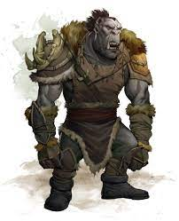

# Ogrekin

## Attributes and Core Skills

| STR       | 1 |    | RFX             | 0 |    | INT               | -1 |    |
| --------- | :-: | :-: | --------------- | :-: | :-: | ----------------- | :-: | :-: |
| Athletics | 1 | 5d6 | Acrobatics      | 1 | 4d6 | Communication     | 1 | 3d6 |
| Climb     | 0 | 4d6 | Perception      | 0 | 3d6 | General Knowledge | 0 | 2d6 |
| Endurance | 1 | 5d6 | Sleight of Hand | 0 | 3d6 | Survival          | 0 | 2d6 |
| Lift      | 0 | 4d6 | Stealth         | 0 | 3d6 | Will              | 0 | 2d6 |

## Vocations and Vocational Skills

| Brute {STR}                  | 1 | 5d6 | Fellcaster {STR, RFX, INT} | 0 | 3d6 |
| ---------------------------- | :-: | :-: | -------------------------- | - | --- |
| Large Hafted {STR, RFX, INT} | 1 | 4d6 | Polycraft {STR, RFX, INT} | 0 | 3d6 |
| Medium Spear {STR, RFX, INT}  | 1 | 4d6 |                            |   |     |
| Unarmed {STR, RFX, INT}      | 1 | 4d6 |                            |   |     |

## Effects

|          Name          |                                                         Effect                                                         | Duration |                                                       Source                                                       |
| :---------------------: | :---------------------------------------------------------------------------------------------------------------------: | :------: | :-----------------------------------------------------------------------------------------------------------------: |
|  Minor Silver Weakness  |                                 +1 to the level of injury received from Silver damage.                                 |          |                                                   Fellblood blood                                                   |
| Physical Defense Level |                                                            2                                                            |          |                                                        Armor                                                        |
|       Medium Size       |                                                  5x5 ft on battle map.                                                  |          |                                                                                                                    |
|   Language: Babelish   |                                                   Can speak Babelish.                                                   |          |                                                                                                                    |
|     Language: Jotun     |                                                    Can speak Jotun.                                                    |          |                                                                                                                    |
|       Dark Vision       | Within 60 feet, sees dim light as if it were bright light and darkness as if it were dim light, though devoid of color. |          |                                                      Polycraft                                                      |
|    Equipment Weight    |                                                          22 lb                                                          |          |                                                      Equipment                                                      |
|  Carry Weight  |                                                         220 lb                                                         |          | +50 lbs Carry Weight per Lift dice |
|      Light Weight      |                                             -0d6 to STR/RFX governed Dice Pools                                             |          |                                              0% =< Equipment Weight <= 25% of Carry Weight                                              |
| Terrestrial Combat Speed |                                                          35 ft                                                          |          |                              +10 ft (per Athletics Dice), +/-10 ft (per RFX)                              |
|   Swim Combat Speed   |                                                          30 ft                                                          |          |                              +5 ft (per Athletics Dice), +/-5 ft (per RFX)                              |
|  Climb Combat Speed  |                                                          25 ft                                                          |          |                                +5 ft (per Climb Dice), +/-5 ft (per RFX)                                |

## Combat Rolls

|        Name        |    One Handed    |    Two Handed    | Dual Wielded | Penetration | Range | Damage Types | Engageable Opponents | Area Of Effect | Resource Class |
| :----------------: | :-------------------: | :-------------------: | :---------------: | :---------: | :----: | :---------------: | :-----------------------: | :-----------------: | :-----------------: |
|  Large Hafted Axe  |    4d6 (+0d6)    |    7d6 (+3d6)    |       None       |      2      | Melee |        Hew        |           Rapid           |        None        |        None        |
|    Medium Spear    | 1d4, 5d6 (+2d6) | 1d4, 5d6 (+2d6) |      (+1d6)      |      2      | Melee |      Pierce      |        Rapid Max 2        |        None        |        None        |
| Thrown Medium Spear | 1d4, 5d6 (+2d6) | 1d4, 5d6 (+2d6) |       None       |      2      | Medium |      Pierce      |         Standard         |        None        |        None        |
|      Unarmed      |    3d6 (-1)    |    3d6 (-1)    |       None       |      0      | Melee |     Bludgeon     |           Rapid           |        None        |        None        |

### Combat Spells

|                                               Name                                               | One Handed | Two Handed | Dual Wielded | Penetration | Range |    Damage Types    | Engageable Opponents | Area Of Effect | Resource Class |
| :-----------------------------------------------------------------------------------------------: | :-------------: | :-------------: | :---------------: | :---------: | :----: | :----------------------: | :-----------------------: | :-----------------: | :-----------------: |
| [Generic Party Trick](./../../../../../CoreRules/MagicRules/Spells/PartyTricks/GenericPartyTrick.md) |                |                |                  |            |  Near  | Slash, Bludgeon, Pierce |                          |                    |  0 Magic Resource  |
|  [Generic Novice Spell](./../../../../../CoreRules/MagicRules/Spells/Novice/GenericNoviceSpell.md)  |                |                |                  |            | Medium | Slash, Bludgeon, Pierce |                          |                    |  0 Magic Resource  |

## Fellblood: 1/1

## Equipment:

| Name                 | # |                    Class                    |   Effect   |  Tier  | Durability | LB | Value |
| -------------------- | :-: | :------------------------------------------: | :---------: | :-----: | :--------: | :-: | :---: |
| Leather Armor        | 1 | Head Armor, Body Armor, Arm Armor, Leg Armor | Phy. Def. 2.00 | Quality |   15/15   | 12 | 10 bc |
| Wooden Javelin | 3 |       Medium Spear, Thrown Medium Spear       |   Shoddy   |        |    9/9    | 2 | 50 cc |
| Dane Axe             | 1 |               Large Hafted Axe               |            | Mundane |   12/12   | 4 | 11 bc |
