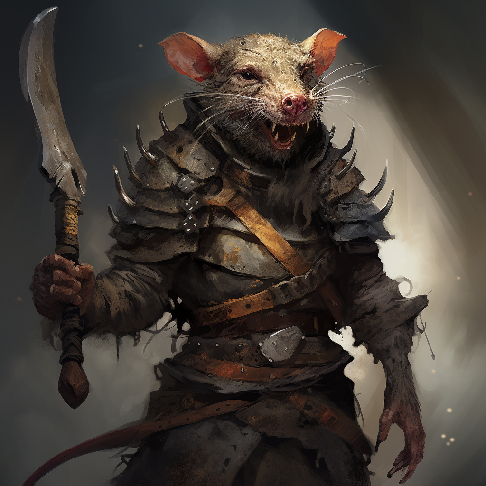

# Feral Vermkin

## Attributes and Core Skills

| STR       | -1 |    | RFX             | 1 |    | INT               | 0 |    |
| --------- | :-: | :-: | --------------- | :-: | :-: | ----------------- | :-: | :-: |
| Athletics | 0 | 2d6 | Acrobatics      | 1 | 5d6 | Communication     | 0 | 3d6 |
| Climb     | 0 | 2d6 | Perception      | 0 | 4d6 | General Knowledge | 0 | 3d6 |
| Endurance | 0 | 2d6 | Sleight of Hand | 0 | 4d6 | Survival          | 0 | 3d6 |
| Lift      | 0 | 2d6 | Stealth         | 1 | 5d6 | Will              | 0 | 3d6 |

## Vocations and Vocational Skills

| Bandit {RFX}        | 1 | 5d6 | Fellcaster {STR, RFX, INT} | 0  | 3d6 |
| ------------------- | :-: | :-: | ---------------- | -- | --- |
| Medium Sword {STR, RFX, INT} | 1 | 4d6 | Polycraft {STR, RFX, INT}  | -1 | 2d6 |
| Light Bow {STR, RFX, INT}     | 1 | 4d6 |                  |    |     |

## Effects:

|             Name             |                                                            Effect                                                            | Duration |                                                       Source                                                       |
| :---------------------------: | :--------------------------------------------------------------------------------------------------------------------------: | :------: | :-----------------------------------------------------------------------------------------------------------------: |
|    Physical Defense Level    |                                                              2                                                              |          |                                                        Armor                                                        |
|          Small Size          |                                                    5x5 ft on battle map.                                                    |          |                                                                                                                    |
|      Language: Babelish      |                                                     Can speak Babelish.                                                     |          |                                                                                                                    |
|       Language: Primal       |                                                      Can speak Primal.                                                      |          |                                                                                                                    |
|     Minor Silver Weakness     |                                   +1 to the level of injury received from Silver damage.                                   |          |                                                    Fellblood                                                    |
|          Dark Vision          | Within 60 feet, sees dim light as if it were bright light and darkness as if it were dim light, though devoid of color. |          |                                                 Feral Fellblood                                                 |
|       Equipment Weight       |                                                           15.05 lb                                                           |          |                                                      Equipment                                                      |
|     Carry Weight     |                                                            70 lb                                                            |          | +50 lbs Carry Weight per Lift dice |
|         Light Weight         |                                               -0d6 to STR/RFX governed Dice Pools                                               |          |                                              0% - 25% of carry weight                                              |
| Terrestrial Combat Speed |                                                            35 ft                                                            |          |                                +10 ft (per Athletics Dice), +/-10 ft (per RFX)                                |
|      Swim Combat Speed      |                                                            15 ft                                                            |          |                                +5 ft (per Athletics Dice), +/-5 ft (per RFX)                                |
|     Climb Combat Speed     |                                                            15 ft                                                            |          |                                  +5 ft (per Climb Dice), +/-5 ft (per RFX)                                  |

## Combat Rolls:

|          Name          |   One Handed   |   Two Handed   | Dual Wielded | Penetration | Range | Damage Types | Engageable Opponents | Area Of Effect | Resource Class |
| :--------------------: | :------------------: | :------------------: | :---------------: | :---------: | :----: | :---------------: | :-----------------------: | :-----------------: | :-----------------: |
|       Light Bow       |         None         | 4d6, 1d4 (+1d6) |       None       |      1      | Ranged |      Pierce      |           Quick           |        None        |        None        |
| Medium Thrusting Sword | 4d6, 1d4 (+1d6) | 5d6, 1d4 (+2d6) |      (+1d6)      |      2      | Melee |      Pierce      |           Rapid           |        None        |        None        |
| Medium Slashing Sword | 5d6, 1d4 (+2d6) | 7d6, 1d4 (+3d6) |      (+1d6)      |      0      | Melee |       Slash       |           Rapid           |        None        |        None        |

|     Name     | Resource Class |  Resource Dice  | Penetration | Range | Damage Types | Area Of Effect |
| :----------: | :-----------------: | :------------------: | :---------: | :---: | :---------------: | :-----------------: |
| Shoddy Arrow |        Arrow        | 4d6, 2d4 (+1d4) |      1      | None |      Pierce      |        None        |

## Equipment:

| Name                          | # |                     Class                     |     Effect     |  Tier  | Durability |  LB  | Value |
| ----------------------------- | :-: | :-------------------------------------------: | :------------: | :-----: | :--------: | :--: | :---: |
| Leather Cuirass and Pauldrons | 1 |                  Body Armor                  | Phy. Def. 1.00 | Quality |   15/15   |  6  | 5 bc |
| Buckler Shield                | 1 |                    Shield                    | Phy. Def. 1.00 | Mundane |   12/12   |  4  | 2 bc |
| Shoddy Scimitar               | 1 | Medium Thrusting Sword, Medium Slashing Sword |                | Shoddy |    9/9    |  2  | 5 bc |
| Shoddy Shortbow               | 1 |                   Light Bow                   |                | Shoddy |    9/9    |  2  | 15 bc |
| Wood Tipped Arrow             | 20 |                 Shoddy Arrow                 |                | Mundane |     -     | 0.05 | 2 cc |
| Quiver (capacity: 20)         | 1 |                                              |                | Mundane |            |  1  | 1 bc |

## Backstory

One of the short feral members of Fellkin, living in small packs preying on travelers.

## Appearance

Height: 3'6"

## Disposition

- Cowardice
- Cruel
- Hostile
- Brave in numbers

## Goals/Aspirations

- To pillage as much as possible.
