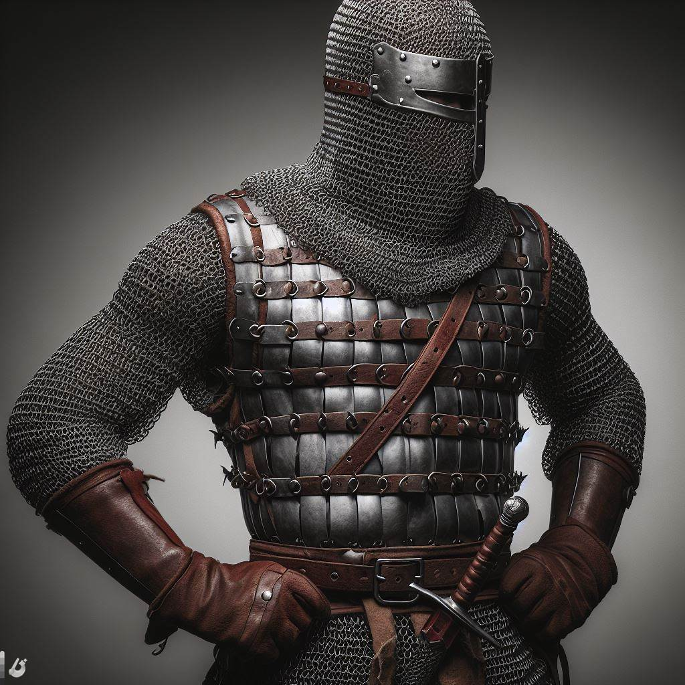

# Guard

## [Attributes](./../../../../../CoreRules/GeneralRules/Attributes.md) and [Core Skills](./../../../../../CoreRules/GeneralRules/CoreSkills.md)

|  [STR](./../../../../../CoreRules/GeneralRules/Attributes.md#strength-str)  | 0 |    |    [RFX](./../../../../../CoreRules/GeneralRules/Attributes.md#reflex-rfx)    | 0 |    |        [INT](./../../../../../CoreRules/GeneralRules/Attributes.md#intelligence-int)        | 0 |    |
| :-----------------------------------------------------------------------: | :-: | :-: | :-------------------------------------------------------------------------: | :-: | :-: | :---------------------------------------------------------------------------------------: | :-: | :-: |
| [Athletics](./../../../../../CoreRules/GeneralRules/CoreSkills.md#athletics) | 1 | 3d6 |  [Dexterity](./../../../../../CoreRules/GeneralRules/CoreSkills.md#dexterity)  | 1 | 3d6 |     [Communication](./../../../../../CoreRules/GeneralRules/CoreSkills.md#communication)     | 0 | 3d6 |
|                               (Deprecated)                               | 0 | 2d6 | [Perception](./../../../../../CoreRules/GeneralRules/CoreSkills.md#perception) | 1 | 3d6 | [General Knowledge](./../../../../../CoreRules/GeneralRules/CoreSkills.md#general-knowledge) | 0 | 3d6 |
| [Endurance](./../../../../../CoreRules/GeneralRules/CoreSkills.md#endurance) | 1 | 3d6 |                                (Deprecated)                                | 0 | 2d6 |                                       (Deprecated)                                       | 0 | 3d6 |
|      [Lift](./../../../../../CoreRules/GeneralRules/CoreSkills.md#lift)      | 1 | 3d6 |    [Stealth](./../../../../../CoreRules/GeneralRules/CoreSkills.md#stealth)    | 0 | 2d6 |              [Will](./../../../../../CoreRules/GeneralRules/CoreSkills.md#will)              | 0 | 3d6 |

## [Vocations](./../../../../../CoreRules/GeneralRules/Vocations.md) and [Vocation Skills](./../../../../../CoreRules/GeneralRules/Vocations.md#vocation-skills)

|    Guard    | STR, RFX, INT | 1 | 3d6 |
| :---------: | :-----------: | :-: | :-: |
| Large Melee | STR, RFX, INT | 1 | 3d6 |

## Info

|                                                  Name                                                  |                Info                | Duration |                      Source                      |
| :-----------------------------------------------------------------------------------------------------: | :---------------------------------: | :------: | :----------------------------------------------: |
|                          [Language](./../../../Languages/Languages.md): Babelish                          |         Can speak Babelish.         |          |                                                  |
|                                                                                                        |                                    |          |                                                  |
|           [Equipment Weight](./../../../../../CoreRules/AdvancedRules/CarryWeight.md#equipment)           |                66 lb                |          |                    Equipment                    |
|            [Carry Weight](./../../../../../CoreRules/AdvancedRules/CarryWeight.md#carry-weight)            |               200 lb               |          |        +50 lbs Carry Weight per Lift dice        |
|       [Weight Class](./../../../../../CoreRules/AdvancedRules/CarryWeight.md#weight-classes): Medium       | -1d6 to STR/RFX governed Dice Pools |          |  0% =< Equipment Weight <= 25% of Carry Weight  |
|                                                                                                        |                                    |          |                                                  |
| [Physical Defense Level](./../../../../../CoreRules/CombatRules/DefenseAndPenetration.md#physical-defense) |          4, 6 with Shield          |          |                  Armor & Shield                  |
|                                                                                                        |                                    |          |                                                  |
|                  [Size](./../../../../../CoreRules/CombatRules/BattleMap.md#size): Medium                  |        5x5 ft on battle map.        |          |                                                  |
|      [Combat Speed](./../../../../../CoreRules/CombatRules/CombatSpeed.md#combat-speeds): Terrestrial      |                30 ft                |          | +10 ft (per Athletics Dice), +/-10 ft (per RFX) |
|         [Combat Speed](./../../../../../CoreRules/CombatRules/CombatSpeed.md#combat-speeds): Swim         |                15 ft                |          |  +5 ft (per Athletics Dice), +/-5 ft (per RFX)  |
|         [Combat Speed](./../../../../../CoreRules/CombatRules/CombatSpeed.md#combat-speeds): Climb         |                10 ft                |          |  +5 ft (per Athletics Dice), +/-5 ft (per RFX)  |
|                                                                                                        |                                    |          |                                                  |
|                      [Injury](./../../../../../CoreRules/CombatRules/Injury.md): None                      |    – 0 dice to all dice checks.    |          |                 Damage Received                 |

## [Combat Rolls](./../../../../../CoreRules/CombatRules/CombatRolls.md)

- [Victory Levels link](./../../../../../CoreRules/CombatRules/VictoryLevels.md)

### [Weapons](./../../../../../CoreRules/CombatRules/Weapons.md)

|          Name          | [One Handed](./../../../../../CoreRules/CombatRules/Weapons.md#one-handed) | [Two Handed](./../../../../../CoreRules/CombatRules/Weapons.md#two-handed) | [Dual Wielded](./../../../../../CoreRules/CombatRules/Weapons.md#dual-wielded) | [Penetration](./../../../../../CoreRules/CombatRules/Penetration.md) | [Range](./../../../../../CoreRules/CombatRules/Range.md) | [Engageable Opponents](./../../../../../CoreRules/CombatRules/EngageableOpponents.md) | [Area Of Effect](./../../../../../CoreRules/CombatRules/AreaOfEffect.md) | [Ammo Type](./../../../../../CoreRules/CombatRules/Ammunitions.md#ammo-type) | [Ammo Per Use](./../../../../../CoreRules/CombatRules/Weapons.md#ammo-per-shot) | [Damage Types](./../../../../../CoreRules/CombatRules/DamageTypes.md) |
| :---------------------: | :--------------------------------------------------------------------------------: | :--------------------------------------------------------------------------------: | :------------------------------------------------------------------------------------: | :-------------------------------------------------------------------------------------: | :---------------------------------------------------: | :-------------------------------------------------------------------------------------: | :------------------------------------------------------------------------: | :-------------------------------------------------------------------------------------------: | :----------------------------------------------------------------------------------------------: | :---------------------------------------------------------------------: |
|         Unarmed         |                                         -1                                         |                                        None                                        |                                          +0d6                                          |                                            0                                            |                         Melee                         |                                          Swift                                          |                                                                            |                                             None                                             |                                                                                                  |                                Bludgeon                                |
| Hand Protection Unarmed |                                        +0d6                                        |                                        None                                        |                                          +0d6                                          |                                            0                                            |                         Melee                         |                                          Swift                                          |                                                                            |                                             None                                             |                                                                                                  |                                Bludgeon                                |
|      Large Spear      |                                        +2d6                                        |                                        +3d6                                        |                                          None                                          |                                            3                                            |                         Melee                         |                                       Steady                                       |                                                                            |                                             None                                             |                                                                                                  |                                 Pierce                                 |
|   Thrown Large Spear   |                                        +1d6                                        |                                        None                                        |                                          None                                          |                                            3                                            |                         Short                         |                                        Steady                                        |                                                                            |                                             Self                                             |                                                1                                                |                                 Pierce                                 |

## [Equipment](./../../../../../CoreRules/AdvancedRules/CarryWeight.md#equipment)

| Name            | # |      [Class](./../../../../../CoreRules/AdvancedRules/ItemClass.md)      | [Effect](./../../../../../CoreRules/AdvancedRules/EffectsOverview.md) | [Tier](./../../../../../CoreRules/AdvancedRules/ItemTier.md) | [Durability](./../../../../../CoreRules/AdvancedRules/ItemDurability.md) | [LB](./../../../../../CoreRules/AdvancedRules/CarryWeight.md) | [Value](./../../../Items/ItemShop.md#currency) |
| --------------- | :-: | :-------------------------------------------------------------------: | :------------------------------------------------------------: | :-------------------------------------------------------: | :-------------------------------------------------------------------: | :--------------------------------------------------------: | :-----------------------------------------: |
| Gambeson Armor  | 1 |                   Body Armor, Arm Armor, Leg Armor                   |                         Phy. Def. 1.00                         |                          Mundane                          |                                 12/12                                 |                             8                             |                    5 bc                    |
| Chainmail Armor | 1 | Head Armor, Body Armor, Arm Armor, Leg Armor, Hand Protection Unarmed |                         Phy. Def. 3.00                         |                         Excellent                         |                                 21/21                                 |                             47                             |                    75 bp                    |
| Heater Shield   | 1 |                                Shield                                |                         Phy. Def. 2.00                         |                          Mundane                          |                                 12/12                                 |                             8                             |                    7 bc                    |
| Spear           | 1 |                    Large Spear, Thrown Large Spear                    |                                                                |                          Mundane                          |                                 12/12                                 |                             3                             |                    1 bc                    |
