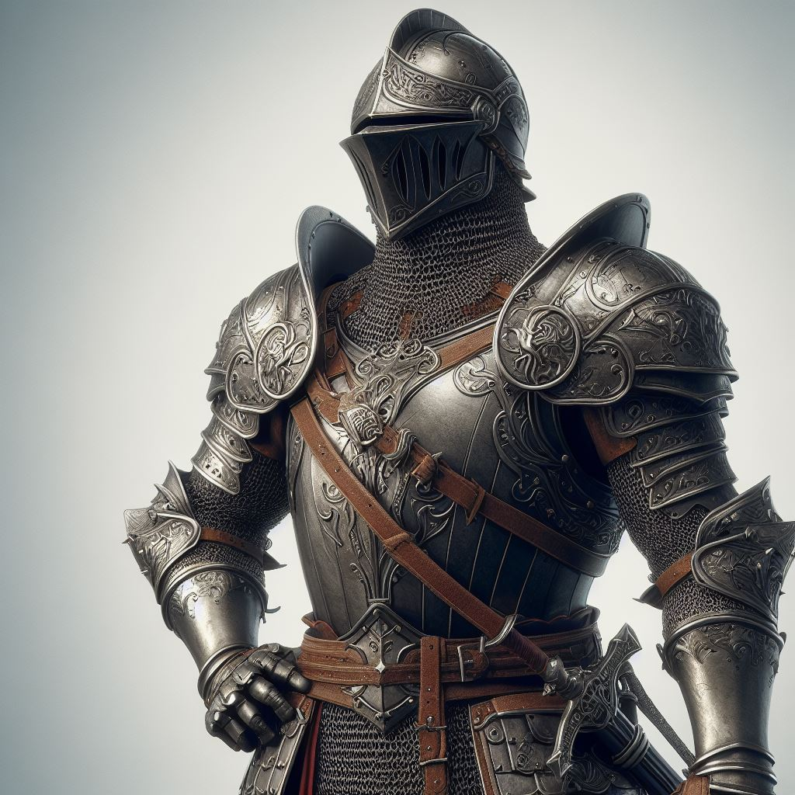

# Knight

## [Attributes](./../../../../../CoreRules/GeneralRules/Attributes.md) and [Core Skills](./../../../../../CoreRules/GeneralRules/CoreSkills.md)

|  [STR](./../../../../../CoreRules/GeneralRules/Attributes.md#strength-str)  | 1 |    |    [RFX](./../../../../../CoreRules/GeneralRules/Attributes.md#reflex-rfx)    | 0 |    |        [INT](./../../../../../CoreRules/GeneralRules/Attributes.md#intelligence-int)        | 0 |    |
| :-----------------------------------------------------------------------: | :-: | :-: | :-------------------------------------------------------------------------: | :-: | :-: | :---------------------------------------------------------------------------------------: | :-: | :-: |
| [Athletics](./../../../../../CoreRules/GeneralRules/CoreSkills.md#athletics) | 1 | 5d6 |  [Dexterity](./../../../../../CoreRules/GeneralRules/CoreSkills.md#dexterity)  | 0 | 3d6 |     [Communication](./../../../../../CoreRules/GeneralRules/CoreSkills.md#communication)     | 2 | 5d6 |
|                               (Deprecated)                               | 0 | 4d6 | [Perception](./../../../../../CoreRules/GeneralRules/CoreSkills.md#perception) | 0 | 3d6 | [General Knowledge](./../../../../../CoreRules/GeneralRules/CoreSkills.md#general-knowledge) | 0 | 3d6 |
| [Endurance](./../../../../../CoreRules/GeneralRules/CoreSkills.md#endurance) | 2 | 6d6 |                                (Deprecated)                                | 0 | 3d6 |                                       (Deprecated)                                       | 0 | 3d6 |
|      [Lift](./../../../../../CoreRules/GeneralRules/CoreSkills.md#lift)      | 3 | 7d6 |    [Stealth](./../../../../../CoreRules/GeneralRules/CoreSkills.md#stealth)    | 0 | 3d6 |              [Will](./../../../../../CoreRules/GeneralRules/CoreSkills.md#will)              | 1 | 4d6 |

## [Vocations](./../../../../../CoreRules/GeneralRules/Vocations.md) and [Vocation Skills](./../../../../../CoreRules/GeneralRules/Vocations.md#vocation-skills)

|   Warrior   | STR, RFX, INT | 2 | 6d6 |
| :---------: | :-----------: | :-: | :-: |
| Large Melee | STR, RFX, INT | 2 | 6d6 |
|  Crossbow  | STR, RFX, INT | 0 | 4d6 |
| Close Melee | STR, RFX, INT | 2 | 6d6 |

## Info

|                                                  Name                                                  |                         Info                         | Duration |                      Source                      |
| :-----------------------------------------------------------------------------------------------------: | :--------------------------------------------------: | :------: | :----------------------------------------------: |
|                          [Language](./../../../Languages/Languages.md): Babelish                          |                 Can speak Babelish.                 |          |                                                  |
|                                                                                                        |                                                      |          |                                                  |
|           [Equipment Weight](./../../../../../CoreRules/AdvancedRules/CarryWeight.md#equipment)           |                       76.5 lb                       |          |                    Equipment                    |
|            [Carry Weight](./../../../../../CoreRules/AdvancedRules/CarryWeight.md#carry-weight)            |                        350 lb                        |          |        +50 lbs Carry Weight per Lift dice        |
|       [Weight Class](./../../../../../CoreRules/AdvancedRules/CarryWeight.md#weight-classes): Light       |         -0d6 to STR/RFX governed Dice Pools         |          |  0% =< Equipment Weight <= 25% of Carry Weight  |
|                                                                                                        |                                                      |          |                                                  |
|         [Minor Weakness](./../../../../../CoreRules/CombatRules/WeaknessAndResistance.md): Silver         | +1 to the level of injury received from damage type. |          |                    Fellblood                    |
| [Physical Defense Level](./../../../../../CoreRules/CombatRules/DefenseAndPenetration.md#physical-defense) |                          6                          |          |                  Armor & Shield                  |
|                                                                                                        |                                                      |          |                                                  |
|                  [Size](./../../../../../CoreRules/CombatRules/BattleMap.md#size): Medium                  |                5x5 ft on battle map.                |          |                                                  |
|      [Combat Speed](./../../../../../CoreRules/CombatRules/CombatSpeed.md#combat-speeds): Terrestrial      |                        50 ft                        |          | +10 ft (per Athletics Dice), +/-10 ft (per RFX) |
|         [Combat Speed](./../../../../../CoreRules/CombatRules/CombatSpeed.md#combat-speeds): Swim         |                        25 ft                        |          |  +5 ft (per Athletics Dice), +/-5 ft (per RFX)  |
|         [Combat Speed](./../../../../../CoreRules/CombatRules/CombatSpeed.md#combat-speeds): Climb         |                        20 ft                        |          |  +5 ft (per Athletics Dice), +/-5 ft (per RFX)  |
|                                                                                                        |                                                      |          |                                                  |
|                      [Injury](./../../../../../CoreRules/CombatRules/Injury.md): None                      |            – 0 dice to all dice checks.            |          |                 Damage Received                 |

## [Combat Rolls](./../../../../../CoreRules/CombatRules/CombatRolls.md)

- [Victory Levels link](./../../../../../CoreRules/CombatRules/VictoryLevels.md)

### [Weapons](./../../../../../CoreRules/CombatRules/Weapons.md)

|            Name            | [One Handed](./../../../../../CoreRules/CombatRules/Weapons.md#one-handed) | [Two Handed](./../../../../../CoreRules/CombatRules/Weapons.md#two-handed) | [Dual Wielded](./../../../../../CoreRules/CombatRules/Weapons.md#dual-wielded) | [Penetration](./../../../../../CoreRules/CombatRules/DefenseAndPenetration.md#penetration) | [Range](./../../../../../CoreRules/CombatRules/Range.md) | [Engageable Opponents](./../../../../../CoreRules/CombatRules/EngageableOpponents.md) | [Area Of Effect](./../../../../../CoreRules/CombatRules/AreaOfEffect.md) | [Ammo Type](./../../../../../CoreRules/CombatRules/Ammunitions.md#ammo-type) | [Ammo Per Use](./../../../../../CoreRules/CombatRules/Weapons.md#ammo-per-shot) | [Damage Types](./../../../../../CoreRules/CombatRules/DamageTypes.md) |
| :-------------------------: | :--------------------------------------------------------------------------------: | :--------------------------------------------------------------------------------: | :------------------------------------------------------------------------------------: | :-------------------------------------------------------------------------------------: | :---------------------------------------------------: | :-------------------------------------------------------------------------------------: | :------------------------------------------------------------------------: | :-------------------------------------------------------------------------------------------: | :----------------------------------------------------------------------------------------------: | :---------------------------------------------------------------------: |
|           Unarmed           |                                         -1                                         |                                        None                                        |                                          +0d6                                          |                                            0                                            |                         Melee                         |                                          Rapid                                          |                                                                            |                                             None                                             |                                                                                                  |                                Bludgeon                                |
|   Hand Protection Unarmed   |                                        +0d6                                        |                                        None                                        |                                          +0d6                                          |                                            0                                            |                         Melee                         |                                          Rapid                                          |                                                                            |                                             None                                             |                                                                                                  |                                Bludgeon                                |
|    Large Thrusting Sword    |                                        +0d6                                        |                                        +2d6                                        |                                          None                                          |                                            3                                            |                         Melee                         |                                          Rapid                                          |                                                                            |                                             None                                             |                                                                                                  |                                 Pierce                                 |
|    Large Slashing Sword    |                                        +1d6                                        |                                        +3d6                                        |                                          None                                          |                                            2                                            |                         Melee                         |                                          Rapid                                          |                                                                            |                                             None                                             |                                                                                                  |                                  Slash                                  |
|    Small Piercing Blade    |                                        +0d6                                        |                                        +0d6                                        |                                          +1d6                                          |                                            2                                            |                         Melee                         |                                          Rapid                                          |                                                                            |                                             None                                             |                                                                                                  |                                 Pierce                                 |
|    Small Slashing Blade    |                                        +1d6                                        |                                        +1d6                                        |                                          +1d6                                          |                                            0                                            |                         Melee                         |                                          Rapid                                          |                                                                            |                                             None                                             |                                                                                                  |                                  Slash                                  |
| Thrown Small Piercing Blade |                                        +0d6                                        |                                        +0d6                                        |                                          +1d6                                          |                                            0                                            |                         Short                         |                                          Quick                                          |                                                                            |                                             Self                                             |                                                1                                                |                                 Pierce                                 |
|       Light Crossbow       |                                        None                                        |                                        +1d6                                        |                                          None                                          |                                            2                                            |                          Far                          |                                         Loading                                         |                                                                            |                                          Light Bolt                                          |                                                1                                                |                                                                        |

#### [Ammunitions](./../../../../../CoreRules/CombatRules/Ammunitions.md)

|         Name         | [Ammo Type](./../../../../../CoreRules/CombatRules/Ammunitions.md#ammo-type) | [Dice Pool Mod](./../../../../../CoreRules/CombatRules/Ammunitions.md#dice-pool-mod) | [Base Dice Tier Adjustment](./../../../../../CoreRules/CombatRules/Ammunitions.md#resource-dice) | [Penetration](./../../../../../CoreRules/CombatRules/Ammunitions.md#penetration) | [Range](./../../../../../CoreRules/CombatRules/Ammunitions.md#range) | [Damage Types](./../../../../../CoreRules/CombatRules/Ammunitions.md#damage-types) | [Area Of Effect](./../../../../../CoreRules/CombatRules/Ammunitions.md#area-of-effect) |
| :-------------------: | :-------------------------------------------------------------------------------------------: | :-----------------------------------------------------------------------------------------: | :-----------------------------------------------------------------------------------------------------: | :-------------------------------------------------------------------------------------: | :-------------------------------------------------------------------------: | :--------------------------------------------------------------------------------------------: | :------------------------------------------------------------------------------------------------: |
| Anti-armor Light Bolt |                                          Light Bolt                                          |                                            +0d6                                            |                                                   +0                                                   |                                            1                                            |                                    None                                    |                                             Pierce                                             |                                                                                                    |

## [Equipment](./../../../../../CoreRules/AdvancedRules/CarryWeight.md#equipment)

| Name                                | # |       [Class](./../../../../../CoreRules/AdvancedRules/ItemClass.md)       | [Effect](./../../../../../CoreRules/AdvancedRules/ItemEffects.md) | [Tier](./../../../../../CoreRules/AdvancedRules/ItemTier.md) | [Durability](./../../../../../CoreRules/AdvancedRules/ItemDurability.md) | [LB](./../../../../../CoreRules/AdvancedRules/CarryWeight.md) | [Value](./../../../Items/ItemShop.md#currency) |
| ----------------------------------- | :-: | :---------------------------------------------------------------------: | :------------------------------------------------------------: | :-------------------------------------------------------: | :-------------------------------------------------------------------: | :--------------------------------------------------------: | :-----------------------------------------: |
| Gambeson Armor                      | 1 |                    Body Armor, Arm Armor, Leg Armor                    |                         Phy. Def. 1.00                         |                          Mundane                          |                                 12/12                                 |                             8                             |                    5 bc                    |
| Plate Armor                         | 1 |  Head Armor, Body Armor, Arm Armor, Leg Armor, Hand Protection Unarmed  |                         Phy. Def. 5.00                         |                        Mastercraft                        |                                 33/33                                 |                             57                             |                   1495 bc                   |
| Longsword                           | 1 |               Large Thrusting Sword, Large Slashing Sword               |                                                                |                          Mundane                          |                                 12/12                                 |                             3                             |                    25 bc                    |
| Dagger                              | 1 | Small Piercing Blade, Small Slashing Blade, Thrown Small Piercing Blade |                                                                |                          Mundane                          |                                 12/12                                 |                             1                             |                    2 bc                    |
| Light Crossbow                      | 1 |                             Light Crossbow                             |                                                                |                          Mundane                          |                                 12/12                                 |                             5                             |                    25 bc                    |
| Case, Crossbow Bolts (capacity: 20) | 1 |                                                                        |                                                                |                          Mundane                          |                                                                      |                             1                             |                    1 bc                    |
| Light Bolt - Bodkin                 | 20 |                          Anti-armor Light Bolt                          |                                                                |                          Mundane                          |                                                                      |                           0.075                           |                    10 cc                    |
