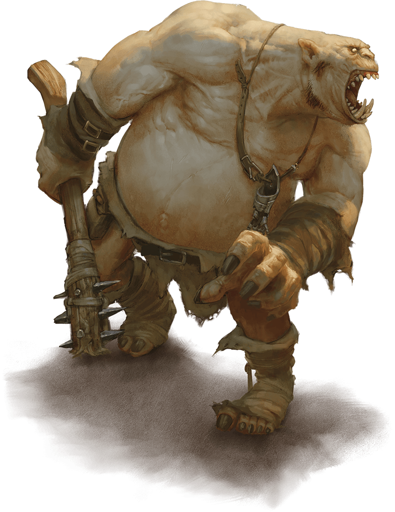

# Ogre

## [Attributes](./../../../../../CoreRules/GeneralRules/Attributes.md) and [Core Skills](./../../../../../CoreRules/GeneralRules/CoreSkills.md)

|  [STR](./../../../../../CoreRules/GeneralRules/Attributes.md#strength-str)  | 3 |    |    [RFX](./../../../../../CoreRules/GeneralRules/Attributes.md#reflex-rfx)    | -1 |    |        [INT](./../../../../../CoreRules/GeneralRules/Attributes.md#intelligence-int)        | -1 |    |
| :-----------------------------------------------------------------------: | :-: | :-: | :-------------------------------------------------------------------------: | :-: | :-: | :---------------------------------------------------------------------------------------: | :-: | :-: |
| [Athletics](./../../../../../CoreRules/GeneralRules/CoreSkills.md#athletics) | -1 | 5d6 |  [Dexterity](./../../../../../CoreRules/GeneralRules/CoreSkills.md#dexterity)  | 0 | 2d6 |     [Communication](./../../../../../CoreRules/GeneralRules/CoreSkills.md#communication)     | 0 | 2d6 |
| [Endurance](./../../../../../CoreRules/GeneralRules/CoreSkills.md#endurance) | 0 | 6d6 | [Perception](./../../../../../CoreRules/GeneralRules/CoreSkills.md#perception) | 0 | 2d6 | [General Knowledge](./../../../../../CoreRules/GeneralRules/CoreSkills.md#general-knowledge) | 0 | 2d6 |
|      [Lift](./../../../../../CoreRules/GeneralRules/CoreSkills.md#lift)      | 2 | 8d6 |    [Stealth](./../../../../../CoreRules/GeneralRules/CoreSkills.md#stealth)    | 0 | 2d6 |              [Will](./../../../../../CoreRules/GeneralRules/CoreSkills.md#will)              | 0 | 2d6 |

## [Vocations](./../../../../../CoreRules/GeneralRules/Vocations.md) and [Vocation Skills](./../../../../../CoreRules/GeneralRules/Vocations.md#vocation-skills)

| Brute {STR} | STR, RFX, INT | 1 | 7d6 |
| :----------: | :-----------: | :-: | :-: |
| Reach Hafted | STR, RFX, INT | 1 | 5d6 |
| Medium Melee | STR, RFX, INT | 1 | 5d6 |
|     Slam     | STR, RFX, INT | 1 | 5d6 |
| Close Melee | STR, RFX, INT | 1 | 5d6 |

## Effects

|                                                        Name                                                        |                         Desc                         | Duration |                      Source                      |
| :-----------------------------------------------------------------------------------------------------------------: | :--------------------------------------------------: | :------: | :----------------------------------------------: |
|                                [Language](./../../../Languages/Languages.md): Babelish                                |                 Can speak Babelish.                 |          |                                                  |
|                                  [Language](./../../../Languages/Languages.md): Jotun                                  |                   Can speak Jotun.                   |          |                                                  |
|                                                                                                                    |                                                      |          |                                                  |
|     [Equipment Weight](./../../../../../CoreRules/AdvancedRules/EquipmentCarryWeightAndWeightClasses.md#equipment)     |                        17 lb                        |          |                    Equipment                    |
|     [Carry Weight](./../../../../../CoreRules/AdvancedRules/EquipmentCarryWeightAndWeightClasses.md#carry-weight)     |                        400 lb                        |          |        +50 lbs Carry Weight per Lift dice        |
| [Weight Class](./../../../../../CoreRules/AdvancedRules/EquipmentCarryWeightAndWeightClasses.md#weight-classes): Light |          -0d to STR/RFX governed Dice Pools          |          |  0% =< Equipment Weight <= 25% of Carry Weight  |
|                                                                                                                    |                                                      |          |                                                  |
|               [Minor Weakness](./../../../../../CoreRules/CombatRules/WeaknessAndResistance.md): Silver               | +1 to the level of injury received from damage type. |          |                    Fellblood                    |
|              [Physical Defense Level](./../../../../../CoreRules/CombatRules/Defense.md#physical-defense)              |                          1                          |          |                  Natural Armor                  |
|                                                                                                                    |                                                      |          |                                                  |
|                        [Size](./../../../../../CoreRules/CombatRules/BattleMap.md#size): Large                        |               10x10 ft on battle map.               |          |                                                  |
|             [Combat Speed](./../../../../../CoreRules/CombatRules/BattleMap.md#combat-speed): Terrestrial             |                        40 ft                        |          | +10 ft (per Athletics Dice), +/-10 ft (per RFX) |
|                 [Combat Speed](./../../../../../CoreRules/CombatRules/BattleMap.md#combat-speed): Swim                 |                        25 ft                        |          |  +5 ft (per Athletics Dice), +/-5 ft (per RFX)  |
|                [Combat Speed](./../../../../../CoreRules/CombatRules/BattleMap.md#combat-speed): Climb                |                        25 ft                        |          |  +5 ft (per Athletics Dice), +/-5 ft (per RFX)  |
|                                                                                                                    |                                                      |          |                                                  |
|                       [Injury](./../../../../../CoreRules/CombatRules/InjuryAndHealing.md): None                       |       -0d to STR/RFX/INT governed Dice Pools.       |          |                 Damage Received                 |

## [Combat Rolls](./../../../../../CoreRules/CombatRules/CombatRolls.md)

- [Victory Levels link](./../../../../../CoreRules/CombatRules/VictoryLevels.md)

### [Weapons](./../../../../../CoreRules/CombatRules/Weapons.md)

|        Name        | [One Handed](./../../../../../CoreRules/CombatRules/Weapons.md#one-handed) | [Two Handed](./../../../../../CoreRules/CombatRules/Weapons.md#two-handed) | [Dual Wielded](./../../../../../CoreRules/CombatRules/Weapons.md#dual-wielded) | [Penetration](./../../../../../CoreRules/CombatRules/Penetration.md) | [Range](./../../../../../CoreRules/CombatRules/Range.md) | [Uses Per Round](./../../../../../CoreRules/CombatRules/UsesPerRound.md) | [Area Of Effect](./../../../../../CoreRules/CombatRules/AreaOfEffect.md) | [Ammo Type](./../../../../../CoreRules/CombatRules/Ammunitions.md#ammo-type) | [Ammo Per Use](./../../../../../CoreRules/CombatRules/Weapons.md#ammo-per-shot) | [Damage Types](./../../../../../CoreRules/CombatRules/DamageTypes.md) |
| :-----------------: | :--------------------------------------------------------------------------: | :--------------------------------------------------------------------------: | :------------------------------------------------------------------------------: | :---------------------------------------------------------------: | :---------------------------------------------------: | :------------------------------------------------------------------------: | :------------------------------------------------------------------------: | :----------------------------------------------------------------------------: | :-------------------------------------------------------------------------------: | :---------------------------------------------------------------------: |
|       Unarmed       |                                      -1                                      |                                     None                                     |                                       +0d6                                       |                                 0                                 |                         Melee                         |                                   Swift                                   |                                                                            |                                      None                                      |                                                                                  |                                Bludgeon                                |
|        Slam        |                               +0d6 (5d6)                               |                                     None                                     |                                 +1d6 (6d6)                                 |                                 2                                 |                         Melee                         |                                   Swift                                   |                                                                            |                                      None                                      |                                                                                  |                                Bludgeon                                |
| Thrown Medium Spear |                               +1d6 (6d6)                               |                                     None                                     |                                       +1d6                                       |                                 2                                 |                        Medium                        |                                   Quick                                   |                                                                            |                                      Self                                      |                                         1                                         |                                 Pierce                                 |
|    Medium Spear    |                               +2d6 (7d6)                               |                               +2d6 (7d6)                               |                                       None                                       |                                 2                                 |                        Medium                        |                                   Quick                                   |                                                                            |                                      Self                                      |                                         1                                         |                                 Pierce                                 |
| Reach Hafted Point |                                -2 (3d6)                                |                               +3d6 (8d6)                               |                                       None                                       |                                 4                                 |                         Reach                         |                                   Swift                                   |                                                                            |                                      None                                      |                                                                                  |                                 Pierce                                 |
| Reach Hafted Blunt |                                -2 (3d6)                                |                               +2d6 (8d6)                               |                                       None                                       |                                 5                                 |                         Reach                         |                                   Swift                                   |                                                                            |                                      None                                      |                                                                                  |                                Bludgeon                                |

### [Equipment](./../../../../../CoreRules/AdvancedRules/EquipmentCarryWeightAndWeightClasses.md#equipment)

| Name               | # | [Effects](./../../../../../../README.md#effect-rules) | [LB](./../../../../../CoreRules/AdvancedRules/EquipmentCarryWeightAndWeightClasses.md) | [Value](./../../../Items/ItemShop.md#currency) | Description |
| ------------------ | :-: | :------------------------------------------------: | :---------------------------------------------------------------------------------: | :-----------------------------------------: | ----------- |
| Ogre's Spiked Club | 1 |       Reach Hafted Blunt, Reach Hafted Point       |                                         14                                         |                    41 cc                    |             |
| Javelin            | 2 |         Medium Spear, Thrown Medium Spear         |                                          3                                          |                    5 bc                    |             |
