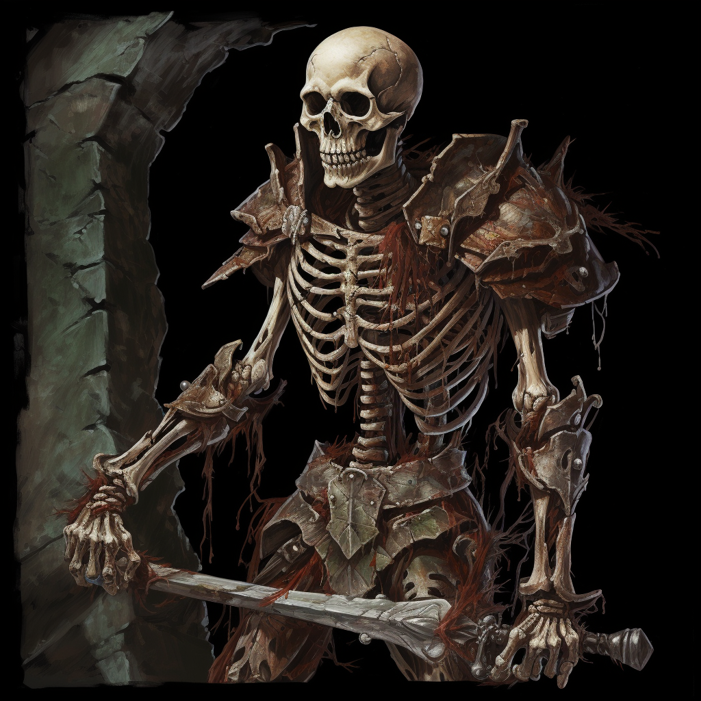

# Skeleton

## [Attributes](./../../../../../CoreRules/GeneralRules/Attributes.md) and [Core Skills](./../../../../../CoreRules/GeneralRules/CoreSkills.md)

|  [STR](./../../../../../CoreRules/GeneralRules/Attributes.md#strength-str)  | 0 |    |         [RFX](./../../../../../CoreRules/GeneralRules/Attributes.md#reflex-rfx)         | 1 |    |        [INT](./../../../../../CoreRules/GeneralRules/Attributes.md#intelligence-int)        | -1 |    |
| :-----------------------------------------------------------------------: | :-: | :-: | :-----------------------------------------------------------------------------------: | :-: | :-: | :---------------------------------------------------------------------------------------: | :-: | :-: |
| [Athletics](./../../../../../CoreRules/GeneralRules/CoreSkills.md#athletics) | 0 | 3d6 |      [Acrobatics](./../../../../../CoreRules/GeneralRules/CoreSkills.md#acrobatics)      | 0 | 4d6 |     [Communication](./../../../../../CoreRules/GeneralRules/CoreSkills.md#communication)     | -1 | 1d6 |
|     [Climb](./../../../../../CoreRules/GeneralRules/CoreSkills.md#climb)     | 0 | 3d6 |      [Perception](./../../../../../CoreRules/GeneralRules/CoreSkills.md#perception)      | -1 | 3d6 | [General Knowledge](./../../../../../CoreRules/GeneralRules/CoreSkills.md#general-knowledge) | -1 | 1d6 |
| [Endurance](./../../../../../CoreRules/GeneralRules/CoreSkills.md#endurance) | 1 | 4d6 | [Sleight of Hand](./../../../../../CoreRules/GeneralRules/CoreSkills.md#sleight-of-hand) | 0 | 4d6 |          [Survival](./../../../../../CoreRules/GeneralRules/CoreSkills.md#survival)          | -1 | 1d6 |
|      [Lift](./../../../../../CoreRules/GeneralRules/CoreSkills.md#lift)      | 0 | 3d6 |         [Stealth](./../../../../../CoreRules/GeneralRules/CoreSkills.md#stealth)         | 0 | 4d6 |              [Will](./../../../../../CoreRules/GeneralRules/CoreSkills.md#will)              | -1 | 1d6 |

## [Vocations](./../../../../../CoreRules/GeneralRules/Vocations.md) and [Vocation Skills](./../../../../../CoreRules/GeneralRules/Vocations.md#vocation-skills)

|   Fighter   |   STR, RFX   | 0 | 3d6 |
| :----------: | :-----------: | :-: | :-: |
| Medium Melee | STR, RFX, INT | 0 | 3d6 |
|  Bow  | STR, RFX, INT | 0 | 3d6 |

## Info

|                                                  Name                                                  |                          Info                          | Duration |                      Source                      |
| :-----------------------------------------------------------------------------------------------------: | :-----------------------------------------------------: | :------: | :----------------------------------------------: |
|           [Equipment Weight](./../../../../../CoreRules/AdvancedRules/CarryWeight.md#equipment)           |                         9.5 lb                         |          |                    Equipment                    |
|            [Carry Weight](./../../../../../CoreRules/AdvancedRules/CarryWeight.md#carry-weight)            |                         150 lb                         |          |        +50 lbs Carry Weight per Lift dice        |
|       [Weight Class](./../../../../../CoreRules/AdvancedRules/CarryWeight.md#weight-classes): Light       |           -0d6 to STR/RFX governed Dice Pools           |          |  0% =< Equipment Weight <= 25% of Carry Weight  |
|                                                                                                        |                                                        |          |                                                  |
| [Physical Defense Level](./../../../../../CoreRules/CombatRules/DefenseAndPenetration.md#physical-defense) |                            1                            |          |                  Armor & Shield                  |
|         [Minor Resistance](./../../../../../CoreRules/CombatRules/WeaknessAndResistance.md): Slash         |     -1 to victory levels received from damage type.     |          |                                                  |
|        [Serious Weakness](./../../../../../CoreRules/CombatRules/WeaknessAndResistance.md): Pierce        |     -3 to victory levels received from damage type.     |          |                                                  |
|       [Complete Resistance](./../../../../../CoreRules/CombatRules/WeaknessAndResistance.md): Poison       |    Negate victory levels received from damage type.    |          |                                                  |
|                                                                                                        |                                                        |          |                                                  |
|       [Medium Weakness](./../../../../../CoreRules/CombatRules/WeaknessAndResistance.md): Bludgeon       | +2 to the level of injury received from damage type. |          |                                                  |
|                                                                                                        |                                                        |          |                                                  |
|                  [Size](./../../../../../CoreRules/CombatRules/BattleMap.md#size): Medium                  |                  5x5 ft on battle map.                  |          |                                                  |
|      [Combat Speed](./../../../../../CoreRules/CombatRules/CombatSpeed.md#combat-speeds): Terrestrial      |                          40 ft                          |          | +10 ft (per Athletics Dice), +/-10 ft (per RFX) |
|          [Combat Speed](./../../../../../CoreRules/CombatRules/CombatSpeed.md#combat-speeds): Swim          |                          20 ft                          |          |  +5 ft (per Athletics Dice), +/-5 ft (per RFX)  |
|         [Combat Speed](./../../../../../CoreRules/CombatRules/CombatSpeed.md#combat-speeds): Climb         |                          20 ft                          |          |    +5 ft (per Climb Dice), +/-5 ft (per RFX)    |
|                                                                                                        |                                                        |          |                                                  |
|                      [Injury](./../../../../../CoreRules/CombatRules/Injury.md): None                      |              – 0 dice to all dice checks.              |          |                 Damage Received                 |

## [Combat Rolls](./../../../../../CoreRules/CombatRules/CombatRolls.md)

- [Victory Levels link](./../../../../../CoreRules/CombatRules/VictoryLevels.md)

### [Weapon Classes](./../../../../../CoreRules/CombatRules/WeaponClasses.md)

|          Name          | [One Handed](./../../../../../CoreRules/CombatRules/WeaponClasses.md#one-handed) | [Two Handed](./../../../../../CoreRules/CombatRules/WeaponClasses.md#two-handed) | [Dual Wielded](./../../../../../CoreRules/CombatRules/WeaponClasses.md#dual-wielded) | [Penetration](./../../../../../CoreRules/CombatRules/DefenseAndPenetration.md#penetration) | [Range](./../../../../../CoreRules/CombatRules/Range.md) | [Damage Types](./../../../../../CoreRules/CombatRules/DamageTypes.md) | [Engageable Opponents](./../../../../../CoreRules/CombatRules/EngageableOpponents.md) | [Area Of Effect](./../../../../../CoreRules/CombatRules/AreaOfEffect.md) | [Weapon Resource](./../../../../../CoreRules/CombatRules/WeaponClasses.md#weapon-resources) |
| :--------------------: | :--------------------------------------------------------------------------------: | :--------------------------------------------------------------------------------: | :------------------------------------------------------------------------------------: | :-------------------------------------------------------------------------------------: | :---------------------------------------------------: | :---------------------------------------------------------------------: | :-------------------------------------------------------------------------------------: | :------------------------------------------------------------------------: | :-------------------------------------------------------------------------------------------: |
|        Unarmed        |                                         -1                                         |                                        None                                        |                                          +0d6                                          |                                            0                                            |                         Melee                         |                                Bludgeon                                |                                          Rapid                                          |                                    None                                    |                                             None                                             |
|       Light Bow       |                                        None                                        |                                        +2d6                                        |                                          None                                          |                                            1                                            |                        Ranged                        |                                 Pierce                                 |                                          Quick                                          |                                    None                                    |                                             None                                             |
| Medium Thrusting Sword |                                      4d6, 1d4                                      |                                        +2d6                                        |                                          +1d6                                          |                                            2                                            |                         Melee                         |                                 Pierce                                 |                                          Rapid                                          |                                    None                                    |                                             None                                             |
| Medium Slashing Sword |                                      5d6, 1d4                                      |                                        +3d6                                        |                                          +1d6                                          |                                            1                                            |                         Melee                         |                                  Slash                                  |                                          Rapid                                          |                                    None                                    |                                             None                                             |

#### [Weapon Resource Classes](./../../../../../CoreRules/CombatRules/WeaponResourceClasses.md)

|     Name     | [Resource Class](./../../../../../CoreRules/CombatRules/WeaponResourceClasses.md#resource-class) | [Resource Dice](./../../../../../CoreRules/CombatRules/WeaponResourceClasses.md#resource-dice) | [Penetration](./../../../../../CoreRules/CombatRules/WeaponResourceClasses.md#penetration) | [Range](./../../../../../CoreRules/CombatRules/WeaponResourceClasses.md#range) | [Damage Types](./../../../../../CoreRules/CombatRules/WeaponResourceClasses.md#damage-types) | [Area Of Effect](./../../../../../CoreRules/CombatRules/WeaponResourceClasses.md#area-of-effect) |
| :----------: | :-------------------------------------------------------------------------------------------: | :-----------------------------------------------------------------------------------------: | :-------------------------------------------------------------------------------------: | :-------------------------------------------------------------------------: | :--------------------------------------------------------------------------------------------: | :------------------------------------------------------------------------------------------------: |
| Shoddy Arrow |                                             Arrow                                             |                                            +1d4                                            |                                            1                                            |                                    None                                    |                                             Pierce                                             |                                                None                                                |

### [Equipment](./../../../../../CoreRules/AdvancedRules/CarryWeight.md#equipment)

| Name                   | # | [Class](./../../../../../CoreRules/AdvancedRules/ItemClass.md) | [Effect](./../../../../../CoreRules/AdvancedRules/ItemEffects.md) | [Tier](./../../../../../CoreRules/AdvancedRules/ItemTier.md) | [Durability](./../../../../../CoreRules/AdvancedRules/ItemDurability.md) | [LB](./../../../../../CoreRules/AdvancedRules/CarryWeight.md) | [Value](./../../../Items/ItemShop.md#currency) |
| ---------------------- | :-: | :---------------------------------------------------------: | :------------------------------------------------------------: | :-------------------------------------------------------: | :-------------------------------------------------------------------: | :--------------------------------------------------------: | :-----------------------------------------: |
| Buckler Shield         | 1 |                         Phy. Def. 1                         |                                                                |                          Mundane                          |                                 12/12                                 |                             4                             |                    2 bc                    |
| Shoddy Scimitar        | 1 |        Medium Thrusting Sword, Medium Slashing Sword        |                                                                |                          Shoddy                          |                                  9/9                                  |                             2                             |                    5 bc                    |
| Shoddy Shortbow        | 1 |                          Light Bow                          |                                                                |                          Shoddy                          |                                  9/9                                  |                             2                             |                    15 bc                    |
| Rusted Broadhead Arrow | 20 |                        Shoddy Arrow                        |                                                                |                          Shoddy                          |                                   -                                   |                            0.05                            |                    3 cc                    |
| Quiver (capacity: 20)  | 1 |                                                            |                                                                |                          Mundane                          |                                                                      |                             1                             |                    1 bc                    |
