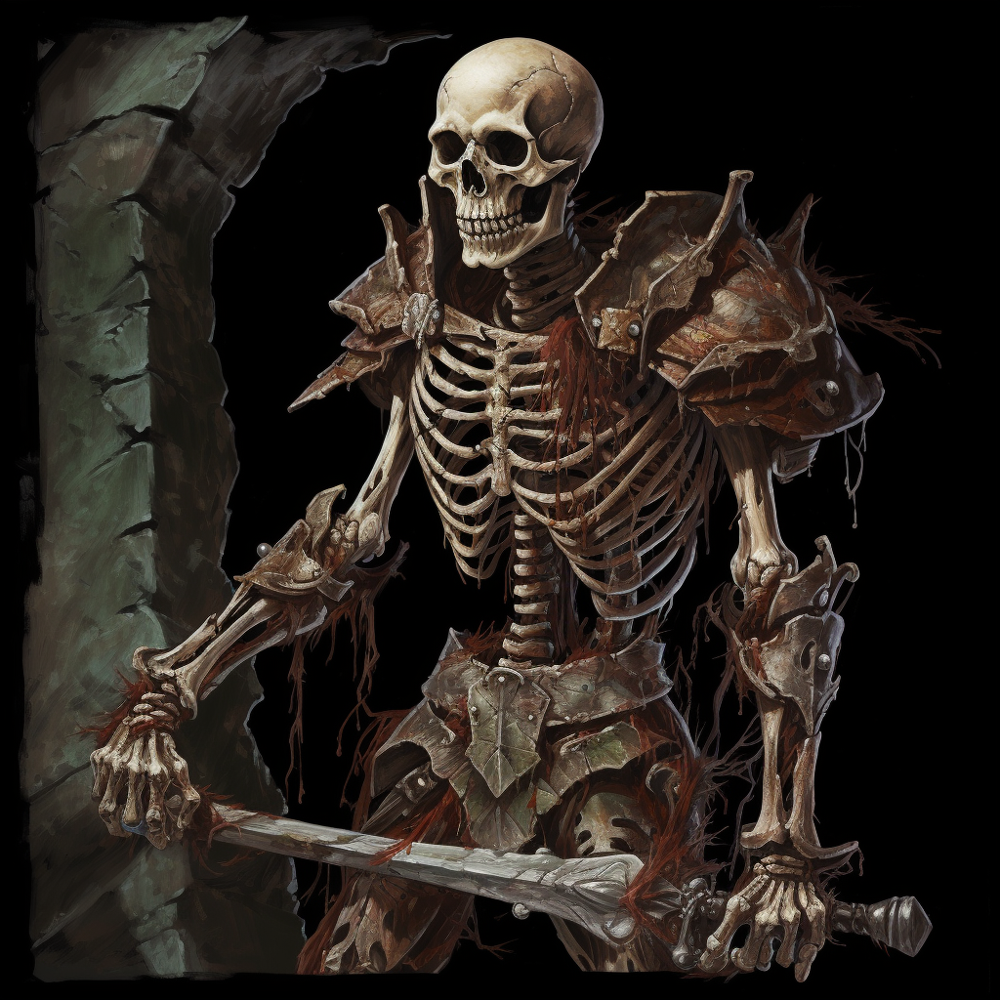

# Weak Skeleton

## Attributes and Core Skills

| STR       | 0 |    | RFX             | 1 |    | INT               | -1 |    |
| --------- | :-: | :-: | --------------- | :-: | :-: | ----------------- | :-: | :-: |
| Athletics | 0 | 3d6 | Acrobatics      | 0 | 4d6 | Communication     | -1 | 1d6 |
| Climb     | 0 | 3d6 | Perception      | -1 | 3d6 | General Knowledge | -1 | 1d6 |
| Endurance | 2 | 5d6 | Sleight of Hand | 0 | 4d6 | Survival          | -1 | 1d6 |
| Lift      | 0 | 3d6 | Stealth         | 0 | 4d6 | Will              | -1 | 1d6 |

## Vocations and Vocational Skills

| Fighter {RFX}      | 0 | 4d6 |
| ------------------- | :-: | :-: |
| Medium Sword {STR, RFX, INT} | 0 | 3d6 |
| Light Bow {STR, RFX, INT}     | 0 | 3d6 |

## Effects:

|            Name            |                           Effect                           | Duration |                                                       Source                                                       |
| :------------------------: | :---------------------------------------------------------: | :------: | :-----------------------------------------------------------------------------------------------------------------: |
|   Physical Defense Level   |                              1                              |          |                                                        Armor                                                        |
|        Medium Size        |                    5x5 ft on battle map.                    |          |                                                                                                                    |
|      Equipment Weight      |                           13.5 lb                           |          |                                                      Equipment                                                      |
|   Carry Weight   |                           120 lb                           |          | +50 lbs Carry Weight per Lift dice |
|        Weight Class: Light        |               -0d6 to STR/RFX governed Dice Pools               |          |                                              0% =< Equipment Weight <= 25% of Carry Weight                                              |
|  Terrestrial Combat Speed  |                            40 ft                            |          |                                +10 ft (per Athletics Dice), +/-10 ft (per RFX)                                |
|    Swim Combat Speed    |                            0 ft                            |          |                                                 Bone's don't float                                                 |
|    Climb Combat Speed    |                            15 ft                            |          |                                  +5 ft (per Climb Dice), +/-5 ft (per RFX)                                  |
|        Dark Vision        |                            60 ft                            |          |                                                       Innate                                                       |
|  Medium Bludgeon Weakness  | +2 to the level of injury received from Bludgeon damage. |          |                                                       Innate                                                       |
|  Medium Radiant Weakness  |  +2 to the level of injury received from Radiant damage.  |          |                                                       Innate                                                       |
| Medium Spiritual Weakness | +2 to the level of injury received from Spiritual damage. |          |                                                       Innate                                                       |
|   Minor Silver Weakness   |  +1 to the level of injury received from Silver damage.  |          |                                                       Innate                                                       |
|   Minor Slash Resistance   |      -1 to victory levels received from Slash damage.      |          |                                                       Innate                                                       |
|  Major Pierce Resistance  |      -3 to victory levels received from Pierce damage.      |          |                                                       Innate                                                       |
| Complete Poison Resistance |      Negate victory levels received from  Poison damage.      |          |                                                       Innate                                                       |

## Combat Rolls:

|          Name          |   One Handed   |   Two Handed   | Dual Wielded | Penetration | Range | Damage Types | Engageable Opponents | Area Of Effect | Resource Class |
| :--------------------: | :------------------: | :------------------: | :---------------: | :---------: | :----: | :---------------: | :-----------------------: | :-----------------: | :-----------------: |
|       Light Bow       |         None         | 3d6, 1d4 (+1d6) |       None       |      1      | Ranged |      Pierce      |           Quick           |        None        |        None        |
| Medium Thrusting Sword | 3d6, 1d4 (+1d6) | 4d6, 1d4 (+2d6) |      (+1d6)      |      2      | Melee |      Pierce      |           Rapid           |        None        |        None        |
| Medium Slashing Sword | 4d6, 1d4 (+2d6) | 5d6, 1d4 (+3d6) |      (+1d6)      |      0      | Melee |       Slash       |           Rapid           |        None        |        None        |

|     Name     | Resource Class |  Resource Dice  | Penetration | Range | Damage Types | Area Of Effect |
| :----------: | :-----------------: | :------------------: | :---------: | :---: | :---------------: | :-----------------: |
| Shoddy Arrow |        Arrow        | 3d6, 2d4 (+1d4) |      1      | None |      Pierce      |        None        |

## Equipment:

| Name                                 | # |                     Class                     |  Tier  | Durability | LB | Value |
| ------------------------------------ | :-: | :-------------------------------------------: | :-----: | :--------: | :-: | :---: |
| Buckler Shield                       | 1 |                  Phy. Def. 1                  | Mundane |   12/12   |  4  | 2 bc |
| Shoddy Leather Cuirass and Pauldrons | 1 |                 Phy. Def. 0.5                 | Shoddy |    9/9    |  4  | 3 bc |
| Shoddy Scimitar                      | 1 | Medium Thrusting Sword, Medium Slashing Sword | Shoddy |    9/9    |  2  | 5 bc |
| Shoddy Shortbow                      | 1 |                   Light Bow                   | Shoddy |    9/9    |  2  | 15 bc |
| Rusted Broadhead Arrow               | 20 |                 Shoddy Arrow                 | Shoddy |     -     | 0.05 | 3 cc |
| Quiver (capacity: 20)                | 1 |                                          | Mundane |            |  1  | 1 bc |

## Backstory

Skeletons arise when animated by dark magic. They heed the summons of spellcasters who call them from their stony tombs and ancient battlefields, or rise of their own accord in places saturated with death and loss, awakened by stirrings of necromantic energy or the presence of corrupting evil.

## Disposition

- Soulless
- Nothing without orders

## Goals/Aspirations

- None
