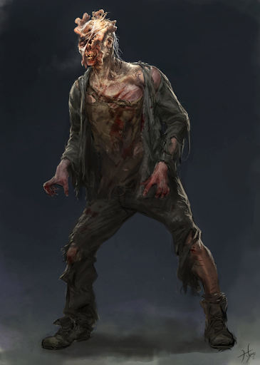

# Spore Infected

## Attributes and Core Skills

| STR       | 1 |    | RFX             | -1 |    | INT               | -2 |    |
| --------- | :-: | :-: | --------------- | :-: | :-: | ----------------- | :-: | :-: |
| Athletics | 0 | 4d6 | Acrobatics      | -1 | 1d6 | Communication     | -1 | 0d6 |
| Climb     | 0 | 4d6 | Perception      | 0 | 2d6 | General Knowledge | -1 | 0d6 |
| Endurance | 1 | 5d6 | Sleight of Hand | -1 | 1d6 | Survival          | -1 | 0d6 |
| Lift      | 0 | 4d6 | Stealth         | 0 | 2d6 | Will              | -1 | 0d6 |

## Vocations and Vocational Skills

| Zombie {STR}     | 2 | 6d6 |
| ---------------- | :-: | :-: |
| Unarmed {ALL}    | 2 | 3d6 |
| Small Bite {ALL} | 2 | 3d6 |

## Effects

|            Name            |                                                                                Effect                                                                                | Duration |                                                       Source                                                       |
| :-------------------------: | :-------------------------------------------------------------------------------------------------------------------------------------------------------------------: | :------: | :-----------------------------------------------------------------------------------------------------------------: |
|        Spore Carrier        | Carries the spore fungal infection. Creatures injured are infected with the spore disease. Upon death, the fungal growth hardens into a brittle stone like substance. |          |                                                                                                                    |
|       Spore Follower       |          Without the presence of a spore evolved, this creature will behave as a brain dead monster. But under direction will follow orders and use weapons.          |          |                                                                                                                    |
|    Minor Silver Weakness    |                                                     (+1) to the level of injury received from Silver damage.                                                     |          |                                                    Fellkin blood                                                    |
|  Minor Physical Resistance  |                                                         -1 to victory levels received from physical damage.                                                         |          |                                                                                                                    |
| Complete Psychic Resistance |                                                          -5 to victory levels received from Psychic damage.                                                          |          |                                                                                                                    |
|   Physical Defense Level   |                                                                                   0                                                                                   |          |                                                        Armor                                                        |
|         Medium Size         |                                                                         5x5 ft on battle map.                                                                         |          |                                                                                                                    |
|      Inventory Weight      |                                                                                 3 lb                                                                                 |          |                                                      Equipment                                                      |
|    Humanoid Carry Weight    |                                                                                220 lb                                                                                |          | 120 lb (Base), +100 lb positive STR, -50 lb negative STR, + 40 lb positive Lift, - 20 lb negative Lift |
|        Light Weight        |                                                                    -0d6 to STR/RFX governed skills                                                                    |          |                                              0% - 25% of carry weight                                              |
|   Humanoid Movement Speed   |                                                                                 20 ft                                                                                 |          |                                30 ft (Base), +10 ft (per RFX), +5 ft (per Athletics)                                |
|     Humanoid Swim Speed     |                                                                                 20 ft                                                                                 |          |                              15 ft (Base), +/-5 ft (per STR), +/-5 ft (per Athletics)                              |
|    Humanoid Climb Speed    |                                                                                 20 ft                                                                                 |          |                                15 ft (Base), +/-5 ft (per STR), +/-5 ft (per Climb)                                |

## Combat Rolls

|    Name    | One Handed | Two Handed | Dual Wielded | Penetration | Range | Damage Types | Engageable Opponents | Area Of Effect | Resource Class |
| :--------: | :-------------: | :-------------: | :---------------: | :---------: | :---: | :---------------: | :-----------------------: | :-----------------: | :-----------------: |
|  Unarmed  |  2d6 (-1)  |       -1       |       None       |      0      | Melee |     Bludgeon     |           Rapid           |        None        |        None        |
| Small Bite | 3d6 (+0d6) |      +1d6      |       None       |      0      | Melee | Pierce, Bludgeon |          Focused          |        None        |        None        |

## Equipment

| Name            | # | Class |  Tier  | Durability | LB | Value |
| --------------- | :-: | :---: | :-----: | :--------: | :-: | :---: |
| Clothes, Common | 1 |  | Mundane |            | 3 | 5 bc |
