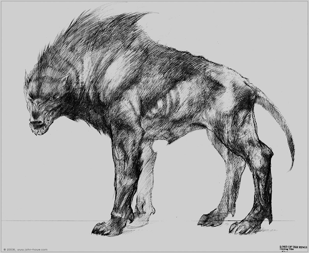

# Worg

## [Attributes](./../../../../../CoreRules/GeneralRules/Attributes.md) and [Core Skills](./../../../../../CoreRules/GeneralRules/CoreSkills.md)

|  [STR](./../../../../../CoreRules/GeneralRules/Attributes.md#strength-str)  | 1 |    |    [RFX](./../../../../../CoreRules/GeneralRules/Attributes.md#reflex-rfx)    | 0 |    |        [INT](./../../../../../CoreRules/GeneralRules/Attributes.md#intelligence-int)        | -1 |    |
| :-----------------------------------------------------------------------: | :-: | :-: | :-------------------------------------------------------------------------: | :-: | :-: | :---------------------------------------------------------------------------------------: | :-: | :-: |
| [Athletics](./../../../../../CoreRules/GeneralRules/CoreSkills.md#athletics) | 2 | 6d6 |  [Dexterity](./../../../../../CoreRules/GeneralRules/CoreSkills.md#dexterity)  | 1 | 4d6 |     [Communication](./../../../../../CoreRules/GeneralRules/CoreSkills.md#communication)     | 0 | 2d6 |
|                               (Deprecated)                               | 0 | 4d6 | [Perception](./../../../../../CoreRules/GeneralRules/CoreSkills.md#perception) | 2 | 5d6 | [General Knowledge](./../../../../../CoreRules/GeneralRules/CoreSkills.md#general-knowledge) | 0 | 2d6 |
| [Endurance](./../../../../../CoreRules/GeneralRules/CoreSkills.md#endurance) | 1 | 5d6 |                                (Deprecated)                                | 0 | 3d6 |                                       (Deprecated)                                       | 2 | 4d6 |
|      [Lift](./../../../../../CoreRules/GeneralRules/CoreSkills.md#lift)      | 1 | 5d6 |    [Stealth](./../../../../../CoreRules/GeneralRules/CoreSkills.md#stealth)    | 1 | 4d6 |              [Will](./../../../../../CoreRules/GeneralRules/CoreSkills.md#will)              | 2 | 3d6 |

## [Vocations](./../../../../../CoreRules/GeneralRules/Vocations.md) and [Vocation Skills](./../../../../../CoreRules/GeneralRules/Vocations.md#vocation-skills)

|    Beast    |   STR, RFX   | 2 | 6d6 |
| :----------: | :-----------: | :-: | :-: |
| Primal Melee | STR, RFX, INT | 2 | 5d6 |

## Info

|                                                  Name                                                  |                      Info                      | Duration |                      Source                      |
| :-----------------------------------------------------------------------------------------------------: | :--------------------------------------------: | :------: | :----------------------------------------------: |
|                           [Language](./../../../Languages/Languages.md): Primal                           |               Can speak Primal.               |          |                                                  |
|                                               Keen Smell                                               |  Advantage on smell based Perception checks.  |          |                                                  |
|                                              Keen Hearing                                              | Advantage on hearing based Perception checks. |          |                                                  |
|                                                                                                        |                                                |          |                                                  |
| [Physical Defense Level](./../../../../../CoreRules/CombatRules/DefenseAndPenetration.md#physical-defense) |                       2                       |          |                  Natural Armor                  |
|                                                                                                        |                                                |          |                                                  |
|                  [Size](./../../../../../CoreRules/CombatRules/BattleMap.md#size): Medium                  |             5x5 ft on battle map.             |          |                                                  |
|      [Combat Speed](./../../../../../CoreRules/CombatRules/CombatSpeed.md#combat-speeds): Terrestrial      |                     60 ft                     |          | +10 ft (per Athletics Dice), +/-10 ft (per RFX) |
|         [Combat Speed](./../../../../../CoreRules/CombatRules/CombatSpeed.md#combat-speeds): Swim         |                     30 ft                     |          |  +5 ft (per Athletics Dice), +/-5 ft (per RFX)  |
|         [Combat Speed](./../../../../../CoreRules/CombatRules/CombatSpeed.md#combat-speeds): Climb         |                     20 ft                     |          |  +5 ft (per Athletics Dice), +/-5 ft (per RFX)  |
|                                                                                                        |                                                |          |                                                  |
|                      [Injury](./../../../../../CoreRules/CombatRules/Injury.md): None                      |         – 0 dice to all dice checks.         |          |                 Damage Received                 |

## [Combat Rolls](./../../../../../CoreRules/CombatRules/CombatRolls.md)

- [Victory Levels link](./../../../../../CoreRules/CombatRules/VictoryLevels.md)

### [Weapons](./../../../../../CoreRules/CombatRules/Weapons.md)

| Name | [One Handed](./../../../../../CoreRules/CombatRules/Weapons.md#one-handed) | [Two Handed](./../../../../../CoreRules/CombatRules/Weapons.md#two-handed) | [Dual Wielded](./../../../../../CoreRules/CombatRules/Weapons.md#dual-wielded) | [Penetration](./../../../../../CoreRules/CombatRules/DefenseAndPenetration.md#penetration) | [Range](./../../../../../CoreRules/CombatRules/Range.md) | [Engageable Opponents](./../../../../../CoreRules/CombatRules/EngageableOpponents.md) | [Area Of Effect](./../../../../../CoreRules/CombatRules/AreaOfEffect.md) | [Ammo](./../../../../../CoreRules/CombatRules/Weapons.md#weapon-resources) | [Ammo Per Use](./../../../../../CoreRules/CombatRules/Weapons.md#resource-per-shot) | [Damage Types](./../../../../../CoreRules/CombatRules/DamageTypes.md) |
| :--: | :--------------------------------------------------------------------------------: | :--------------------------------------------------------------------------------: | :------------------------------------------------------------------------------------: | :-------------------------------------------------------------------------------------: | :---------------------------------------------------: | :-------------------------------------------------------------------------------------: | :------------------------------------------------------------------------: | :-------------------------------------------------------------------------------------------: | :----------------------------------------------------------------------------------------------: | :---------------------------------------------------------------------: |
| Bite |                                        None                                        |                                  +2d6 (6d6)                                  |                                          None                                          |                                            2                                            |                         Melee                         |                                       Rapid Max 2                                       |                                                                            |                                             None                                             |                                                                                                  |                            Pierce, Bludgeon                            |
