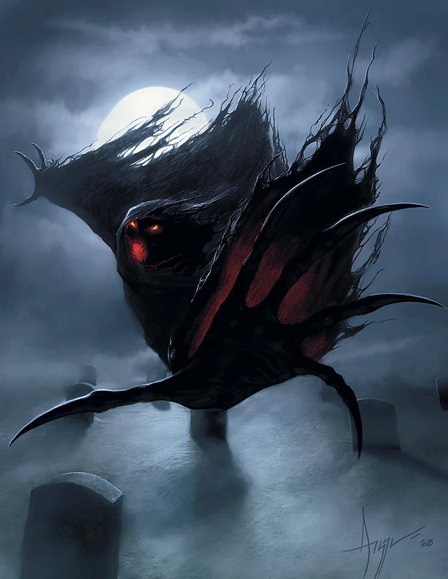

# Wraith

## [Attributes](./../../../../../CoreRules/GeneralRules/Attributes.md) and [Core Skills](./../../../../../CoreRules/GeneralRules/CoreSkills.md)

|  [STR](./../../../../../CoreRules/GeneralRules/Attributes.md#strength-str)  | -1 |    |    [RFX](./../../../../../CoreRules/GeneralRules/Attributes.md#reflex-rfx)    | 1 |    |        [INT](./../../../../../CoreRules/GeneralRules/Attributes.md#intelligence-int)        | 1 |    |
| :-----------------------------------------------------------------------: | :-: | :-: | :-------------------------------------------------------------------------: | :-: | :-: | :---------------------------------------------------------------------------------------: | :-: | :-: |
| [Athletics](./../../../../../CoreRules/GeneralRules/CoreSkills.md#athletics) | 1 | 3d6 |  [Dexterity](./../../../../../CoreRules/GeneralRules/CoreSkills.md#dexterity)  | 0 | 4d6 |     [Communication](./../../../../../CoreRules/GeneralRules/CoreSkills.md#communication)     | 1 | 5d6 |
| [Endurance](./../../../../../CoreRules/GeneralRules/CoreSkills.md#endurance) | 0 | 2d6 | [Perception](./../../../../../CoreRules/GeneralRules/CoreSkills.md#perception) | 0 | 4d6 | [General Knowledge](./../../../../../CoreRules/GeneralRules/CoreSkills.md#general-knowledge) | 0 | 4d6 |
|      [Lift](./../../../../../CoreRules/GeneralRules/CoreSkills.md#lift)      | 0 | 2d6 |    [Stealth](./../../../../../CoreRules/GeneralRules/CoreSkills.md#stealth)    | 0 | 4d6 |              [Will](./../../../../../CoreRules/GeneralRules/CoreSkills.md#will)              | 1 | 5d6 |

## [Vocations](./../../../../../CoreRules/GeneralRules/Vocations.md) and [Vocation Skills](./../../../../../CoreRules/GeneralRules/Vocations.md#vocation-skills)

|    Spirit    | RFX, INT | 2 | 7d6 |
| :-----------: | :------: | :-: | :-: |
| Spirit Magic | RFX, INT | 2 | 7d6 |
| Shadow Magic | RFX, INT | 2 | 7d6 |

## Effects

|                                                               Name                                                               |                                                          Desc                                                          | Duration |                      Source                      |
| :------------------------------------------------------------------------------------------------------------------------------: | :---------------------------------------------------------------------------------------------------------------------: | :------: | :----------------------------------------------: |
|                                   [Language](./../../../Languages/Languages.md): Alive Language                                   |                                         Can speak language it knew while alive.                                         |          |                                                  |
|                                                         Incorporeal Form                                                         |                   Can move through physical objects and creatures as if they were difficult terrain.                   |          |                                                  |
|                         [Darkvision](./../../../../../CoreRules/AdvancedRules/VisionAndLight.md#darkvision)                         | Within 60 feet, sees dim light as if it were bright light and darkness as if it were dim light, though devoid of color. |          |                                                  |
|                                                                                                                                  |                                                                                                                        |          |                                                  |
|                    [Physical Defense Level](./../../../../../CoreRules/CombatRules/Defense.md#physical-defense)                    |                                                            0                                                            |          |                  Armor & Shield                  |
|                 [Complete Resistance](./../../../../../CoreRules/CombatRules/WeaknessAndResistance.md): Non-Magical                 |                                   Negate victory levels received from damage source.                                   |          |                                                  |
| [Condition](./../../../../../CoreRules/CombatRules/Conditions.md) Immunities: Charmed, Exhaustion, Paralyzed, Petrified, Prone |                                    Character is immune to the specified conditions.                                    |          |                                                  |
|                      [Minor Weakness](./../../../../../CoreRules/CombatRules/WeaknessAndResistance.md): Silver                      |                                 +1 to the level of injury received from damage source.                                 |          |                                                  |
|                                                                                                                                  |                                                                                                                        |          |                                                  |
|                              [Size](./../../../../../CoreRules/CombatRules/BattleMap.md#size): Medium                              |                                                  5x5 ft on battle map.                                                  |          |                                                  |
|                      [Combat Speed](./../../../../../CoreRules/CombatRules/BattleMap.md#combat-speed): Flight                      |                                                          60 ft                                                          |          | +15 ft (per Athletics Dice), +/-10 ft (per RFX) |
|                                                                                                                                  |                                                                                                                        |          |                                                  |
|                      [Magic Resource](./../../../../../CoreRules/MagicRules/MagicResource.md): Spiritual Power                      |                                                          19/19                                                          |          |       Vocation/Magic Governing Core Skill       |
|                             [Injury](./../../../../../CoreRules/CombatRules/InjuryAndHealing.md): None                             |                                         -0d to STR/RFX/INT governed Dice Pools.                                         |          |                 Damage Received                 |

## [Combat Rolls](./../../../../../CoreRules/CombatRules/CombatRolls.md)

- [Victory Levels link](./../../../../../CoreRules/CombatRules/VictoryLevels.md)

### [Melee Weapon Spells](./../../../../../CoreRules/MagicRules/Spells.md#melee-weapon-spells)

|        Name        | [One Handed](./../../../../../CoreRules/CombatRules/Weapons.md#one-handed) | [Two Handed](./../../../../../CoreRules/CombatRules/Weapons.md#two-handed) | [Dual Wielded](./../../../../../CoreRules/CombatRules/Weapons.md#dual-wielded) | [Penetration](./../../../../../CoreRules/CombatRules/Penetration.md) | [Range](./../../../../../CoreRules/CombatRules/Range.md) | [Uses Per Round](./../../../../../CoreRules/CombatRules/UsesPerRound.md) | [Area Of Effect](./../../../../../CoreRules/CombatRules/AreaOfEffect.md) | [Magic Resource](./../../../../../CoreRules/MagicRules/MagicResource.md) | [Damage Types](./../../../../../CoreRules/CombatRules/DamageTypes.md) |
| :-----------------: | :--------------------------------------------------------------------------: | :--------------------------------------------------------------------------: | :------------------------------------------------------------------------------: | :---------------------------------------------------------------: | :---------------------------------------------------: | :------------------------------------------------------------------------: | :------------------------------------------------------------------------: | :------------------------------------------------------------------------: | ----------------------------------------------------------------------- |
|     Magic Glove     |                                     +0d6                                     |                                     None                                     |                                       +0d6                                       |                                 0                                 |                         Melee                         |                                   Swift                                   |                                                                            |                                     0                                     |                                                                         |
| Magic Small Thrust |                                     +0d6                                     |                                     None                                     |                                       +1d6                                       |                                 2                                 |                         Melee                         |                                   Swift                                   |                                                                            |                                     0                                     |                                                                         |
|  Magic Small Slash  |                                     +1d6                                     |                                     None                                     |                                       +1d6                                       |                                 0                                 |                         Melee                         |                                   Swift                                   |                                                                            |                                     0                                     |                                                                         |
|                    |                                                                              |                                                                              |                                                                                  |                                                                  |                                                      |                                                                            |                                                                            |                                                                            |                                                                         |
| Magic Medium Slash |                                     +2d6                                     |                                     +3d6                                     |                                       +1d6                                       |                                 1                                 |                         Melee                         |                                   Swift                                   |                                                                            |                                     1                                     |                                                                         |
| Magic Medium Thrust |                                     +1d6                                     |                                     +2d6                                     |                                       +1d6                                       |                                 2                                 |                         Melee                         |                                   Swift                                   |                                                                            |                                     1                                     |                                                                         |
| Magic Medium Smash |                                     +0d6                                     |                                     +1d6                                     |                                       +1d6                                       |                                 4                                 |                         Melee                         |                                   Swift                                   |                                                                            |                                     1                                     |                                                                         |
| Magic Medium Spear |                                     +2d6                                     |                                     None                                     |                                       +1d6                                       |                                 2                                 |                         Melee                         |                                   Steady                                   |                                                                            |                                     1                                     |                                                                         |
|     Magic Whip     |                                     +1d6                                     |                                     None                                     |                                       +1d6                                       |                                 0                                 |                         Reach                         |                                   Swift                                   |                                                                            |                                     1                                     |                                                                         |
|  Magic Large Slash  |                                     +1d6                                     |                                     +3d6                                     |                                       None                                       |                                 2                                 |                         Melee                         |                                   Swift                                   |                                                                            |                                     1                                     |                                                                         |
| Magic Large Thrust |                                     +0d6                                     |                                     +2d6                                     |                                       None                                       |                                 3                                 |                         Melee                         |                                   Swift                                   |                                                                            |                                     1                                     |                                                                         |
|  Magic Large Smash  |                                      -1                                      |                                     +1d6                                     |                                       None                                       |                                 5                                 |                         Melee                         |                                   Swift                                   |                                                                            |                                     1                                     |                                                                         |
|  Magic Large Spear  |                                     +2d6                                     |                                     +3d6                                     |                                       None                                       |                                 3                                 |                         Melee                         |                                   Steady                                   |                                                                            |                                     1                                     |                                                                         |
|                    |                                                                              |                                                                              |                                                                                  |                                                                  |                                                      |                                                                            |                                                                            |                                                                            |                                                                         |
|  Magic Reach Slash  |                                      -2                                      |                                     +4d6                                     |                                       None                                       |                                 3                                 |                         Reach                         |                                Reach Swift                                |                                                                            |                                     2                                     |                                                                         |
| Magic Reach Thrust |                                      -2                                      |                                     +3d6                                     |                                       None                                       |                                 4                                 |                         Reach                         |                                Reach Swift                                |                                                                            |                                     2                                     |                                                                         |
|  Magic Reach Smash  |                                      -2                                      |                                     +2d6                                     |                                       None                                       |                                 5                                 |                         Reach                         |                                Reach Swift                                |                                                                            |                                     2                                     |                                                                         |
|  Magic Reach Spear  |                                      -2                                      |                                     +4d6                                     |                                       None                                       |                                 4                                 |                         Reach                         |                                   Steady                                   |                                                                            |                                     2                                     |                                                                         |

### [Ranged Weapon Spell](./../../../../../CoreRules/MagicRules/Spells.md#ranged-weapon-spells)

|             Name             | [One Handed](./../../../../../CoreRules/CombatRules/Weapons.md#one-handed) | [Two Handed](./../../../../../CoreRules/CombatRules/Weapons.md#two-handed) | [Dual Wielded](./../../../../../CoreRules/CombatRules/Weapons.md#dual-wielded) | [Penetration](./../../../../../CoreRules/CombatRules/Penetration.md) | [Range](./../../../../../CoreRules/CombatRules/Range.md) | [Uses Per Round](./../../../../../CoreRules/CombatRules/UsesPerRound.md) | [Area Of Effect](./../../../../../CoreRules/CombatRules/AreaOfEffect.md) | [Magic Resource](./../../../../../CoreRules/MagicRules/MagicResource.md) | [Damage Types](./../../../../../CoreRules/CombatRules/DamageTypes.md) |
| :---------------------------: | :--------------------------------------------------------------------------: | :--------------------------------------------------------------------------: | :------------------------------------------------------------------------------: | :---------------------------------------------------------------: | :---------------------------------------------------: | :------------------------------------------------------------------------: | :------------------------------------------------------------------------: | :------------------------------------------------------------------------: | ----------------------------------------------------------------------- |
|          Magic Dart          |                                     +0d6                                     |                                     None                                     |                                       +1d6                                       |                                 0                                 |                         Short                         |                                   Swift                                   |                                                                            |                                     0                                     |                                                                         |
|          Magic Sling          |                                     +0d6                                     |                                     None                                     |                                       None                                       |                                 1                                 |                       Mediocre                       |                                   Quick                                   |                                                                            |                                     0                                     |                                                                         |
|                              |                                                                              |                                                                              |                                                                                  |                                                                  |                                                      |                                                                            |                                                                            |                                                                            |                                                                         |
|         Magic Javelin         |                                     +1d6                                     |                                     None                                     |                                       None                                       |                                 2                                 |                       Mediocre                       |                                   Quick                                   |                                                                            |                                     1                                     |                                                                         |
|      Magic Great Javelin      |                                     +1d6                                     |                                     None                                     |                                       None                                       |                                 3                                 |                         Short                         |                                   Quick                                   |                                                                            |                                     1                                     |                                                                         |
|        Magic Hand Bolt        |                                     +1d6                                     |                                     None                                     |                                       +1d6                                       |                                 1                                 |                       Mediocre                       |                                   Quick                                   |                                                                            |                                     1                                     |                                                                         |
|          Magic Bolt          |                                     None                                     |                                     +1d6                                     |                                       None                                       |                                 2                                 |                          Far                          |                                   Steady                                   |                                                                            |                                     1                                     |                                                                         |
|       Magic Great Bolt       |                                     None                                     |                                     +2d6                                     |                                       None                                       |                                 3                                 |                         Long                         |                               Extremely Slow                               |                                                                            |                                     1                                     |                                                                         |
|          Magic Arrow          |                                     None                                     |                                     +1d6                                     |                                       None                                       |                                 1                                 |                          Far                          |                                   Swift                                   |                                                                            |                                     1                                     |                                                                         |
|       Magic Close Cone       |                                     None                                     |                                     +1d6                                     |                                       None                                       |                                 3                                 |                         Close                         |                                     1                                     |                           Close Cone Calculation                           |                                     1                                     |                                                                         |
|                              |                                                                              |                                                                              |                                                                                  |                                                                  |                                                      |                                                                            |                                                                            |                                                                            |                                                                         |
|  Magic Penetrating Hand Bolt  |                                     +1d6                                     |                                     None                                     |                                       +1d6                                       |                                 2                                 |                       Mediocre                       |                                   Quick                                   |                                                                            |                                     2                                     |                                                                         |
|    Magic Penetrating Bolt    |                                     None                                     |                                     +1d6                                     |                                       None                                       |                                 3                                 |                          Far                          |                                   Steady                                   |                                                                            |                                     2                                     |                                                                         |
| Magic Penetrating Great Bolt |                                     None                                     |                                     +2d6                                     |                                       None                                       |                                 4                                 |                         Long                         |                               Extremely Slow                               |                                                                            |                                     2                                     |                                                                         |
|    Magic Penetrating Arrow    |                                     None                                     |                                     +1d6                                     |                                       None                                       |                                 2                                 |                          Far                          |                                   Swift                                   |                                                                            |                                     2                                     |                                                                         |
|       Magic Medium Cone       |                                     None                                     |                                     +1d6                                     |                                       None                                       |                                 3                                 |                       Mediocre                       |                                     1                                     |                          Medium Cone Calculation                          |                                     2                                     |                                                                         |
|       Magic Great Arrow       |                                     None                                     |                                     +2d6                                     |                                       None                                       |                                 3                                 |                     Sharpshooter                     |                                   Quick                                   |                                                                            |                                     2                                     |                                                                         |
|                              |                                                                              |                                                                              |                                                                                  |                                                                  |                                                      |                                                                            |                                                                            |                                                                            |                                                                         |
| Magic Penetrating Great Arrow |                                     None                                     |                                     +2d6                                     |                                       None                                       |                                 4                                 |                     Sharpshooter                     |                                   Quick                                   |                                                                            |                                     3                                     |                                                                         |
|        Magic Hand Shot        |                                     +2d6                                     |                                     None                                     |                                       +1d6                                       |                                 4                                 |                       Mediocre                       |                               Extremely Slow                               |                                                                            |                                     3                                     |                                                                         |
|          Magic Shot          |                                     +0d6                                     |                                     +2d6                                     |                                       None                                       |                                 5                                 |                         Long                         |                               Extremely Slow                               |                                                                            |                                     3                                     |                                                                         |
|       Magic Great Shot       |                                     +0d6                                     |                                     +3d6                                     |                                       None                                       |                                 6                                 |                     Sharpshooter                     |                               Painfully Slow                               |                                                                            |                                     3                                     |                                                                         |
|      Magic Medium Sphere      |                                     None                                     |                                     +2d6                                     |                                       None                                       |                                 4                                 |                         Long                         |                                     1                                     |                         Medium Sphere Calculation                         |                                     3                                     |                                                                         |

### [Shield Spells](./../../../../../CoreRules/MagicRules/Spells.md#shield-spells)

|     Name     | Class |                                   Effect                                   |
| :-----------: | :----: | :-------------------------------------------------------------------------: |
| Small Shield | Shield | Phy. Def. 1.00, Bodily Def. 1.00, Spiritual Def. 1.00, or Mental Def. 1.00 |
| Medium Shield | Shield | Phy. Def. 2.00, Bodily Def. 2.00, Spiritual Def. 2.00, or Mental Def. 2.00 |
| Large Shield | Shield | Phy. Def. 3.00, Bodily Def. 3.00, Spiritual Def. 3.00, or Mental Def. 3.00 |
