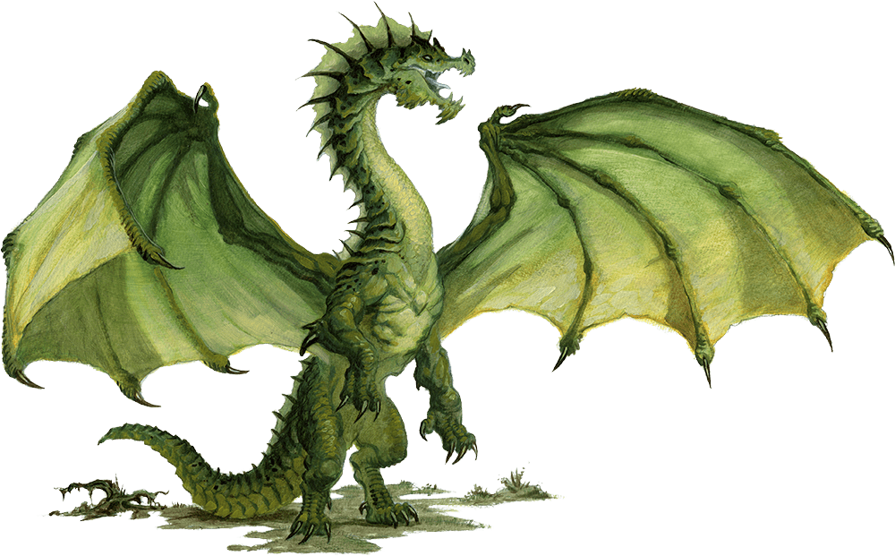

# Young Green Dragon

## [Attributes](./../../../../../CoreRules/GeneralRules/Attributes.md) and [Core Skills](./../../../../../CoreRules/GeneralRules/CoreSkills.md)

|  [STR](./../../../../../CoreRules/GeneralRules/Attributes.md#strength-str)  | 3 |    |    [RFX](./../../../../../CoreRules/GeneralRules/Attributes.md#reflex-rfx)    | 0 |    |        [INT](./../../../../../CoreRules/GeneralRules/Attributes.md#intelligence-int)        | 1 |    |
| :-----------------------------------------------------------------------: | :-: | :-: | :-------------------------------------------------------------------------: | :-: | :-: | :---------------------------------------------------------------------------------------: | :-: | :-: |
| [Athletics](./../../../../../CoreRules/GeneralRules/CoreSkills.md#athletics) | 0 | 6d6 |  [Dexterity](./../../../../../CoreRules/GeneralRules/CoreSkills.md#dexterity)  | 2 | 5d6 |     [Communication](./../../../../../CoreRules/GeneralRules/CoreSkills.md#communication)     | 2 | 6d6 |
|                               (Deprecated)                               | 0 | 6d6 | [Perception](./../../../../../CoreRules/GeneralRules/CoreSkills.md#perception) | 3 | 6d6 | [General Knowledge](./../../../../../CoreRules/GeneralRules/CoreSkills.md#general-knowledge) | 0 | 4d6 |
| [Endurance](./../../../../../CoreRules/GeneralRules/CoreSkills.md#endurance) | 0 | 6d6 |                                (Deprecated)                                | 0 | 3d6 |                                       (Deprecated)                                       | 0 | 4d6 |
|      [Lift](./../../../../../CoreRules/GeneralRules/CoreSkills.md#lift)      | 0 | 6d6 |    [Stealth](./../../../../../CoreRules/GeneralRules/CoreSkills.md#stealth)    | 2 | 5d6 |              [Will](./../../../../../CoreRules/GeneralRules/CoreSkills.md#will)              | 2 | 6d6 |

## [Vocations](./../../../../../CoreRules/GeneralRules/Vocations.md) and [Vocation Skills](./../../../../../CoreRules/GeneralRules/Vocations.md#vocation-skills)

| [Fellcaster](./../../../MagicSystems/Fellcraft/Fellcraft.md) | STR, RFX, INT | 2 | 9d6 |
| :-------------------------------------------------------: | :-----------: | :-: | :-: |
|                        Toxincraft                        | STR, RFX, INT | 2 | 9d6 |

|   Predator   | STR, RFX, INT | 1 | 8d6 |
| :----------: | :-----------: | :-: | :-: |
| Primal Melee | STR, RFX, INT | 1 | 8d6 |

## Effects

|                                             Name                                             |                                                           Desc                                                           | Duration |                      Source                      |
| :-------------------------------------------------------------------------------------------: | :----------------------------------------------------------------------------------------------------------------------: | :------: | :----------------------------------------------: |
|                     [Language](./../../../Languages/Languages.md): Babelish                     |                                                   Can speak Babelish.                                                   |          |                                                  |
|                     [Language](./../../../Languages/Languages.md): Draconic                     |                                                   Can speak Draconic.                                                   |          |                                                  |
|                                                                                              |                                                                                                                          |          |                                                  |
|   [Physical Defense Level](./../../../../../CoreRules/CombatRules/Defense.md#physical-defense)   |                                                            5                                                            |          |                  Natural Armor                  |
|  [Complete Resistance](./../../../../../CoreRules/CombatRules/WeaknessAndResistance.md): Poison  |                                     Negate victory levels received from damage type.                                     |          |                                                  |
|                                                                                              |                                                                                                                          |          |                                                  |
|    [Minor Weakness](./../../../../../CoreRules/CombatRules/WeaknessAndResistance.md): Silver    |                                  +1 to the level of injury received from damage type.                                  |          |                                                  |
|                                                                                              |                                                                                                                          |          |                                                  |
|   [Enhanced Darkvision](./../../../../../CoreRules/AdvancedRules/VisionAndLight.md#darkvision)   | Within 120 feet, sees dim light as if it were bright light and darkness as if it were dim light, though devoid of color. |          |                                                  |
|       [Blindsight](./../../../../../CoreRules/AdvancedRules/VisionAndLight.md#blindsight)       |                        Within 30 ft, the environment can be perceived without the need for sight.                        |          |                                                  |
|                                                                                              |                                                                                                                          |          |                                                  |
|             [Size](./../../../../../CoreRules/CombatRules/BattleMap.md#size): Large             |                                                 10x10 ft on battle map.                                                 |          |                                                  |
|   [Combat Speed](./../../../../../CoreRules/CombatRules/CombatSpeed.md#combat-speeds): Flight   |                                                          90 ft                                                          |          | +15 ft (per Athletics Dice), +/-15 ft (per RFX) |
| [Combat Speed](./../../../../../CoreRules/CombatRules/CombatSpeed.md#combat-speeds): Terrestrial |                                                          60 ft                                                          |          | +10 ft (per Athletics Dice), +/-10 ft (per RFX) |
|   [Combat Speed](./../../../../../CoreRules/CombatRules/CombatSpeed.md#combat-speeds): Aquatic   |                                                          60 ft                                                          |          | +10 ft (per Athletics Dice), +/-10 ft (per RFX) |
|    [Combat Speed](./../../../../../CoreRules/CombatRules/CombatSpeed.md#combat-speeds): Climb    |                                                          30 ft                                                          |          |  +5 ft (per Athletics Dice), +/-5 ft (per RFX)  |
|                                                                                              |                                                                                                                          |          |                                                  |
|       [Magic Resource](./../../../../../CoreRules/MagicRules/MagicResource.md): Fellblood       |                                                          11/11                                                          |          |       Vocation/Magic Governing Core Skill       |
|                 [Injury](./../../../../../CoreRules/CombatRules/Injury.md): None                 |                                              – 0 dice to all dice checks.                                              |          |                 Damage Received                 |

## [Combat Rolls](./../../../../../CoreRules/CombatRules/CombatRolls.md)

- [Victory Levels link](./../../../../../CoreRules/CombatRules/VictoryLevels.md)

### [Weapons](./../../../../../CoreRules/CombatRules/Weapons.md)

|        Name        | [One Handed](./../../../../../CoreRules/CombatRules/Weapons.md#one-handed) | [Two Handed](./../../../../../CoreRules/CombatRules/Weapons.md#two-handed) | [Dual Wielded](./../../../../../CoreRules/CombatRules/Weapons.md#dual-wielded) | [Penetration](./../../../../../CoreRules/CombatRules/Penetration.md) | [Range](./../../../../../CoreRules/CombatRules/Range.md) | [Uses Per Round](./../../../../../CoreRules/CombatRules/UsesPerRound.md) | [Area Of Effect](./../../../../../CoreRules/CombatRules/AreaOfEffect.md) | [Ammo Type](./../../../../../CoreRules/CombatRules/Ammunitions.md#ammo-type) | [Ammo Per Use](./../../../../../CoreRules/CombatRules/Weapons.md#ammo-per-shot) | [Damage Types](./../../../../../CoreRules/CombatRules/DamageTypes.md) |
| :-----------------: | :--------------------------------------------------------------------------: | :--------------------------------------------------------------------------: | :------------------------------------------------------------------------------: | :---------------------------------------------------------------: | :---------------------------------------------------: | :-------------------------------------------------------------------------------------: | :------------------------------------------------------------------------: | :----------------------------------------------------------------------------: | :-------------------------------------------------------------------------------: | :---------------------------------------------------------------------: |
| Large Slashing Claw |                                     +2d6                                     |                                     None                                     |                                       +1d6                                       |                                 1                                 |                         Melee                         |                                          Swift                                          |                                                                            |                                      None                                      |                                                                                  |                                  Slash                                  |
| Large Piercing Claw |                                     +1d6                                     |                                     None                                     |                                       +1d6                                       |                                 2                                 |                         Melee                         |                                          Swift                                          |                                                                            |                                      None                                      |                                                                                  |                                 Pierce                                 |
|     Large Bite     |                                     None                                     |                                     +3d6                                     |                                       None                                       |                                 3                                 |                         Melee                         |                                          Quick                                          |                                                                            |                                      None                                      |                                                                                  |                            Pierce, Bludgeon                            |
|     Large Slam     |                                     +0d6                                     |                                     None                                     |                                       +1d6                                       |                                 4                                 |                         Melee                         |                                          Swift                                          |                                                                            |                                      None                                      |                                                                                  |                                Bludgeon                                |

### [Ranged Weapon Spell](./../../../../../CoreRules/MagicRules/Spells.md#ranged-weapon-spells)

|             Name             | [One Handed](./../../../../../CoreRules/CombatRules/Weapons.md#one-handed) | [Two Handed](./../../../../../CoreRules/CombatRules/Weapons.md#two-handed) | [Dual Wielded](./../../../../../CoreRules/CombatRules/Weapons.md#dual-wielded) | [Penetration](./../../../../../CoreRules/CombatRules/Penetration.md) | [Range](./../../../../../CoreRules/CombatRules/Range.md) | [Uses Per Round](./../../../../../CoreRules/CombatRules/UsesPerRound.md) | [Area Of Effect](./../../../../../CoreRules/CombatRules/AreaOfEffect.md) | [Magic Resource](./../../../../../CoreRules/MagicRules/MagicResource.md) | [Damage Types](./../../../../../CoreRules/CombatRules/DamageTypes.md) |
| :---------------------------: | :--------------------------------------------------------------------------: | :--------------------------------------------------------------------------: | :------------------------------------------------------------------------------: | :---------------------------------------------------------------: | :---------------------------------------------------: | :-------------------------------------------------------------------------------------: | :------------------------------------------------------------------------: | :------------------------------------------------------------------------: | ----------------------------------------------------------------------- |
|          Magic Dart          |                                     +0d6                                     |                                     None                                     |                                       +1d6                                       |                                 0                                 |                         Short                         |                                          Swift                                          |                                                                            |                                     0                                     |                                                                         |
|          Magic Sling          |                                     +0d6                                     |                                     None                                     |                                       None                                       |                                 1                                 |                        Medium                        |                                          Quick                                          |                                                                            |                                     0                                     |                                                                         |
|                              |                                                                              |                                                                              |                                                                                  |                                                                  |                                                      |                                                                                        |                                                                            |                                                                            |                                                                         |
|         Magic Javelin         |                                     +1d6                                     |                                     None                                     |                                       None                                       |                                 2                                 |                        Medium                        |                                          Quick                                          |                                                                            |                                     1                                     |                                                                         |
|      Magic Great Javelin      |                                     +1d6                                     |                                     None                                     |                                       None                                       |                                 3                                 |                         Short                         |                                          Quick                                          |                                                                            |                                     1                                     |                                                                         |
|        Magic Hand Bolt        |                                     +1d6                                     |                                     None                                     |                                       +1d6                                       |                                 1                                 |                        Medium                        |                                          Quick                                          |                                                                            |                                     1                                     |                                                                         |
|          Magic Bolt          |                                     None                                     |                                     +1d6                                     |                                       None                                       |                                 2                                 |                          Far                          |                                         Steady                                         |                                                                            |                                     1                                     |                                                                         |
|       Magic Great Bolt       |                                     None                                     |                                     +2d6                                     |                                       None                                       |                                 3                                 |                         Long                         |                                     Extremely Slow                                     |                                                                            |                                     1                                     |                                                                         |
|          Magic Arrow          |                                     None                                     |                                     +1d6                                     |                                       None                                       |                                 1                                 |                          Far                          |                                          Swift                                          |                                                                            |                                     1                                     |                                                                         |
|       Magic Close Cone       |                                     None                                     |                                     +1d6                                     |                                       None                                       |                                 3                                 |                         Close                         |                                            1                                            |                           Close Cone Calculation                           |                                     1                                     |                                                                         |
|                              |                                                                              |                                                                              |                                                                                  |                                                                  |                                                      |                                                                                        |                                                                            |                                                                            |                                                                         |
|  Magic Penetrating Hand Bolt  |                                     +1d6                                     |                                     None                                     |                                       +1d6                                       |                                 2                                 |                        Medium                        |                                          Quick                                          |                                                                            |                                     2                                     |                                                                         |
|    Magic Penetrating Bolt    |                                     None                                     |                                     +1d6                                     |                                       None                                       |                                 3                                 |                          Far                          |                                         Steady                                         |                                                                            |                                     2                                     |                                                                         |
| Magic Penetrating Great Bolt |                                     None                                     |                                     +2d6                                     |                                       None                                       |                                 4                                 |                         Long                         |                                     Extremely Slow                                     |                                                                            |                                     2                                     |                                                                         |
|    Magic Penetrating Arrow    |                                     None                                     |                                     +1d6                                     |                                       None                                       |                                 2                                 |                          Far                          |                                          Swift                                          |                                                                            |                                     2                                     |                                                                         |
|       Magic Medium Cone       |                                     None                                     |                                     +1d6                                     |                                       None                                       |                                 3                                 |                        Medium                        |                                            1                                            |                          Medium Cone Calculation                          |                                     2                                     |                                                                         |
|       Magic Great Arrow       |                                     None                                     |                                     +2d6                                     |                                       None                                       |                                 3                                 |                     Sharpshooter                     |                                          Quick                                          |                                                                            |                                     2                                     |                                                                         |
|                              |                                                                              |                                                                              |                                                                                  |                                                                  |                                                      |                                                                                        |                                                                            |                                                                            |                                                                         |
| Magic Penetrating Great Arrow |                                     None                                     |                                     +2d6                                     |                                       None                                       |                                 4                                 |                     Sharpshooter                     |                                          Quick                                          |                                                                            |                                     3                                     |                                                                         |
|        Magic Hand Shot        |                                     +2d6                                     |                                     None                                     |                                       +1d6                                       |                                 4                                 |                        Medium                        |                                     Extremely Slow                                     |                                                                            |                                     3                                     |                                                                         |
|          Magic Shot          |                                     +0d6                                     |                                     +2d6                                     |                                       None                                       |                                 5                                 |                         Long                         |                                     Extremely Slow                                     |                                                                            |                                     3                                     |                                                                         |
|       Magic Great Shot       |                                     +0d6                                     |                                     +3d6                                     |                                       None                                       |                                 6                                 |                     Sharpshooter                     |                                     Painfully Slow                                     |                                                                            |                                     3                                     |                                                                         |
|      Magic Medium Sphere      |                                     None                                     |                                     +2d6                                     |                                       None                                       |                                 4                                 |                         Long                         |                                            1                                            |                         Medium Sphere Calculation                         |                                     3                                     |                                                                         |

### [Shield Spells](./../../../../../CoreRules/MagicRules/Spells.md#shield-spells)

|     Name     |                                   Effect                                   | Magic Resource |
| :-----------: | :-------------------------------------------------------------------------: | :-----------------: |
| Small Shield | Phy. Def. 1.00, Bodily Def. 1.00, Spiritual Def. 1.00, or Mental Def. 1.00 |          0          |
| Medium Shield | Phy. Def. 2.00, Bodily Def. 2.00, Spiritual Def. 2.00, or Mental Def. 2.00 |          1          |
| Large Shield | Phy. Def. 3.00, Bodily Def. 3.00, Spiritual Def. 3.00, or Mental Def. 3.00 |          2          |
