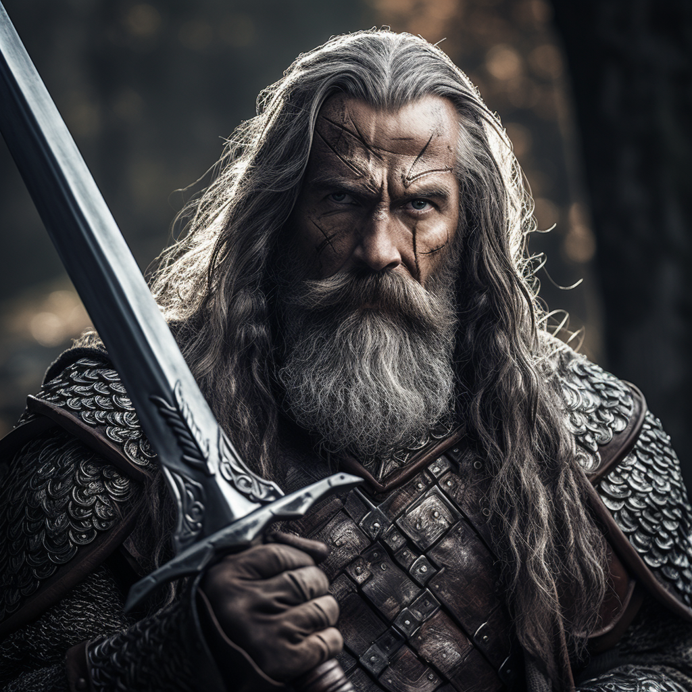

# Ulfric Warwinter

[Link to character sheet](https://docs.google.com/spreadsheets/d/1HbPyI_M6E6O2NYyO22s6DV032g0q3gPgFVNLjz-3YQI/edit?usp=sharing)

## Backstory

Ulfric Warwinter, a former soldier and sellsword, originates from the city of Reddwall. He is a committed member of the Eastern Alliance, a political entity that unites the cities and towns of the East.

## Appearance

Age: 50

Race: Mudblood

Height: 6'0"

Body Type: Strong

## Disposition

Despite his restrained and somewhat cold demeanor, he compassionate and genuine individual. He lacks confidence and charisma, but his heart is in the right place. He is cautious by nature, but he is not afraid to step into dangerous situations when others are too scared to do so.

He has a fondness for "quaint" inns.

## Goals/Aspirations

His primary goal is to see the town of Tuntin thrive and ensure that no one, even the most foolish, comes to harm.
