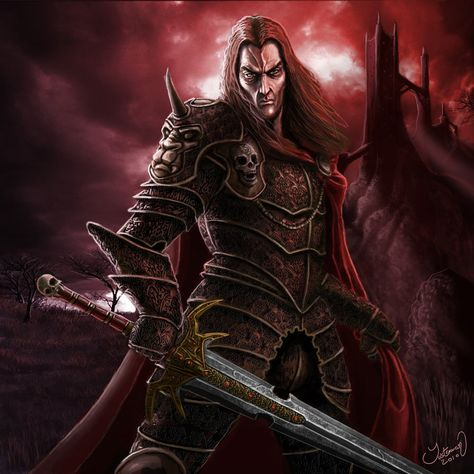

# 16

## [Attributes](./../../../../../CoreRules/GeneralRules/Attributes.md) and [Core Skills](./../../../../../CoreRules/GeneralRules/CoreSkills.md)

|  [STR](./../../../../../CoreRules/GeneralRules/Attributes.md#strength-str)  | 0 |    |    [RFX](./../../../../../CoreRules/GeneralRules/Attributes.md#reflex-rfx)    | 1 |    |        [INT](./../../../../../CoreRules/GeneralRules/Attributes.md#intelligence-int)        | 0 |    |
| :-----------------------------------------------------------------------: | :-: | :-: | :-------------------------------------------------------------------------: | :-: | :-: | :---------------------------------------------------------------------------------------: | :-: | :-: |
| [Athletics](./../../../../../CoreRules/GeneralRules/CoreSkills.md#athletics) | 0 | 3d6 |  [Dexterity](./../../../../../CoreRules/GeneralRules/CoreSkills.md#dexterity)  | 1 | 5d6 |     [Communication](./../../../../../CoreRules/GeneralRules/CoreSkills.md#communication)     | 0 | 3d6 |
| [Endurance](./../../../../../CoreRules/GeneralRules/CoreSkills.md#endurance) | 0 | 3d6 | [Perception](./../../../../../CoreRules/GeneralRules/CoreSkills.md#perception) | 1 | 5d6 | [General Knowledge](./../../../../../CoreRules/GeneralRules/CoreSkills.md#general-knowledge) | -1 | 2d6 |
|      [Lift](./../../../../../CoreRules/GeneralRules/CoreSkills.md#lift)      | 0 | 3d6 |    [Stealth](./../../../../../CoreRules/GeneralRules/CoreSkills.md#stealth)    | 1 | 5d6 |              [Will](./../../../../../CoreRules/GeneralRules/CoreSkills.md#will)              | 0 | 3d6 |

## [Vocations](./../../../../../CoreRules/GeneralRules/Vocations.md) and [Vocation Skills](./../../../../../CoreRules/GeneralRules/Vocations.md#vocation-skills)

|    Rogue    |   RFX, INT   | 1 | 5d6 |
| :----------: | :-----------: | :-: | :-: |
|     Bow     | STR, RFX, INT | 0 | 4d6 |
| Medium Melee | STR, RFX, INT | 1 | 5d6 |
| Close Melee | STR, RFX, INT | 0 | 4d6 |

## Effects

|                                                        Name                                                        |                                                                                                                                                                  Desc                                                                                                                                                                  | Duration |                      Source                      |
| :-----------------------------------------------------------------------------------------------------------------: | :-------------------------------------------------------------------------------------------------------------------------------------------------------------------------------------------------------------------------------------------------------------------------------------------------------------------------------------: | :------: | :----------------------------------------------: |
|                       [Level](./../../../../../CoreRules/CharacterCreationRules/TiersOfPlay.md)                       |                                                                                                                                                                    1                                                                                                                                                                    |          |                                                  |
|                                [Language](./../../../Languages/Languages.md): Babelish                                |                                                                                                                                                           Can speak Babelish.                                                                                                                                                           |          |                                                  |
|                                 [Language](./../../../Languages/Languages.md): Pirish                                 |                                                                                                                                                            Can speak Pirish.                                                                                                                                                            |          |                                                  |
|  [Disabling Characteristic](./../../../../../CoreRules/CharacterCreationRules/DisablingCharacteristics.md): Amnesia  |                                                                                                                           Character is missing a large portion of their past. -1 dice to General Knowledge.                                                                                                                           |          |                                                  |
|                                                                                                                    |                                                                                                                                                                                                                                                                                                                                        |          |                                                  |
|     [Equipment Weight](./../../../../../CoreRules/AdvancedRules/EquipmentCarryWeightAndWeightClasses.md#equipment)     |                                                                                                                                                                  29 lb                                                                                                                                                                  |          |                    Equipment                    |
|     [Carry Weight](./../../../../../CoreRules/AdvancedRules/EquipmentCarryWeightAndWeightClasses.md#carry-weight)     |                                                                                                                                                                 150 lb                                                                                                                                                                 |          |        +50 lbs Carry Weight per Lift dice        |
| [Weight Class](./../../../../../CoreRules/AdvancedRules/EquipmentCarryWeightAndWeightClasses.md#weight-classes): Light |                                                                                                                                                   -0d to STR/RFX governed Dice Pools                                                                                                                                                   |          |  0% =< Equipment Weight <= 25% of Carry Weight  |
|                                                                                                                    |                                                                                                                                                                                                                                                                                                                                        |          |                                                  |
|              [Physical Defense Level](./../../../../../CoreRules/CombatRules/Defense.md#physical-defense)              |                                                                                                                                                                    3                                                                                                                                                                    |          |                  Armor & Shield                  |
|                                                                                                                    |                                                                                                                                                                                                                                                                                                                                        |          |                                                  |
|                        [Size](./../../../../../CoreRules/CombatRules/BattleMap.md#size): Medium                        |                                                                                                                                                          5x5 ft on battle map.                                                                                                                                                          |          |                                                  |
|             [Combat Speed](./../../../../../CoreRules/CombatRules/BattleMap.md#combat-speed): Terrestrial             |                                                                                                                                                                  40 ft                                                                                                                                                                  |          | +10 ft (per Athletics Dice), +/-10 ft (per RFX) |
|                 [Combat Speed](./../../../../../CoreRules/CombatRules/BattleMap.md#combat-speed): Swim                 |                                                                                                                                                                  20 ft                                                                                                                                                                  |          |  +5 ft (per Athletics Dice), +/-5 ft (per RFX)  |
|                [Combat Speed](./../../../../../CoreRules/CombatRules/BattleMap.md#combat-speed): Climb                |                                                                                                                                                                  20 ft                                                                                                                                                                  |          |  +5 ft (per Athletics Dice), +/-5 ft (per RFX)  |
|                                                                                                                    |                                                                                                                                                                                                                                                                                                                                        |          |                                                  |
|                       [Destiny Points](./../../../../../CoreRules/GeneralRules/DestinyPoints.md)                       | Characters can be awarded Destiny Points by the Narrator and can hold a max of 3. Spending a "Preemptive Destiny Point" before rolling a dice pool gives Advantage on the resulting roll. Spending "Post Roll Destiny Points" adds additional Wins for each point spent, with the total Wins never exceeding the size of the dice pool. |          |               0/3 (Given by The Narrator)               |
|             [Destiny Resistance](./../../../../../CoreRules/GeneralRules/DestinyPoints.md#destiny-resistance)             |                                                                                                                                         "Post Roll Destiny Points" cannot be spent against this character.                                                                                                                                         |          |              Given by The Narrator              |
|                       [Injury](./../../../../../CoreRules/CombatRules/InjuryAndHealing.md): None                       |                                                                                                                                                 -0d to STR/RFX/INT governed Dice Pools.                                                                                                                                                 |          |                 Damage Received                 |

## [Combat Rolls](./../../../../../CoreRules/CombatRules/CombatRolls.md)

- [Victory Levels link](./../../../../../CoreRules/CombatRules/VictoryLevels.md)

### [Weapons](./../../../../../CoreRules/CombatRules/Weapons.md)

|            Name            | [One Handed](./../../../../../CoreRules/CombatRules/Weapons.md#one-handed) | [Two Handed](./../../../../../CoreRules/CombatRules/Weapons.md#two-handed) | [Dual Wielded](./../../../../../CoreRules/CombatRules/Weapons.md#dual-wielded) | [Penetration](./../../../../../CoreRules/CombatRules/Penetration.md) | [Range](./../../../../../CoreRules/CombatRules/Range.md) | [Uses Per Round](./../../../../../CoreRules/CombatRules/UsesPerRound.md) | [Area Of Effect](./../../../../../CoreRules/CombatRules/AreaOfEffect.md) | [Ammo Type](./../../../../../CoreRules/CombatRules/Ammunitions.md#ammo-type) | [Ammo Per Use](./../../../../../CoreRules/CombatRules/Weapons.md#ammo-per-shot) | [Damage Types](./../../../../../CoreRules/CombatRules/DamageTypes.md) |
| :-------------------------: | :--------------------------------------------------------------------------: | :--------------------------------------------------------------------------: | :------------------------------------------------------------------------------: | :---------------------------------------------------------------: | :---------------------------------------------------: | :------------------------------------------------------------------------: | :------------------------------------------------------------------------: | :----------------------------------------------------------------------------: | :-------------------------------------------------------------------------------: | :---------------------------------------------------------------------: |
|           Unarmed           |                                      -1                                      |                                     None                                     |                                       +0d6                                       |                                 0                                 |                         Melee                         |                                   Swift                                   |                                                                            |                                      None                                      |                                                                                  |                                Bludgeon                                |
|   Medium Thrusting Sword   |                             +1d6 (1d8, 5d6)                             |                                     None                                     |                               +1d6 (1d8, 5d6)                               |                                 2                                 |                         Melee                         |                                   Swift                                   |                                                                            |                                      None                                      |                                                                                  |                                 Pierce                                 |
|    Medium Slashing Sword    |                             +2d6 (1d8, 6d6)                             |                                     None                                     |                               +1d6 (1d8, 7d6)                               |                                 1                                 |                         Melee                         |                                   Swift                                   |                                                                            |                                      None                                      |                                                                                  |                                  Slash                                  |
|    Small Piercing Blade    |                               +0d6 (4d6)                               |                               +0d6 (4d6)                               |                                 +1d6 (5d6)                                 |                                 2                                 |                         Melee                         |                                   Swift                                   |                                                                            |                                      None                                      |                                                                                  |                                 Pierce                                 |
|    Small Slash Melee (+0) (One-handed), Small Slash Melee (+0) (Dual-wielded)    |                               +1d6 (5d6)                               |                               +1d6 (5d6)                               |                                 +1d6 (6d6)                                 |                                 0                                 |                         Melee                         |                                   Swift                                   |                                                                            |                                      None                                      |                                                                                  |                                  Slash                                  |
| Thrown Small Pierce Melee (+0) (One-handed), Thrown Small Pierce Melee (+0) (Dual-wielded) |                               +0d6 (4d6)                               |                               +0d6 (4d6)                               |                                       None                                       |                                 0                                 |                         Short                         |                                   Swift                                   |                                                                            |                                      Self                                      |                                         1                                         |                                 Pierce                                 |
|          Light Bow          |                                     None                                     |                                     +1d6                                     |                                       None                                       |                                 1                                 |                          Far                          |                                   Swift                                   |                                                                            |                                  Light Arrow                                  |                                         1                                         |                                                                        |

#### [Ammunitions](./../../../../../CoreRules/CombatRules/Ammunitions.md)

|         Name         | [Ammo Type](./../../../../../CoreRules/CombatRules/Ammunitions.md#ammo-type) | [Dice Pool Mod](./../../../../../CoreRules/CombatRules/Ammunitions.md#dice-pool-mod) | [Base Dice Tier Adjustment](./../../../../../CoreRules/CombatRules/Ammunitions.md#resource-dice) | [Penetration](./../../../../../CoreRules/CombatRules/Ammunitions.md#penetration) | [Range](./../../../../../CoreRules/CombatRules/Ammunitions.md#range) | [Damage Types](./../../../../../CoreRules/CombatRules/Ammunitions.md#damage-types) | [Area Of Effect](./../../../../../CoreRules/CombatRules/Ammunitions.md#area-of-effect) |
| :------------------: | :----------------------------------------------------------------------------: | :-------------------------------------------------------------------------------: | :-------------------------------------------------------------------------------------------: | :---------------------------------------------------------------------------: | :---------------------------------------------------------------: | :----------------------------------------------------------------------------------: | :--------------------------------------------------------------------------------------: |
| Standard Light Arrow |                                  Light Arrow                                  |                                       +0d6                                       |                                              +0                                              |                                       0                                       |                               None                               |                                        Pierce                                        |                                                                                          |

## [Equipment](./../../../../../CoreRules/AdvancedRules/EquipmentCarryWeightAndWeightClasses.md#equipment)

| Name                    | # | [Effects](./../../../../../../README.md#effect-rules)                      | [LB](./../../../../../CoreRules/AdvancedRules/EquipmentCarryWeightAndWeightClasses.md) | [Value](./../../../Items/ItemShop.md#currency) | Description |
| ----------------------- | :-: | ----------------------------------------------------------------------- | :---------------------------------------------------------------------------------: | :-----------------------------------------: | ----------- |
| Gambeson Armor          | 1 | Body Armor, Arm Armor, Leg Armor, Phy. Def. 1.00                        |                                          8                                          |                    5 bc                    |             |
| Leather Armor           | 1 | Head Armor, Body Armor, Arm Armor, Leg Armor, Phy. Def. 2.00            |                                         12                                         |                    5 bc                    |             |
| Rapier                  | 1 | Fine Medium Thrusting Sword, Shoddy Medium Slashing Sword               |                                          2                                          |                    25 bc                    |             |
| Arming Sword            | 1 | Medium Thrusting Sword, Medium Slashing Sword                           |                                          2                                          |                    10 bc                    |             |
| Dagger                  | 2 | Small Piercing Blade, Small Slash Melee (+0) (One-handed), Small Slash Melee (+0) (Dual-wielded), Thrown Small Pierce Melee (+0) (One-handed), Thrown Small Pierce Melee (+0) (Dual-wielded) |                                          1                                          |                    2 bc                    |             |
| Light Longbow           | 1 | Light Bow                                                               |                                          2                                          |                    25 bc                    |             |
| Quiver (capacity: 20)   | 1 |                                                                         |                                          1                                          |                    1 bc                    |             |
| Light Arrow - Broadhead | 20 | Standard Light Arrow                                                    |                                        0.05                                        |                    5 cc                    |             |

## [Containers](./../../../../../CoreRules/AdvancedRules/Containers.md)

| Name              |        #        | [Effects](./../../../../../../README.md#effect-rules) | [LB](./../../../../../CoreRules/AdvancedRules/EquipmentCarryWeightAndWeightClasses.md) | [Value](./../../../Items/ItemShop.md#currency) | Description |
| ----------------- | :-------------: | :------------------------------------------------: | :---------------------------------------------------------------------------------: | :-----------------------------------------: | ----------- |
| Backpack          | 30 lb container |                                                    |                                          5                                          |                    2 bc                    |             |
| Clothes, Traveler |        1        |                                                    |                                          4                                          |                    5 bc                    |             |
| Bronze Coin       |       12       |                                                    |                                        0.02                                        |                    1 bc                    |             |

## Notes

## Appearance

Age: 1000

Race: Dhampir

Height: 6' 1"

Weight: ~ 190 lb

Body Type: Athletic

Hair Color: Black

Eye Color: Red

Additional Details:

## Disposition

- Practical
- Ruthless
- Cunning
- Reciprocal

## Beliefs/Morality

## Goals/Aspirations

## Backstory

After waking up with only amnesia and the clothes on his back (which bore the number 16 draw in red paint on the back), 16 headed for Reddwall, the sprawling Gothic Capital of Reddland. There he searched for clues about his past, but none surfaced. In order to feed himself, 16 took up odd jobs acting as protection or muscle for various employers 16's work spoke for itself, quickly earning him a reputation as a reliable merc.

This caught the attention of Burrowbard Stoneseeker, a local Molekin business man. Over drinks, Burrowbard learned of 16's unknown past and offered his assistance to 16, giving him access to his wide network of contacts free of charge. 16, grateful to his new friend and unwilling to take a hand out, offered to exchange his services guarding Burrowbard's valuable Ironwood caravan in exchange for using his network. Both men happily agreed, and thus a friendship/business relationship was born. 16 now spends half his time as a mercenary and the other half searching for who he is...
