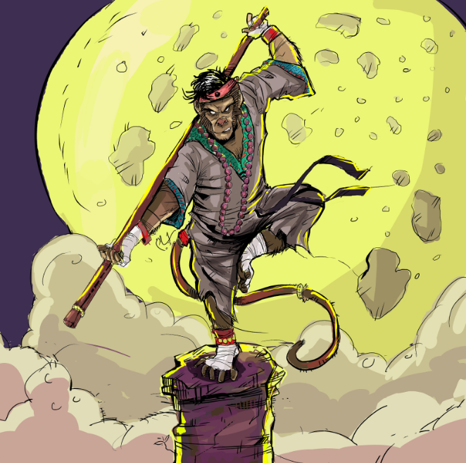
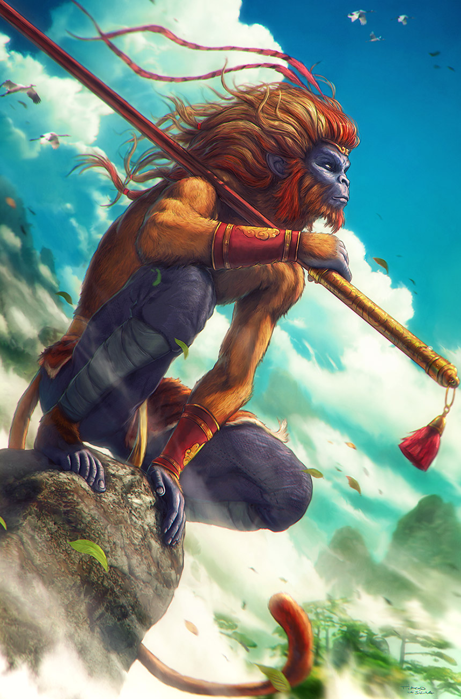

# Arinoth The Enlightened

## Attributes and Core Skills

| STR       | 0 |    | RFX             | 1 |    | INT               | -1 |    |
| --------- | :-: | :-: | --------------- | :-: | :-: | ----------------- | :-: | :-: |
| Athletics | 0 | 3d6 | Acrobatics      | 1 | 5d6 | Communication     | 0 | 2d6 |
| Climb     | 1 | 4d6 | Perception      | 1 | 5d6 | General Knowledge | 0 | 2d6 |
| Endurance | 0 | 3d6 | Sleight of Hand | 0 | 4d6 | Survival          | 0 | 2d6 |
| Lift      | 0 | 4d6 | Stealth         | 1 | 5d6 | Will              | 0 | 2d6 |

## Vocations and Vocational Skills

| Monk {RFX}         | 1 | 5d6 | Fellcaster {STR, RFX, INT} | 0  | 3d6 |
| ------------------- | :-: | :-: | -------------------------- | -- | --- |
| Large Hafted {ALL} | 1 | 4d6 | Sonocraft {STR, RFX, INT}  | -1 | 2d6 |

## Effects

|          Name          |                            Effect                            | Duration |                                                       Source                                                       |
| :---------------------: | :-----------------------------------------------------------: | :------: | :-----------------------------------------------------------------------------------------------------------------: |
|  Minor Silver Weakness  | (+1) to the level of injury received from Silver damage. |          |                                                    Fellkin blood                                                    |
| Physical Defense Level |                               1                               |          |                                                        Armor                                                        |
|       Medium Size       |                     5x5 ft on battle map.                     |          |                                                                                                                    |
|   Language: Babelish   |                      Can speak Babelish.                      |          |                                                                                                                    |
|    Language: Primal    |                       Can speak Primal.                       |          |                                                                                                                    |
|  Disabling: Dim-witted  |                            -1 INT                            |          |                                                                                                                    |
|    Inventory Weight    |                             14 lb                             |          |                                                      Equipment                                                      |
|  Humanoid Carry Weight  |                            120 lb                            |          | 120 lb (Base), +100 lb positive STR, -50 lb negative STR, + 40 lb positive Lift, - 20 lb negative Lift |
|      Light Weight      |                -0d6 to STR/RFX governed skills                |          |                                              0% - 25% of carry weight                                              |
| Humanoid Movement Speed |                             40 ft                             |          |                              30 ft (Base), +/-10 ft (per RFX), +/-5 ft (per Athletics)                              |
|   Humanoid Swim Speed   |                             15 ft                             |          |                              15 ft (Base), +/-5 ft (per STR), +/-5 ft (per Athletics)                              |
|  Humanoid Climb Speed  |                             20 ft                             |          |                                15 ft (Base), +/-5 ft (per STR), +/-5 ft (per Climb)                                |

## Combat Rolls

### Weapons

|        Name        |   One Handed   |   Two Handed   | Dual Wielded | Penetration | Range | Damage Types | Engageable Opponents | Area Of Effect | Resource Class |
| :-----------------: | :------------------: | :------------------: | :---------------: | :---------: | :---: | :---------------: | :-----------------------: | :-----------------: | :-----------------: |
| Small Hafted Blunt | 3d8, 1d6 (+0d6) |        (+0d6)        |      (+1d6)      |      2      | Melee |     Bludgeon     |           Rapid           |        None        |        None        |
| Medium Hafted Blunt | 3d8, 1d6 (+0d6) | 3d8, 2d6 (+1d6) |      (+1d6)      |      4      | Melee |     Bludgeon     |           Rapid           |        None        |        None        |
| Large Hafted Blunt |  3d8, 0d6 (-1)  | 3d8, 2d6 (+1d6) |       None       |      5      | Melee |     Bludgeon     |           Rapid           |        None        |        None        |
| Reach Hafted Blunt |  2d8, 0d6 (-2)  | 3d8, 3d6 (+2d6) |       None       |      5      | Reach |     Bludgeon     |           Rapid           |        None        |        None        |

| Name | Resource Class | Resource Dice | Penetration | Range | Damage Types | Area Of Effect |
| :--: | :-----------------: | :----------------: | :---------: | :---: | :---------------: | :-----------------: |
|      |                    |                    |            |      |                  |                    |

### Novice Spells

|                                              Name                                              | One Handed | Two Handed | Dual Wielded | Penetration | Range | Damage Types | Engageable Opponents | Area Of Effect | Resource Class |
| :--------------------------------------------------------------------------------------------: | :-------------: | :-------------: | :---------------: | :---------: | :----: | :---------------: | :-----------------------: | :-----------------: | :-----------------: |
| [Cantrip Smash/Thrust](./../../../../../CoreRules/MagicRules/Spells/Novice/GenericNoviceSpell.md) |      +0d6      |      +0d6      |       +1d6       |      2      | Melee |     Shockwave     |           Rapid           |        None        |  0 Magic Resource  |
|    [Cantrip Slash](./../../../../../CoreRules/MagicRules/Spells/Novice/GenericNoviceSpell.md)    |      +1d6      |      +1d6      |       +1d6       |      0      | Melee |     Shockwave     |           Rapid           |        None        |  0 Magic Resource  |
|    [Cantrip Throw](./../../../../../CoreRules/MagicRules/Spells/Novice/GenericNoviceSpell.md)    |      +1d6      |      +1d6      |       None       |      0      | Short |     Shockwave     |           Quick           |        None        |  0 Magic Resource  |
|     [Cantrip Dart](./../../../../../CoreRules/MagicRules/Spells/Novice/GenericNoviceSpell.md)     |      +0d6      |      +0d6      |       None       |      1      | Short |     Shockwave     |           Quick           |        None        |  0 Magic Resource  |
|    [Cantrip Sling](./../../../../../CoreRules/MagicRules/Spells/Novice/GenericNoviceSpell.md)    |      +1d6      |      +1d6      |       None       |      1      | Medium |     Shockwave     |         Standard         |        None        |  0 Magic Resource  |

## Destiny Points: 1/3

## Fellblood: 0/0

## Equipment:

| Name                          | # |                                      Class                                      | Effect            |   Tier   | Durability | LB | Value |
| ----------------------------- | :-: | :-----------------------------------------------------------------------------: | ----------------- | :-------: | :--------: | :-: | :---: |
| Leather Cuirass and Pauldrons | 1 |                                   Body Armor                                   | Phy. Def. 1.00    |  Quality  |   15/15   | 6 | 5 bc |
| Clothes, Traveler             | 1 |                                                                                |                   |  Mundane  |            | 4 | 5 bc |
| Monkey Staff                  | 1 | Small Hafted Blunt, Medium Hafted Blunt, Large Hafted Blunt, Reach Hafted Blunt | Extendable Weapon | Excellent |   21/21   | 4 |   ?   |

## Containers

| Name              | # |      Class      | Effect |  Tier  | Durability |  LB  | Value |
| ----------------- | :-: | :-------------: | ------ | :-----: | :--------: | :--: | :---: |
| Backpack (1 ft^3) | 1 | 30 lb container |        | Mundane |            |  5  | 2 bc |
| Bronze Coin       | 24 |                |        | Mundane |            | 0.02 | 1 bc |
| Copper Coin       | 83 |                |        | Mundane |            | 0.02 | 1 cc |

## Notes

- Ronald McTavish
- Professor of Rune Craft
- Byrgenwerth magic college
- other side of broken mountain range
- feral tundra --> monsters --> silver!

## Appearance

Age: 29

Race: Beastkin (Ape)

Height: 4' 8"

Weight: ~ 25 lb

Body Type: Chunky (monkey)

Hair Color: (brown)

Eyes Color: (brown)

Additional Details:

## Disposition

- Disobedience

## Beliefs/Morality

- I worship my ancestors.
- Ancestors live through me.
- I will be strong. Apeling strong together.

## Goals/Aspirations

- Find other apelings. Apeling strong together.

## Additional Art

## Backstory

Arinoth the Enlightened was born in a jungle village. When Arinoth was a young boy, he went out into the jungle to gather food for his community. When he returned, his village was gone. The people and the trees were burnt to the ground. Arinoth suspects a dragon attacked that day, but he can't say for sure. He will never have that certainty to comfort him.

After leaving his village to start a new life, Arinoth was adopted by monks who incited his desire to find his family and grow strong together again. From them, Arinoth has learned to calm his wild monkey mind and focus on his goals. Arinoth has left the monks to live a more independent life.

Later in his life he spent time meditating in the Iron Forest to the east of Reddwall. While swinging amongst the great canopy, a branch snapped causing him to fall into a mysterious cavern full of a mysterious sandy powder. Unbeknownst to Arinoth, this dust was a drug called Mirage, which can cause deep slumber and strange delusions.

As the monk wandered through the underground mirage network, the illusionary effects proved too overwhelming for his limited tolerance. Succumbing to the mesmerizing mirages, he fell into a deep slumber. Unbeknownst to him, Burrowbard, the molekin, discovered the sleeping figure and, with his keen sense of smell, partially blind eyes, and lapsing memory, mistook him for his long-lost chimpkin assistant, Arinoth.

For a while, the chimpkin monk, still under the influence of the lingering mirage, believed himself to be Arinoth. It was only when moments of clarity broke through the illusions that he realized his true identity. Faced with the moral dilemma of aiding an entrepreneur whose business spreads the dubious mirage, Arinoth grappled with conflicting emotions. On one hand, he was enraged by the unethical practices, but on the other, he felt a strange gratitude towards Burrowbard, who genuinely cared for his missing assistant.

Ultimately, Arinoth decided to guide the molekin entrepreneur towards a more virtuous path. Embracing his role as the newfound "Arinoth," the chimpkin monk used his unique perspective to influence Burrowbard's business decisions. Together, they embarked on a journey of transformation, seeking to balance the entrepreneur's ambitions with a sense of morality and enlightenment.
