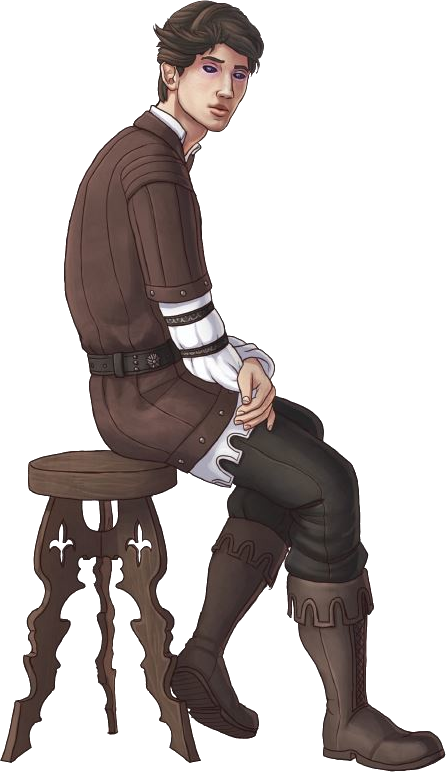

# Cornelius Pandrus

## Attributes and Core Skills

| STR       | -1 |    | RFX             | 0 |    | INT               | 1 |    |
| --------- | :-: | :-: | --------------- | :-: | :-: | ----------------- | :-: | :-: |
| Athletics | 0 | 2d6 | Acrobatics      | 0 | 3d6 | Communication     | 0 | 4d6 |
| Climb     | 0 | 2d6 | Perception      | 1 | 4d6 | General Knowledge | 1 | 5d6 |
| Endurance | 0 | 2d6 | Sleight of Hand | 0 | 3d6 | Survival          | 0 | 4d6 |
| Lift      | 0 | 2d6 | Stealth         | 0 | 3d6 | Will              | 1 | 5d6 |

## Vocations and Vocational Skills

| Runesmith {RFX, INT}           | 1 | 5d6 | Fellcaster {STR, RFX, INT} | 0  | 3d6 |
| ------------------------------ | :-: | :-: | -------------------------- | -- | --- |
| Rune of Fire {RFX, INT}       | 1 | 5d6 | Hemacraft {STR, RFX, INT}  | -1 | 2d6 |
| Rune of Earth {RFX, INT}       | 0 | 4d6 |                            |    |     |
| Rune of Air {RFX, INT}         | 0 | 4d6 |                            |    |     |
| Runesmith Knowledge {RFX, INT} |  | 5d6 |                            |    |     |

## Effects:

|          Name          |                         Effect                         | Duration |                                                       Source                                                       |
| :---------------------: | :----------------------------------------------------: | :------: | :-----------------------------------------------------------------------------------------------------------------: |
|  Minor Silver Weakness  | +1 to the level of injury received from Silver damage. |          |                                                    Fellkin blood                                                    |
| Physical Defense Level |                           0                           |          |                                                        Armor                                                        |
|       Medium Size       |                 5x5 ft on battle map.                 |          |                                                                                                                    |
|   Language: Babelish   |                  Can speak Babelish.                  |          |                                                                                                                    |
|    Language: Pirish    |                   Can speak Pirish.                   |          |                                                                                                                    |
|    Disabling: Feeble    |                         -1 STR                         |          |                                                                                                                    |
|    Equipment Weight    |                         11 lb                         |          |                                                      Equipment                                                      |
|  Humanoid Carry Weight  |                         70 lb                         |          | 120 lb (Base), +100 lb positive STR, -50 lb negative STR, + 40 lb positive Lift, - 20 lb negative Lift |
|      Light Weight      |            -0d6 to STR/RFX governed skills            |          |                                              0% - 25% of carry weight                                              |
| Humanoid Movement Speed |                         30 ft                         |          |                              30 ft (Base), +/-10 ft (per RFX), +/-5 ft (per Athletics)                              |
|   Humanoid Swim Speed   |                         10 ft                         |          |                              15 ft (Base), +/-5 ft (per STR), +/-5 ft (per Athletics)                              |
|  Humanoid Climb Speed  |                         10 ft                         |          |                                15 ft (Base), +/-5 ft (per STR), +/-5 ft (per Climb)                                |

## Combat Rolls:

### Innate

|  Name  | One Handed | Two Handed | Dual Wielded | Penetration | Range | Damage Types | Engageable Opponents | Area Of Effect | Resource Class |
| :-----: | :-------------: | :-------------: | :---------------: | :---------: | :---: | :---------------: | :-----------------------: | :-----------------: | :-----------------: |
| Unarmed |       -1d       |       -1d       |       None       |      0      | Melee |     Bludgeon     |           Rapid           |        None        |        None        |

### Weapons

| Name | One Handed | Two Handed | Dual Wielded | Penetration | Range | Damage Types | Engageable Opponents | Area Of Effect | Resource Class |
| :--: | :-------------: | :-------------: | :---------------: | :---------: | :---: | :---------------: | :-----------------------: | :-----------------: | :-----------------: |
|      |                |                |                  |            |      |                  |                          |                    |                    |

| Name | Resource Class | Resource Dice | Penetration | Range | Damage Types | Area Of Effect |
| :--: | :-----------------: | :----------------: | :---------: | :---: | :---------------: | :-----------------: |
|      |                    |                    |            |      |                  |                    |

### Combat Spells

|                                                    Name                                                    | One Handed | Two Handed | Dual Wielded | Penetration |    Range    |                                            Damage Types                                            | Engageable Opponents | Area Of Effect | Resource Class |
| :--------------------------------------------------------------------------------------------------------: | :-------------: | :-------------: | :---------------: | :---------: | :----------: | :-----------------------------------------------------------------------------------------------------: | :-----------------------: | :-----------------: | :------------------: |
|     [Generic Party Trick](./../../../../../CoreRules/MagicRules/Spells/PartyTricks/GenericPartyTrick.md)     |                |                |                  |            |     Near     | Fire Rune: Fire Earth Rune: Slash, Bludgeon, Hew, Pierce Air Rune: Slash, Bludgeon, Shockwave |                          |                    |   0 Magic Resource   |
|       [Generic Novice Spell](./../../../../../CoreRules/MagicRules/Spells/Novice/GenericNoviceSpell.md)       |                |                |                  |            |    Medium    |                                                                                                        |                          |                    |  0 Magic Resource  |
| [Generic Apprentice Spell](./../../../../../CoreRules/MagicRules/Spells/Apprentice/GenericApprenticeSpell.md) |                |                |                  |            |  Far - Long  |                                                                                                        |                          |                    | 1 - 2 Magic Resource |
|        [Generic Adept Spell](./../../../../../CoreRules/MagicRules/Spells/Adept/GenericAdeptSpell.md)        |                |                |                  |            | Sharpshooter |                                                                                                        |                          |                    | 3 - 4 Magic Resource |

## Destiny Points: 0/3

## Focus: 3/5

## Equipment:

| Name                | # |     Class     | Effect |  Tier  | Durability | LB | Value |
| ------------------- | :-: | :------------: | ------ | :-----: | :--------: | :-: | :---: |
| Clothes, Traveler's | 1 |                |        | Mundane |            |  4  | 2 bc |
| Pouch (1/5 ft^3)    | 1 | 6 lb container |        | Mundane |            |  1  | 50 cc |
| Cuneiform Tablets   | 30 | Magic Conduit |        | Mundane |            | 0.1 | 1 cc |
| Potter's Tools      | 1 |                |        | Mundane |            |  3  | 10 bc |

## Containers:

| Name                           |  #  |      Class      | Effect |  Tier  | Durability |  LB  | Value |
| ------------------------------ | :--: | :-------------: | ------ | :-----: | :--------: | :--: | :---: |
| Satchel (2/5 ft^3)             |  1  | 12 lb container |        | Mundane |            |  2  | 1 bc |
| Journal, Soft Bound, 25 Sheets |  1  |                |        | Mundane |            |  1  | 7 bc |
| Common Book, Hard Bound        |  1  |                |        | Mundane |            |  1  | 2 bc |
| Calligrapher's Supplies        |  1  |                |        | Mundane |            |  5  | 10 bc |
| Copper Coin                    |  0  |                |        | Mundane |            | 0.02 | 1 cc |
| Bronze Coin                    | 54.5 |                |        | Mundane |            | 0.02 | 3 bc |

## Appearance

Age: 4064

Race: Dhampir

Height: 5'10" (178cm)

Weight: 110lbs (50kg)

Body Type: "Academic"

Hair Color: Black

Eyes Color: Dark Red eyes

Additional Details:

Cornelius has the tell tail signs of his dhampir bloodline, pointed ears (that he hides with his long hair), near black, dark red eyes, and fangs.  Cornelius tends to downplay his true nature to better mix with the mudbloods.

## Disposition

Cornelius is a product of his decades of academic life.  He sees the world (and those that inhabit it) as variables, data points, and problems that must be studied, understood, and ultimately solved.

Religious characters find him blasphemous for his view on morality.

Social characters find him cold and calculating, or introverted.

Academic characters find him intelligent, but a bit of a know it all.

## Beliefs/Morality:

There is nothing more important to Cornelius than knowledge.  Nothing frustrates him more than having hidden knowledge, and nothing elates him more than solving something that no one else has discovered.

Cornelius views morality as more of a guideline to fit into society rather than a hard core rules that will keep your soul safe from eternal damnation.  As a result, Cornelius will break social taboos if he knows there won't be serious repercussions from it.

## Goals/Aspirations

Cornelius has read all the books and scrolls on runecraft within the colleges of Byrgenwerth and feels he has reached the end of academic knowledge.  He has two goals now:

1. Put his academic knowledge to test and either confirm or deny it's validity
2. Discover new knowledge through investigation or experimentation.

With both these goals, Cornelius plans to write a new book that he hopes will immortalize himself in the academic circles, and advance the theory of runecraft to new heights.

## Backstory

Born to a minor noble family of dhampir, Cornelius entered the colleges at a young age.  His curious nature was well aligned with academic life, and he quickly made a name for himself in the field of runecraft.

After a thousand years of research in the Byrgenwerth colleges, Cornelius has pulled every ounce of knowledge possible from the dusty tomes (even creating updated manuscripts).  Now Cornelius feels a sense of longing and regret that there is nothing more to learn.

One day while in the market, Cornelius came across a strange new rune.  Cornelius studied the rune for over a year before determining the rune was a fake, however, Cornelius had caught the bug. He sold off his major belongings, and is now setting off into the world, hoping to find new knowledge.  That last year filled the gap in his life, and he would never let the thirst for knowledge leave.

Cornelius was approached by an old family friend named Burrowbard Stoneseeker, an elderly molekin business man in the Ironwood trade. Burrowbard was looking to bring someone on to a new business venture who had talents in Runecraft. Cornelius leapt at the opportunity, excited to see the world, hit the open road, and acquire more knowledge.
