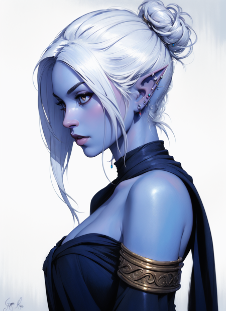

# Elinor Shortwick

## Attributes and Core Skills

| STR       |   0   |       | RFX             |   0   |       | INT               |   1   |       |
| --------- | :---: | :---: | --------------- | :---: | :---: | ----------------- | :---: | :---: |
| Athletics |   0   |  3d6  | Acrobatics      |   0   |  3d6  | Communication     |   0   |  4d6  |
| Climb     |   0   |  3d6  | Perception      |   0   |  3d6  | General Knowledge |   2   |  6d6  |
| Endurance |   1   |  4d6  | Sleight of Hand |   0   |  3d6  | Survival          |   2   |  6d6  |
| Lift      |   0   |  3d6  | Stealth         |   1   |  4d6  | Will         |   0   |  4d6  |

## Vocations and Vocational Skills

| Detective {INT}    |   1   |  5d6  | Fellcaster {ALL} | 2   | 6d6 |
| ------------------ | :---: | :---: | ------------- | --- | --- |
| Medium Sword {ALL} |   0   |  4d6  | Polycraft     | 2   | 6d6 |

## Effects:

|              Name               |                                 Effect                                 | Duration |                        Source                         |
| :-----------------------------: | :--------------------------------------------------------------------: | :------: | :---------------------------------------------------: |
|      Minor Silver Weakness      |        (+1) to the level of injury received from Silver damage.        |          |                     Fellkin blood                     |
|     Physical Defense Level      |                                   5                                    |          |                         Armor                         |
|           Medium Size           |                         5x5 ft on battle map.                          |          |                                                       |
|       Language: Babelish        |                          Can speak Babelish.                           |          |                                                       |
|      Language: Deep-speak       |                         Can speak Deep-speak.                          |          |                                                       |
| Disabling: Incontrollable Grief |     Overwhelming grief that is triggered reminder of past trauma.      |          |                                                       |
|       Disabling: Delusion       | Has delusions of her parents that she talks to when no one is looking. |          |                                                       |
|      Disabling: Obsession       |                  Obsessed with avenging her parents.                   |          |                                                       |
|        Inventory Weight         |                                  0 lb                                  |          |                       Equipment                       |
|      Humanoid Carry Weight      |                                 120 lb                                 |          |  120 lb (Base), +100 lb positive STR, -50 lb negative STR, + 40 lb positive Lift, - 20 lb negative Lift  |
|          Light Weight           |                    -0d6 to STR/RFX governed skills                     |          |               0% - 25% of carry weight                |
|     Humanoid Movement Speed     |                                 30 ft                                  |          | 30 ft (Base), +10 ft (per RFX), +5 ft (per Athletics) |
|       Humanoid Swim Speed       |                                 15 ft                                  |          | 15 ft (Base), +5 ft (per STR), +5 ft (per Athletics)  |
|      Humanoid Climb Speed       |                                 15 ft                                  |          |   15 ft (Base), +5 ft (per STR), +5 ft (per Climb)    |

## Combat Rolls:

|           Name           | One Handed | Two Handed | Dual Wielded | Penetration |  Range   |      Damage Types       | Engageable Opponents | Area Of Effect | Resource Class |
| :----------------------: | :-------------: | :-------------: | :---------------: | :---------: | :------: | :--------------------------: | :-----------------------: | :-----------------: | :-----------------: |
| Polycraft - Melee Trick  |       6d6       |                 |                   |      0      |  Melee   | Slash, Bludgeon, Hew, Pierce |           Rapid           |                     |                     |
| Polycraft - Ranged Trick |       6d6       |                 |                   |      0      | Extended | Slash, Bludgeon, Hew, Pierce |         Standard          |                     |                     |
|    Polycraft - Melee     |       7d6       |                 |                   |      2      |  Melee   | Slash, Bludgeon, Hew, Pierce |           Rapid           |                     |      1 (Fellblood)      |
|    Polycraft - Ranged    |       7d6       |                 |                   |      1      | Extended | Slash, Bludgeon, Hew, Pierce |         Standard          |                     |      1 (Fellblood)      |
|     Polycraft - Cone     |       7d6       |                 |                   |      2      | Extended | Slash, Bludgeon, Hew, Pierce |          Focused          |        Cone         |      1 (Fellblood)      |
|    Polycraft - Reach     |       7d6       |                 |                   |      2      |  Reach   | Slash, Bludgeon, Hew, Pierce |           Rapid           |                     |      1 (Fellblood)      |
|   Polycraft - Focused    |       7d6       |                 |                   |      2      | Extended | Slash, Bludgeon, Hew, Pierce |          Focused          |                     |      1 (Fellblood)      |
|    Polycraft - Sphere    |       8d6       |                 |                   |      3      | Extended | Slash, Bludgeon, Hew, Pierce |          Focused          |       Sphere        |      2 (Fellblood)      |
|  Medium Thrusting Sword  | 5d6 (+1d6) | 6d6 (+2d6) |       None        |      2      |  Melee   |            Pierce            |           Rapid           |        None         |        None         |
|  Medium Slashing Sword   | 7d6 (+2d6) | 8d6 (+3d6) |       None        |      0      |  Melee   |            Slash             |           Rapid           |        None         |        None         |

## Destiny Points: 3/3

## Fellblood: 7/7

## Equipment:

| Name                         |   #   |         Class         |  Tier   | Durability |  LB   | Value  |
| ---------------------------- | :---: | :-------------------: | :-----: | :--------: | :---: | :----: |
| Gambeson Coat                |   1   |      Phy. Def. 1      | Mundane |   12/12    |   5   |  2 bc  |
| Gambeson Leggings            |   1   |     Phy. Def. 0.5     | Mundane |   12/12    |   3   |  1 bc  |
| Leather Cuirass and Pauldron |   1   |     Phy. Def. 0.5     | Mundane |   12/12    |   4   |  3 bc  |
| Leather Cuisses and Greaves  |   1   |     Phy. Def. 0.5     | Mundane |   12/12    |   3   |  2 bc  |
| Leather Vambrace             |   1   |     Phy. Def. 0.5     | Mundane |   12/12    |   2   | 1.5 bc |
| Scimitar                     |   1   | Medium Slashing Sword | Mundane |   12/12    |   2   | 25 bc  |
| Heater Shield                |   1   |      Phy. Def. 2      | Mundane |   12/12    |   8   |  7 bc  |

## Containers:

### Container Name

| Name |   #   | Class | Tier  | Durability |  LB   | Value |
| ---- | :---: | :---: | :---: | :--------: | :---: | :---: |
|      |       |       |       |            |       |       |

## Appearance:

Age: 20

Race: Seakin

Height: 5' 6"

Weight: 130 lb

Body Type: Good shape

Hair: White

Skin: Blueish

Eyes: Green eyes

Additional Details:

## Disposition:

## Beliefs/Morality:

- Will kill anyone except the weak such as women and children.
- doesn't follow any religions or deity.
- Morals aren't fully realized.
- Just consumed with anger, rage, and vengeance.

## Goals/Aspirations:

- Kill the Black Spider

## Notes:

## Backstory:

Elinor Shortwick had a pleasant childhood. She grew up as a member of the Shortwick family, an old and prestigious line of Sirens.

Her parents were kind and loving, but often didn't agree with their daughters choices on how to spend her time. They would have preferred to be in court, networking and learning to pedal in political influence as they did.

But Elinor choose her own path. She was quick to anger and cared little for the empty words of court, spending most of her time running rooftops, sneaking into places she wasn't suppose to, and pranking the guard of her families mansion. While Elinor and her parents didn't agree on most things, they did agree she need to know how to defend herself, providing the best fencing and marksmanship instructors money could buy.

Life went went on this way until her 18 birthday. The celebration was massive, and anyone who was someone had come to attend. Her father had arrived late to her birthday celebration, seeming distraught. But Elinor was to busy watching the preforming monks, as they preformed their martial arts in fantastic displays. Dressed in her beautiful gown, many suitors vied for her affection. While it wasn't her usual cup of tea, she rather enjoyed her party, falling asleep with a faint smile across her face.

She awoke coughing and heaving. Smoke filled her room and fire licked the outside of her window. She flung open her door, and the horror of her burning ancestral home  froze her for a second. Mother, Father, she shook herself out of her fear and ran to her parents bedroom. But it was to late, their bedroom a smoldering inferno, their limp body motionless, burning.

It was becoming increasingly hard to breath. She said goodbye to her parents and leapt through a window, falling to the ground below. She hit the ground hard, knocking the wind from her. She saw the monks who had preformed at her show running and climbing over the walls of the mansion. The last one over the wall was holding a torch, his face hard as he meet Elinor's eyes. Elinor screamed vengeance upon him before loss consciousness.

After the traumatic event, Elinor was taken by a family friend of the Shortwick's named Burrowbard Stoneseeker. Though he tried to comfort Elinor, he realized that until she brought the people to justice responsible for her parents death. He supported her financially and acted as a father figure to her.

She spent the next year and the remainder of her families fortune tracking down these monk hitman. She learned they were called the Zen Hu, and she tracked them down as dawn broke across the sky exactly one year after the fire. But she arrived to late, someone had already wrought carnage on the Zen Hu, the bodies of men, women, and children littering the ground, all decapitated. She found the head of the monk she had seen that night, and wept as she had been denied her vengeance. While at the Zen Hu hideout, Elinor recovered the contract for her and her parents assassination. Signed with only an alias called "The Black Spider", Elinor was at a dead end.

She found the last survivor, an elf named Jing Hu, leaning from a tree stump, his belly open. He spoke of how he was cursed, and that all the family he had ever known lay dead. In the memory of her loving and kind parents, Elinor showed pity and mercy to Jing Su. She stabilized him from the brink of death ans spent the next couple weeks nursing him back to health.

For this act of kindness, Jing Su swore a life oath to Elinor, swearing to protect her from any foe, no matter the danger. They now travel together, searching for who had payed the Zen Hu to attack her family in the first place.

Elinor spent the next couple years following the thread of "The Black Spider" lead assisted by her , though it lead nowhere. Eventually concerned for her, Burrowbard pleaded her to take a break and assist him with a business venture he was starting up. Elinor reluctantly agreed, though secretly she planned to continue her search regardless...
