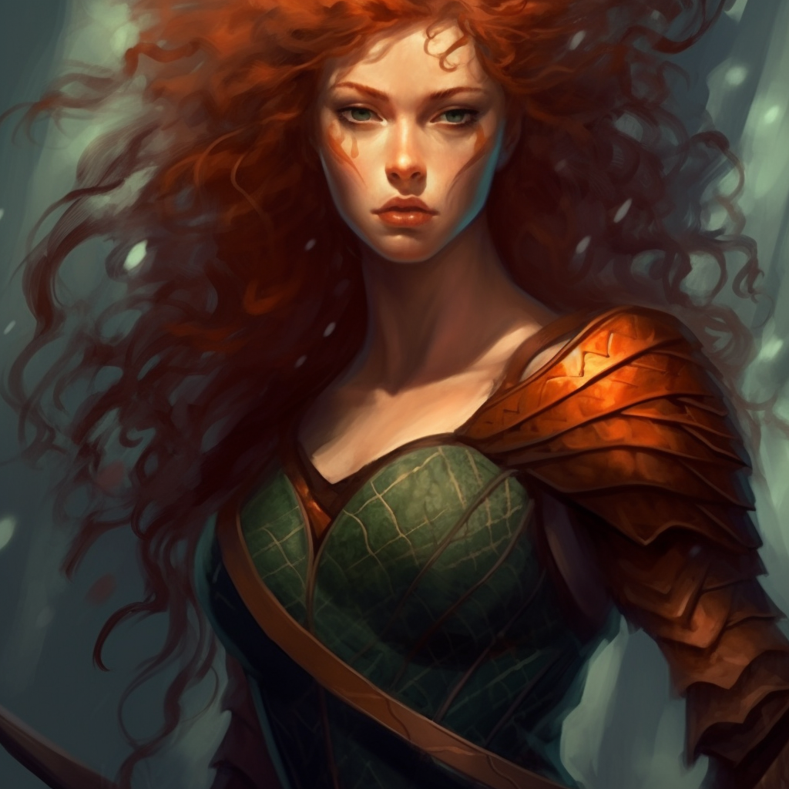

# Elowyn Lovelace

## [Attributes](./../../../../../CoreRules/GeneralRules/Attributes.md) and [Core Skills](./../../../../../CoreRules/GeneralRules/CoreSkills.md)

| [STR](./../../../../../CoreRules/GeneralRules/Attributes.md#strength-str)    | 1 |    | [RFX](./../../../../../CoreRules/GeneralRules/Attributes.md#reflex-rfx)                  | 0 |    | [INT](./../../../../../CoreRules/GeneralRules/Attributes.md#intelligence-int)                | 0 |    |
| ------------------------------------------------------------------------- | :-: | :-: | ------------------------------------------------------------------------------------- | :-: | :-: | ----------------------------------------------------------------------------------------- | :-: | :-: |
| [Athletics](./../../../../../CoreRules/GeneralRules/CoreSkills.md#athletics) | 1 | 5d6 | [Acrobatics](./../../../../../CoreRules/GeneralRules/CoreSkills.md#acrobatics)           | 0 | 3d6 | [Communication](./../../../../../CoreRules/GeneralRules/CoreSkills.md#communication)         | 0 | 3d6 |
| [Climb](./../../../../../CoreRules/GeneralRules/CoreSkills.md#climb)         | 0 | 4d6 | [Perception](./../../../../../CoreRules/GeneralRules/CoreSkills.md#perception)           | 1 | 4d6 | [General Knowledge](./../../../../../CoreRules/GeneralRules/CoreSkills.md#general-knowledge) | 0 | 3d6 |
| [Endurance](./../../../../../CoreRules/GeneralRules/CoreSkills.md#endurance) | 0 | 4d6 | [Sleight of Hand](./../../../../../CoreRules/GeneralRules/CoreSkills.md#sleight-of-hand) | 0 | 3d6 | [Survival](./../../../../../CoreRules/GeneralRules/CoreSkills.md#survival)                   | 0 | 3d6 |
| [Lift](./../../../../../CoreRules/GeneralRules/CoreSkills.md#lift)           | 0 | 4d6 | [Stealth](./../../../../../CoreRules/GeneralRules/CoreSkills.md#stealth)                 | 1 | 4d6 | [Will](./../../../../../CoreRules/GeneralRules/CoreSkills.md#will)                           | 0 | 3d6 |

## [Vocations](./../../../../../CoreRules/GeneralRules/Vocations.md) and [Vocation Skills](./../../../../../CoreRules/GeneralRules/Vocations.md#vocation-skills)

| Fellcaster Ranger | STR, RFX, INT | 1 | 5d6 |
| ----------------- | :-----------: | :-: | :-: |
| Heavy Bow         | STR, RFX, INT | 1 | 5d6 |
| Medium Sword      | STR, RFX, INT | 0 | 4d6 |
| Hemacraft         | STR, RFX, INT | -1 | 3d6 |
| Polycraft         | STR, RFX, INT | -1 | 3d6 |
| Mindcraft         | STR, RFX, INT | -1 | 3d6 |

## Info

|                                                            Name                                                            |                                  Info                                  | Duration |                      Source                      |
| :------------------------------------------------------------------------------------------------------------------------: | :--------------------------------------------------------------------: | :------: | :----------------------------------------------: |
|                           [Level](./../../../../../CoreRules/CharacterCreationRules/TiersOfPlay.md)                           |                                   1                                   |          |                                                  |
|                                    [Language](./../../../Languages/Languages.md): Babelish                                    |                          Can speak Babelish.                          |          |                                                  |
|                                        [Language](./../../../Languages/Languages.md):                                        |                           Can speak Pirish.                           |          |                                                  |
| [Disabling Characteristic](./../../../../../CoreRules/CharacterCreationRules/DisablingCharacteristics.md): Extremem Prejudice | Overwhelming hatred/disgust of Brightkin and Dawn Empire members. |          |                                                  |
|                                                                                                                            |                                                                        |          |                                                  |
|                     [Equipment Weight](./../../../../../CoreRules/AdvancedRules/CarryWeight.md#equipment)                     |                                 32 lb                                 |          |                    Equipment                    |
|                     [Carry Weight](./../../../../../CoreRules/AdvancedRules/CarryWeight.md#carry-weight)                     |                                 200 lb                                 |          |        +50 lbs Carry Weight per Lift dice        |
|                    [Light Weight](./../../../../../CoreRules/AdvancedRules/CarryWeight.md#weight-classes)                    |                  -0d6 to STR/RFX governed Dice Pools                  |          |  0% =< Equipment Weight <= 25% of Carry Weight  |
|                                                                                                                            |                                                                        |          |                                                  |
|                   [Minor Silver Weakness](./../../../../../CoreRules/CombatRules/WeaknessAndResistance.md)                   |         +1 to the level of injury received from Silver damage.         |          |                    Fellblood                    |
|          [Physical Defense Level](./../../../../../CoreRules/CombatRules/DefenseAndPenetration.md#physical-defense)          |                                   3                                   |          |                      Armor                      |
|                                                                                                                            |                                                                        |          |                                                  |
|                            [Medium Size](./../../../../../CoreRules/CombatRules/BattleMap.md#size)                            |                         5x5 ft on battle map.                         |          |                                                  |
|                [Terrestrial Combat Speed](./../../../../../CoreRules/CombatRules/CombatSpeed.md#combat-speeds)                |                                 50 ft                                 |          | +10 ft (per Athletics Dice), +/-10 ft (per RFX) |
|                   [Swim Combat Speed](./../../../../../CoreRules/CombatRules/CombatSpeed.md#combat-speeds)                   |                                 25 ft                                 |          |  +5 ft (per Athletics Dice), +/-5 ft (per RFX)  |
|                   [Climb Combat Speed](./../../../../../CoreRules/CombatRules/CombatSpeed.md#combat-speeds)                   |                                 20 ft                                 |          |    +5 ft (per Climb Dice), +/-5 ft (per RFX)    |
|                                                                                                                            |                                                                        |          |                                                  |
|                           [Magic Resource](./../../../../../CoreRules/MagicRules/MagicResource.md):                           |                                  5/5                                  |          |       Vocation/Magic Governing Skill Level       |
|                          [Destiny Points](./../../../../../CoreRules/GeneralRules/DestinyPoints.md)                          |                                  0/3                                  |          |               Awarded by Narrator               |
|                               [Injury](./../../../../../CoreRules/CombatRules/Injury.md): None                               |                     – 0 dice to all dice checks.                     |          |                      Damage                      |

## [Combat Rolls](./../../../../../CoreRules/CombatRules/CombatRolls.md)

- [Victory Levels link](./../../../../../CoreRules/CombatRules/VictoryLevels.md)

### [Weapons](./../../../../../CoreRules/CombatRules/WeaponClasses.md)

|         Name         | [One Handed](./../../../../../CoreRules/CombatRules/WeaponClasses.md#one-handed) | [Two Handed](./../../../../../CoreRules/CombatRules/WeaponClasses.md#two-handed) | [Dual Wielded](./../../../../../CoreRules/CombatRules/WeaponClasses.md#dual-wielded) | [Penetration](./../../../../../CoreRules/CombatRules/DefenseAndPenetration.md#penetration) | [Range](./../../../../../CoreRules/CombatRules/Range.md) | [Damage Types](./../../../../../CoreRules/CombatRules/DamageTypes.md) | [Engageable Opponents](./../../../../../CoreRules/CombatRules/EngageableOpponents.md) | [Area Of Effect](./../../../../../CoreRules/CombatRules/AreaOfEffect.md) | [Weapon Resource](./../../../../../CoreRules/CombatRules/WeaponClasses.md#weapon-resources) |
| :-------------------: | :--------------------------------------------------------------------------------: | :--------------------------------------------------------------------------------: | :------------------------------------------------------------------------------------: | :-------------------------------------------------------------------------------------: | :---------------------------------------------------: | :---------------------------------------------------------------------: | :-------------------------------------------------------------------------------------: | :------------------------------------------------------------------------: | :-------------------------------------------------------------------------------------------: |
|        Unarmed        |                                         -1                                         |                                         -1                                         |                                          None                                          |                                            0                                            |                         Melee                         |                                Bludgeon                                |                                          Rapid                                          |                                    None                                    |                                             None                                             |
|       Heavy Bow       |                                        None                                        |                                        +2d6                                        |                                          None                                          |                                            2                                            |              Sharpshooter (150/600)              |                                                                        |                                        Standard                                        |                                    None                                    |                                             Arrow                                             |
| Large Thrusting Sword |                                        +0d6                                        |                                        +2d6                                        |                                          None                                          |                                            3                                            |                         Melee                         |                                 Pierce                                 |                                          Rapid                                          |                                    None                                    |                                             None                                             |
| Large Slashing Sword |                                        +0d6                                        |                                        +3d6                                        |                                          None                                          |                                            2                                            |                         Melee                         |                                  Slash                                  |                                          Rapid                                          |                                    None                                    |                                             None                                             |

#### [Weapon Resources](./../../../../../CoreRules/CombatRules/WeaponClasses.md#ranged-weapon-resources)

|       Name       | [One Handed](./../../../../../CoreRules/CombatRules/WeaponClasses.md#one-handed) | [Two Handed](./../../../../../CoreRules/CombatRules/WeaponClasses.md#two-handed) | [Dual Wielded](./../../../../../CoreRules/CombatRules/WeaponClasses.md#dual-wielded) | [Penetration](./../../../../../CoreRules/CombatRules/DefenseAndPenetration.md#penetration) | [Range](./../../../../../CoreRules/CombatRules/Range.md) | [Damage Types](./../../../../../CoreRules/CombatRules/DamageTypes.md) | [Engageable Opponents](./../../../../../CoreRules/CombatRules/EngageableOpponents.md) | [Area Of Effect](./../../../../../CoreRules/CombatRules/AreaOfEffect.md) | [Weapon Resource](./../../../../../CoreRules/CombatRules/WeaponClasses.md#weapon-resources) |
| :--------------: | :--------------------------------------------------------------------------------: | :--------------------------------------------------------------------------------: | :------------------------------------------------------------------------------------: | :-------------------------------------------------------------------------------------: | :---------------------------------------------------: | :---------------------------------------------------------------------: | :-------------------------------------------------------------------------------------: | :------------------------------------------------------------------------: | :-------------------------------------------------------------------------------------------: |
|  Standard Arrow  |                                       Arrow                                       |                                        +1d6                                        |                                           1                                           |                                          None                                          |                        Pierce                        |                                  None                                  |                                                                                        |                                                                            |                                                                                              |
|  Wounding Arrow  |                                       Arrow                                       |                                        +1d6                                        |                                           1                                           |                                          None                                          |                     Pierce, Bleed                     |                                  None                                  |                                                                                        |                                                                            |                                                                                              |
| Anti-armor Arrow |                                       Arrow                                       |                                        +1d6                                        |                                           2                                           |                                          None                                          |                        Pierce                        |                                  None                                  |                                                                                        |                                                                            |                                                                                              |

### [Party Trick Combat Magic](./../../../../../CoreRules/MagicRules/GenericMagic.md#party-trick-combat-magic)

|     Name     | [One Handed](./../../../../../CoreRules/CombatRules/WeaponClasses.md#one-handed) | [Two Handed](./../../../../../CoreRules/CombatRules/WeaponClasses.md#two-handed) | [Dual Wielded](./../../../../../CoreRules/CombatRules/WeaponClasses.md#dual-wielded) | [Penetration](./../../../../../CoreRules/CombatRules/DefenseAndPenetration.md#penetration) | [Range](./../../../../../CoreRules/CombatRules/Range.md) | [Damage Types](./../../../../../CoreRules/CombatRules/DamageTypes.md) | [Engageable Opponents](./../../../../../CoreRules/CombatRules/EngageableOpponents.md) | [Area Of Effect](./../../../../../CoreRules/CombatRules/AreaOfEffect.md) | [Magic Resource](./../../../../../CoreRules/MagicRules/MagicResource.md) |
| :----------: | :--------------------------------------------------------------------------------: | :--------------------------------------------------------------------------------: | :------------------------------------------------------------------------------------: | :-------------------------------------------------------------------------------------: | :---------------------------------------------------: | :---------------------------------------------------------------------: | :-------------------------------------------------------------------------------------: | :------------------------------------------------------------------------: | :------------------------------------------------------------------------: |
| Mag. Unarmed |                                         -1                                         |                                         -1                                         |                                          None                                          |                                            0                                            |                         Melee                         |                                                                        |                                          Rapid                                          |                                    None                                    |                                     0                                     |
|              |                                                                                    |                                                                                    |                                                                                        |                                                                                        |                                                      |                                                                        |                                                                                        |                                                                            |                                                                            |
|  Mag. Puff  |                                         -1                                         |                                         -1                                         |                                          None                                          |                                            0                                            |                         Near                         |                                                                        |                                        Standard                                        |                                    None                                    |                                     0                                     |

## [Equipment](./../../../../../CoreRules/AdvancedRules/CarryWeight.md#equipment)

| Name                   | # | [Class](./../../../../../CoreRules/AdvancedRules/ItemClass.md) | [Effect](./../../../../../CoreRules/AdvancedRules/ItemEffects.md) | [Tier](./../../../../../CoreRules/AdvancedRules/ItemTier.md) | [Durability](./../../../../../CoreRules/AdvancedRules/ItemDurability.md) | [LB](./../../../../../CoreRules/AdvancedRules/CarryWeight.md) | [Value](./../../../Items/ItemShop.md#currency) |
| ---------------------- | :-: | :---------------------------------------------------------: | -------------------------------------------------------------- | :-------------------------------------------------------: | :-------------------------------------------------------------------: | :--------------------------------------------------------: | :-----------------------------------------: |
| Gambeson Armor         | 1 |              Body Armor, Arm Armor, Leg Armor              | Phy. Def. 1.00                                                 |                          Mundane                          |                                 12/12                                 |                             8                             |                    5 bc                    |
| Leather Armor          | 1 |        Head Armor, Body Armor, Arm Armor, Leg Armor        | Phy. Def. 2                                                    |                          Quality                          |                                 15/15                                 |                             12                             |                    10 bc                    |
| Longsword              | 1 |         Large Thrusting Sword, Large Slashing Sword         |                                                                |                          Mundane                          |                                 12/12                                 |                             3                             |                    15 bc                    |
| Longbow                | 1 |                          Heavy Bow                          |                                                                |                          Mundane                          |                                 12/12                                 |                             4                             |                    50 bc                    |
| Quiver (capacity: 20)  | 3 |                                                            |                                                                |                          Mundane                          |                                                                      |                             1                             |                    1 bc                    |
| Broadhead Arrow        | 20 |                       Standard Arrow                       |                                                                |                          Mundane                          |                                                                      |                            0.05                            |                    5 cc                    |
| Barbed Broadhead Arrow | 20 |                       Wounding Arrow                       |                                                                |                          Mundane                          |                                                                      |                            0.05                            |                    7 cc                    |
| Bodkin Arrow           | 20 |                      Anti-armor Arrow                      |                                                                |                          Mundane                          |                                                                      |                            0.05                            |                    10 cc                    |

## [Containers](./../../../../../CoreRules/AdvancedRules/Containers.md)

| Name | # | [Class](./../../../../../CoreRules/AdvancedRules/ItemClass.md) | [Effect](./../../../../../CoreRules/AdvancedRules/ItemEffects.md) | [Tier](./../../../../../CoreRules/AdvancedRules/ItemTier.md) | [Durability](./../../../../../CoreRules/AdvancedRules/ItemDurability.md) | [LB](./../../../../../CoreRules/AdvancedRules/CarryWeight.md) | [Value](./../../../Items/ItemShop.md#currency) |
| ---- | :-: | :---------------------------------------------------------: | -------------------------------------------------------------- | :-------------------------------------------------------: | :-------------------------------------------------------------------: | :--------------------------------------------------------: | :-----------------------------------------: |
|      |  |                                                            |                                                                |                                                          |                                                                      |                                                            |                                            |

## Notes

## Appearance

Age: 18

Race: Dhampir

Height: 5' 6"

Weight: ~ 140 lb

Body Type: Slender

Hair Color: Red

Eye Color: Green

Additional Details:

## Disposition

- Independent
- Athletic
- Beautiful
- Courageous
- Dangerous
- Loyal to sister

## Beliefs/Morality

## Goals/Aspirations

- To save Livi from the cult so that she can live a normal life.

## Backstory

Elowyn was born to Velena Reddington and Velstadt Lovelace. Her mother was the sister of Veronica Reddington, current ruler of Reddland. In Elowyn's early years, she spent many months playing in the gardens of Castle Tearstone in Reddwall with her cousin Vex'ahlia, Killroy, and her younger sister Livi. Flint (Vex’s father) instilled the love of archery into her and her sister. Elowyn spent hours everyday practicing her archery, becoming a child prodigy. However, when her father returned to Reddwall, Elowyn’s mother and father decided to leave the safety and warmth of Castle Tearstone to pursue darker ambitions.

Elowyn and her sister were indoctrinated into the insidious Worshipers of Amon, or Cult of Amon as it is more widely known. There she was taught that the grand myth of The Awakening was a lie. That the Bright Lord and his Brightkin descendants weren’t holy saviors, but oppressors. By extension, the Dawn Empire that they had built on the backs of Fellkin was to be regarded as an evil and corrupting force on Terra, and thus must be overthrown. The Worshipers of Amon, believe that it was Amon, the Faithful One, the Great Betrayer, that protected Fellkind. They believe the reason he turned on the Bright Lord was for Fellkind's protection.

Elowyn and her sister were radicalized by their parents. When the Worshipers of Amon began planning their attack on the festival of sacrifice, Elowyn and her sister participated actively with the encouragement of their parents. But when the attack commenced, Elowyn witnessed the death of her friend Finnan, her loving aunt Veronica Reddington, her cousin Vex'halia, and countless innocent lives. Elowyn had fought and killed Inquisitors sent after her group and family in self-defense, but never the slaughter of innocents. In that moment she made a decision that would influence the rest of her life, as she started firing arrows into her fellow cult members, trying to stop the carnage and slaughter of innocent life.

After the attack, Elowyn fled into hiding, an enemy of both the Cult and Empire. When the heat died down, Elowyn searched for her sister, praying that she had not died in the attack. But she found no trace. Assuming that the other Cult members had fled back to their headquarters near Tentcity in Southern Reddland, she began her quest back south, all alone.

After returning to Tentcity, she lent out her skills as a hired protection for coin, which she plans to use to escape with her sister when she finds her.

Velena: Vain, loyal to the cult and her husband. Cares more about the cult than her children.

Velstadt: Cold, brutal, high ranking member in the cult.
