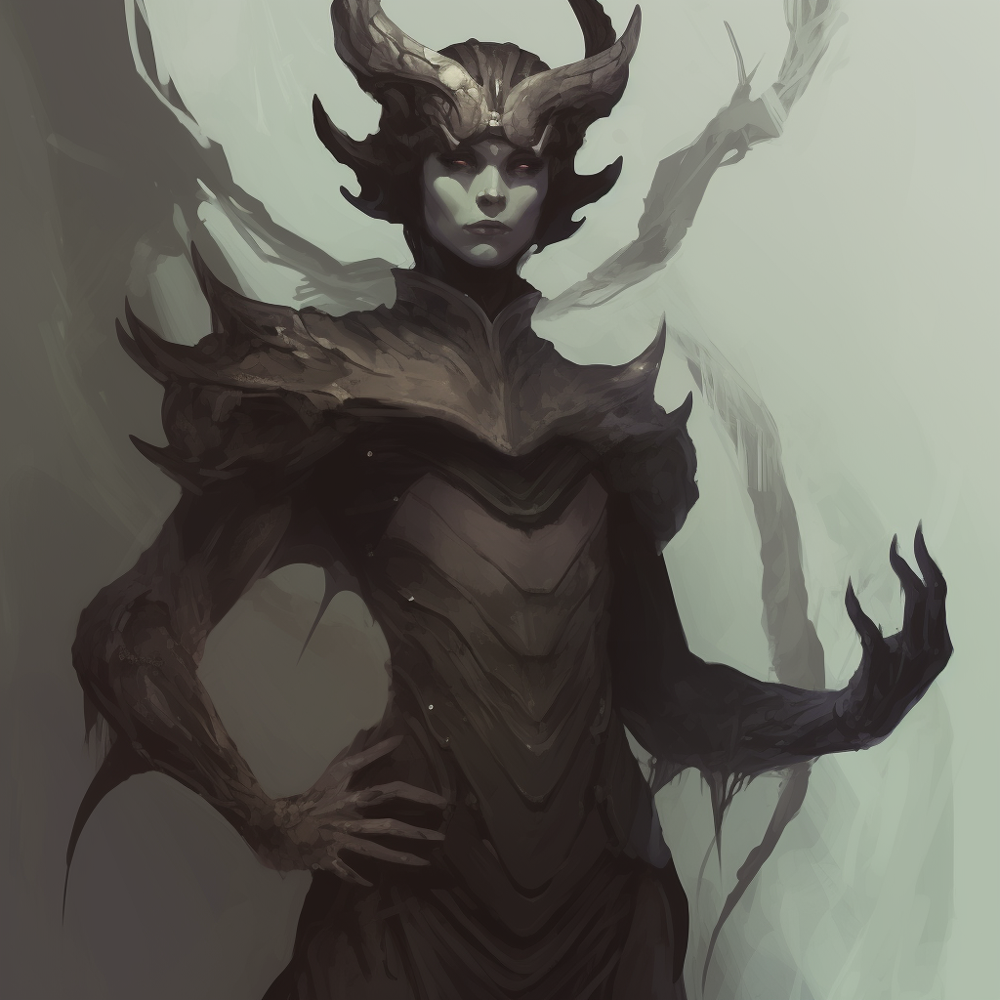
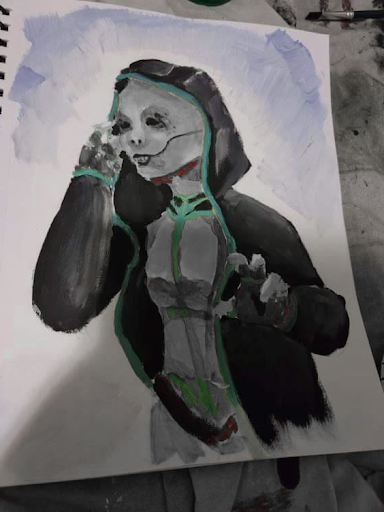
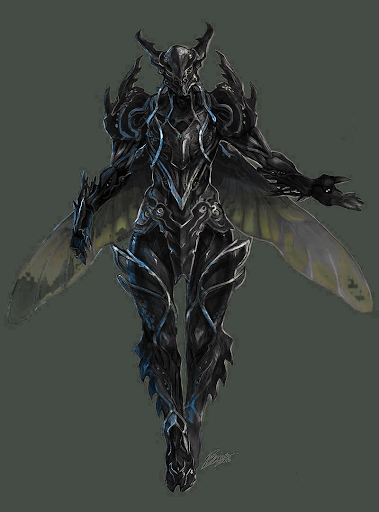
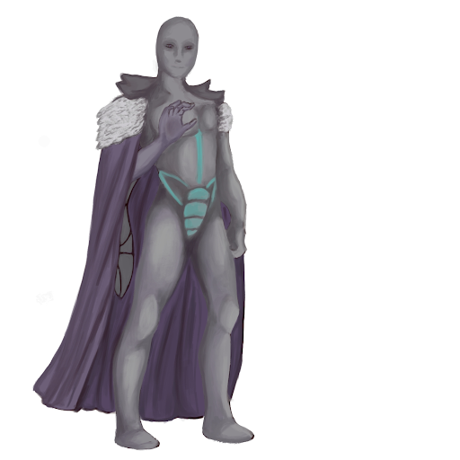

# Fanácrio

## Attributes and Core Skills

| STR       |   0   |       | RFX             |   0   |       | INT               |   2   |       |
| --------- | :---: | :---: | --------------- | :---: | :---: | ----------------- | :---: | :---: |
| Athletics |   0   |  3d6  | Acrobatics      |   0   |  3d6  | Communication     |   2   |  7d6  |
| Climb     |   0   |  3d6  | Perception      |   1   |  4d6  | General Knowledge |   2   |  7d6  |
| Endurance |   1   |  4d6  | Sleight of Hand |   0   |  3d6  | Survival          |   1   |  6d6  |
| Lift      |   0   |  3d6  | Stealth         |   0   |  3d6  | Will         |  -1   |  4d6  |

## Vocations and Vocational Skills

| Fellcaster {STR, RFX, INT}   |   3   |  8d6  | Royal Morraki {INT} | 0   | 5d6 |
| --------------- | :---: | :---: | ------------------- | --- | --- |
| Mindcraft {STR, RFX, INT} |   3   |  8d6  | Medium Hafted       | 0   | 5d6 |
| Sonocraft {STR, RFX, INT} |   3   |  8d6  |                     |     |     |
| Polycraft {STR, RFX, INT} |   1   |  6d6  |                     |     |     |
| Galecraft {STR, RFX, INT} |   0   |  5d6  |                     |     |     |

## Effects

|          Name           |                            Effect                             | Duration |                                                                  Source                                                                  |
| :---------------------: | :-----------------------------------------------------------: | :------: | :--------------------------------------------------------------------------------------------------------------------------------------: |
|  Minor Silver Weakness  | +1 to the level of injury received from Silver damage. |          |                                                              Fellkin blood                                                               |
| Physical Defense Level  |                               4                               |          |                                                                  Armor                                                                   |
|       Medium Size       |                     5x5 ft on battle map.                     |          |                                                                                                                                          |
|   Language: Babelish    |                      Can speak Babelish.                      |          |                                                                                                                                          |
|    Language: Kikishi    |                      Can speak Kikishi.                       |          |                                                                                                                                          |
|       Disabling:        |                                                               |          |                                                                                                                                          |
|       Disabling:        |                                                               |          |                                                                                                                                          |
|    Equipment Weight     |                             27 lb                             |          |                                                                Equipment                                                                 |
|  Humanoid Carry Weight  |                            120 lb                             |          | 120 lb (Base), +100 lb positive STR, -50 lb negative STR, + 40 lb positive Lift, - 20 lb negative Lift |
|      Light Weight       |                -0d6 to STR/RFX governed skills                |          |                                                         0% - 25% of carry weight                                                         |
| Humanoid Movement Speed |                             30 ft                             |          |                                        30 ft (Base), +/-5 ft (per Athletics Modifier), +/-10 ft (per RFX)                                         |
|   Humanoid Swim Speed   |                             20 ft                             |          |                                        30 ft (Base), +/-5 ft (per Athletics Modifier), +/-5 ft (per RFX)                                         |
|  Humanoid Climb Speed   |                             15 ft                             |          |                                           15 ft (Base), +/-5 ft (per Climb Modifier), +/-5 ft (per RFX)                                           |

## Combat Rolls

|           Name           | One Handed | Two Handed | Dual Wielded | Penetration | Range | Damage Types | Engageable Opponents | Area Of Effect | Resource Class |
| :----------------------: | :-------------: | :-------------: | :---------------: | :---------: | :---: | :---------------: | :-----------------------: | :-----------------: | :-----------------: |
| Mindcraft - Melee Trick  |       8d6       |                 |                   |      0      | Melee |                   |           Rapid           |                     |        None         |
| Mindcraft - Ranged Trick |       8d6       |                 |                   |      0      | Long  |                   |         Standard          |                     |        None         |
|    Mindcraft - Melee     |       9d6       |                 |                   |      2      | Melee |                   |           Rapid           |                     |      1 (Fellblood)      |
|    Mindcraft - Ranged    |       9d6       |                 |                   |      1      | Long  |                   |         Standard          |                     |      1 (Fellblood)      |
|     Mindcraft - Cone     |       9d6       |                 |                   |      2      | Long  |                   |          1          |        Cone         |      1 (Fellblood)      |
|     Mindcraft- Reach     |       9d6       |                 |                   |      2      | Reach |                   |           Rapid           |                     |      1 (Fellblood)      |
|   Mindcraft - 1    |      10d6       |                 |                   |      2      | Long  |                   |          1          |                     |      1 (Fellblood)      |
|    Mindcraft - Sphere    |      10d6       |                 |                   |      3      | Long  |                   |          1          |       Sphere        |      2 (Fellblood)      |
| Sonocraft - Melee Trick  |       8d6       |                 |                   |      0      | Melee |                   |           Rapid           |                     |        None         |
| Sonocraft - Ranged Trick |       8d6       |                 |                   |      0      | Long  |                   |         Standard          |                     |        None         |
|    Sonocraft - Melee     |       9d6       |                 |                   |      2      | Melee |                   |           Rapid           |                     |      1 (Fellblood)      |
|    Sonocraft - Ranged    |       9d6       |                 |                   |      1      | Long  |                   |         Standard          |                     |      1 (Fellblood)      |
|     Sonocraft - Cone     |       9d6       |                 |                   |      2      | Long  |                   |          1          |        Cone         |      1 (Fellblood)      |
|    Sonocraft - Reach     |       9d6       |                 |                   |      2      | Reach |                   |           Rapid           |                     |      1 (Fellblood)      |
|   Sonocraft - 1    |      10d6       |                 |                   |      2      | Long  |                   |          1          |                     |      1 (Fellblood)      |
|    Sonocraft - Sphere    |      10d6       |                 |                   |      3      | Long  |                   |          1          |       Sphere        |      2 (Fellblood)      |
| Polycraft - Melee Trick  |       6d6       |                 |                   |      0      | Melee |                   |           Rapid           |                     |        None         |
| Polycraft - Ranged Trick |       6d6       |                 |                   |      0      | Close |                   |         Standard          |                     |        None         |
|    Polycraft - Melee     |       7d6       |                 |                   |      2      | Melee |                   |           Rapid           |                     |      1 (Fellblood)      |
|    Polycraft - Ranged    |       7d6       |                 |                   |      1      | Close |                   |         Standard          |                     |      1 (Fellblood)      |
|     Polycraft - Cone     |       7d6       |                 |                   |      2      | Close |                   |          1          |        Cone         |      1 (Fellblood)      |
|    Polycraft - Reach     |       7d6       |                 |                   |      2      | Reach |                   |           Rapid           |                     |      1 (Fellblood)      |
|   Polycraft - 1    |       8d6       |                 |                   |      2      | Close |                   |          1          |                     |      1 (Fellblood)      |
| Galecraft - Melee Trick  |       5d6       |                 |                   |      0      | Melee |                   |           Rapid           |                     |        None         |
| Galecraft - Ranged Trick |       5d6       |                 |                   |      0      | Close |                   |         Standard          |                     |        None         |
|    Galecraft - Melee     |       6d6       |                 |                   |      2      | Melee |                   |           Rapid           |                     |      1 (Fellblood)      |
|    Galecraft - Ranged    |       6d6       |                 |                   |      1      | Close |                   |         Standard          |                     |      1 (Fellblood)      |
|   Medium Hafted Blunt    | 5d6 (+0d6) | 6d6 (+1d6) |       +1d6        |      4      | Melee |     Bludgeon      |           Rapid           |        None         |        None         |

| Name  | Resource Class | Resource Dice | Penetration | Range | Damage Types | Area Of Effect |
| :---: | :-----------------: | :----------------: | :---------: | :---: | :---------------: | :-----------------: |
|       |                     |                    |             |       |                   |                     |

## Destiny Points: 2/3

## Fellblood: 10/10

## Equipment

| Name                                 |   #   |                  Class                   |   Tier   | Durability |  LB   | Value  |
| ------------------------------------ | :---: | :--------------------------------------: | :------: | :--------: | :---: | :----: |
| Superior Gambeson Coat               |   1   |               Phy. Def. 1                | Superior |   24/24    |   5   |  2 bc  |
| Superior Gambeson Leggings           |   1   |              Phy. Def. 0.5               | Superior |   24/24    |   3   |  1 bc  |
| Superior Leather Helmet              |   1   |              Phy. Def. 0.5               | Superior |   24/24    |   2   | 0.5 bc |
| Superior Leather Cuisses and Greaves |   1   |              Phy. Def. 0.5               | Superior |   24/24    |   3   |  2 bc  |
| Superior Leather Vambrace            |   1   |              Phy. Def. 0.5               | Superior |   24/24    |   2   | 1.5 bc |
| Shoddy Morraki Attire/Cloak          |   1   |                                      | Mundane  |            |   4   | 15 bc  |
| Buckler Shield                       |   1   |               Phy. Def. 1                | Mundane  |   12/12    |   4   |  2 bc  |
| Morning Star                         |   1   | Medium Hafted Blunt, Medium Hafted Point | Mundane  |   12/12    |   4   | 15 bc  |

## Containers

| Name                                   |   #   |      Class      |   Tier    | Durability |  LB   | Value |
| -------------------------------------- | :---: | :-------------: | :-------: | :--------: | :---: | :---: |
| Backpack (1 ft^3)                      |   1   | 30 lb container |  Mundane  |            |   5   | 2 bc  |
| Kite Shield (Dawn Emp. Crest)          |   1   |   Phy. Def. 2   | Superior  |   24/24    |   8   | 30 bc |
| Superior Leather Cuirass and Pauldrons |   1   |  Phy. Def. 0.5  | Superior  |   24/24    |   4   | 3 bc  |
| 30 lb of gold and gems                 |   1   |             | Exquisite |     -      |  30   |   ?   |

## Notes

Just Bug Things:
Driver Ant heads can be used to close sutures, with their big mandibles.
Maggots can be used to prevent infection, because they eat dead tissue.

Notes:
KRITARON
Ask Narrator about Kikimora weakness to Mindcraft
Approached Reddland on the Dutchess with Yavin, Tragar, another guy.
\Fanácrio wrote the story of Helena in his notebook, called "The Story Behind the Blood Princess". He treats Helena as the heroine of the tale, The world is against her, and everyone leaves her. He makes up a lot in this story, but he tries to implement everything Uhtred told him.
Weeping Anvil. Helena’s grave is dug up, 10 big heavy booted figures dragged a 12 year old Brightkin tied up with bloody rope sits next to the grave. No other external injuries. Bloody Angel Spike next to her corpse. A track leads to the right of the grave, and leads to an explosion with 5 dead cult members and multiple guards.
Uhtred regards the rocks above Helena’s grave as evil.
Fanácrio has been getting his mind repaired over the gap between season 2 & 3. His gentle nice personality is coming back, but during situations of high stress or combat, his cold calculated self comes back.
Fanácrio, being the only one proficient in mindcraft, is the hub of the group's mind. There is something else that has infiltrated, another entity.
Leodelphian assassins are called “Fangs”
Uhtred is a street rat. Is an orphan. Beocca was a friend from the orphanage, they were family. Uhtred went to Reddwall (Story of the Blood Princess). Saw Beocca in Reddwall a few days before. Finnan kamikaze during terrorist. {Caught stealing food from a rich man.} Beocca is the one wielding the terrorist,
Brightkin cant die, but there is a price to be paid or a gift in some due, every time they come back, a part of them dies and is replaced with aspects of the Bright Lord.
The war is at a standstill, building up reserves at the Crimson Hills. Reddland deployed a new strategy.item, a runecraft mechanical contraption, which resulted in a devastating loss for the empire.
Why do you live here in such an awful territory for Kiki? I am aiding those who have brought me life. I have loyalty, unlike some Kiki who have lost their way.
Mercenary is over his head, bound by his master. Deep-speak to unlock the collar.
Cult of amon meeting place
If a humanoid/monster who does not have Kikimora blood wields the Mask of Ah-lat, the wielder must make a level 5 will check. If failed, the mask breaks into their mind, dealing a level 3 mental injury. If the wielder failed the first will check, they then must make another level 5 will check. If they fail, the mask severs the bonds holding their mind together, leaving them a husk of what they were. Finally, the mask dominates the wielder’s body . The mask breaks, tears, and rearranges the wielder's body, to form that of a kikimora worker.

Fanácrio needs to keep the group together. A tactical advantage to keep a bigger group then lose people. Frame everything, as the group.

## Appearance

Age: 17

Race: Chitinkin

Height: 5'11''

Body Type: Slender

## Disposition

- Rational
- Easily Overwhelmed
- Alert
- Empathetic
- Dreamy
- Adventurous
- Respects Authority

## Beliefs/Morality

Even though his people treated Fanácrio terrible, he still can't shake the need to help.

## Goals/Aspirations

- Get the hivemind back.

## Additional Art

## Backstory

The Kiki descended from the insectoid monsters known as  Kikimora. Once they were granted consciousness by the Bright Lord, their own biology structured their entire civilization. This would be known as "the Old Way'', a civilization that had many similarities to that of the Kikimore. The Old Way was ruled by structure, order, and control. The group was always prioritized over the individual. This was the time of the Great Queens. Though, over time the Old Way would fade, and the New Way would rise. This was spurred by missionaries of the Bright Lord, who introduced Kiki to the concept of freedom and self-will. Throughout the Age of Conquest, Kiki flourished. That is until The Witch Queen Alana began her quest of domination by slaughtering the Kiki Queen, and marking the beginning of the Red War. Without the protection of their Queen, Alana controlled Kiki using her mindcraft, wresting control of their will through the Old Way. They fought as the physical extensions of her will. After the death of the Witch Queen, the colony went into madness. The other races now saw Kiki as less than Fellkind. Fearing outside threats and subjugation, Chitinkin reverted to the Old Way as they cared more for their security, strength, and survival than their freedom. Those that regressed into the Old way were labeled Moraki, and those that favored the New Way were deemed Goroki.

The Uniwako is a natural ritual all Chitinkin undergo, its purpose being to determine their role in the hive. All Chitinkin are labeled Pruer, meaning "unmarked" before they undergo their Uniwako. Most become workers following their Uniwako, though those special few marked by the Queen's pheromones grow up to be members of the Royal Cast. Royal cast members bear a bright teal rudania (the accents that line their exoskeletons) which are revealed after they shed their first exoskeleton. The Royal Cast can resist the influence of the Queen and create offspring. They serve as generals, advisors, dukes, and other jobs that require creativity and  self-will. Occasionally one of the Royal cast will reveal a purple rudania, which marks them as the next Queen. Fanácrio grew up among the other members of the Royal class. Fanácrio's best friend growing up in the Hive was Natt, another member of the Royal Cast. Together they grew up like royalty, trained in both Mindcraft and Exocraft(Polycraft) since birth. They would practice controlling smaller bugs and modifying their forms. They were taught about the history of their people, and about the dangerous Goroka and the ever present Kiki threat. They were made to understand from birth that they were to one day rule this kingdom, and must act like it. Structure was an everyday part of life, being told when to go to bed, eat, and study. Fanácrio didn't dislike his structured life, as he preferred minimal change, but he did take issue with what he perceived as extreme cruelness. He learned this more emotional way of thinking from his favorite book, "The Tragedy of Killroy the Fool''. Fanácrio was hooked by the intense emotions that the story portrayed. The bitter rivalry between Serena Reddington and The Witch Queen, the brotherhood of the Red Legion, and the selfless sacrifice of Killroy. These stories lived in Fanácrio's head, often day dreaming he was in Reddland and they ended up influencing his behavior. He quickly started noticing how cold and cruel his people could be to one another. In his mind, his hero Serana Reddington would never stand for bullies, and so Fanácrio would often get himself in trouble with bullies within the royal cast that would pick on the workers. He would often get bailed out by his best friend Natt the only female in his hatch group, as all the bullies of the Royal palace knew not to mess with her, as one day she might be Queen. Natt was very quiet, but seemed to enjoy listening to Fanácrio talk about the great heroics of the outside world and his fan fictions about Killroy and Serana. Fanácrio's emotions did not go unnoticed, and many in the royal casts looked down on him, scared he  might corrupt Natt with emotions.  Queen Xandala however treated Fanácrio with respect, as she could understand having selective differences of opinions around her.

When the Great Festival of Sacrifice was announced in Reddland, Fanácrio was chosen as the Caurusian emissary. Fanácrio was overjoyed to learn this. Little did he know that he had been selected for the task due to many in the Royal Cast wishing to be rid of him, hoping to at worst get rid of him for a time, and at best have him succumb to bandits on the road. Natt asked Fanácrio not to go, and she shed a single tear, which Fanácrio had never witnessed her do before. Natt pointed out that his Uniwako was fast approaching and that to have it in a foreign place could be dangerous. Fanácrio, blinded by the call to adventure, told her not to worry, telling her he would return a great knight just like Serana. Fanácrio departed the Hive with his personal guards, headed to Reddland.These guard mysteriously vanished(abandoned him) the third day of their travels. Fanácrio, determined to fulfill his mission, continued his trek across the continent, eventually coming across two teenagers, who were also heading to Reddland. These two were Carma and Dipper, both Lycans of the great kingdom of Leodelphia. Fanácrio enjoyed his new companions' company.

Hollow are assassins of the Kiki race that if you tell them to do whatever with whatever they do it
