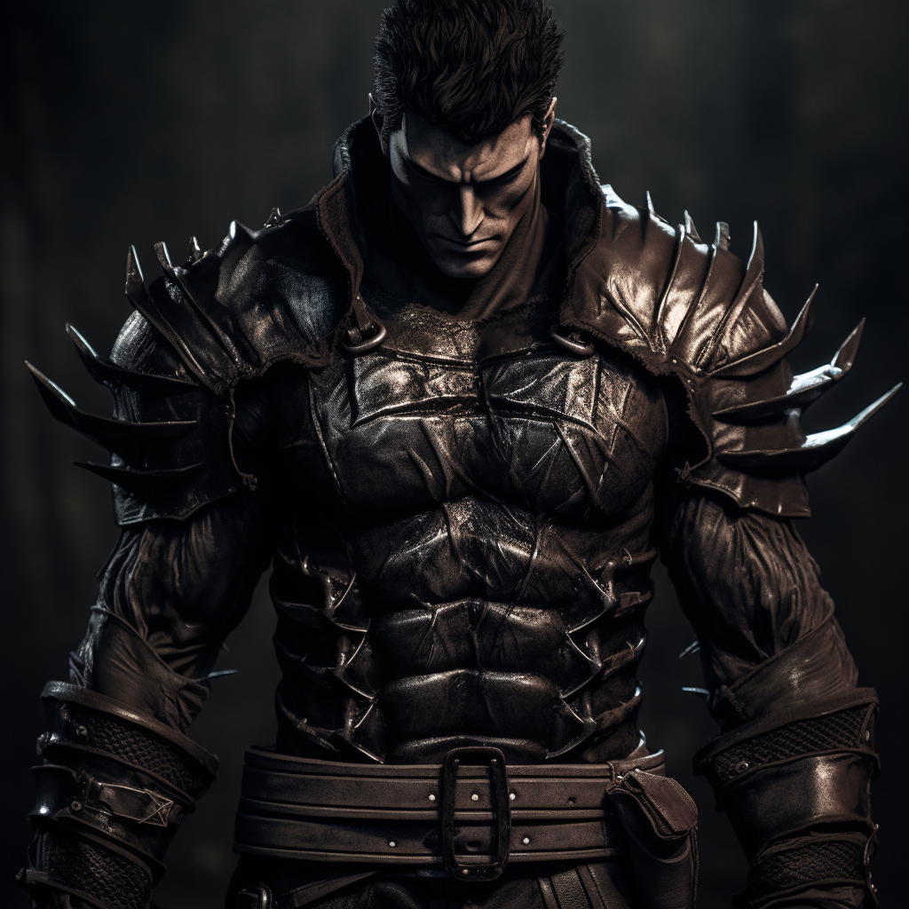

# Grimwald Thornhelm

## Attributes and Core Skills

| STR       | 1 |    | RFX             | 0 |    | INT               | 0 |    |
| --------- | :-: | :-: | --------------- | :-: | :-: | ----------------- | :-: | :-: |
| Athletics | 2 | 6d6 | Acrobatics      | 0 | 3d6 | Communication     | 0 | 3d6 |
| Climb     | 0 | 4d6 | Perception      | 0 | 3d6 | General Knowledge | 0 | 3d6 |
| Endurance | 0 | 4d6 | Sleight of Hand | 0 | 3d6 | Survival          | 1 | 4d6 |
| Lift      | 2 | 5d6 | Stealth         | 0 | 3d6 | Will              | 0 | 4d6 |

## Vocations and Vocational Skills

| Knight {STR}               | 2 | 6d6 | Fellcaster {STR, RFX, INT} | 0  | 4d6 |
| --------------------------- | :-: | :-: | -------------------------- | -- | --- |
| Large Sword {STR, RFX, INT} | 2 | 6d6 | Polycraft                  | -1 | 3d6 |

## Effects

|               Name               |                             Effect                             | Duration |                                                       Source                                                       |
| :------------------------------: | :-------------------------------------------------------------: | :------: | :-----------------------------------------------------------------------------------------------------------------: |
|      Minor Silver Weakness      |     +1 to the level of injury received from Silver damage.     |          |                                                    Fellblood                                                    |
|      Physical Defense Level      |                                4                                |          |                                                        Armor                                                        |
|           Medium Size           |                      5x5 ft on battle map.                      |          |                                                                                                                    |
|        Language: Babelish        |                       Can speak Babelish.                       |          |                                                                                                                    |
|         Language: Primal         |                        Can speak Primal.                        |          |                                                                                                                    |
| Disabling: Superstition Paranoia | Extreme belief in common superstition and old wives tales. |          |                                                                                                                    |
|         Equipment Weight         |                              64 lb                              |          |                                                      Equipment                                                      |
|      Carry Weight      |                             300 lb                             |          | +50 lbs Carry Weight per Lift dice |
|           Light Weight           |                 -0d6 to STR/RFX governed Dice Pools                 |          |                                              0% - 25% of carry weight                                              |
|          Terrestrial Combat Speed          |                              60 ft                              |          |                                  +10 ft (per Athletics Dice), +/-10 ft (per RFX)                                  |
|            Swim Combat Speed            |                              30 ft                              |          |                                   +5 ft (per Athletics Dice), +/-5 ft (per RFX)                                   |
|           Climb Combat Speed           |                              20 ft                              |          |                                     +5 ft (per Climb Dice), +/-5 ft (per RFX)                                     |

## Combat Rolls

|           Name           | One Handed | Two Handed | Dual Wielded | Penetration |    Range    | Damage Types | Engageable Opponents | Area Of Effect | Resource Class |
| :----------------------: | :-------------: | :-------------: | :---------------: | :---------: | :----------: | :---------------: | :-----------------------: | :-----------------: | :-----------------: |
| Polycraft - Melee Trick |       3d6       |                |                  |      0      |    Melee    |       Bleed       |           Rapid           |                    |        None        |
| Polycraft - Ranged Trick |       3d6       |                |                  |      0      |    Close    |       Bleed       |         Standard         |                    |        None        |
|        Heavy Bow        |      None      | 8d6 (+2d6) |       None       |      2      | Sharpshooter |                  |         Standard         |        None        |        Arrow        |
|  Large Thrusting Sword  | 3d6 (+0d6) | 8d6 (+2d6) |  5d6 (+1d6)  |      3      |    Melee    |      Pierce      |           Rapid           |        None        |        None        |
|   Large Slashing Sword   | 3d6 (+0d6) | 9d6 (+3d6) |  6d6 (+1d6)  |      2      |    Melee    |       Slash       |           Rapid           |        None        |        None        |

|      Name      | Resource Class | Resource Dice | Penetration | Range | Damage Types | Area Of Effect |
| :------------: | :-----------------: | :----------------: | :---------: | :---: | :---------------: | :-----------------: |
| Standard Arrow |        Arrow        |        +1d6        |      1      | None |      Pierce      |        None        |

## Destiny Points: 0/3

## Fellblood: 0/0

## Equipment:

| Name                  | # |                    Class                    |   Tier   | Durability |  LB  |  Value  |
| --------------------- | :-: | :-----------------------------------------: | :------: | :--------: | :--: | :-----: |
| Gambeson Coat         | 1 |                 Phy. Def. 1                 | Mundane |   12/12   |  5  |  2 bc  |
| Chainmail Coif        | 1 |               Phy. Def. 0.75               | Superior |   24/24   |  4  | 11.2 bc |
| Chainmail Shirt       | 1 |               Phy. Def. 0.75               | Mundane |   12/12   |  20  | 22.4 bc |
| Chainmail Leggings    | 1 |               Phy. Def. 0.75               | Mundane |   12/12   |  12  | 11.2 bc |
| Chainmail Sleeves     | 1 |               Phy. Def. 0.75               | Mundane |   12/12   |  11  | 11.2 bc |
| Clothes, Common       | 1 |                                            | Mundane |            |  3  |  50 cc  |
| Longbow               | 1 |                  Heavy Bow                  | Mundane |   12/12   |  4  |  50 bc  |
| Quiver (capacity: 20) | 1 |                                            | Mundane |            |  1  |  1 bc  |
| Broadhead Arrow       | 20 |               Standard Arrow               | Mundane |     -     | 0.05 |  5 cc  |
| Longsword             | 1 | Large Thrusting Sword, Large Slashing Sword | Mundane |   12/12   |  3  |  15 bc  |

## Containers

| Name | # | Class | Tier | Durability | LB | Value |
| ---- | :-: | :---: | :--: | :--------: | :-: | :---: |
|      |  |      |      |            |    |      |

## Notes

## Appearance

Age: 24

Race: Beastkin

Height: 6'2"

Body Type: Built

Weight: 230 lb

Hair Color: Black

Eyes Color: Brown

Additional Details:

## Disposition

- Bold
- Cunning
- Accurate
- Superstitious

## Beliefs/Morality

## Goals/Aspirations

- Make coin through his mercenary work.

## Backstory

Grimwald is a hedge knight. He is a youthful 24. He is bold, cunning, and accurate. He is superstitious about all things related to magic, ghost, and the super natural. Made freaks him out as it is beyond the scope of the world he is use to, combat. As a mercenary for hire, Grimwald travels were ever the coin leads.

Grimwald was orphaned after a group of monsters attacked his small family farm. Still young, Grimwald was unable to protect his family, a bitter regret he holds to this day.
