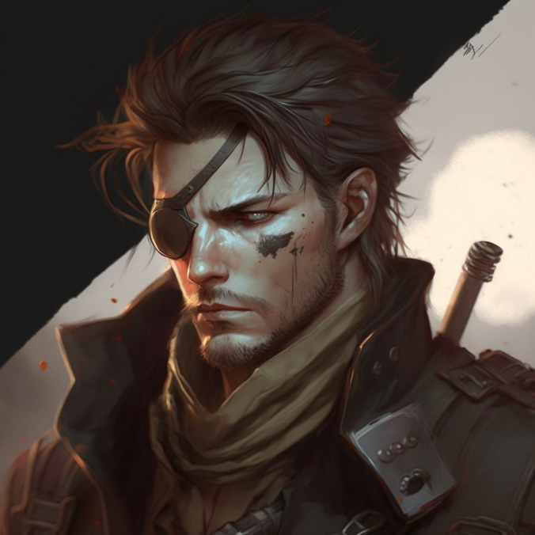

# Javk Wick

## [Attributes](./../../../../../CoreRules/GeneralRules/Attributes.md) and [Core Skills](./../../../../../CoreRules/GeneralRules/CoreSkills.md)

| [STR](./../../../../../CoreRules/GeneralRules/Attributes.md#strength-str)    | 0 |    | [RFX](./../../../../../CoreRules/GeneralRules/Attributes.md#reflex-rfx)                  | 1 |    | [INT](./../../../../../CoreRules/GeneralRules/Attributes.md#intelligence-int)                | 0 |    |
| ------------------------------------------------------------------------- | :-: | :-: | ------------------------------------------------------------------------------------- | :-: | :-: | ----------------------------------------------------------------------------------------- | :-: | :-: |
| [Athletics](./../../../../../CoreRules/GeneralRules/CoreSkills.md#athletics) | 1 | 4d6 | [Acrobatics](./../../../../../CoreRules/GeneralRules/CoreSkills.md#acrobatics)           | 0 | 4d6 | [Communication](./../../../../../CoreRules/GeneralRules/CoreSkills.md#communication)         | 0 | 3d6 |
| [Climb](./../../../../../CoreRules/GeneralRules/CoreSkills.md#climb)         | 0 | 3d6 | [Perception](./../../../../../CoreRules/GeneralRules/CoreSkills.md#perception)           | 0 | 4d6 | [General Knowledge](./../../../../../CoreRules/GeneralRules/CoreSkills.md#general-knowledge) | 0 | 3d6 |
| [Endurance](./../../../../../CoreRules/GeneralRules/CoreSkills.md#endurance) | 0 | 3d6 | [Sleight of Hand](./../../../../../CoreRules/GeneralRules/CoreSkills.md#sleight-of-hand) | 0 | 4d6 | [Survival](./../../../../../CoreRules/GeneralRules/CoreSkills.md#survival)                   | 0 | 3d6 |
| [Lift](./../../../../../CoreRules/GeneralRules/CoreSkills.md#lift)           | 0 | 3d6 | [Stealth](./../../../../../CoreRules/GeneralRules/CoreSkills.md#stealth)                 | 1 | 5d6 | [Will](./../../../../../CoreRules/GeneralRules/CoreSkills.md#will)                           | 0 | 3d6 |

## [Vocations](./../../../../../CoreRules/GeneralRules/Vocations.md) and [Vocation Skills](./../../../../../CoreRules/GeneralRules/Vocations.md#vocation-skills)

| Runesmith Rogue     |   RFX, INT   | 1 | 5d6 |
| ------------------- | :-----------: | :-: | :-: |
| Rogue Knowledge     |      INT      |    | 4d6 |
| Medium Sword        | STR, RFX, INT | 1 | 5d6 |
| Hand Crossbow       | STR, RFX, INT | 1 | 5d6 |
| Rune of Shadow      |   RFX, INT   | -1 | 3d6 |
| Rune of Sound       |   RFX, INT   | -1 | 3d6 |
| Rune of Electricity |   RFX, INT   | -1 | 3d6 |

## Info

|                                                        Name                                                        |                                 Info                                 | Duration |                      Source                      |
| :-----------------------------------------------------------------------------------------------------------------: | :------------------------------------------------------------------: | :------: | :----------------------------------------------: |
|                       [Level](./../../../../../CoreRules/CharacterCreationRules/TiersOfPlay.md)                       |                                  1                                  |          |                                                  |
|                                [Language](./../../../Languages/Languages.md): Babelish                                |                         Can speak Babelish.                         |          |                                                  |
|                                 [Language](./../../../Languages/Languages.md): Demonic                                 |                          Can speak Demonic.                          |          |                                                  |
| [Disabling Characteristic](./../../../../../CoreRules/CharacterCreationRules/DisablingCharacteristics.md): Missing Arm | STR and RFX dice penalties when performing tasks requiring 2 hands. |          |           Missing Left Arm below elbow           |
|                                                                                                                    |                                                                      |          |                                                  |
|                 [Equipment Weight](./../../../../../CoreRules/AdvancedRules/CarryWeight.md#equipment)                 |                                0 lb                                |          |                    Equipment                    |
|                  [Carry Weight](./../../../../../CoreRules/AdvancedRules/CarryWeight.md#carry-weight)                  |                                150 lb                                |          |        +50 lbs Carry Weight per Lift dice        |
|                 [Weight Class](./../../../../../CoreRules/AdvancedRules/CarryWeight.md#weight-classes): Light                 |                 -0d6 to STR/RFX governed Dice Pools                 |          |  0% =< Equipment Weight <= 25% of Carry Weight  |
|                                                                                                                    |                                                                      |          |                                                  |
|                [Minor Silver Weakness](./../../../../../CoreRules/CombatRules/WeaknessAndResistance.md)                |        +1 to the level of injury received from Silver damage.        |          |                    Fellblood                    |
|       [Physical Defense Level](./../../../../../CoreRules/CombatRules/DefenseAndPenetration.md#physical-defense)       |                                  3                                  |          |                      Armor                      |
|                                                                                                                    |                                                                      |          |                                                  |
|                        [Size](./../../../../../CoreRules/CombatRules/BattleMap.md#size): Medium                        |                        5x5 ft on battle map.                        |          |                                                  |
|            [Terrestrial Combat Speed](./../../../../../CoreRules/CombatRules/CombatSpeed.md#combat-speeds)            |                                50 ft                                |          | +10 ft (per Athletics Dice), +/-10 ft (per RFX) |
|                [Swim Combat Speed](./../../../../../CoreRules/CombatRules/CombatSpeed.md#combat-speeds)                |                                25 ft                                |          |  +5 ft (per Athletics Dice), +/-5 ft (per RFX)  |
|               [Climb Combat Speed](./../../../../../CoreRules/CombatRules/CombatSpeed.md#combat-speeds)               |                                15 ft                                |          |    +5 ft (per Climb Dice), +/-5 ft (per RFX)    |
|                                                                                                                    |                                                                      |          |                                                  |
|                    [Magic Resource](./../../../../../CoreRules/MagicRules/MagicResource.md): Focus                    |                                 4/4                                 |          |       Vocation/Magic Governing Skill Level       |
|                       [Destiny Points](./../../../../../CoreRules/GeneralRules/DestinyPoints.md)                       |                                 0/3                                 |          |               Awarded by Narrator               |
|                            [Injury](./../../../../../CoreRules/CombatRules/Injury.md): None                            |                    – 0 dice to all dice checks.                    |          |                      Damage                      |

## [Combat Rolls](./../../../../../CoreRules/CombatRules/CombatRolls.md)

- [Victory Levels link](./../../../../../CoreRules/CombatRules/VictoryLevels.md)

### [Weapons](./../../../../../CoreRules/CombatRules/WeaponClasses.md)

|               Name               | [One Handed](./../../../../../CoreRules/CombatRules/WeaponClasses.md#one-handed) | [Two Handed](./../../../../../CoreRules/CombatRules/WeaponClasses.md#two-handed) | [Dual Wielded](./../../../../../CoreRules/CombatRules/WeaponClasses.md#dual-wielded) | [Penetration](./../../../../../CoreRules/CombatRules/DefenseAndPenetration.md#penetration) | [Range](./../../../../../CoreRules/CombatRules/Range.md) | [Damage Types](./../../../../../CoreRules/CombatRules/DamageTypes.md) | [Engageable Opponents](./../../../../../CoreRules/CombatRules/EngageableOpponents.md) | [Area Of Effect](./../../../../../CoreRules/CombatRules/AreaOfEffect.md) | [Weapon Resource](./../../../../../CoreRules/CombatRules/WeaponClasses.md#weapon-resources) |
| :-------------------------------: | :--------------------------------------------------------------------------------: | :--------------------------------------------------------------------------------: | :------------------------------------------------------------------------------------: | :-------------------------------------------------------------------------------------: | :---------------------------------------------------: | :---------------------------------------------------------------------: | :-------------------------------------------------------------------------------------: | :------------------------------------------------------------------------: | :-------------------------------------------------------------------------------------------: |
|              Unarmed              |                                         -1                                         |                                         -1                                         |                                          None                                          |                                            0                                            |                         Melee                         |                                Bludgeon                                |                                          Rapid                                          |                                    None                                    |                                             None                                             |
| Epilogue - Medium Thrusting Sword |                                +1d6 (3d8, 3d6)                                |                                +2d6 (3d8, 4d6)                                |                                  +1d6 (3d8, 4d6)                                  |                                            2                                            |                         Melee                         |                                 Pierce                                 |                                   4/5/5 (Rapid)                                   |                                    None                                    |                                             None                                             |
| Epilogue - Medium Slashing Sword |                                +2d6 (3d8, 4d6)                                |                                +3d6 (3d8, 5d6)                                |                                  +1d6 (3d8, 5d6)                                  |                                            0                                            |                         Melee                         |                                  Slash                                  |                                   5/5/5 (Rapid)                                   |                                    None                                    |                                             None                                             |
|      Thorn - Hand Crossbow      |                                        +1d6                                        |                                        +1d6                                        |                                          +1d6                                          |                                            0                                            |                        Medium                        |                                                                        |                                        Standard                                        |                                    None                                    |                                             Bolt                                             |

#### [Weapon Resources](./../../../../../CoreRules/CombatRules/WeaponClasses.md#ranged-weapon-resources)

| Name  | [Resource Class](./../../../../../CoreRules/CombatRules/WeaponResourceClasses.md#resource-class) | [Resource Dice](./../../../../../CoreRules/CombatRules/WeaponResourceClasses.md#resource-dice) | [Penetration](./../../../../../CoreRules/CombatRules/WeaponResourceClasses.md#penetration) | [Range](./../../../../../CoreRules/CombatRules/WeaponResourceClasses.md#range) | [Damage Types](./../../../../../CoreRules/CombatRules/WeaponResourceClasses.md#damage-types) | [Area Of Effect](./../../../../../CoreRules/CombatRules/WeaponResourceClasses.md#area-of-effect) |
| :---: | :------------: | :-----------: | :----------------------------------------------------------------------------------------: | :------------------------------------------------------: | :------------------------------------------------------------------------: | :---------------------------------------------------------------------------: |
|  Standard Bolt  |                                        Bolt                                        |                                        +1d6                                        |                                           1                                           |                                          None                                          |                        Pierce                        |                                  None                                  |                                                                                        |                                                                            |                                                                                              |
|  Wounding Bolt  |                                        Bolt                                        |                                        +1d6                                        |                                           1                                           |                                          None                                          |                     Pierce, Bleed                     |                                  None                                  |                                                                                        |                                                                            |                                                                                              |
| Anti-armor Bolt |                                        Bolt                                        |                                        +1d6                                        |                                           2                                           |                                          None                                          |                        Pierce                        |                                  None                                  |                                                                                        |                                                                            |                                                                                              |

### [Incompetent Combat Magic](./../../../../../CoreRules/MagicRules/GenericMagic.md#incompetent-combat-magic)

|     Name     | [One Handed](./../../../../../CoreRules/CombatRules/WeaponClasses.md#one-handed) | [Two Handed](./../../../../../CoreRules/CombatRules/WeaponClasses.md#two-handed) | [Dual Wielded](./../../../../../CoreRules/CombatRules/WeaponClasses.md#dual-wielded) | [Penetration](./../../../../../CoreRules/CombatRules/DefenseAndPenetration.md#penetration) | [Range](./../../../../../CoreRules/CombatRules/Range.md) | [Damage Types](./../../../../../CoreRules/CombatRules/DamageTypes.md) | [Engageable Opponents](./../../../../../CoreRules/CombatRules/EngageableOpponents.md) | [Area Of Effect](./../../../../../CoreRules/CombatRules/AreaOfEffect.md) | [Magic Resource](./../../../../../CoreRules/MagicRules/MagicResource.md) |
| :----------: | :--------------------------------------------------------------------------------: | :--------------------------------------------------------------------------------: | :------------------------------------------------------------------------------------: | :-------------------------------------------------------------------------------------: | :---------------------------------------------------: | :---------------------------------------------------------------------: | :-------------------------------------------------------------------------------------: | :------------------------------------------------------------------------: | :------------------------------------------------------------------------: |
| Mag. Unarmed |                                         -1                                         |                                         -1                                         |                                          None                                          |                                            0                                            |                         Melee                         |                                                                        |                                          Rapid                                          |                                    None                                    |                                     0                                     |
|              |                                                                                    |                                                                                    |                                                                                        |                                                                                        |                                                      |                                                                        |                                                                                        |                                                                            |                                                                            |
|  Mag. Puff  |                                         -1                                         |                                         -1                                         |                                          None                                          |                                            0                                            |                         Near                         |                                                                        |                                        Standard                                        |                                    None                                    |                                     0                                     |

## [Equipment](./../../../../../CoreRules/AdvancedRules/CarryWeight.md#equipment)

| Name           | # | [Class](./../../../../../CoreRules/AdvancedRules/ItemClass.md) | [Effect](./../../../../../CoreRules/AdvancedRules/ItemEffects.md) | [Tier](./../../../../../CoreRules/AdvancedRules/ItemTier.md) | [Durability](./../../../../../CoreRules/AdvancedRules/ItemDurability.md) | [LB](./../../../../../CoreRules/AdvancedRules/CarryWeight.md) | [Value](./../../../Items/ItemShop.md#currency) |
| -------------- | :-: | :---------------------------------------------------------: | -------------------------------------------------------------- | :-------------------------------------------------------: | :-------------------------------------------------------------------: | :--------------------------------------------------------: | :-----------------------------------------: |
| Gambeson Armor | 1 |              Body Armor, Arm Armor, Leg Armor              | Phy. Def. 1.00                                                 |                          Mundane                          |                                 12/12                                 |                             8                             |                    5 bc                    |
| Leather Armor  | 1 |        Head Armor, Body Armor, Arm Armor, Leg Armor        | Phy. Def. 2.00                                                    |                          Quality                          |                                 15/15                                 |                             12                             |                    10 bc                    |
| Epilogue       | 1 |        Medium Thrusting Sword, Medium Slashing Sword        | Ending                                                         |                         Excellent                         |                                 21/21                                 |                             2                             |                      ?                      |
| Hand Crossbow  | 1 |                        Hand Crossbow                        |                                                                |                          Mundane                          |                                 12/12                                 |                             3                             |                    75 bc                    |

## [Containers](./../../../../../CoreRules/AdvancedRules/Containers.md)

| Name                         | # | [Class](./../../../../../CoreRules/AdvancedRules/ItemClass.md) | [Effect](./../../../../../CoreRules/AdvancedRules/ItemEffects.md) | [Tier](./../../../../../CoreRules/AdvancedRules/ItemTier.md) | [Durability](./../../../../../CoreRules/AdvancedRules/ItemDurability.md) | [LB](./../../../../../CoreRules/AdvancedRules/CarryWeight.md) | [Value](./../../../Items/ItemShop.md#currency) |
| ---------------------------- | :-: | :---------------------------------------------------------: | -------------------------------------------------------------- | :-------------------------------------------------------: | :-------------------------------------------------------------------: | :--------------------------------------------------------: | :-----------------------------------------: |
| "Better" Backpack (1.2 ft^3) | 1 |                       35 lb container                       |                                                                |                          Mundane                          |                                                                      |                             5                             |                    4 bc                    |

## Notes

Javk sacrificed his arm and eye as a devil contract

Thorn is the name of Javk's arm or maybe bow

Diamond devil eyes from containment

Yellow flame of frenzy eye on normal eye

Sayings:

- "Never fight fair"
- "We, fight, TOGETHER"
- Who carries the load (Boat)
- "We do this, together"
- "Why do we Fall…"
- "I'm not likely to back down from much, I always stand my ground"
- "If you find yourself in a fair fight, then your tactics suck."
- "It's never been a fair fight"
- "Because fighting fair is for losers."
- "Don't know if you have a choice bucko, no man gets to walk out of his own story…"
- "Then be a hero"
- "The only thing necessary for evil to triumph is for good men to do nothing"
- "It's not about you, it's about them"
- "It's the deeds that make the man..."
- "Sometime you gotta dig deep to find what your looking for..."
  https://youtube.com/shorts/KxKjt2-Z7ts?feature=share

Habits:

- Tinker with arm
- Practice card tricks and magician tricks
- Complain that I don't have a cigar
- Play his guitar
- Fiddle with horn
- Play up deteriorating health

## Appearance

Age: ~30

Race: Mudblood

Height: 6' 2"

Weight: ~ 200 lb

Body Type: Shredded, Geralt of Rivia style

Hair Color: Brown

Eye Color:

- Right eye: Prothetic eye, glowing yellow iris, black sclera
- Left eye: Blueish green

Additional Details:

* Missing a bodily extremity/limb: Missing left forearm below elbow
* Scarred face, running across left eye, nose, left edge of mouth...
* Lichenberg Figures across arm and torso
* Black crystal "horn" protruding near hair line above right eye
* Neck is scared for small bit marks
* Always wearing lucky Reddland bandana scarf around the neck
* Generally wearing dull brown and black attire
* Talks with a southern accent

## Disposition

- Natural Leader
- Proud
- Brave
- Resourceful
- Tenacious
- Sarcasm: "Just because I don't care doesn't mean I don't understand."
- Lucky: "Never tell me the odds."
- Moral Compass: "A sense of shame is not a bad moral compass."
- Blood Lust: "When I start killing, things go red and something else takes over. I'll come out of it later when everything is dead or someone snaps me out of it."
- Hard on self: "The purpose of life is finding the largest burden that you can bear and bearing it."
- Regretful: "I am ashamed of my past and the people that I hurt"

## Beliefs/Morality

- Redemption: There's a spark of good in everyone.
- Creativity: I think creativity is intelligence and having fun.
- Black and White: Believes in good and evil.
- Doesn't hurt children and the weak.

## Goals/Aspirations

- Find a way to remove the Shard of Darkness that is slowly killing him.
- Try to live up to the expectations of Old Ben.
- Become an excellent magician and perform for people.
- Upgrade his arm to become a artifact magic item.
- Figure out what the dreams and nightmares mean. Standing before a burning city.
- Find a cool cowboy hat and magic whip.
- Find cool sword.
- Find the perfect cigar.
- Find a guitar.
- Find poison materials.
- Start merc group (sword point).
- Become a magician.

## Backstory

Across the world, when mothers tuck their children into bed, bandits gather around their campfires, and adventures congregate near the inn's hearth, the "Tale of the Wicker" is a common tale. A monster/ghost story that has been passed down from generation to generation. The tale of the Wicker is a reminder that the scariest monsters don't look like monsters at all. For the Wicker looks just like you and me. Only when it claims your severed head and drags your soul to the bottom of the Abyss will you know you have encountered the Wicker. For children it is a reminder to not trust strangers or wonder off from your parents. For adults it's a warning that monsters walk among us, and no matter how much power, wealth, or fame you possess, none of it will protect you from true malevolence.

As for the actual validity of the Wicker, after looking at the supposed historical accounts, there is no definitive evidence. However, while I don't believe in the "Wicker", I'm terrified it exists… – An Narrative Exploration of the Wicker Myth by Volothamp Veddarm

"There is no binding it can't escape. No trap it can't evade. No door it can't open. No price it can be bought for. It's coming for you next. Pleasant dreams..." – Tales of the Wicker

Stories are usually full of half truths. In reality there isn't a "Wicker" or not anymore. Through most of modern time there have been many Wicker, all clones of a human who was believed to be the first Wicker. Within the past 100 years though, the "original" clones have been phased out slowly as the repeated cloning has left them with little to no innate magic. The modern Wicker organization has close ties to many shady organizations, and the majority of their contracts come from them. Whether its upstart evil wizards, war lords, crime bosses, city officials, or disloyal spies, the Wicker always gets their mark.

The calling card of the Wicker is their headless victims, a cut so clean that no material weapon could produce. This is an old Wicker enchantment weapon enchantment that separates the head from the body of the creatures when killed with the weapon. This is simply for practical purposes, as the head is needed to confirm the contract. But superstitious theories would argue otherwise.

Wickers are strong, fast, intelligent, predisposed to extreme violence, and malleable. All Wicker are born with innate magic potential. Wicker's take up various specialties (classes). While many take up the path of the Rogue, it’s not uncommon to see Wizards, Rangers, and others in their ranks. Early on all clones are implanted with a shard of darkness that will grow and eventually kill them. This acts as an expiration date on all Wicker Men to ensure none get ideas of leaving.

Javk's first memory was being pulled out of the sealed vessel which he was grown in. Javk was the last of the "original" clones, and was the first to be created with no innate magic. In an odd way this was beneficial for Javk, as it meant his shard grew much slower. Javk made up for his lack of magic in shear violence, ingenuity, body count, and bloodlust in combat. Javk would routinely take the most dangerous contracts, looking to earn respect. This all change on a botched job were Javk was blown up, mangled, and left to drown in a river. Javk was rescued by Old Ben, a simple human carpenter, tinkerer, and magician. He nursed Javk back to health, though Javk had lost the uses of his left arm and right eye. Ben would travel from town to town performing street magic, fixing peoples wagons, and clocks. Javk initially stuck around to repay his debt, though Ben assured him he owned him nothing. But Javk grew to respect Old Ben. Javk for the first time in his life felt guilt for his sins. Guilt ridden with his sins, Javk snuck away from their camp one night, and planned to pierce his heart with his sword. In his darkest moment Javk stayed his hand. Right there he decided to devote his life to the Good in the world. He spent the next year with Old Ben before he passed. Javk buried his friend, and set out into the world ready to make a difference.
