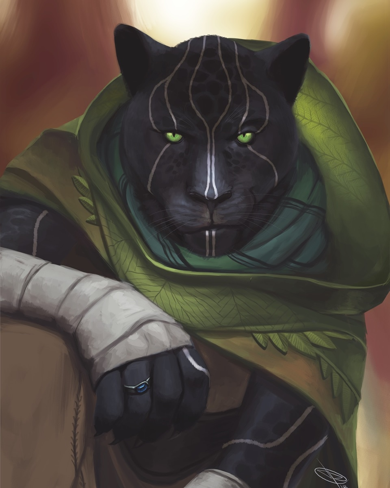

# Jing Hu

## [Attributes](./../../../../../CoreRules/GeneralRules/Attributes.md) and [Core Skills](./../../../../../CoreRules/GeneralRules/CoreSkills.md)

|  [STR](./../../../../../CoreRules/GeneralRules/Attributes.md#strength-str)  | 0 |    |    [RFX](./../../../../../CoreRules/GeneralRules/Attributes.md#reflex-rfx)    | 1 |    |        [INT](./../../../../../CoreRules/GeneralRules/Attributes.md#intelligence-int)        | 0 |    |
| :-----------------------------------------------------------------------: | :-: | :-: | :-------------------------------------------------------------------------: | :-: | :-: | :---------------------------------------------------------------------------------------: | :-: | :-: |
| [Athletics](./../../../../../CoreRules/GeneralRules/CoreSkills.md#athletics) | 1 | 4d6 |  [Dexterity](./../../../../../CoreRules/GeneralRules/CoreSkills.md#dexterity)  | 1 | 5d6 |     [Communication](./../../../../../CoreRules/GeneralRules/CoreSkills.md#communication)     | -1 | 2d6 |
| [Endurance](./../../../../../CoreRules/GeneralRules/CoreSkills.md#endurance) | 0 | 3d6 | [Perception](./../../../../../CoreRules/GeneralRules/CoreSkills.md#perception) | 1 | 5d6 | [General Knowledge](./../../../../../CoreRules/GeneralRules/CoreSkills.md#general-knowledge) | 0 | 3d6 |
|      [Lift](./../../../../../CoreRules/GeneralRules/CoreSkills.md#lift)      | 0 | 3d6 |    [Stealth](./../../../../../CoreRules/GeneralRules/CoreSkills.md#stealth)    | 0 | 4d6 |              [Will](./../../../../../CoreRules/GeneralRules/CoreSkills.md#will)              | 0 | 3d6 |

## [Vocations](./../../../../../CoreRules/GeneralRules/Vocations.md) and [Vocation Skills](./../../../../../CoreRules/GeneralRules/Vocations.md#vocation-skills)

| Monk           | STR, RFX, INT | 1 | 5d6 |
| -------------- | :-----------: | :-: | :-: |
| Large Melee    | STR, RFX, INT | 1 | 5d6 |
| Monk Knowledge |      INT      |  | 4d6 |

| [Fellcaster](./../../../MagicSystems/Fellcraft/Fellcraft.md) | STR, RFX, INT | 0 | 4d6 |
| :-------------------------------------------------------: | :-----------: | :-: | :-: |
|                         Polycraft                         | STR, RFX, INT | -1 | 3d6 |
|                         Sonocraft                         | STR, RFX, INT | -1 | 3d6 |

## Effects

|                                                             Name                                                             |                                                                                                                                                                  Desc                                                                                                                                                                  | Duration |                      Source                      |
| :---------------------------------------------------------------------------------------------------------------------------: | :-------------------------------------------------------------------------------------------------------------------------------------------------------------------------------------------------------------------------------------------------------------------------------------------------------------------------------------: | :------: | :----------------------------------------------: |
|                            [Level](./../../../../../CoreRules/CharacterCreationRules/TiersOfPlay.md)                            |                                                                                                                                                                    1                                                                                                                                                                    |          |                                                  |
|                                     [Language](./../../../Languages/Languages.md): Babelish                                     |                                                                                                                                                           Can speak Babelish.                                                                                                                                                           |          |                                                  |
|                                      [Language](./../../../Languages/Languages.md): Primal                                      |                                                                                                                                                            Can speak Primal.                                                                                                                                                            |          |                                                  |
| [Disabling Characteristic](./../../../../../CoreRules/CharacterCreationRules/DisablingCharacteristics.md): Incontrollable Grief |                                                                                                                                      Overwhelming grief that is triggered reminder of past trauma.                                                                                                                                      |          |                                                  |
| [Disabling Characteristic](./../../../../../CoreRules/CharacterCreationRules/DisablingCharacteristics.md): Disabling: Paranoia |                                                                                                                                        Irrational belief that the Wicker Men will come for him.                                                                                                                                        |          |                                                  |
|                                                                                                                              |                                                                                                                                                                                                                                                                                                                                        |          |                                                  |
|          [Equipment Weight](./../../../../../CoreRules/AdvancedRules/EquipmentCarryWeightAndWeightClasses.md#equipment)          |                                                                                                                                                                  24 lb                                                                                                                                                                  |          |                    Equipment                    |
|          [Carry Weight](./../../../../../CoreRules/AdvancedRules/EquipmentCarryWeightAndWeightClasses.md#carry-weight)          |                                                                                                                                                                 150 lb                                                                                                                                                                 |          |        +50 lbs Carry Weight per Lift dice        |
|      [Weight Class](./../../../../../CoreRules/AdvancedRules/EquipmentCarryWeightAndWeightClasses.md#weight-classes): Light      |                                                                                                                                                   -0d to STR/RFX governed Dice Pools                                                                                                                                                   |          |  0% =< Equipment Weight <= 25% of Carry Weight  |
|                                                                                                                              |                                                                                                                                                                                                                                                                                                                                        |          |                                                  |
|                    [Minor Weakness](./../../../../../CoreRules/CombatRules/WeaknessAndResistance.md): Silver                    |                                                                                                                                          +1 to the level of injury received from damage type.                                                                                                                                          |          |                    Fellblood                    |
|                   [Physical Defense Level](./../../../../../CoreRules/CombatRules/Defense.md#physical-defense)                   |                                                                                                                                                                    3                                                                                                                                                                    |          |                  Armor & Shield                  |
|                                                                                                                              |                                                                                                                                                                                                                                                                                                                                        |          |                                                  |
|                             [Size](./../../../../../CoreRules/CombatRules/BattleMap.md#size): Medium                             |                                                                                                                                                          5x5 ft on battle map.                                                                                                                                                          |          |                                                  |
|                  [Combat Speed](./../../../../../CoreRules/CombatRules/BattleMap.md#combat-speed): Terrestrial                  |                                                                                                                                                                  50 ft                                                                                                                                                                  |          | +10 ft (per Athletics Dice), +/-10 ft (per RFX) |
|                      [Combat Speed](./../../../../../CoreRules/CombatRules/BattleMap.md#combat-speed): Swim                      |                                                                                                                                                                  25 ft                                                                                                                                                                  |          |  +5 ft (per Athletics Dice), +/-5 ft (per RFX)  |
|                     [Combat Speed](./../../../../../CoreRules/CombatRules/BattleMap.md#combat-speed): Climb                     |                                                                                                                                                                  25 ft                                                                                                                                                                  |          |  +5 ft (per Athletics Dice), +/-5 ft (per RFX)  |
|                                                                                                                              |                                                                                                                                                                                                                                                                                                                                        |          |                                                  |
|                       [Magic Resource](./../../../../../CoreRules/MagicRules/MagicResource.md): Fellblood                       |                                                                                                                                                                   2/2                                                                                                                                                                   |          |       Vocation/Magic Governing Core Skill       |
|                            [Destiny Points](./../../../../../CoreRules/GeneralRules/DestinyPoints.md)                            | Characters can be awarded Destiny Points by the Narrator and can hold a max of 3. Spending a "Preemptive Destiny Point" before rolling a dice pool gives Advantage on the resulting roll. Spending "Post Roll Destiny Points" adds additional Wins for each point spent, with the total Wins never exceeding the size of the dice pool. |          |               0/3 (Given by The Narrator)               |
|             [Destiny Resistance](./../../../../../CoreRules/GeneralRules/DestinyPoints.md#destiny-resistance)             |                                                                                                                                         "Post Roll Destiny Points" cannot be spent against this character.                                                                                                                                         |          |              Given by The Narrator              |
|                            [Injury](./../../../../../CoreRules/CombatRules/InjuryAndHealing.md): None                            |                                                                                                                                                 -0d to STR/RFX/INT governed Dice Pools.                                                                                                                                                 |          |                 Damage Received                 |

## [Combat Rolls](./../../../../../CoreRules/CombatRules/CombatRolls.md)

- [Victory Levels link](./../../../../../CoreRules/CombatRules/VictoryLevels.md)

### [Weapons](./../../../../../CoreRules/CombatRules/Weapons.md)

|        Name        | [One Handed](./../../../../../CoreRules/CombatRules/Weapons.md#one-handed) | [Two Handed](./../../../../../CoreRules/CombatRules/Weapons.md#two-handed) | [Dual Wielded](./../../../../../CoreRules/CombatRules/Weapons.md#dual-wielded) | [Penetration](./../../../../../CoreRules/CombatRules/Penetration.md) | [Range](./../../../../../CoreRules/CombatRules/Range.md) | [Uses Per Round](./../../../../../CoreRules/CombatRules/UsesPerRound.md) | [Area Of Effect](./../../../../../CoreRules/CombatRules/AreaOfEffect.md) | [Ammo Type](./../../../../../CoreRules/CombatRules/Ammunitions.md#ammo-type) | [Ammo Per Use](./../../../../../CoreRules/CombatRules/Weapons.md#ammo-per-shot) | [Damage Types](./../../../../../CoreRules/CombatRules/DamageTypes.md) |
| :----------------: | :--------------------------------------------------------------------------: | :--------------------------------------------------------------------------: | :------------------------------------------------------------------------------: | :---------------------------------------------------------------: | :---------------------------------------------------: | :------------------------------------------------------------------------: | :------------------------------------------------------------------------: | :----------------------------------------------------------------------------: | :-------------------------------------------------------------------------------: | :---------------------------------------------------------------------: |
|      Unarmed      |                                      -1                                      |                                     None                                     |                                       +0d6                                       |                                 0                                 |                         Melee                         |                                   Swift                                   |                                                                            |                                      None                                      |                                                                                  |                                Bludgeon                                |
|    Large Spear    |                                     +2d6                                     |                                     +3d6                                     |                                       None                                       |                                 3                                 |                         Melee                         |                                   Steady                                   |                                                                            |                                      None                                      |                                                                                  |                                 Pierce                                 |
| Thrown Large Spear (+0) (One-handed) |                                     +1d6                                     |                                     None                                     |                                       None                                       |                                 3                                 |                         Short                         |                                   Steady                                   |                                                                            |                                      Self                                      |                                         1                                         |                                 Pierce                                 |
| Large Bludgeon Melee (+0) (One-handed), Large Bludgeon Melee (+0) (Two-handed) |                                      -1                                      |                                     +1d6                                     |                                       None                                       |                                 5                                 |                         Melee                         |                                   Swift                                   |                                                                            |                                      None                                      |                                                                                  |                                Bludgeon                                |

#### [Ammunitions](./../../../../../CoreRules/CombatRules/Ammunitions.md)

| Name | [Ammo Type](./../../../../../CoreRules/CombatRules/Ammunitions.md#ammo-type) | [Dice Pool Mod](./../../../../../CoreRules/CombatRules/Ammunitions.md#dice-pool-mod) | [Base Dice Tier Adjustment](./../../../../../CoreRules/CombatRules/Ammunitions.md#resource-dice) | [Penetration](./../../../../../CoreRules/CombatRules/Ammunitions.md#penetration) | [Range](./../../../../../CoreRules/CombatRules/Ammunitions.md#range) | [Damage Types](./../../../../../CoreRules/CombatRules/Ammunitions.md#damage-types) | [Area Of Effect](./../../../../../CoreRules/CombatRules/Ammunitions.md#area-of-effect) |
| :--: | :----------------------------------------------------------------------------: | :-------------------------------------------------------------------------------: | :-------------------------------------------------------------------------------------------: | :---------------------------------------------------------------------------: | :---------------------------------------------------------------: | :----------------------------------------------------------------------------------: | :--------------------------------------------------------------------------------------: |
|      |                                                                                |                                                                                  |                                                                                              |                                                                              |                                                                  |                                                                                      |                                                                                          |

#### [Melee Weapon Spells](./../../../../../CoreRules/MagicRules/Spells.md#melee-weapon-spells)

|        Name        | [One Handed](./../../../../../CoreRules/CombatRules/Weapons.md#one-handed) | [Two Handed](./../../../../../CoreRules/CombatRules/Weapons.md#two-handed) | [Dual Wielded](./../../../../../CoreRules/CombatRules/Weapons.md#dual-wielded) | [Penetration](./../../../../../CoreRules/CombatRules/Penetration.md) | [Range](./../../../../../CoreRules/CombatRules/Range.md) | [Uses Per Round](./../../../../../CoreRules/CombatRules/UsesPerRound.md) | [Area Of Effect](./../../../../../CoreRules/CombatRules/AreaOfEffect.md) | [Magic Resource](./../../../../../CoreRules/MagicRules/MagicResource.md) | [Damage Types](./../../../../../CoreRules/CombatRules/DamageTypes.md) |
| :-----------------: | :--------------------------------------------------------------------------: | :--------------------------------------------------------------------------: | :------------------------------------------------------------------------------: | :---------------------------------------------------------------: | :---------------------------------------------------: | :------------------------------------------------------------------------: | :------------------------------------------------------------------------: | :------------------------------------------------------------------------: | ----------------------------------------------------------------------- |
|     Magic Glove     |                                     +0d6                                     |                                     None                                     |                                       +0d6                                       |                                 0                                 |                         Melee                         |                                   Swift                                   |                                                                            |                                     0                                     |                                                                         |
| Magic Small Thrust |                                     +0d6                                     |                                     None                                     |                                       +1d6                                       |                                 2                                 |                         Melee                         |                                   Swift                                   |                                                                            |                                     0                                     |                                                                         |
|  Magic Small Slash  |                                     +1d6                                     |                                     None                                     |                                       +1d6                                       |                                 0                                 |                         Melee                         |                                   Swift                                   |                                                                            |                                     0                                     |                                                                         |
|                    |                                                                              |                                                                              |                                                                                  |                                                                  |                                                      |                                                                            |                                                                            |                                                                            |                                                                         |
| Magic Medium Slash |                                     +2d6                                     |                                     +3d6                                     |                                       +1d6                                       |                                 1                                 |                         Melee                         |                                   Swift                                   |                                                                            |                                     1                                     |                                                                         |
| Magic Medium Thrust |                                     +1d6                                     |                                     +2d6                                     |                                       +1d6                                       |                                 2                                 |                         Melee                         |                                   Swift                                   |                                                                            |                                     1                                     |                                                                         |
| Magic Medium Smash |                                     +0d6                                     |                                     +1d6                                     |                                       +1d6                                       |                                 4                                 |                         Melee                         |                                   Swift                                   |                                                                            |                                     1                                     |                                                                         |
| Magic Medium Spear |                                     +2d6                                     |                                     None                                     |                                       +1d6                                       |                                 2                                 |                         Melee                         |                                   Steady                                   |                                                                            |                                     1                                     |                                                                         |
|     Magic Whip     |                                     +1d6                                     |                                     None                                     |                                       +1d6                                       |                                 0                                 |                         Reach                         |                                   Swift                                   |                                                                            |                                     1                                     |                                                                         |
|  Magic Large Slash  |                                     +1d6                                     |                                     +3d6                                     |                                       None                                       |                                 2                                 |                         Melee                         |                                   Swift                                   |                                                                            |                                     1                                     |                                                                         |
| Magic Large Thrust |                                     +0d6                                     |                                     +2d6                                     |                                       None                                       |                                 3                                 |                         Melee                         |                                   Swift                                   |                                                                            |                                     1                                     |                                                                         |
|  Magic Large Smash  |                                      -1                                      |                                     +1d6                                     |                                       None                                       |                                 5                                 |                         Melee                         |                                   Swift                                   |                                                                            |                                     1                                     |                                                                         |
|  Magic Large Spear  |                                     +2d6                                     |                                     +3d6                                     |                                       None                                       |                                 3                                 |                         Melee                         |                                   Steady                                   |                                                                            |                                     1                                     |                                                                         |
|                    |                                                                              |                                                                              |                                                                                  |                                                                  |                                                      |                                                                            |                                                                            |                                                                            |                                                                         |
|  Magic Reach Slash  |                                      -2                                      |                                     +4d6                                     |                                       None                                       |                                 3                                 |                         Reach                         |                                Reach Swift                                |                                                                            |                                     2                                     |                                                                         |
| Magic Reach Thrust |                                      -2                                      |                                     +3d6                                     |                                       None                                       |                                 4                                 |                         Reach                         |                                Reach Swift                                |                                                                            |                                     2                                     |                                                                         |
|  Magic Reach Smash  |                                      -2                                      |                                     +2d6                                     |                                       None                                       |                                 5                                 |                         Reach                         |                                Reach Swift                                |                                                                            |                                     2                                     |                                                                         |
|  Magic Reach Spear  |                                      -2                                      |                                     +4d6                                     |                                       None                                       |                                 4                                 |                         Reach                         |                                   Steady                                   |                                                                            |                                     2                                     |                                                                         |

### [Ranged Weapon Spell](./../../../../../CoreRules/MagicRules/Spells.md#ranged-weapon-spells)

|             Name             | [One Handed](./../../../../../CoreRules/CombatRules/Weapons.md#one-handed) | [Two Handed](./../../../../../CoreRules/CombatRules/Weapons.md#two-handed) | [Dual Wielded](./../../../../../CoreRules/CombatRules/Weapons.md#dual-wielded) | [Penetration](./../../../../../CoreRules/CombatRules/Penetration.md) | [Range](./../../../../../CoreRules/CombatRules/Range.md) | [Uses Per Round](./../../../../../CoreRules/CombatRules/UsesPerRound.md) | [Area Of Effect](./../../../../../CoreRules/CombatRules/AreaOfEffect.md) | [Magic Resource](./../../../../../CoreRules/MagicRules/MagicResource.md) | [Damage Types](./../../../../../CoreRules/CombatRules/DamageTypes.md) |
| :---------------------------: | :--------------------------------------------------------------------------: | :--------------------------------------------------------------------------: | :------------------------------------------------------------------------------: | :---------------------------------------------------------------: | :---------------------------------------------------: | :------------------------------------------------------------------------: | :------------------------------------------------------------------------: | :------------------------------------------------------------------------: | ----------------------------------------------------------------------- |
|          Magic Dart          |                                     +0d6                                     |                                     None                                     |                                       +1d6                                       |                                 0                                 |                         Short                         |                                   Swift                                   |                                                                            |                                     0                                     |                                                                         |
|          Magic Sling          |                                     +0d6                                     |                                     None                                     |                                       None                                       |                                 1                                 |                       Mediocre                       |                                   Quick                                   |                                                                            |                                     0                                     |                                                                         |
|                              |                                                                              |                                                                              |                                                                                  |                                                                  |                                                      |                                                                            |                                                                            |                                                                            |                                                                         |
|         Magic Javelin         |                                     +1d6                                     |                                     None                                     |                                       None                                       |                                 2                                 |                       Mediocre                       |                                   Quick                                   |                                                                            |                                     1                                     |                                                                         |
|      Magic Great Javelin      |                                     +1d6                                     |                                     None                                     |                                       None                                       |                                 3                                 |                         Short                         |                                   Quick                                   |                                                                            |                                     1                                     |                                                                         |
|        Magic Hand Bolt        |                                     +1d6                                     |                                     None                                     |                                       +1d6                                       |                                 1                                 |                       Mediocre                       |                                   Quick                                   |                                                                            |                                     1                                     |                                                                         |
|          Magic Bolt          |                                     None                                     |                                     +1d6                                     |                                       None                                       |                                 2                                 |                          Far                          |                                   Steady                                   |                                                                            |                                     1                                     |                                                                         |
|       Magic Great Bolt       |                                     None                                     |                                     +2d6                                     |                                       None                                       |                                 3                                 |                         Long                         |                               Extremely Slow                               |                                                                            |                                     1                                     |                                                                         |
|          Magic Arrow          |                                     None                                     |                                     +1d6                                     |                                       None                                       |                                 1                                 |                          Far                          |                                   Swift                                   |                                                                            |                                     1                                     |                                                                         |
|       Magic Close Cone       |                                     None                                     |                                     +1d6                                     |                                       None                                       |                                 3                                 |                         Close                         |                                     1                                     |                           Close Cone Calculation                           |                                     1                                     |                                                                         |
|                              |                                                                              |                                                                              |                                                                                  |                                                                  |                                                      |                                                                            |                                                                            |                                                                            |                                                                         |
|  Magic Penetrating Hand Bolt  |                                     +1d6                                     |                                     None                                     |                                       +1d6                                       |                                 2                                 |                       Mediocre                       |                                   Quick                                   |                                                                            |                                     2                                     |                                                                         |
|    Magic Penetrating Bolt    |                                     None                                     |                                     +1d6                                     |                                       None                                       |                                 3                                 |                          Far                          |                                   Steady                                   |                                                                            |                                     2                                     |                                                                         |
| Magic Penetrating Great Bolt |                                     None                                     |                                     +2d6                                     |                                       None                                       |                                 4                                 |                         Long                         |                               Extremely Slow                               |                                                                            |                                     2                                     |                                                                         |
|    Magic Penetrating Arrow    |                                     None                                     |                                     +1d6                                     |                                       None                                       |                                 2                                 |                          Far                          |                                   Swift                                   |                                                                            |                                     2                                     |                                                                         |
|       Magic Medium Cone       |                                     None                                     |                                     +1d6                                     |                                       None                                       |                                 3                                 |                       Mediocre                       |                                     1                                     |                          Medium Cone Calculation                          |                                     2                                     |                                                                         |
|       Magic Great Arrow       |                                     None                                     |                                     +2d6                                     |                                       None                                       |                                 3                                 |                     Sharpshooter                     |                                   Quick                                   |                                                                            |                                     2                                     |                                                                         |
|                              |                                                                              |                                                                              |                                                                                  |                                                                  |                                                      |                                                                            |                                                                            |                                                                            |                                                                         |
| Magic Penetrating Great Arrow |                                     None                                     |                                     +2d6                                     |                                       None                                       |                                 4                                 |                     Sharpshooter                     |                                   Quick                                   |                                                                            |                                     3                                     |                                                                         |
|        Magic Hand Shot        |                                     +2d6                                     |                                     None                                     |                                       +1d6                                       |                                 4                                 |                       Mediocre                       |                               Extremely Slow                               |                                                                            |                                     3                                     |                                                                         |
|          Magic Shot          |                                     +0d6                                     |                                     +2d6                                     |                                       None                                       |                                 5                                 |                         Long                         |                               Extremely Slow                               |                                                                            |                                     3                                     |                                                                         |
|       Magic Great Shot       |                                     +0d6                                     |                                     +3d6                                     |                                       None                                       |                                 6                                 |                     Sharpshooter                     |                               Painfully Slow                               |                                                                            |                                     3                                     |                                                                         |
|      Magic Medium Sphere      |                                     None                                     |                                     +2d6                                     |                                       None                                       |                                 4                                 |                         Long                         |                                     1                                     |                         Medium Sphere Calculation                         |                                     3                                     |                                                                         |

### [Shield Spells](./../../../../../CoreRules/MagicRules/Spells.md#shield-spells)

|     Name     |                                   Effect                                   | Magic Resource |
| :-----------: | :-------------------------------------------------------------------------: | :-----------------: |
| Small Shield | Phy. Def. 1.00, Bodily Def. 1.00, Spiritual Def. 1.00, or Mental Def. 1.00 |          0          |
| Medium Shield | Phy. Def. 2.00, Bodily Def. 2.00, Spiritual Def. 2.00, or Mental Def. 2.00 |          1          |
| Large Shield | Phy. Def. 3.00, Bodily Def. 3.00, Spiritual Def. 3.00, or Mental Def. 3.00 |          2          |

## [Equipment](./../../../../../CoreRules/AdvancedRules/EquipmentCarryWeightAndWeightClasses.md#equipment)

| Name                           | # | [Effects](./../../../../../../README.md#effect-rules)           | [LB](./../../../../../CoreRules/AdvancedRules/EquipmentCarryWeightAndWeightClasses.md) | [Value](./../../../Items/ItemShop.md#currency) | Description |
| ------------------------------ | :-: | ------------------------------------------------------------ | :---------------------------------------------------------------------------------: | :-----------------------------------------: | ----------- |
| Gambeson Armor                 | 1 | Body Armor, Arm Armor, Leg Armor, Phy. Def. 1.00             |                                          8                                          |                    5 bc                    |             |
| Leather Armor                  | 1 | Head Armor, Body Armor, Arm Armor, Leg Armor, Phy. Def. 2.00 |                                         12                                         |                    10 bc                    |             |
| Quarterstaff with Hidden Spear | 1 | Large Bludgeon Melee (+0) (One-handed), Large Bludgeon Melee (+0) (Two-handed), Large Spear (+0) (One-handed), Large Spear (+0) (Two-handed), Thrown Large Spear (+0) (One-handed)          |                                          4                                          |                    2 bc                    |             |

## [Containers](./../../../../../CoreRules/AdvancedRules/Containers.md)

| Name | # | [Effects](./../../../../../../README.md#effect-rules) | [LB](./../../../../../CoreRules/AdvancedRules/EquipmentCarryWeightAndWeightClasses.md) | [Value](./../../../Items/ItemShop.md#currency) | Description |
| ---- | :-: | -------------------------------------------------- | :---------------------------------------------------------------------------------: | :-----------------------------------------: | ----------- |
|      |  |                                                    |                                                                                    |                                            |             |

## Notes

## Appearance

Age: 220

Race: Beastkin (Cat)

Height: 6' 1"

Weight: 175 lb

Body Type: Shredded

Eyes: White

Skin:

Hair: Dark Black

Additional Details:

## Disposition

- I always have a plan for what to do when things go wrong.

## Beliefs/Morality

- Freedom. Chains are meant to be broken, as are those who would forge them. (Chaotic)

## Goals/Aspirations

- I'm guilty of a terrible crime, I unknowingly killed my family. I hope I can redeem myself for it.

## Backstory

Jing Hu's childhood was abruptly shattered when he fell victim to a kidnapping orchestrated by the secretive Leodelphian martial arts clan known as the Zen Hu. Renowned for their superior martial skills and shadow magic, the Zen Hu earned a fearsome reputation as assassins.

Rather than resorting to the conventional ransom demands, the leader of the Zen Hu recognized Jing Hu's exceptional martial prowess even at his tender age. Instead of returning him to his parents, they decided to induct him into their clandestine clan. Jing Hu flourished under their tutelage, becoming a formidable warrior and a dedicated member of the Zen Hu.

During one fateful mission, Jing Hu unknowingly carried out an assignment that resulted in the unintentional demise of his Dhampir biological parents, who belonged to the formidable Loughty clan. The Loughty clan, being powerful nobles, sought revenge by dispatching a rival assassins guild, the Wicker Men, to annihilate the Zen Hu while they slept. Few survived the attack and Jing Hu was grievously wounded, left on the brink of death.

At dawn, Elinor Shortwick, fueled by vengeance for her family's demise at the hands of the Zen Hu, discovered the aftermath of the deadly night. Recognizing the shared tragedy of losing their families, she extended compassion to Jing Hu. She patch him up enough to save his life and brought him back to the home of Burrowbard Stoneseeker, Elinor's patron who supports her quest to find her parents killers.

Jing Hu while recovering from his grievous wounds, Jing Hu had a crisis of purpose. His clan, the Zen Hu, who had kidnapped him, ordered him to murdered his parents, were no more. There was no vengeance to be had as they were already all dead. In those dark moments, Burrowbard Stoneseeker help Jing Hu find purpose again helping Elinor. Though he could not get justice for his own kin, maybe by helping another he could find purpose.

In gratitude for Elinor's act of kindness, Jing Hu pledged a life oath to her, vowing to protect her from any adversary, regardless of the peril. United by their common quest, they now journey together, determined to uncover the puppeteer responsible for orchestrating the events that led to the deaths of both their families.
