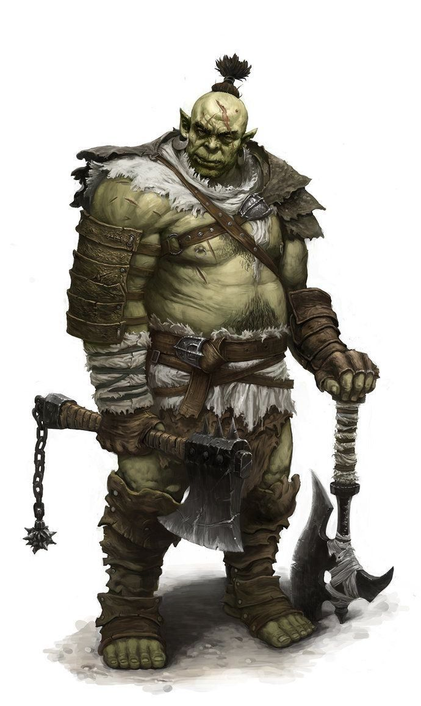

# Krater Ublee

## [Attributes](./../../../../../CoreRules/GeneralRules/Attributes.md) and [Core Skills](./../../../../../CoreRules/GeneralRules/CoreSkills.md)

| [STR](./../../../../../CoreRules/GeneralRules/Attributes.md#strength-str)    | 1 |    | [RFX](./../../../../../CoreRules/GeneralRules/Attributes.md#reflex-rfx)        | 0 |    | [INT](./../../../../../CoreRules/GeneralRules/Attributes.md#intelligence-int)                | 0 |    |
| ------------------------------------------------------------------------- | :-: | :-: | --------------------------------------------------------------------------- | :-: | :-: | ----------------------------------------------------------------------------------------- | :-: | :-: |
| [Athletics](./../../../../../CoreRules/GeneralRules/CoreSkills.md#athletics) | 1 | 5d6 | [Dexterity](./../../../../../CoreRules/GeneralRules/CoreSkills.md#dexterity)   | 0 | 3d6 | [Communication](./../../../../../CoreRules/GeneralRules/CoreSkills.md#communication)         | 0 | 3d6 |
| (Deprecated)                                                              | 1 | 5d6 | [Perception](./../../../../../CoreRules/GeneralRules/CoreSkills.md#perception) | 0 | 3d6 | [General Knowledge](./../../../../../CoreRules/GeneralRules/CoreSkills.md#general-knowledge) | 0 | 3d6 |
| [Endurance](./../../../../../CoreRules/GeneralRules/CoreSkills.md#endurance) | 1 | 5d6 | (Deprecated)                                                                | 0 | 3d6 | (Deprecated)                                                                              | 1 | 4d6 |
| [Lift](./../../../../../CoreRules/GeneralRules/CoreSkills.md#lift)           | 1 | 5d6 | [Stealth](./../../../../../CoreRules/GeneralRules/CoreSkills.md#stealth)       | 0 | 3d6 | [Will](./../../../../../CoreRules/GeneralRules/CoreSkills.md#will)                           | 0 | 3d6 |

## [Vocations](./../../../../../CoreRules/GeneralRules/Vocations.md) and [Vocation Skills](./../../../../../CoreRules/GeneralRules/Vocations.md#vocation-skills)

| Fellcaster Woodsman | STR, RFX, INT | 1 | 5d6 |
| ------------------- | :-----------: | :-: | :-: |
| Large Melee         | STR, RFX, INT | 1 | 5d6 |
| Naturecraft         | STR, RFX, INT | 1 | 5d6 |
| Polycraft           | STR, RFX, INT | -1 | 3d6 |
| Fellcraft Skill     | STR, RFX, INT | -1 | 3d6 |

## Info

|                                                  Name                                                  |                          Info                          | Duration |                      Source                      |
| :-----------------------------------------------------------------------------------------------------: | :----------------------------------------------------: | :------: | :----------------------------------------------: |
|                 [Level](./../../../../../CoreRules/CharacterCreationRules/TiersOfPlay.md)                 |                           4                           |          |                                                  |
|                          [Language](./../../../Languages/Languages.md): Babelish                          |                  Can speak Babelish.                  |          |                                                  |
|                               [Language](./../../../Languages/Languages.md):                               |                      Can speak .                      |          |                                                  |
| [Disabling Characteristic](./../../../../../CoreRules/CharacterCreationRules/DisablingCharacteristics.md): |                                                        |          |                                                  |
|                                                                                                        |                                                        |          |                                                  |
|           [Equipment Weight](./../../../../../CoreRules/AdvancedRules/CarryWeight.md#equipment)           |                         59 lb                         |          |                    Equipment                    |
|            [Carry Weight](./../../../../../CoreRules/AdvancedRules/CarryWeight.md#carry-weight)            |                         250 lb                         |          |        +50 lbs Carry Weight per Lift dice        |
|           [Light Weight](./../../../../../CoreRules/AdvancedRules/CarryWeight.md#weight-classes)           |          -0d6 to STR/RFX governed Dice Pools          |          |  0% =< Equipment Weight <= 25% of Carry Weight  |
|                                                                                                        |                                                        |          |                                                  |
|          [Minor Silver Weakness](./../../../../../CoreRules/CombatRules/WeaknessAndResistance.md)          | +1 to the level of injury received from Silver damage. |          |                    Fellblood                    |
| [Physical Defense Level](./../../../../../CoreRules/CombatRules/DefenseAndPenetration.md#physical-defense) |                           4                           |          |                      Armor                      |
|                                                                                                        |                                                        |          |                                                  |
|                  [Size](./../../../../../CoreRules/CombatRules/BattleMap.md#size): Medium                  |                 5x5 ft on battle map.                 |          |                                                  |
|      [Terrestrial Combat Speed](./../../../../../CoreRules/CombatRules/CombatSpeed.md#combat-speeds)      |                         50 ft                         |          | +10 ft (per Athletics Dice), +/-10 ft (per RFX) |
|          [Swim Combat Speed](./../../../../../CoreRules/CombatRules/CombatSpeed.md#combat-speeds)          |                         25 ft                         |          |  +5 ft (per Athletics Dice), +/-5 ft (per RFX)  |
|         [Climb Combat Speed](./../../../../../CoreRules/CombatRules/CombatSpeed.md#combat-speeds)         |                         25 ft                         |          |  +5 ft (per Athletics Dice), +/-5 ft (per RFX)  |
|                                                                                                        |                                                        |          |                                                  |
|            [Magic Resource](./../../../../../CoreRules/MagicRules/MagicResource.md): Fellblood            |                          4/5                          |          |       Vocation/Magic Governing Skill Level       |
|                 [Destiny Points](./../../../../../CoreRules/GeneralRules/DestinyPoints.md)                 |                          2/3                          |          |               Awarded by Narrator               |
|                      [Injury](./../../../../../CoreRules/CombatRules/Injury.md): None                      |             – 0 dice to all dice checks.             |          |                      Damage                      |

## [Combat Rolls](./../../../../../CoreRules/CombatRules/CombatRolls.md)

- [Victory Levels link](./../../../../../CoreRules/CombatRules/VictoryLevels.md)

### [Weapons](./../../../../../CoreRules/CombatRules/Weapons.md)

|             Name             | [One Handed](./../../../../../CoreRules/CombatRules/Weapons.md#one-handed) | [Two Handed](./../../../../../CoreRules/CombatRules/Weapons.md#two-handed) | [Dual Wielded](./../../../../../CoreRules/CombatRules/Weapons.md#dual-wielded) | [Penetration](./../../../../../CoreRules/CombatRules/DefenseAndPenetration.md#penetration) | [Range](./../../../../../CoreRules/CombatRules/Range.md) | [Engageable Opponents](./../../../../../CoreRules/CombatRules/EngageableOpponents.md) | [Area Of Effect](./../../../../../CoreRules/CombatRules/AreaOfEffect.md) | [Ammo Type](./../../../../../CoreRules/CombatRules/Ammunitions.md#ammo-type) | [Ammo Per Use](./../../../../../CoreRules/CombatRules/Weapons.md#ammo-per-shot) | [Damage Types](./../../../../../CoreRules/CombatRules/DamageTypes.md) |
| :--------------------------: | :--------------------------------------------------------------------------------: | :--------------------------------------------------------------------------------: | :------------------------------------------------------------------------------------: | :-------------------------------------------------------------------------------------: | :---------------------------------------------------: | :-------------------------------------------------------------------------------------: | :------------------------------------------------------------------------: | :-------------------------------------------------------------------------------------------: | :----------------------------------------------------------------------------------------------: | :---------------------------------------------------------------------: |
|           Unarmed           |                                   -1 (3d6)                                   |                                        None                                        |                                    +0d6 (3d6)                                    |                                            0                                            |                         Melee                         |                                          Rapid                                          |                                                                            |                                             None                                             |                                                                                                  |                                Bludgeon                                |
|   Hand Protection Unarmed   |                                  +0d6 (4d6)                                  |                                        None                                        |                                    +0d6 (4d6)                                    |                                            0                                            |                         Melee                         |                                          Rapid                                          |                                                                            |                                             None                                             |                                                                                                  |                                Bludgeon                                |
| Frostbark - Large Hafted Axe |                                +1d6 (3d8, 3d6)                                |                                +3d6 (3d8, 5d6)                                |                                          None                                          |                                            2                                            |                         Melee                         |                                          Rapid                                          |                                                                            |                                             None                                             |                                                                                                  |                                   Hew                                   |
|      Large Hafted Blunt      |                                   -1 (4d6)                                   |                                  +1d6 (6d6)                                  |                                          None                                          |                                            5                                            |                         Melee                         |                                          Rapid                                          |                                                                            |                                             None                                             |                                                                                                  |                                Bludgeon                                |

#### [Ammunitions](./../../../../../CoreRules/CombatRules/Ammunitions.md)

| Name | [Ammo Type](./../../../../../CoreRules/CombatRules/Ammunitions.md#ammo-type) | [Dice Pool Mod](./../../../../../CoreRules/CombatRules/Ammunitions.md#dice-pool-mod) | [Base Dice Tier Adjustment](./../../../../../CoreRules/CombatRules/Ammunitions.md#resource-dice) | [Penetration](./../../../../../CoreRules/CombatRules/Ammunitions.md#penetration) | [Range](./../../../../../CoreRules/CombatRules/Ammunitions.md#range) | [Damage Types](./../../../../../CoreRules/CombatRules/Ammunitions.md#damage-types) | [Area Of Effect](./../../../../../CoreRules/CombatRules/Ammunitions.md#area-of-effect) |
| :--: | :-------------------------------------------------------------------------------------------: | :-----------------------------------------------------------------------------------------: | :-----------------------------------------------------------------------------------------------------: | :-------------------------------------------------------------------------------------: | :-------------------------------------------------------------------------: | :--------------------------------------------------------------------------------------------: | :------------------------------------------------------------------------------------------------: |
|      |                                                                                              |                                                                                            |                                                                                                        |                                                                                        |                                                                            |                                                                                                |                                                                                                    |

### Melee Weapon Spells

|        Name        | [One Handed](./../../../../../CoreRules/CombatRules/Weapons.md#one-handed) | [Two Handed](./../../../../../CoreRules/CombatRules/Weapons.md#two-handed) | [Dual Wielded](./../../../../../CoreRules/CombatRules/Weapons.md#dual-wielded) | [Penetration](./../../../../../CoreRules/CombatRules/DefenseAndPenetration.md#penetration) | [Range](./../../../../../CoreRules/CombatRules/Range.md) | [Engageable Opponents](./../../../../../CoreRules/CombatRules/EngageableOpponents.md) | [Area Of Effect](./../../../../../CoreRules/CombatRules/AreaOfEffect.md) | [Magic Resource](./../../../../../CoreRules/MagicRules/MagicResource.md) | [Damage Types](./../../../../../CoreRules/CombatRules/DamageTypes.md) |
| :-----------------: | :--------------------------------------------------------------------------------: | :--------------------------------------------------------------------------------: | :------------------------------------------------------------------------------------: | :-------------------------------------------------------------------------------------: | :---------------------------------------------------: | :-------------------------------------------------------------------------------------: | :------------------------------------------------------------------------: | :------------------------------------------------------------------------: | ----------------------------------------------------------------------- |
|     Magic Glove     |                                        +0d6                                        |                                        None                                        |                                          +1d6                                          |                                            0                                            |                         Melee                         |                                          Rapid                                          |                                    None                                    |                                     0                                     |                                                                         |
| Magic Small Thrust |                                        +0d6                                        |                                        None                                        |                                          +1d6                                          |                                            2                                            |                         Melee                         |                                          Rapid                                          |                                    None                                    |                                     0                                     |                                                                         |
|  Magic Small Slash  |                                        +1d6                                        |                                        None                                        |                                          +1d6                                          |                                            0                                            |                         Melee                         |                                          Rapid                                          |                                    None                                    |                                     0                                     |                                                                         |
|                    |                                                                                    |                                                                                    |                                                                                        |                                                                                        |                                                      |                                                                                        |                                                                            |                                                                            |                                                                         |
| Magic Medium Slash |                                        +2d6                                        |                                        +3d6                                        |                                          +1d6                                          |                                            1                                            |                         Melee                         |                                          Rapid                                          |                                    None                                    |                                     1                                     |                                                                         |
| Magic Medium Thrust |                                        +1d6                                        |                                        +2d6                                        |                                          +1d6                                          |                                            2                                            |                         Melee                         |                                          Rapid                                          |                                    None                                    |                                     1                                     |                                                                         |
| Magic Medium Smash |                                        +0d6                                        |                                        +1d6                                        |                                          +1d6                                          |                                            4                                            |                         Melee                         |                                          Rapid                                          |                                    None                                    |                                     1                                     |                                                                         |
| Magic Medium Spear |                                        +2d6                                        |                                        None                                        |                                          +1d6                                          |                                            2                                            |                         Melee                         |                                       Rapid Max 2                                       |                                    None                                    |                                     1                                     |                                                                         |
|     Magic Whip     |                                        +1d6                                        |                                        None                                        |                                          +1d6                                          |                                            0                                            |                         Reach                         |                                          Rapid                                          |                                    None                                    |                                     1                                     |                                                                         |
|                    |                                                                                    |                                                                                    |                                                                                        |                                                                                        |                                                      |                                                                                        |                                                                            |                                                                            |                                                                         |
|  Magic Large Slash  |                                        +1d6                                        |                                        +3d6                                        |                                          None                                          |                                            2                                            |                         Melee                         |                                          Rapid                                          |                                    None                                    |                                     2                                     |                                                                         |
| Magic Large Thrust |                                        +0d6                                        |                                        +2d6                                        |                                          None                                          |                                            3                                            |                         Melee                         |                                          Rapid                                          |                                    None                                    |                                     2                                     |                                                                         |
|  Magic Large Smash  |                                         -1                                         |                                        +1d6                                        |                                          None                                          |                                            5                                            |                         Melee                         |                                          Rapid                                          |                                    None                                    |                                     2                                     |                                                                         |
|  Magic Large Spear  |                                        +2d6                                        |                                        +3d6                                        |                                          None                                          |                                            3                                            |                         Melee                         |                                       Rapid Max 2                                       |                                    None                                    |                                     2                                     |                                                                         |
|                    |                                                                                    |                                                                                    |                                                                                        |                                                                                        |                                                      |                                                                                        |                                                                            |                                                                            |                                                                         |
|  Magic Reach Slash  |                                         -2                                         |                                        +4d6                                        |                                          None                                          |                                            3                                            |                         Reach                         |                                          Rapid                                          |                                    None                                    |                                     3                                     |                                                                         |
| Magic Reach Thrust |                                         -2                                         |                                        +3d6                                        |                                          None                                          |                                            4                                            |                         Reach                         |                                          Rapid                                          |                                    None                                    |                                     3                                     |                                                                         |
|  Magic Reach Smash  |                                         -2                                         |                                        +2d6                                        |                                          None                                          |                                            5                                            |                         Reach                         |                                          Rapid                                          |                                    None                                    |                                     3                                     |                                                                         |
|  Magic Reach Spear  |                                         -2                                         |                                        +4d6                                        |                                          None                                          |                                            4                                            |                         Reach                         |                                       Rapid Max 2                                       |                                    None                                    |                                     3                                     |                                                                         |

### Ranged Weapon Spells

|        Name        | [One Handed](./../../../../../CoreRules/CombatRules/Weapons.md#one-handed) | [Two Handed](./../../../../../CoreRules/CombatRules/Weapons.md#two-handed) | [Dual Wielded](./../../../../../CoreRules/CombatRules/Weapons.md#dual-wielded) | [Penetration](./../../../../../CoreRules/CombatRules/DefenseAndPenetration.md#penetration) | [Range](./../../../../../CoreRules/CombatRules/Range.md) | [Engageable Opponents](./../../../../../CoreRules/CombatRules/EngageableOpponents.md) | [Area Of Effect](./../../../../../CoreRules/CombatRules/AreaOfEffect.md) | [Magic Resource](./../../../../../CoreRules/MagicRules/MagicResource.md) | [Damage Types](./../../../../../CoreRules/CombatRules/DamageTypes.md) |
| :-----------------: | :--------------------------------------------------------------------------------: | :--------------------------------------------------------------------------------: | :------------------------------------------------------------------------------------: | :-------------------------------------------------------------------------------------: | :---------------------------------------------------: | :-------------------------------------------------------------------------------------: | :------------------------------------------------------------------------: | :------------------------------------------------------------------------: | ----------------------------------------------------------------------- |
|             Name             | [One Handed](./../../../../../CoreRules/CombatRules/Weapons.md#one-handed) | [Two Handed](./../../../../../CoreRules/CombatRules/Weapons.md#two-handed) | [Dual Wielded](./../../../../../CoreRules/CombatRules/Weapons.md#dual-wielded) | [Penetration](./../../../../../CoreRules/CombatRules/DefenseAndPenetration.md#penetration) | [Range](./../../../../../CoreRules/CombatRules/Range.md) | [Engageable Opponents](./../../../../../CoreRules/CombatRules/EngageableOpponents.md) | [Area Of Effect](./../../../../../CoreRules/CombatRules/AreaOfEffect.md) | [Magic Resource](./../../../../../CoreRules/MagicRules/MagicResource.md) | [Damage Types](./../../../../../CoreRules/CombatRules/DamageTypes.md) |
| :---------------------------: | :--------------------------------------------------------------------------------: | :--------------------------------------------------------------------------------: | :------------------------------------------------------------------------------------: | :-------------------------------------------------------------------------------------: | :---------------------------------------------------: | :-------------------------------------------------------------------------------------: | :------------------------------------------------------------------------: | :------------------------------------------------------------------------: | ----------------------------------------------------------------------- |
|          Magic Dart          |                                        +0d6                                        |                                        None                                        |                                          +1d6                                          |                                            0                                            |                         Short                         |                                          Quick                                          |                                                                            |                                     0                                     |                                                                         |
|          Magic Sling          |                                        +0d6                                        |                                        None                                        |                                          None                                          |                                            1                                            |                        Medium                        |                                        Standard                                        |                                                                            |                                     0                                     |                                                                         |
|                              |                                                                                    |                                                                                    |                                                                                        |                                                                                        |                                                      |                                                                                        |                                                                            |                                                                            |                                                                         |
|         Magic Javelin         |                                        +1d6                                        |                                        None                                        |                                          +1d6                                          |                                            2                                            |                        Medium                        |                                        Standard                                        |                                                                            |                                     1                                     |                                                                         |
|        Magic Hand Bolt        |                                        +1d6                                        |                                        None                                        |                                          +1d6                                          |                                            0                                            |                        Medium                        |                                        Standard                                        |                                                                            |                                     1                                     |                                                                         |
|          Magic Bolt          |                                        None                                        |                                        +1d6                                        |                                          None                                          |                                            2                                            |                          Far                          |                                         Loading                                         |                                                                            |                                     1                                     |                                                                         |
|          Magic Arrow          |                                        None                                        |                                        +1d6                                        |                                          None                                          |                                            1                                            |                          Far                          |                                          Quick                                          |                                                                            |                                     1                                     |                                                                         |
|       Magic Close Cone       |                                        None                                        |                                        +1d6                                        |                                          None                                          |                                            3                                            |                      Close Cone                      |                                            1                                            |                           Close Cone Calculation                           |                                     1                                     |                                                                         |
|                              |                                                                                    |                                                                                    |                                                                                        |                                                                                        |                                                      |                                                                                        |                                                                            |                                                                            |                                                                         |
|  Magic Penetrating Hand Bolt  |                                        +1d6                                        |                                        None                                        |                                          +1d6                                          |                                            1                                            |                        Medium                        |                                        Standard                                        |                                                                            |                                     2                                     |                                                                         |
|    Magic Penetrating Bolt    |                                        None                                        |                                        +1d6                                        |                                          None                                          |                                            3                                            |                          Far                          |                                         Loading                                         |                                                                            |                                     2                                     |                                                                         |
|    Magic Penetrating Arrow    |                                        None                                        |                                        +1d6                                        |                                          None                                          |                                            2                                            |                          Far                          |                                          Quick                                          |                                                                            |                                     2                                     |                                                                         |
|      Magic Great Javelin      |                                        +1d6                                        |                                        None                                        |                                          None                                          |                                            3                                            |                         Short                         |                                        Standard                                        |                                                                            |                                     2                                     |                                                                         |
|       Magic Great Bolt       |                                        None                                        |                                        +2d6                                        |                                          None                                          |                                            3                                            |                         Long                         |                                     Complex Loading                                     |                                                                            |                                     2                                     |                                                                         |
|       Magic Medium Cone       |                                        None                                        |                                        +1d6                                        |                                          None                                          |                                            3                                            |                      Medium Cone                      |                                            1                                            |                          Medium Cone Calculation                          |                                     2                                     |                                                                         |
|                              |                                                                                    |                                                                                    |                                                                                        |                                                                                        |                                                      |                                                                                        |                                                                            |                                                                            |                                                                         |
| Magic Penetrating Great Bolt |                                        None                                        |                                        +2d6                                        |                                          None                                          |                                            4                                            |                         Long                         |                                     Complex Loading                                     |                                                                            |                                     3                                     |                                                                         |
|       Magic Great Arrow       |                                        None                                        |                                        +2d6                                        |                                          None                                          |                                            3                                            |                     Sharpshooter                     |                                        Standard                                        |                                                                            |                                     3                                     |                                                                         |
|      Magic Medium Sphere      |                                        None                                        |                                        +2d6                                        |                                          None                                          |                                            3                                            |                         Long                         |                                            1                                            |                         Medium Sphere Calculation                         |                                     3                                     |                                                                         |
|                              |                                                                                    |                                                                                    |                                                                                        |                                                                                        |                                                      |                                                                                        |                                                                            |                                                                            |                                                                         |
| Magic Penetrating Great Arrow |                                        None                                        |                                        +2d6                                        |                                          None                                          |                                            4                                            |                     Sharpshooter                     |                                        Standard                                        |                                                                            |                                     4                                     |                                                                         |                                       None                                          |                                            3                                            |                         Long                         |                                            1                                            |                             Sphere Calculation                             |                                     3                                     |                                                                         |

### [Shield Spells](./../../../../../CoreRules/MagicRules/Spells.md#shield-spells)

|     Name     | Class |                                   Effect                                   | Magic Resource |
| :-----------: | :----: | :-------------------------------------------------------------------------: | :-----------------: |
| Small Shield | Shield | Phy. Def. 1.00, Bodily Def. 1.00, Spiritual Def. 1.00, or Mental Def. 1.00 |          0          |
| Medium Shield | Shield | Phy. Def. 2.00, Bodily Def. 2.00, Spiritual Def. 2.00, or Mental Def. 2.00 |          1          |
| Large Shield | Shield | Phy. Def. 3.00, Bodily Def. 3.00, Spiritual Def. 3.00, or Mental Def. 3.00 |          2          |

## [Spells Known](./../../../../../CoreRules/MagicRules/Spells.md)

### [Novice Spells (CL 0)](./../../../../../CoreRules/MagicRules/Spells.md#novice-spells-cl-0)

### [Apprentice Spells (CL 1-2)](./../../../../../CoreRules/MagicRules/Spells.md#apprentice-spells-cl-1---2)

- Mend Wounds
- Talk With Animals
- Entangle
- Ranged Healing

### [Adept (CL 3-4)](./../../../../../CoreRules/MagicRules/Spells.md#adept-spells-cl-3---4)

### [Expert (CL 5-6)](./../../../../../CoreRules/MagicRules/Spells.md#expert-spells-cl-5---6)

### [Master (CL 7-8)](./../../../../../CoreRules/MagicRules/Spells.md#master-spells-cl-7---8)

### [Legendary (CL 9+)](./../../../../../CoreRules/MagicRules/Spells.md#legendary-spells-cl-9)

## [Equipment](./../../../../../CoreRules/AdvancedRules/CarryWeight.md#equipment)

| Name            | # |      [Class](./../../../../../CoreRules/AdvancedRules/ItemClass.md)      | [Effect](./../../../../../CoreRules/AdvancedRules/ItemEffects.md) | [Tier](./../../../../../CoreRules/AdvancedRules/ItemTier.md) | [Durability](./../../../../../CoreRules/AdvancedRules/ItemDurability.md) | [LB](./../../../../../CoreRules/AdvancedRules/CarryWeight.md) | [Value](./../../../Items/ItemShop.md#currency) |
| --------------- | :-: | :-------------------------------------------------------------------: | -------------------------------------------------------------- | :-------------------------------------------------------: | :-------------------------------------------------------------------: | :--------------------------------------------------------: | :-----------------------------------------: |
| Gambeson Armor  | 1 |                   Body Armor, Arm Armor, Leg Armor                   | Phy. Def. 1.00                                                 |                          Mundane                          |                                 12/12                                 |                             8                             |                    5 bc                    |
| Chainmail Armor | 1 | Head Armor, Body Armor, Arm Armor, Leg Armor, Hand Protection Unarmed | Phy. Def. 3.00                                                 |                         Excellent                         |                                 21/21                                 |                             47                             |                    75 bp                    |
| Frostbark       | 1 |            Excellent Large Hafted Axe, Spellcasting Focus            | Cold Enchantment                                               |                         Excellent                         |                                 21/21                                 |                             4                             |                    ? bc                    |

## [Containers](./../../../../../CoreRules/AdvancedRules/Containers.md)

| Name                  | # | [Class](./../../../../../CoreRules/AdvancedRules/ItemClass.md) | [Effect](./../../../../../CoreRules/AdvancedRules/ItemEffects.md) | [Tier](./../../../../../CoreRules/AdvancedRules/ItemTier.md) | [Durability](./../../../../../CoreRules/AdvancedRules/ItemDurability.md) | [LB](./../../../../../CoreRules/AdvancedRules/CarryWeight.md) | [Value](./../../../Items/ItemShop.md#currency) |
| --------------------- | :-: | :---------------------------------------------------------: | -------------------------------------------------------------- | :-------------------------------------------------------: | :-------------------------------------------------------------------: | :--------------------------------------------------------: | :-----------------------------------------: |
| Backpack              | 1 |                       30 lb container                       |                                                                |                          Mundane                          |                                                                      |                             5                             |                    2 bc                    |
| Great Club            | 1 |                     Large Hafted Blunt                     |                                                                |                          Mundane                          |                                 12/12                                 |                             10                             |                    20 cc                    |
| Dane Axe              | 1 |                      Large Hafted Axe                      |                                                                |                          Mundane                          |                                 12/12                                 |                             4                             |                    11 bc                    |
| Lavender Lancer Scarf | 1 |                                                            |                                                                |                          Mundane                          |                                                                      |                            0.5                            |                    50 cc                    |
| Bronze Coin           | 2 |                                                            |                                                                |                          Mundane                          |                                                                      |                            0.02                            |                    1 bc                    |
| Copper Coin           | 67 |                                                            |                                                                |                          Mundane                          |                                                                      |                            0.02                            |                    1 cc                    |
| Handaxe               | 3 |          Small Hafted Axe, Thrown Small Hafted Axe          |                                                                |                          Mundane                          |                                 12/12                                 |                             2                             |                    5 bc                    |

| Name           |  #  | [Class](./../../../../../CoreRules/AdvancedRules/ItemClass.md) | [Effect](./../../../../../CoreRules/AdvancedRules/ItemEffects.md) | [Tier](./../../../../../CoreRules/AdvancedRules/ItemTier.md) | [Durability](./../../../../../CoreRules/AdvancedRules/ItemDurability.md) | [LB](./../../../../../CoreRules/AdvancedRules/CarryWeight.md) | [Value](./../../../Items/ItemShop.md#currency) |
| -------------- | :--: | :---------------------------------------------------------: | -------------------------------------------------------------- | :-------------------------------------------------------: | :-------------------------------------------------------------------: | :--------------------------------------------------------: | :-----------------------------------------: |
| Chest          |  1  |                      300 lb container                      |                                                                |                          Mundane                          |                                                                      |                             25                             |                    5 bc                    |
| Bronze Coin    |  61  |                                                            |                                                                |                          Mundane                          |                                                                      |                            0.02                            |                    1 bc                    |
| Copper Coin    | 2550 |                                                            |                                                                |                          Mundane                          |                                                                      |                            0.02                            |                    1 cc                    |
| Perfume (vial) |  3  |                                                            |                                                                |                          Mundane                          |                                                                      |                            0.1                            |                    10 bc                    |

## Notes

## Appearance

Age: 23

Race: Ogrekin

Height: 6' 5"

Weight: 260 lb

Body Type: Chubby

Hair Color: Red

Eye Color: Brown

Additional Details: happy to be here

## Disposition

- Stubborn
- Reserved
- Serious

## Beliefs/Morality

* Believes his father's ghost is anchored to his soul.
* The dead stay with you after they die.
* Family is everything.

## Goals/Aspirations

* Provide for his mother.
* Raise a family.
* Work on stretching (touching his toes).

## Backstory

Krater grew up in the vast Ironwood forest to the east of Reddwall known as Irongrove. His family worked at one of the remote lumberyards responsible for the harvesting and exporting of ironwood. Tragedy struck Karter's family when he was but a boy, when his father was killed in a tragic accident. Krater, traumatized by the event, began to see delusions of his father as he was in life walking around. He will ofter talk with him, even though his mother his told him he isn't real. Krater knows he isn't material, though believes his father's spirit follows him.

Left without a father figure, Burrow Bard Stoneseeker, the owner and financier of the lumberyard operation took Krater under his wing the best he could. Krater emulated his now father figure, becoming stubborn and difficult to compromise with.

Krater grew to be quite the lumberman and proficient with his axe, working hard and always meeting quota. When his mother's health began deteriorating, he saved his salary, enough to eventually move him and his mom towards Reddwall to seek better healthcare for his mother's strange disease. Burrowbard, kind as ever, helped them find a place, haggle down the price, and would frequently check in on the two. Krater, well versed in the Ironwood trade, worked for Burrowbard at one of his Ironwood export docks.

Jotun Prayer:
"Give yourself to Terra, soak in the suns glow,
with the end of you another grows.
May we meet again."
