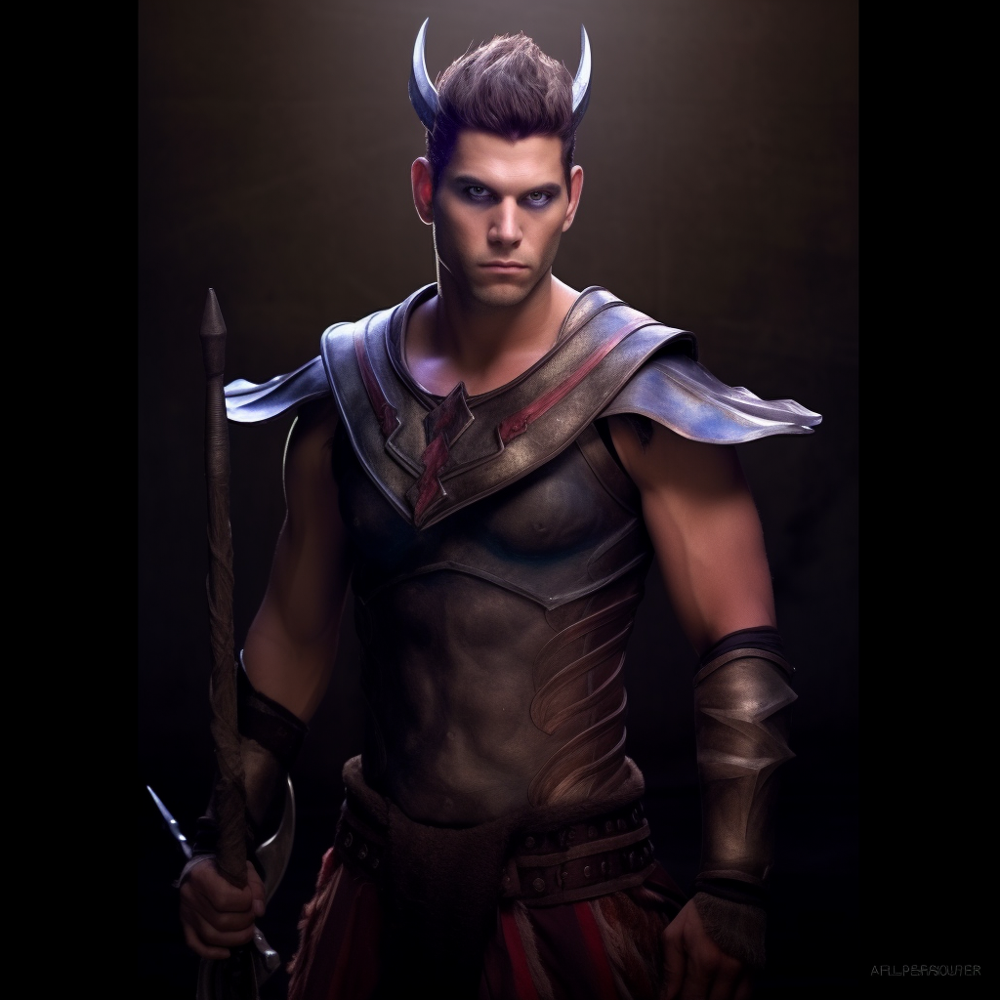

# Krexis

## Attributes and Core Skills

| STR       |   1   |       | RFX             |   0   |       | INT               |   0   |       |
| --------- | :---: | :---: | --------------- | :---: | :---: | ----------------- | :---: | :---: |
| Athletics |   0   |  4d6  | Acrobatics      |   0   |  3d6  | Communication     |   0   |  3d6  |
| Climb     |   0   |  4d6  | Perception      |   0   |  3d6  | General Knowledge |   0   |  3d6  |
| Endurance |   1   |  5d6  | Sleight of Hand |   0   |  3d6  | Survival          |   0   |  3d6  |
| Lift      |   0   |  4d6  | Stealth         |   1   |  4d6  | Will         |   0   |  3d6  |

## Vocations and Vocational Skills

| Fighter {STR}       |   2   |  6d6  | Fellcaster {STR, RFX, INT}   | 1   | 5d6 |
| ------------------- | :---: | :---: | --------------- | --- | --- |
| Medium Hafted {STR, RFX, INT} |   2   |  6d6  | Soulcraft {STR, RFX, INT} | 1   | 5d6 |

## Effects

|          Name           |                            Effect                             | Duration |                                                                  Source                                                                  |
| :---------------------: | :-----------------------------------------------------------: | :------: | :--------------------------------------------------------------------------------------------------------------------------------------: |
|  Minor Silver Weakness  | +1 to the level of injury received from Silver damage. |          |                                                              Fellblood                                                               |
| Physical Defense Level  |                               6                               |          |                                                                  Armor                                                                   |
|       Medium Size       |                     5x5 ft on battle map.                     |          |                                                                                                                                          |
|   Language: Babelish    |                      Can speak Babelish.                      |          |                                                                                                                                          |
|   Language: Draconic    |                      Can speak Draconic.                      |          |                                                                                                                                          |
|  Disabling: Addiction   |                 Addicted to attractive women.                 |          |                                                                                                                                          |
|   Disabling: Amnesia    |                 Can't remember who they were.                 |          |                                                                                                                                          |
|    Equipment Weight     |                             55 lb                             |          |                                                                Equipment                                                                 |
|  Carry Weight  |                            220 lb                             |          | +50 lbs Carry Weight per Lift dice |
|      Light Weight       |                -0d6 to STR/RFX governed Dice Pools                |          |                                                         0% - 25% of carry weight                                                         |
| Terrestrial Combat Speed |                             30 ft                             |          |                                        +10 ft (per Athletics Dice), +/-10 ft (per RFX)                                         |
|   Swim Combat Speed   |                             15 ft                             |          |                                        +5 ft (per Athletics Dice), +/-5 ft (per RFX)                                         |
|  Climb Combat Speed   |                             15 ft                             |          |                                           +5 ft (per Climb Dice), +/-5 ft (per RFX)                                           |

## Combat Rolls

|           Name           | One Handed | Two Handed | Dual Wielded | Penetration | Range  | Damage Types | Engageable Opponents | Area Of Effect | Resource Class |
| :----------------------: | :-------------: | :-------------: | :---------------: | :---------: | :----: | :---------------: | :-----------------------: | :-----------------: | :-----------------: |
| Soulcraft - Melee Trick  |       5d6       |                 |                   |      0      | Melee  |                   |           Rapid           |                     |        None         |
| Soulcraft - Ranged Trick |       5d6       |                 |                   |      0      | Medium |                   |         Standard          |                     |        None         |
|    Soulcraft - Melee     |       6d6       |                 |                   |      2      | Melee  |                   |           Rapid           |                     |      1 (Fellblood)      |
|    Soulcraft - Ranged    |       6d6       |                 |                   |      1      | Medium |                   |         Standard          |                     |      1 (Fellblood)      |
|     Soulcraft - Cone     |       6d6       |                 |                   |      2      | Medium |                   |          1          |        Cone         |      1 (Fellblood)      |
|    Soulcraft - Reach     |       6d6       |                 |                   |      2      | Reach  |                   |           Rapid           |                     |      1 (Fellblood)      |
|   Soulcraft - 1    |       7d6       |                 |                   |      2      | Medium |                   |          1          |                     |      1 (Fellblood)      |
|    Medium Hafted Axe     | 7d6 (+1d6) | 8d6 (+2d6) |  8d6 (+1d6)  |      2      | Melee  |        Hew        |           Rapid           |        None         |        None         |

| Name  | Resource Class | Resource Dice | Penetration | Range | Damage Types | Area Of Effect |
| :---: | :-----------------: | :----------------: | :---------: | :---: | :---------------: | :-----------------: |
|       |                     |                    |             |       |                   |                     |

## Destiny Points: 0/3

## Magic Resource: 4/4

## Equipment

| Name |   #   | Class | Tier  | Durability |  LB   | Value |
| ---- | :---: | :---: | :---: | :--------: | :---: | :---: |
|      |       |       |       |            |       |       |

## Equipment:

| Name                          |   #   |       Class       |   Tier   | Durability |  LB   |  Value  |
| ----------------------------- | :---: | :---------------: | :------: | :--------: | :---: | :-----: |
| Chainmail Sleeves             |   1   |  Phy. Def. 0.75   | Mundane  |   12/12    |  11   | 11.2 bc |
| Chainmail Leggings            |   1   |  Phy. Def. 0.75   | Mundane  |   12/12    |  12   | 11.2 bc |
| Chainmail Coif                |   1   |  Phy. Def. 0.75   | Superior |   24/24    |   4   | 11.2 bc |
| Leather Cuirass and Pauldrons |   1   |   Phy. Def. 0.5   | Mundane  |   12/12    |   4   |  3 bc   |
| Gambeson Leggings             |   1   |   Phy. Def. 0.5   | Mundane  |   12/12    |   3   |  1 bc   |
| Gambeson Coat                 |   1   |    Phy. Def. 1    | Mundane  |   12/12    |   5   |  2 bc   |
| Clothes, Traveler's           |   1   |               | Mundane  |            |   4   |  2 bc   |
| Heater Shield                 |   1   |    Phy. Def. 2    | Mundane  |   12/12    |   8   |  7 bc   |
| Battleaxe                     |   1   | Medium Hafted Axe | Mundane  |   12/12    |   4   |  10 bc  |

## Containers

### Container Name

| Name |   #   | Class | Tier  | Durability |  LB   | Value |
| ---- | :---: | :---: | :---: | :--------: | :---: | :---: |
|      |       |       |       |            |       |       |

## Notes

## Appearance

Age: 29

Race: Dragonkin

Height: 5' 9"

Body Type: Athletic

Weight: 180 ? lb

Hair Color: Brown

Eyes Color: Brown

Additional Details:

## Disposition

- Goal Oriented
- Ladies Man
- Comedic

## Goals/Aspirations

- To discover his past.

## Backstory

After waking up in a prison with amnesia, with only the number on his back as his name, 11. Using his proficiency with the axe and shield, he and the fellow prisoner's ventured through the ancient dungeon. He and his fellow prisoners barely were able to recover the artifact that was required for their freedom.

After returning the artifact to the strange woman that had imprisoned them, they were knocked unconscious and left on the surface in the middle of a field. 11 and 13 decided to stick together. Both trying to ascertain their pasts and help others, they decided to join the Brother hood of silver, a guild dedicated to stop monsters.

11 decided to call himself Krexis, as for some odd reason it felt familiar.

Nivix is plagued by dreams of burning cities.

Krexis has an extreme addiction to beautiful women, going out of his way to seduce them.
