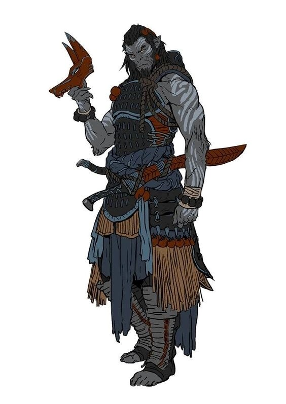

# Malgon Blackiron (Level 3)

## Attributes and Core Skills

| STR       | 1 |    | RFX             | 0 |    | INT               | 0 |    |
| --------- | :-: | :-: | --------------- | :-: | :-: | ----------------- | :-: | :-: |
| Athletics | 1 | 5d6 | Acrobatics      | 0 | 3d6 | Communication     | 0 | 3d6 |
| Climb     | 0 | 4d6 | Perception      | 1 | 4d6 | General Knowledge | 0 | 3d6 |
| Endurance | 0 | 4d6 | Sleight of Hand | 0 | 3d6 | Survival          | 0 | 3d6 |
| Lift      | 0 | 4d6 | Stealth         | 1 | 3d6 | Will              | 0 | 3d6 |

## Vocations and Vocational Skills

| Warrior {STR}               | 1 | 5d6 | Fellcaster {STR, RFX, INT} | 0  | 4d6 |
| ---------------------------- | :-: | :-: | -------------------------- | -- | --- |
| Large Hafted {STR, RFX, INT} | 1 | 5d6 | Cryocraft {STR, RFX, INT} | -1 | 3d6 |
| Heavy Bow {STR, RFX, INT}    | 1 | 5d6 |                            |    |     |
| Warrior Knowledge {INT}      |  | 4d6 |                            |    |     |

## Effects

|             Name             |                         Effect                         | Duration |                                                      Source                                                      |
| :---------------------------: | :----------------------------------------------------: | :------: | :---------------------------------------------------------------------------------------------------------------: |
|     Minor Silver Weakness     | +1 to the level of injury received from Silver damage. |          |                                                   Fellkin blood                                                   |
|    Physical Defense Level    |                           3                           |          |                                                       Armor                                                       |
|          Medium Size          |                 5x5 ft on battle map.                 |          |                                                                                                                  |
|      Language: Babelish      |                  Can speak Babelish.                  |          |                                                                                                                  |
|       Language: Primal       |                   Can speak Primal.                   |          |                                                                                                                  |
| Disabling: Incapable of Lying |       His people do not lie and neither does he.       |          |                                                                                                                  |
|       Equipment Weight       |                       34.35 lb                       |          |                                                     Equipment                                                     |
|     Humanoid Carry Weight     |                         220 lb                         |          | 120 lb (Base), +100 lb positive STR, -50 lb negative STR, +40 lb positive Lift, - 20 lb negative Lift |
|         Light Weight         |            -0d6 to STR/RFX governed skills            |          |                                             0% - 25% of carry weight                                             |
|    Humanoid Movement Speed    |                         35 ft                         |          |                             30 ft (Base), +/-10 ft (per RFX), +/-5 ft (per Athletics)                             |
|      Humanoid Swim Speed      |                         25 ft                         |          |                             15 ft (Base), +/-5 ft (per STR), +/-5 ft (per Athletics)                             |
|     Humanoid Climb Speed     |                         20 ft                         |          |                               15 ft (Base), +/-5 ft (per STR), +/-5 ft (per Climb)                               |

## Combat Rolls

### Weapons

|        Name        | One Handed | Two Handed | Dual Wielded | Penetration |    Range    | Damage Types | Engageable Opponents | Area Of Effect | Resource Class |
| :-----------------: | :-------------: | :-------------: | :---------------: | :---------: | :----------: | :---------------: | :-----------------------: | :-----------------: | :-----------------: |
|      Heavy Bow      |      None      | 7d6 (+2d6) |       None       |      2      | Sharpshooter |                  |         Standard         |        None        |        Arrow        |
|  Large Hafted Axe  | 5d6 (+0d6) | 8d6 (+3d6) |       None       |      2      |    Melee    |        Hew        |           Rapid           |        None        |        None        |
| Medium Hafted Point | 5d6 (+1d6) | 6d6 (+2d6) |  7d6 (+1d6)  |      2      |    Melee    |      Pierce      |           Rapid           |        None        |        None        |
| Medium Hafted Blunt | 4d6 (+0d6) | 5d6 (+1d6) |  6d6 (+1d6)  |      4      |    Melee    |     Bludgeon     |           Rapid           |        None        |        None        |

|      Name      | Resource Class | Resource Dice | Penetration | Range | Damage Types | Area Of Effect |
| :------------: | :-----------------: | :----------------: | :---------: | :---: | :---------------: | :-----------------: |
| Standard Arrow |        Arrow        |  8d6 (+1d6)  |      1      | None |      Pierce      |        None        |

### Combat Spells

|                                                    Name                                                    | One Handed | Two Handed | Dual Wielded | Penetration |    Range    | Damage Types | Engageable Opponents | Area Of Effect | Resource Class |
| :--------------------------------------------------------------------------------------------------------: | :-------------: | :-------------: | :---------------: | :---------: | :----------: | :---------------: | :-----------------------: | :-----------------: | :------------------: |
|     [Generic Party Trick](./../../../../../CoreRules/MagicRules/Spells/PartyTricks/GenericPartyTrick.md)     |                |                |                  |            |     Near     |       Cold       |                          |                    |   0 Magic Resource   |
|       [Generic Novice Spell](./../../../../../CoreRules/MagicRules/Spells/Novice/GenericNoviceSpell.md)       |                |                |                  |            |    Medium    |       Cold       |                          |                    |  0 Magic Resource  |
| [Generic Apprentice Spell](./../../../../../CoreRules/MagicRules/Spells/Apprentice/GenericApprenticeSpell.md) |                |                |                  |            |  Far - Long  |       Cold       |                          |                    | 1 - 2 Magic Resource |
|        [Generic Adept Spell](./../../../../../CoreRules/MagicRules/Spells/Adept/GenericAdeptSpell.md)        |                |                |                  |            | Sharpshooter |       Cold       |                          |                    | 3 - 4 Magic Resource |

## Destiny Points: 3/3

## Fellblood: 0/0

## Equipment:

| Name                          | # |         Class         | Effect          |  Tier  | Durability |  LB  |  Value  |
| ----------------------------- | :-: | :-------------------: | --------------- | :-----: | :--------: | :--: | :-----: |
| Gambeson Coat                 | 1 | Body Armor, Arm Armor | Phy. Def. 0.625 | Mundane |   12/12   |  5  | 3.13 bc |
| Gambeson Leggings             | 1 |       Leg Armor       | Phy. Def. 0.375 | Mundane |   12/12   |  3  | 1.87 bc |
| Leather Helmet                | 1 |      Head Armor      | Phy. Def. 0.34  | Quality |   15/15   |  2  | 1.67 bc |
| Leather Cuirass and Pauldrons | 1 |      Body Armor      | Phy. Def. 1.00  | Quality |   15/15   |  6  |  5 bc  |
| Leather Cuisses and Greaves   | 1 |       Leg Armor       | Phy. Def. 0.33  | Quality |   15/15   |  2  | 1.67 bc |
| Leather Vambrace              | 1 |       Arm Armor       | Phy. Def. 0.33  | Quality |   15/15   |  2  | 1.66 bc |
| Clothes, Traveler's           | 1 |                      |                 | Mundane |            |  4  |  2 bc  |
| Dane Axe                      | 1 |   Large Hafted Axe   |                 | Mundane |   12/12   |  4  |  11 bc  |
| Longbow                       | 1 |       Heavy Bow       |                 | Mundane |   12/12   |  4  |  50 bc  |
| Quiver (capacity: 20)         | 1 |                      |                 | Mundane |            |  1  |  1 bc  |
| Broadhead Arrow               | 17 |    Standard Arrow    |                 | Mundane |            | 0.05 |  1 bc  |
| Lavender Lancer Scarf         | 1 |                      |                 | Mundane |            | 0.5 |  50 cc  |
| Hew                           |    |                      |                 |        |            |      |        |

## Containers

| Name              | # |      Class      | Effect |  Tier  | Durability |  LB  | Value |
| ----------------- | :-: | :-------------: | ------ | :-----: | :--------: | :--: | :---: |
| Backpack (1 ft^3) | 1 | 30 lb container |        | Mundane |            |  5  | 2 bc |
| Dice Set          | 1 |                |        | Mundane |            | 0.2 | 10 cc |
| Ring, Exquisite   | 2 |                |        | Mundane |            | 0.2 | 3 bc |
| Bronze Coin       | 42 |                |        | Mundane |            | 0.02 | 1 bc |
| Copper Coin       | 50 |                |        | Mundane |            | 0.02 | 1 cc |

| Name                   | # |      Class      |         Effect         |   Tier   | Durability |  LB  | Value |
| ---------------------- | :-: | :-------------: | :---------------------: | :-------: | :--------: | :--: | :----: |
| Satchel (2/5 ft^3)     | 1 | 12 lb container |                        |  Mundane  |            |  2  |  1 bc  |
| Bronze Coin            | 11 |                |                        |  Mundane  |            | 0.02 |  1 bc  |
| Potion of Invisibility | 1 |                | Single-use Invisibility | Excellent |            | 0.25 | 250 bc |

## Notes

## Appearance

Age:

Race: Yetikin

Height: ?' ?"

Weight: ~ ? lb

Body Type:

Hair Color:

Eyes Color:

Additional Details:

## Disposition

- Tactical

## Beliefs/Morality

## Goals/Aspirations

## Backstory

Born high in the peaks of the Spine of the world, Malgon learned from an early age what it meant to work as a unit to stay alive. Despite the extreme conditions and the constant threat of monster attacks, Malgon's tribe thrived in the mountains. On his 18th birthday, Malgon left his tribe to take the journey of knowledge, in which young members of the tribe descend the mountains to gather knowledge from the low-landers. The quality and usefulness of the skill the return with and teach determines their position in the tribe.

Life among the low-landers was difficult for Malgon to adjust to. On his travels, he made a fast friend named Burrowbard Stoneseeker, an aged molekin business man who took him under his wing. He gave Malgon work guarding ironwood transport wagons which Burrowbard owned. This gave Malgon ample opportunities to test his mettle against wandering bandits and monsters.
