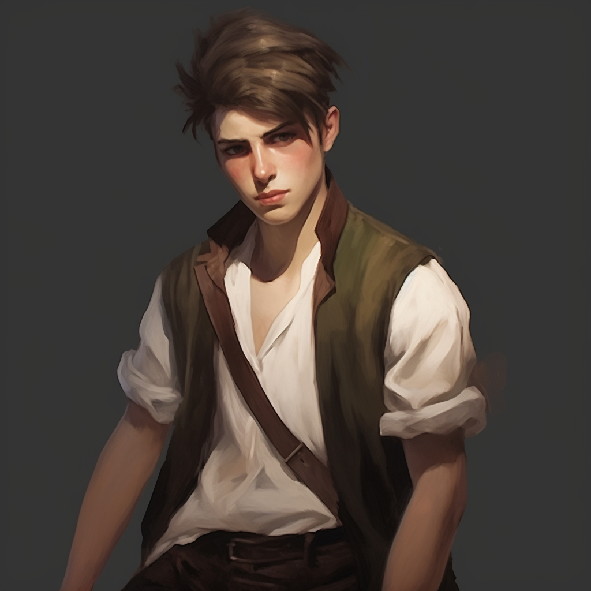

# Uhtred Storm

## Attributes and Core Skills

| STR       | 0 |    | RFX             | 1 |    | INT               | 0 |    |
| --------- | :-: | :-: | --------------- | :-: | :-: | ----------------- | :-: | :-: |
| Athletics | 1 | 4d6 | Acrobatics      | 0 | 4d6 | Communication     | 1 | 4d6 |
| Climb     | 0 | 3d6 | Perception      | 1 | 5d6 | General Knowledge | 0 | 3d6 |
| Endurance | 0 | 3d6 | Sleight of Hand | 1 | 5d6 | Survival          | 2 | 5d6 |
| Lift      | 0 | 3d6 | Stealth         | 1 | 5d6 | Will              | 0 | 3d6 |

## Vocations and Vocational Skills

| Criminal {RFX}   | 2 | 6d6 |
| ----------------- | :-: | :-: |
| Small Blade {STR, RFX, INT} | 1 | 5d6 |

## Effects:

|              Name              |                              Effect                              | Duration |                                                       Source                                                       |
| :----------------------------: | :---------------------------------------------------------------: | :------: | :-----------------------------------------------------------------------------------------------------------------: |
|          Medium Size          |                       5x5 ft on battle map.                       |          |                                                                                                                    |
|       Language: Babelish       |                        Can speak Babelish.                        |          |                                                                                                                    |
|     Disabling: Illiterate     |                       Can't read or write.                       |          |                                                       Injury                                                       |
| Disabling: Government Paranoia | Strong belief that law enforcement is corrupt and out to get him. |          |                                                                                                                    |
|        Equipment Weight        |                              9.8 lb                              |          |                                                      Equipment                                                      |
|     Humanoid Carry Weight     |                              120 lb                              |          | +50 lbs Carry Weight per Lift dice |
|          Light Weight          |                  -0d6 to STR/RFX governed Dice Pools                  |          |                                              0% - 25% of carry weight                                              |
|    Terrestrial Combat Speed    |                               45 ft                               |          |                                +10 ft (per Athletics Dice), +/-10 ft (per RFX)                                |
|      Swim Combat Speed      |                               20 ft                               |          |                                +5 ft (per Athletics Dice), +/-5 ft (per RFX)                                |
|      Climb Combat Speed      |                               15 ft                               |          |                                  +5 ft (per Climb Dice), +/-5 ft (per RFX)                                  |

## Combat Rolls:

|         Name         |   One Handed   | Two Handed |  Dual Wielded  | Penetration | Range | Damage Types | Engageable Opponents | Area Of Effect | Resource Class |
| :------------------: | :------------------: | :-------------: | :------------------: | :---------: | :---: | :---------------: | :-----------------------: | :-----------------: | :-----------------: |
| Small Slashing Blade | 5d6, 1d4 (+1d6) |     (+1d6)     | 6d6, 1d4 (+1d6) |      0      | Melee |       Slash       |           Rapid           |        None        |        None        |
|       Unarmed       |          -1          |       -1       |         None         |      0      | Melee |     Bludgeon     |           Rapid           |        None        |        None        |

| Name | Resource Class | Resource Dice | Penetration | Range | Damage Types | Area Of Effect |
| :--: | :-----------------: | :----------------: | :---------: | :---: | :---------------: | :-----------------: |
|      |                    |                    |            |      |                  |                    |

## Destiny Points: 0/3

## Equipment:

|        On        | Name |          #          |  Class  | Tier | Durability |  LB  | Value |
| :---------------: | :--: | :------------------: | :-----: | :--: | :--------: | :---: | :---: |
|  Clothes, Common  |  1  |                  | Mundane |      |     3     | 50 cc |      |
| Mother's Necklace |  1  |                  | Mundane |      |    0.1    |   ?   |      |
|  Waterskin (4/4)  |  1  |                  | Mundane |      |     5     | 20 cc |      |
|     Sharp Cap     |  1  | Small Slashing Blade | Shoddy | 9/9 |    0.5    | 2 bc |      |
|  Thieves' Tools  |  1  |                  | Mundane |      |     1     | 25 bc |      |
|     Dice Set     |  1  |                  | Mundane |      |    0.2    | 10 cc |      |

## Appearance:

Age: 16

Race: Mudblood

Height: 5' 8"

Weight: ~ 150 lb

Body Type: Wiry

Additional Details:

## Disposition:

- Guarded
- Blunt
- Always thinks people have an angle to work (he always is working an angle on others)

## Beliefs/Morality:

- Believe that the world is out to get him and other mudbloods.
- Will do anything for those he considers family.
- Believes that you have to take what is yours or life will leave you empty handed.
- Thinks the government is only out to for those in their inner circle and not for the common man.

## Goals/Aspirations:

- To get back to Cross Roads and find his friends.
- To gain wealth and power.
- To make a safe home for him and his friends in crossroads.

## Notes:

## Backstory:

Uhtred Storm is from CrossRoads. He was born as a mudblood. Uhtred was not always called Storm. His birth name was Uhtred Becker.  He was born in a low-class part of CrossRoads. His family were humble merchant people peddling goods in their small corner store. He lived a very modest and happy life.

One night around the age of 7 Uhtred heard something going on in the store front. He heard his father Vincent and his mother Sara talking to three unknown figures that Uhtred didn’t recognize. His mother was bound and they had a knife to his father. Uhtred stayed just out of sight. He looked as one of the figures brutally decapitated his father. He did not have the heart to watch as the figures killed his mother. Afterwards, Uhtred saw one of the figures walk to the back of the store and start a fire. These strangers then took valuable items and bit into the necks of his father and mother, drinking their blood. After the strangers left, Uhtred dashed towards his lifeless mother as his home burned to ash. He only had time to shed a brief tear over his butcher parents and took a necklace from his mother that she told him had been in the family for generations.

For the next year, Uhtred lived on the streets of Crossroad. One day he swiped a particularly expensive item. The lady of nobility who he had robbed caught him in the act. She detained him and called the local guard. When the guards arrived, she told them to take him to the local workhouse, the jail, or the orphanage, as "Mud-Bloods are only good for two things in this world, cheap labor, and blood."  One guard took pity on Uhtred and took him to a mud-blood orphanage. Named the the Bright Lord Children's Home, it was a disheveled site to behold. Mary, the caretaker, questioned Uhtred and asked for his full name. Uhtred replied, “my name is Uhtred and only Uhtred”. She asked where his parents were, to which Uhtred replied “I don’t have parents”.  She registered him as an abandoned orphan. Uhtred became a “ward of the state” and was given the family name “Storm”, like every other ward of Crossroads.

 Mary became a mother figure to all those taken in by the orphanage. She did her best to provide for the children. However, they often went hungry, were cold due to the lack of clothing, and lived in complete poverty. He quickly became good friends with the other two boys that he shared a room with. These boys were named Finin and Beocca. They did everything together, including working at a local workhouse. Although in the eyes of the law they were not slaves, for 2 bronze a week they might as well have been.

After having worked in these conditions for 5 years, the boys finally decided that they would no longer endure the harsh work conditions and beatings. They began to commit petty theft and muggings to supply the orphanage with what they needed to survive. At this point Uhtred was somewhat of a skilled pickpocket. They would pick the pockets of tourists and government officials coming in and out of town. Later, the boys began to rob people that ventured into the poor merchant district of the city. They all carried caps, known as Sharp caps. They fastened razor blades into the small space in-between the brim and the fabric that would fold over in the front. They would use these Sharp caps as concealed weapons in a pinch and became known for them.

Uhtred lived in the orphanage till the age of 16. Even though “the Spore” had been slowed in Crossroads, this was not the case for the poor districts, including the orphanage. One night, Uhtred heard a blood curdling scream coming from within the Orphanage. They ran downstairs to see Mary fending off a Spore stricken creature at the front door, with a young 4 year old girl standing behind her.

Uhtred quickly armed himself with a chair, readying to hit the creature to break its grasp on Mary. Before he could strike, the creature pulled Marry outside into a swarm of Spore creatures. He looked upon the scene with horror as the creatures began to feast on her. He told Finin and Beocca to take all the children out the back while he gave them time to escape. Uhtred managed to lure and lock the creatures inside the orphanage common room. Though he was trapped, he was content as he saw the children of the Orphanage escape. As he sat down to catch his breath he heard the noise of the city guard arriving, armor clattering and slashing swords. They closed in and one by one began to kill the Spore creatures. After the creatures were all killed a guardsman retrieved Uhtred. Uhtred recognized the guard that took him out of the orphanage, as it was the same guard that had taken him there 7 years ago.

 Uhtred was taken to a medical facility for testing. After the testing was complete it was determined that Uhtred had been infected with the Spore. He would perish in 2 months if left untreated. The government decided that Uhtred was to be sent away to Reddwall to receive treatment.
