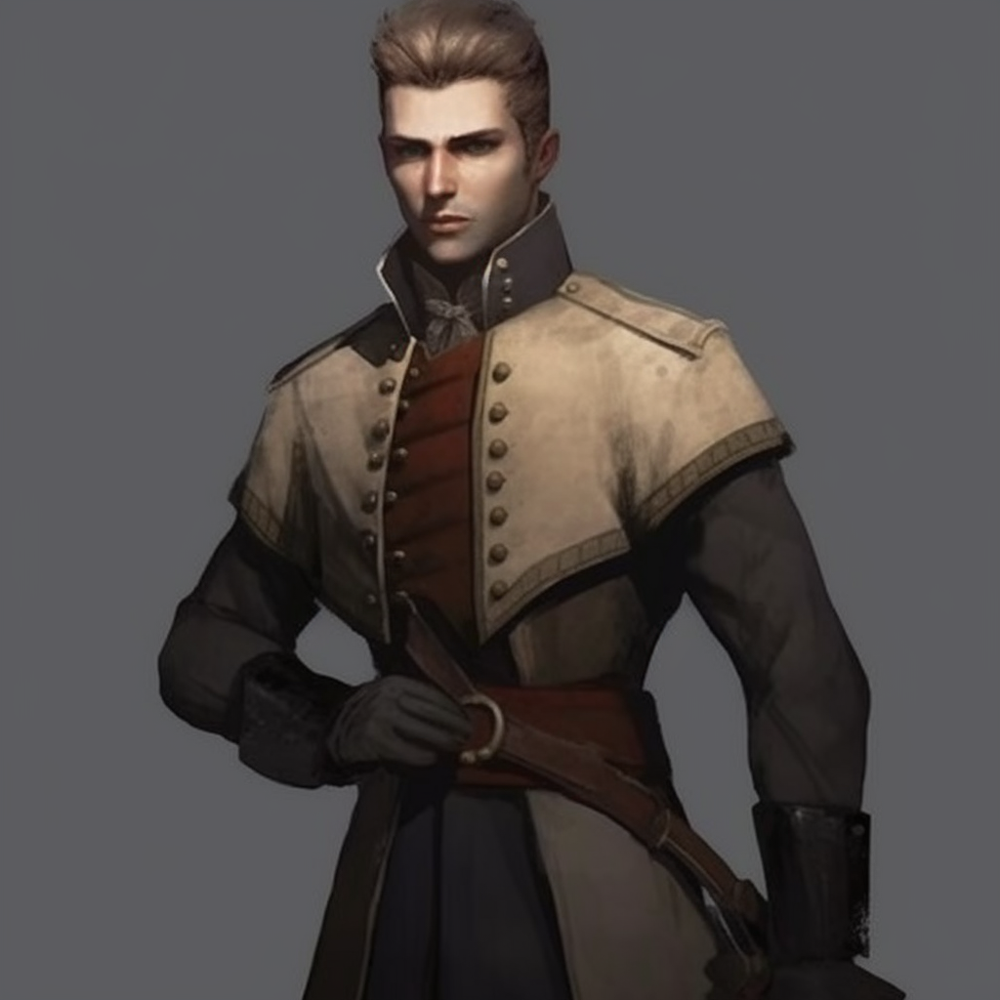

# Uhtred Storm (Depreciated)

## Attributes and Core Skills

| STR       |   0   |       | RFX             |   2   |       | INT               |   0   |       |
| --------- | :---: | :---: | --------------- | :---: | :---: | ----------------- | :---: | :---: |
| Athletics |   2   |  5d6  | Acrobatics      |   0   |  5d6  | Communication     |   0   |  3d6  |
| Climb     |   0   |  3d6  | Perception      |   2   |  7d6  | General Knowledge |   0   |  3d6  |
| Endurance |   0   |  3d6  | Sleight of Hand |   1   |  6d6  | Survival          |   0   |  3d6  |
| Lift      |   0   |  3d6  | Stealth         |   0   |  5d6  | Will         |   0   |  3d6  |

## Vocations and Vocational Skills

| Guard {RFX}        |   3   |  8d6  | Brightsmith {STR, RFX, INT} | 2   | 7d6 |
| ------------------ | :---: | :---: | --------------- | --- | --- |
| Medium Sword {STR, RFX, INT} |   3   |  8d6  | Radiance {STR, RFX, INT}  | 2   | 7d6 |
|                    |   0   |  3d6  | Blessing {STR, RFX, INT}  | -1  | 4d6 |
|                    |   0   |  3d6  | Additional Trick | -1  | 4d6 |

## Effects

|                Name                |                            Effect                             | Duration |                                                                  Source                                                                  |
| :--------------------------------: | :-----------------------------------------------------------: | :------: | :--------------------------------------------------------------------------------------------------------------------------------------: |
|       Minor Silver Weakness        | (+1) to the level of injury received from Silver damage. |          |                                                              Fellkin blood                                                               |
|       Physical Defense Level       |                               3                               |          |                                                                  Armor                                                                   |
|            Medium Size             |                     5x5 ft on battle map.                     |          |                                                                                                                                          |
|         Language: Babelish         |                      Can speak Babelish.                      |          |                                                                                                                                          |
|  Disabling: Incontrollable Grief   | Overwhelming grief that is triggered reminder of past trauma. |          |                                                                                                                                          |
| Disabling: Bright Lord's Influence |    Character is influenced by forces beyond their control.    |          |                                                                                                                                          |
|          Inventory Weight          |                            25.1 lb                            |          |                                                                Equipment                                                                 |
|       Humanoid Carry Weight        |                            120 lb                             |          | 120 lb (Base), +100 lb positive STR, -50 lb negative STR, + 40 lb positive Lift, - 20 lb negative Lift |
|            Light Weight            |                -0d6 to STR/RFX governed skills                |          |                                                         0% - 25% of carry weight                                                         |
|      Humanoid Movement Speed       |                             50 ft                             |          |                                        30 ft (Base), +/-10 ft (per RFX), +/-5 ft (per Athletics)                                         |
|        Humanoid Swim Speed         |                             25 ft                             |          |                                        15 ft (Base), +/-5 ft (per STR), +/-5 ft (per Athletics)                                         |
|        Humanoid Climb Speed        |                             15 ft                             |          |                                           15 ft (Base), +/-5 ft (per STR), +/-5 ft (per Climb)                                           |

## Combat Rolls

|          Name           | One Handed  | Two Handed  | Dual Wielded | Penetration |  Range   | Damage Types | Engageable Opponents | Area Of Effect | Resource Class |
| :---------------------: | :--------------: | :--------------: | :---------------: | :---------: | :------: | :---------------: | :-----------------------: | :-----------------: | :-----------------: |
| Radiance - Melee Trick  |     2d8, 5d6     |                  |                   |      0      |  Melee   |      Radiant      |           Rapid           |                     |        None         |
| Radiance - Ranged Trick |     2d8, 5d6     |                  |                   |      0      | Extended |      Radiant      |         Standard          |                     |        None         |
|    Radiance - Melee     |     2d8, 6d6     |                  |                   |      2      |  Melee   |      Radiant      |           Rapid           |                     |      1 (Fellblood)      |
|    Radiance - Ranged    |     2d8, 6d6     |                  |                   |      1      | Extended |      Radiant      |         Standard          |                     |      1 (Fellblood)      |
|     Radiance - Cone     |     2d8, 6d6     |                  |                   |      2      | Extended |      Radiant      |          Focused          |        Cone         |      1 (Fellblood)      |
|    Radiance - Reach     |     2d8, 6d6     |                  |                   |      2      |  Reach   |      Radiant      |           Rapid           |                     |      1 (Fellblood)      |
|   Radiance - Focused    |     2d8, 7d6     |                  |                   |      2      | Extended |      Radiant      |          Focused          |                     |      1 (Fellblood)      |
|    Radiance - Sphere    |     2d8, 7d6     |                  |                   |      3      | Extended |      Radiant      |          Focused          |       Sphere        |      2 (Fellblood)      |
| Blessing - Melee Trick  |       4d6        |                  |                   |      0      |  Melee   |                   |           Rapid           |                     |        None         |
| Blessing - Ranged Trick |       4d6        |                  |                   |      0      |  Close   |                   |         Standard          |                     |        None         |
| Medium Thrusting Sword  | 9d6 (+1d6)  | 10d6 (+2d6) | 10d6 (+1d6)  |      2      |  Melee   |      Pierce       |           Rapid           |        None         |        None         |
|  Medium Slashing Sword  | 10d6 (+2d6) | 11d6 (+3d6) | 11d6 (+1d6)  |      0      |  Melee   |       Slash       |           Rapid           |        None         |        None         |
|  Small Thrusting Point  | 7d6 (+0d6)  | 7d6 (+0d6)  |  8d6 (+1d6)  |      2      |  Melee   |      Pierce       |           Rapid           |        None         |        None         |
|  Small Slashing Blade   | 8d6 (+1d6)  | 8d6 (+1d6)  |  9d6 (+1d6)  |      0      |  Melee   |       Slash       |           Rapid           |        None         |        None         |
|   Thrown Small Point    | 7d6 (+0d6)  | 7d6 (+0d6)  |       None        |      1      |  Short   |      Pierce       |           Quick           |        None         |        None         |

| Name  | Resource Class | Resource Dice | Penetration | Range | Damage Types | Area Of Effect |
| :---: | :-----------------: | :----------------: | :---------: | :---: | :---------------: | :-----------------: |
|       |                     |                    |             |       |                   |                     |

## Destiny Points: 2/3

## Ichor: 6/6

## Equipment

| Name                                 |   #   |                              Class                              |   Tier   | Durability |  LB   | Value  |
| ------------------------------------ | :---: | :-------------------------------------------------------------: | :------: | :--------: | :---: | :----: |
| Superior Gambeson Coat               |   1   |                           Phy. Def. 1                           | Superior |   24/24    |   5   |  2 bc  |
| Superior Gambeson Leggings           |   1   |                          Phy. Def. 0.5                          | Superior |   24/24    |   3   |  1 bc  |
| Superior Leather Helmet              |   1   |                          Phy. Def. 0.5                          | Superior |   24/24    |   2   | 0.5 bc |
| Superior Leather Cuisses and Greaves |   1   |                          Phy. Def. 0.5                          | Superior |   24/24    |   3   |  2 bc  |
| Superior Leather Vambrace            |   1   |                          Phy. Def. 0.5                          | Superior |   24/24    |   2   | 1.5 bc |
| Clothes, Fine                        |   1   |                                                             | Mundane  |            |   6   | 15 bc  |
| Asher's Arms Swordbreaker            |   1   | Small Thrusting Point, Small Slashing Blade, Thrown Small Blade |   Fine   |   18/18    |   1   |   ?    |
| Spencer's Arms Arming Sword          |   1   |          Medium Thrusting Sword, Medium Slashing Sword          | Superior |   24/24    |   2   | 20 bc  |
| Adversary - Damaged                  |   1   |                        Magic Conduit                         |   Fine   |   18/18    |   1   |   ?    |
| Mother's Necklace                    |   1   |                                                             | Mundane  |            |  0.1  |   ?    |

## Containers

| Name                                   |   #   |      Class      |   Tier    | Durability |  LB   | Value |
| -------------------------------------- | :---: | :-------------: | :-------: | :--------: | :---: | :---: |
| Backpack (1 ft^3)                      |   1   | 30 lb container |  Mundane  |            |   5   | 2 bc  |
| Kite Shield (Dawn Emp. Crest)          |   1   |   Phy. Def. 2   | Superior  |   24/24    |   8   | 30 bc |
| Superior Leather Cuirass and Pauldrons |   1   |  Phy. Def. 0.5  | Superior  |   24/24    |   4   | 3 bc  |
| 30 lb of gold and gems                 |   1   |             | Exquisite |     -      |  30   |   ?   |

## Notes

1 in Miracles, 1 in blessing
The singing ring(in the crypt).

Session 25:
Lady red guard is dead, lord rose blood is dead, vex died and came back to life, Luc saw me and vex come to life and is confused, Uhtred is now Brightkin, the staff was stolen by the cult of Amon. AKA Uskal.
Helena was resurrected: Uhtred does not know
Uhtred got his mother necklace from commander Royce
Uhtred does not have his sword- dream sword may be bad that the dream sword is gone.
Uhtred is outside the hospital after meeting commander Royce.

 23OCT2021
Beocca has the spear of destiny
Party gathers things and leaves Reddwall
Vex has a mental break down
Party attacked by mercenaries that want to kill carma

Session 27:
Carma and Vex left the party
The tavern Exploded
Uhtred sacrifice himself for dipper

Session 28:
Met Destin Shaffer and the group hired his sword
Got into a fight with wraiths( The town we are heading towards might have a lot of death)
Sirius and Uhtred made a deal with the masked man he agreed to help the party protect vex
Masked man told us that Vex had the mark of Amon.

Session 29:
Entered the town of tuntin
Talked to the sheriff
We got contracted to fight the lancers

Session 30:
It came out that Uhtred's friends perpetrated the terrorist attack
Killroy tried to kill him
Fanácrio almost died in killroy’s dream

Session 31:
The lancers killed some girl
We are killing the lancers
There are only 4 of demons

Sessions 32:
Helena is a demon, and she wants to make Uhtred and Sirius lives hell
Killroy finally died, Uhtred did not get to say goodbye
Saw red hair come from Sirius

Session 33&34
The party left tuntin and Luc joined them, they tried to help the suffering people there
The party has been traveling and talking to the masked man, winter fast approaches and they are no closer to finding Vex.
The party is lost in a forest in the middle of a winter storm, they are hungry and freezing to death
They encounter werewolves and Fanácrio and Sirius almost die.

Session 35:
The party made it away from the werewolves and continued to trek the frozen tundra injured and broken.
They come across Vengward who is an assassin kiki that lives apart of the hive.
They talk and get rest and food.
Luc tells Uhtred that they are brothers in some way and that Uhtred will always have his protection
Sirius talks to Luc and Luc draws his sword on him
Uhtred sees sirius’s notebook and its the same phrase written in it over and over again.
Luc leaves the party in the charge of Vengward and they are about to take out a lancer camp and hunker down for the winter.

Session 36:
The party started attacking the bandit camp
Noticed that it seemed like the bandits are cannibals or something they look like zombies

Session 37:

## Appearance

Age: 17

Race: Brightkin

Height: 5'10"

Body Type: Built

## Disposition

- Ambitious
- Brave
- Faithful
- Determined
- Broken (after the death of his friend Killroy)

## Beliefs/Morality

Will defend those who can't defend themselves.
Has strong morals with right and wrong.
Believes there is always a choice.

Post Killroy Death:
Will do whatever it takes to find Vex
Has strong morals with right and wrong
Won't let the innocent suffer due to his negligence, there is always a choice.

## Goals/Aspirations

- To find and protect Vex'halia Reddington
- Find out more about what it means to be Brightkin and find out more about his mother.
- To live his life to make those who have passed proud, and to fix the mistakes that he made.

Things I want to do with Uhtred:

- Find out what Luc meant when he called him brother
- Get stronger and prove that he is worthy to be called brother by LucFind Vex and get her to safety

## Backstory

Uhtred Storm is from CrossRoads. He was born as a mudblood. Uhtred was not always called Storm. His birth name was Uhtred Becker.  He was born in a low-class part of CrossRoads. His family were humble merchant people peddling goods in their small corner store. He lived a very modest and happy life.

One night around the age of 7 Uhtred heard something going on in the store front. He heard his father Vincent and his mother Sara talking to three shadowed dhampirs that Uhtred didn’t recognize. His mother was bound and they had a knife to his father. Uhtred stayed just out of sight. He looked as one of the figures brutally decapitated his father. He did not have the heart to watch as the figures killed his mother. Afterwards, Uhtred saw one of the figures walk to the back of the store and start a fire. These strangers then took valuable items and bit into the necks of his father and mother, drinking their blood. After the strangers left, Uhtred dashed towards his lifeless mother as his home burned to ash. He only had time to shed a brief tear over his butcher parents and took a necklace from his mother that had been in the family for generations.

For the next year, Uhtred lived on the streets. One day he swiped a particularly expensive item. The lady of nobility caught him in the act. She detained him and called the local guard. When the guards arrived, she told them to take him to the local workhouse, the jail, or the orphanage, as "Mud-Bloods are only good for two things in this world, cheap labor, and blood."  One guard took pity on Uhtred and took him to a mud-blood orphanage. Named the Angle of the Bright Lord Children's Home, it was a disheveled site to behold. Mary, the caretaker, questioned Uhtred and asked for his full name. Uhtred replied, “my name is Uhtred and only Uhtred”. She asked where his parents were, to which Uhtred replied “I don’t have parents”.  She registered him as an abandoned orphan. Uhtred became a “ward of the state” and was given the family name “Storm”, like every other ward of Crossroads.

 Mary became a mother figure to all those taken in by the orphanage. She did her best to provide for the children. However, they often went hungry, were cold due to the lack of clothing, and lived in complete poverty. He quickly became good friends with the other two boys that he shared a room with. These boys were named Finin and Beocca. They did everything together, including working at a local workhouse. Although in the eyes of the law they were not slaves, for 2 copper a day they might as well have been.

After having worked in these conditions for 5 years, the boys finally decided that they would no longer endure the harsh work conditions and beatings. They began to commit petty theft and muggings to supply the orphanage with what they needed to survive. At this point Uhtred was somewhat of a skilled pickpocket. They would pick the pockets of tourists and government officials coming in and out of town. Later, the boys began to rob people that ventured into the poor merchant district of the city.They all carried caps, known as Shelby caps. They fastened razor blades into the small space in-between the brim and the fabric that would fold over in the front. They would use these Shelby caps as concealed weapons in a pinch and became known for them.

Uhtred lived in the orphanage till the age of 14. Even though “the Spore”  had been slowed in Crossroads, this was not the case for the poor districts, including the orphanage. One night, Uhtred heard a blood curdling scream coming from within the Orphanage. They ran downstairs to see Mary fending off a Spore stricken creature at the front door, with a young 4 year old girl standing behind her.

Uhtred quickly armed himself with a chair, reading to hit the creature to break its grasp on Mary. Before he could strike, the creature pulled Marry outside into a swarm of Spore creatures. He looked upon the scene with horror as the creatures began to feast on her. He told Finan and Beocca to take all the children out the back while he gave them time to escape. Uhtred managed to lure and lock the creatures inside the orphanage common room. Though he was trapped, he was content as he saw the children of the Orphanage escape. As he sat down to catch his breath he heard the noise of the city guard arriving, armor clattering and slashing swords. They closed in and one by one began to kill the Spore creatures. After the creatures were all killed a guardsman retrieved Uhtred. Uhtred recognized the guard that took him out of the orphanage, as it was the same guard that had taken him there 7 years ago.

 Uhtred was taken to a medical facility for testing. After the testing was complete it was determined that Uhtred had been infected with the Spore. He would perish in 2 months if left untreated. The government decided that Uhtred was to be sent away to Reddwall to receive treatment.

 Common knowledge below(Uhtred, Randy, Felix, Knox)

 Following the death of Helena by Uhtred's hand, Sirius disappeared without a trace. Tensions between Uhtred and Felix rose leading to Uhtred leaving the Weeping Anvil. Knox and Randy went to run the tavern, and Felix was still looking for a way to attend medical school.

 Uhtred returned to his life on the streets resorting to petty theft and squatting to survive. Uhtred took it upon himself to care for Commander Royce in whatever way he could. He spent much of his time with Commander Royce at the Hospital in the Medical district, when he was not on the streets stealing food and items to sell. Both Flint and Vex Reddington would frequently visit Royce and Killroy, and ensured both were well taken care of. This gave Uhtred, Vex, and Flint time to grow close over their shared grief. Uhtred tried to discuss what had transpired with the Masked man. It quickly became clear that Vex had no recollection of what had transpired. Trying to openly discuss anything relating to the Singing Ring or Masked man would give Uhtred the feeling of a heart attack and a quiet, scratchy voice gently whispered "No no no, a deal is a deal".  Despite this, Uhtred and Vex would confide in one another. However, Uhtred did not tell Vex he returned to his street life. Uhtred shared his troubled life and the guilt he felt over what had transpired with Helena. Vex shared the suffocating burden and expectations she needed to live up to, as one day she is to be Empress. Uhtred's guilt continued to consume him and he crept further and further into his pain. After six months of living on the streets, Vex confronted Uhtred. By this time Uhtred's clothes were little more than rags, he appeared gaunt, and in ill health. Vex pushed until Uhtred broke down and was distraught to find he had taken up his old life. Uhtred told Vex that no matter how hard he tried, he always failed to protect those he loved. At this Vex slapped Uhtred, looking him dead in the eyes. "There is always a choice." As tears welled in her eyes' Vex placed her hand on Commander Royce, "Ask yourself what she would've wanted. Ask yourself what she would've wanted for YOU. She cared for you, all of you. If you give up, than her suffering means nothing." Uhtred held these words in his heart. "what would she have wanted, what would she have wanted for me". The next day he signed up to become a cadet in the Red Legion. With his resolve to live his life in honor of commander Royce, Uhtred excelled in his class. Once Flint learned Uhtred had joined, he requested Uhtred be his personal bodyguard, a position that had long remained empty. Uhtred spent his nights in the barracks of Castleward. He continued to  regularly visit Commander Royce and would use most of his money to finance the Weeping Anvil once Killroy was let out of the hospital.

Joining the Guard:

Uhtred was resolved to join the guard. He still could not read. He somehow made it past the entrance exam. Once in Uhtred excelled at all of the physical activities. However, he failed anything that related to reading and writing. One fellow cadet noticed this. This cadet was Sgt Knob's son. Knob' s son had been raised to go to Byrgenwerth. He excelled at all of the book learning in the academy but struggled with all of the physical activities. Uhtred and Knob had been paired up on multiple training events. They both began to help each other. Uhtred helped cadet knob with the physical aspect of the guard and Knob helped uhtred learn to read and write. Uhtred can now read very simple things. Its enough to get him to start passing the exams.

Eight months after Helena's death:

On one occasion Felix and Uhtred bumped into one another at Knox's tavern. Uhtred and his friend Knob had just gotten off after training for the day and decided to share a drink together. Felix had been talking to Knox in a back room, and upon entering the main room, both Felix and Uhtred noticed each other. Felix acknowledged Uhtred in a disdainful tone, "Uhtred". Uhtred responded in turn, "Felix.". Felix: "what are you doing here". Uhtred: "None of your business" sipping his ale. Felix notices the cadet uniform: "What's with the armor Uhtred, here for Randy to?". Uhtred: "If Randy did what Helena did, then yes.". Knob: "Are you actually defending that murderous bitch". Felix: "She didn't have to die.". At this Knob explodes in rage, grabbing Felix, slamming him into a table, and proceeds to beat him. Through his tears, Knob screams: "That bitch took my father from me. How dare you defend her.". Uhtred: "Knob, he's not worth your time.". Knox: "Randy, him outside so he can cool off". Randy drags Knob off and outside. Uhtred lays down a couple coins and nods at Knox: "For the trouble." Uhtred to Felix: "Felix you are naive as the day I met you. Keep your nose in books and out of other people's business."
