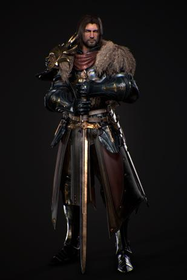

# Vasilii "The Bear Knight" Anatoli

## [Attributes](./../../../../../CoreRules/GeneralRules/Attributes.md) and [Core Skills](./../../../../../CoreRules/GeneralRules/CoreSkills.md)

|  [STR](./../../../../../CoreRules/GeneralRules/Attributes.md#strength-str)  | 1 |    |    [RFX](./../../../../../CoreRules/GeneralRules/Attributes.md#reflex-rfx)    | 0 |    |        [INT](./../../../../../CoreRules/GeneralRules/Attributes.md#intelligence-int)        | 0 |    |
| :-----------------------------------------------------------------------: | :-: | :-: | :-------------------------------------------------------------------------: | :-: | :-: | :---------------------------------------------------------------------------------------: | :-: | :-: |
| [Athletics](./../../../../../CoreRules/GeneralRules/CoreSkills.md#athletics) | 1 | 5d6 |  [Dexterity](./../../../../../CoreRules/GeneralRules/CoreSkills.md#dexterity)  | 1 | 4d6 |     [Communication](./../../../../../CoreRules/GeneralRules/CoreSkills.md#communication)     | 0 | 3d6 |
|                               (Deprecated)                               | 0 | 4d6 | [Perception](./../../../../../CoreRules/GeneralRules/CoreSkills.md#perception) | 0 | 3d6 | [General Knowledge](./../../../../../CoreRules/GeneralRules/CoreSkills.md#general-knowledge) | 0 | 3d6 |
| [Endurance](./../../../../../CoreRules/GeneralRules/CoreSkills.md#endurance) | 1 | 5d6 |                                (Deprecated)                                | 0 | 3d6 |                                       (Deprecated)                                       | 0 | 3d6 |
|      [Lift](./../../../../../CoreRules/GeneralRules/CoreSkills.md#lift)      | 1 | 5d6 |    [Stealth](./../../../../../CoreRules/GeneralRules/CoreSkills.md#stealth)    | 0 | 3d6 |              [Will](./../../../../../CoreRules/GeneralRules/CoreSkills.md#will)              | 0 | 3d6 |

## [Vocations](./../../../../../CoreRules/GeneralRules/Vocations.md) and [Vocation Skills](./../../../../../CoreRules/GeneralRules/Vocations.md#vocation-skills)

| Warrior     | STR, RFX, INT | 1 | 5d6 |
| ----------- | :-----------: | :-: | :-: |
| Large Melee | STR, RFX, INT | 1 | 5d6 |

| [Fellcaster](./../../../MagicSystems/Fellcraft/Fellcraft.md) | STR, RFX, INT | 1 | 5d6 |
| :-------------------------------------------------------: | :-----------: | :-: | :-: |
|                         Polycraft                         | STR, RFX, INT | 1 | 5d6 |
|                         Sonocraft                         | STR, RFX, INT | -1 | 3d6 |

## Effects

|                                                           Name                                                           |                                                                            Desc                                                                          | Duration |                      Source                      |
| :-----------------------------------------------------------------------------------------------------------------------: | :---------------------------------------------------------------------------------------------------------------------------------------------------------: | :------: | :----------------------------------------------: |
|                          [Level](./../../../../../CoreRules/CharacterCreationRules/TiersOfPlay.md)                          |                                                                              4                                                                              |          |                                                  |
|                                   [Language](./../../../Languages/Languages.md): Babelish                                   |                                                                     Can speak Babelish.                                                                     |          |                                                  |
|                                    [Language](./../../../Languages/Languages.md): Primal                                    |                                                                      Can speak Primal.                                                                      |          |                                                  |
|    [Disabling Characteristic](./../../../../../CoreRules/CharacterCreationRules/DisablingCharacteristics.md): Alcoholism    |                                                Extreme addiction, suffers from withdrawals if not satisfied.                                                |          |                                                  |
| [Disabling Characteristic](./../../../../../CoreRules/CharacterCreationRules/DisablingCharacteristics.md): Scandalous Secret | I hide a truly scandalous secret that could ruin my family forever.   By my words and actions, I often bring shame to my family. (Killed his brother) |          |                                                  |
|                                                                                                                          |                                                                                                                                                            |          |                                                  |
|                    [Equipment Weight](./../../../../../CoreRules/AdvancedRules/CarryWeight.md#equipment)                    |                                                                            58 lb                                                                            |          |                    Equipment                    |
|                     [Carry Weight](./../../../../../CoreRules/AdvancedRules/CarryWeight.md#carry-weight)                     |                                                                           250 lb                                                                           |          |        +50 lbs Carry Weight per Lift dice        |
|                [Weight Class](./../../../../../CoreRules/AdvancedRules/CarryWeight.md#weight-classes): Light                |                                                             -0d6 to STR/RFX governed Dice Pools                                                             |          |  0% =< Equipment Weight <= 25% of Carry Weight  |
|                                                                                                                          |                                                                                                                                                            |          |                                                  |
|                  [Minor Weakness](./../../../../../CoreRules/CombatRules/WeaknessAndResistance.md): Silver                  |                                                    +1 to the level of injury received from damage type.                                                    |          |                    Fellblood                    |
|                 [Physical Defense Level](./../../../../../CoreRules/CombatRules/Defense.md#physical-defense)                 |                                                                              4                                                                              |          |                  Armor & Shield                  |
|                                                                                                                          |                                                                                                                                                            |          |                                                  |
|                           [Size](./../../../../../CoreRules/CombatRules/BattleMap.md#size): Medium                           |                                                                    5x5 ft on battle map.                                                                    |          |                                                  |
|               [Combat Speed](./../../../../../CoreRules/CombatRules/CombatSpeed.md#combat-speeds): Terrestrial               |                                                                            50 ft                                                                            |          | +10 ft (per Athletics Dice), +/-10 ft (per RFX) |
|                  [Combat Speed](./../../../../../CoreRules/CombatRules/CombatSpeed.md#combat-speeds): Swim                  |                                                                            25 ft                                                                            |          |  +5 ft (per Athletics Dice), +/-5 ft (per RFX)  |
|                  [Combat Speed](./../../../../../CoreRules/CombatRules/CombatSpeed.md#combat-speeds): Climb                  |                                                                            20 ft                                                                            |          |  +5 ft (per Athletics Dice), +/-5 ft (per RFX)  |
|                                                                                                                          |                                                                                                                                                            |          |                                                  |
|                     [Magic Resource](./../../../../../CoreRules/MagicRules/MagicResource.md): Fellblood                     |                                                                             3/7                                                                             |          |       Vocation/Magic Governing Core Skill       |
|                          [Destiny Points](./../../../../../CoreRules/GeneralRules/DestinyPoints.md)                          |                                                                             2/3                                                                             |          |               Awarded by Narrator               |
|                               [Injury](./../../../../../CoreRules/CombatRules/Injury.md): None                               |                                                                – 0 dice to all dice checks.                                                                |          |                      Damage                      |

## [Combat Rolls](./../../../../../CoreRules/CombatRules/CombatRolls.md)

- [Victory Levels link](./../../../../../CoreRules/CombatRules/VictoryLevels.md)

### [Weapons](./../../../../../CoreRules/CombatRules/Weapons.md)

|               Name               | [One Handed](./../../../../../CoreRules/CombatRules/Weapons.md#one-handed) | [Two Handed](./../../../../../CoreRules/CombatRules/Weapons.md#two-handed) | [Dual Wielded](./../../../../../CoreRules/CombatRules/Weapons.md#dual-wielded) | [Penetration](./../../../../../CoreRules/CombatRules/Penetration.md) | [Range](./../../../../../CoreRules/CombatRules/Range.md) | [Engageable Opponents](./../../../../../CoreRules/CombatRules/EngageableOpponents.md) | [Area Of Effect](./../../../../../CoreRules/CombatRules/AreaOfEffect.md) | [Ammo Type](./../../../../../CoreRules/CombatRules/Ammunitions.md#ammo-type) | [Ammo Per Use](./../../../../../CoreRules/CombatRules/Weapons.md#ammo-per-shot) | [Damage Types](./../../../../../CoreRules/CombatRules/DamageTypes.md) |
| :-------------------------------: | :--------------------------------------------------------------------------: | :--------------------------------------------------------------------------: | :------------------------------------------------------------------------------: | :---------------------------------------------------------------: | :---------------------------------------------------: | :-------------------------------------------------------------------------------------: | :------------------------------------------------------------------------: | :----------------------------------------------------------------------------: | :-------------------------------------------------------------------------------: | :---------------------------------------------------------------------: |
|              Unarmed              |                                      -1                                      |                                     None                                     |                                       +0d6                                       |                                 0                                 |                         Melee                         |                                          Swift                                          |                                                                            |                                      None                                      |                                                                                  |                                Bludgeon                                |
|      Hand Protection Unarmed      |                                     +0d6                                     |                                     None                                     |                                       +0d6                                       |                                 0                                 |                         Melee                         |                                          Swift                                          |                                                                            |                                      None                                      |                                                                                  |                                Bludgeon                                |
| Steelclaw - Large Thrusting Sword |                                     +0d6                                     |                             +2d6 (2d8, 5d6)                             |                                       None                                       |                                 3                                 |                         Melee                         |                                          Swift                                          |                                                                            |                                      None                                      |                                                                                  |                                 Pierce                                 |
| Steelclaw - Large Slashing Sword |                                     +1d6                                     |                             +3d6 (2d8, 6d6)                             |                                       None                                       |                                 2                                 |                         Melee                         |                                          Swift                                          |                                                                            |                                      None                                      |                                                                                  |                                  Slash                                  |

#### [Ammunitions](./../../../../../CoreRules/CombatRules/Ammunitions.md)

| Name | [Ammo Type](./../../../../../CoreRules/CombatRules/Ammunitions.md#ammo-type) | [Dice Pool Mod](./../../../../../CoreRules/CombatRules/Ammunitions.md#dice-pool-mod) | [Base Dice Tier Adjustment](./../../../../../CoreRules/CombatRules/Ammunitions.md#resource-dice) | [Penetration](./../../../../../CoreRules/CombatRules/Ammunitions.md#penetration) | [Range](./../../../../../CoreRules/CombatRules/Ammunitions.md#range) | [Damage Types](./../../../../../CoreRules/CombatRules/Ammunitions.md#damage-types) | [Area Of Effect](./../../../../../CoreRules/CombatRules/Ammunitions.md#area-of-effect) |
| :--: | :----------------------------------------------------------------------------: | :-------------------------------------------------------------------------------: | :-------------------------------------------------------------------------------------------: | :---------------------------------------------------------------------------: | :---------------------------------------------------------------: | :----------------------------------------------------------------------------------: | :--------------------------------------------------------------------------------------: |
|      |                                                                                |                                                                                  |                                                                                              |                                                                              |                                                                  |                                                                                      |                                                                                          |

### [Melee Weapon Spells](./../../../../../CoreRules/MagicRules/Spells.md#melee-weapon-spells)

|        Name        | [One Handed](./../../../../../CoreRules/CombatRules/Weapons.md#one-handed) | [Two Handed](./../../../../../CoreRules/CombatRules/Weapons.md#two-handed) | [Dual Wielded](./../../../../../CoreRules/CombatRules/Weapons.md#dual-wielded) | [Penetration](./../../../../../CoreRules/CombatRules/Penetration.md) | [Range](./../../../../../CoreRules/CombatRules/Range.md) | [Engageable Opponents](./../../../../../CoreRules/CombatRules/EngageableOpponents.md) | [Area Of Effect](./../../../../../CoreRules/CombatRules/AreaOfEffect.md) | [Magic Resource](./../../../../../CoreRules/MagicRules/MagicResource.md) | [Damage Types](./../../../../../CoreRules/CombatRules/DamageTypes.md) |
| :-----------------: | :--------------------------------------------------------------------------: | :--------------------------------------------------------------------------: | :------------------------------------------------------------------------------: | :---------------------------------------------------------------: | :---------------------------------------------------: | :-------------------------------------------------------------------------------------: | :------------------------------------------------------------------------: | :------------------------------------------------------------------------: | ----------------------------------------------------------------------- |
|     Magic Glove     |                                     +0d6                                     |                                     None                                     |                                       +1d6                                       |                                 0                                 |                         Melee                         |                                          Swift                                          |                                    None                                    |                                     0                                     |                                                                         |
| Magic Small Thrust |                                     +0d6                                     |                                     None                                     |                                       +1d6                                       |                                 2                                 |                         Melee                         |                                          Swift                                          |                                    None                                    |                                     0                                     |                                                                         |
|  Magic Small Slash  |                                     +1d6                                     |                                     None                                     |                                       +1d6                                       |                                 0                                 |                         Melee                         |                                          Swift                                          |                                    None                                    |                                     0                                     |                                                                         |
|                    |                                                                              |                                                                              |                                                                                  |                                                                  |                                                      |                                                                                        |                                                                            |                                                                            |                                                                         |
| Magic Medium Slash |                                     +2d6                                     |                                     +3d6                                     |                                       +1d6                                       |                                 1                                 |                         Melee                         |                                          Swift                                          |                                    None                                    |                                     1                                     |                                                                         |
| Magic Medium Thrust |                                     +1d6                                     |                                     +2d6                                     |                                       +1d6                                       |                                 2                                 |                         Melee                         |                                          Swift                                          |                                    None                                    |                                     1                                     |                                                                         |
| Magic Medium Smash |                                     +0d6                                     |                                     +1d6                                     |                                       +1d6                                       |                                 4                                 |                         Melee                         |                                          Swift                                          |                                    None                                    |                                     1                                     |                                                                         |
| Magic Medium Spear |                                     +2d6                                     |                                     None                                     |                                       +1d6                                       |                                 2                                 |                         Melee                         |                                         Steady                                         |                                    None                                    |                                     1                                     |                                                                         |
|     Magic Whip     |                                     +1d6                                     |                                     None                                     |                                       +1d6                                       |                                 0                                 |                         Reach                         |                                          Swift                                          |                                    None                                    |                                     1                                     |                                                                         |
|                    |                                                                              |                                                                              |                                                                                  |                                                                  |                                                      |                                                                                        |                                                                            |                                                                            |                                                                         |
|  Magic Large Slash  |                                     +1d6                                     |                                     +3d6                                     |                                       None                                       |                                 2                                 |                         Melee                         |                                          Swift                                          |                                    None                                    |                                     2                                     |                                                                         |
| Magic Large Thrust |                                     +0d6                                     |                                     +2d6                                     |                                       None                                       |                                 3                                 |                         Melee                         |                                          Swift                                          |                                    None                                    |                                     2                                     |                                                                         |
|  Magic Large Smash  |                                      -1                                      |                                     +1d6                                     |                                       None                                       |                                 5                                 |                         Melee                         |                                          Swift                                          |                                    None                                    |                                     2                                     |                                                                         |
|  Magic Large Spear  |                                     +2d6                                     |                                     +3d6                                     |                                       None                                       |                                 3                                 |                         Melee                         |                                         Steady                                         |                                    None                                    |                                     2                                     |                                                                         |
|                    |                                                                              |                                                                              |                                                                                  |                                                                  |                                                      |                                                                                        |                                                                            |                                                                            |                                                                         |
|  Magic Reach Slash  |                                      -2                                      |                                     +4d6                                     |                                       None                                       |                                 3                                 |                         Reach                         |                                          Swift                                          |                                    None                                    |                                     3                                     |                                                                         |
| Magic Reach Thrust |                                      -2                                      |                                     +3d6                                     |                                       None                                       |                                 4                                 |                         Reach                         |                                          Swift                                          |                                    None                                    |                                     3                                     |                                                                         |
|  Magic Reach Smash  |                                      -2                                      |                                     +2d6                                     |                                       None                                       |                                 5                                 |                         Reach                         |                                          Swift                                          |                                    None                                    |                                     3                                     |                                                                         |
|  Magic Reach Spear  |                                      -2                                      |                                     +4d6                                     |                                       None                                       |                                 4                                 |                         Reach                         |                                         Steady                                         |                                    None                                    |                                     3                                     |                                                                         |

### [Ranged Weapon Spell](./../../../../../CoreRules/MagicRules/Spells.md#ranged-weapon-spells)

|             Name             | [One Handed](./../../../../../CoreRules/CombatRules/Weapons.md#one-handed) | [Two Handed](./../../../../../CoreRules/CombatRules/Weapons.md#two-handed) | [Dual Wielded](./../../../../../CoreRules/CombatRules/Weapons.md#dual-wielded) | [Penetration](./../../../../../CoreRules/CombatRules/Penetration.md) | [Range](./../../../../../CoreRules/CombatRules/Range.md) | [Engageable Opponents](./../../../../../CoreRules/CombatRules/EngageableOpponents.md) | [Area Of Effect](./../../../../../CoreRules/CombatRules/AreaOfEffect.md) | [Magic Resource](./../../../../../CoreRules/MagicRules/MagicResource.md) | [Damage Types](./../../../../../CoreRules/CombatRules/DamageTypes.md) |
| :---------------------------: | :--------------------------------------------------------------------------: | :--------------------------------------------------------------------------: | :------------------------------------------------------------------------------: | :---------------------------------------------------------------: | :---------------------------------------------------: | :-------------------------------------------------------------------------------------: | :------------------------------------------------------------------------: | :------------------------------------------------------------------------: | ----------------------------------------------------------------------- |
|          Magic Dart          |                                     +0d6                                     |                                     None                                     |                                       +1d6                                       |                                 0                                 |                         Short                         |                                          Quick                                          |                                                                            |                                     0                                     |                                                                         |
|          Magic Sling          |                                     +0d6                                     |                                     None                                     |                                       None                                       |                                 1                                 |                        Medium                        |                                         Steady                                         |                                                                            |                                     0                                     |                                                                         |
|                              |                                                                              |                                                                              |                                                                                  |                                                                  |                                                      |                                                                                        |                                                                            |                                                                            |                                                                         |
|         Magic Javelin         |                                     +1d6                                     |                                     None                                     |                                       +1d6                                       |                                 2                                 |                        Medium                        |                                         Steady                                         |                                                                            |                                     1                                     |                                                                         |
|        Magic Hand Bolt        |                                     +1d6                                     |                                     None                                     |                                       +1d6                                       |                                 0                                 |                        Medium                        |                                         Steady                                         |                                                                            |                                     1                                     |                                                                         |
|          Magic Bolt          |                                     None                                     |                                     +1d6                                     |                                       None                                       |                                 2                                 |                          Far                          |                                          Slow                                          |                                                                            |                                     1                                     |                                                                         |
|          Magic Arrow          |                                     None                                     |                                     +1d6                                     |                                       None                                       |                                 1                                 |                          Far                          |                                          Quick                                          |                                                                            |                                     1                                     |                                                                         |
|       Magic Close Cone       |                                     None                                     |                                     +1d6                                     |                                       None                                       |                                 3                                 |                         Close                         |                                            1                                            |                           Close Cone Calculation                           |                                     1                                     |                                                                         |
|                              |                                                                              |                                                                              |                                                                                  |                                                                  |                                                      |                                                                                        |                                                                            |                                                                            |                                                                         |
|  Magic Penetrating Hand Bolt  |                                     +1d6                                     |                                     None                                     |                                       +1d6                                       |                                 1                                 |                        Medium                        |                                         Steady                                         |                                                                            |                                     2                                     |                                                                         |
|    Magic Penetrating Bolt    |                                     None                                     |                                     +1d6                                     |                                       None                                       |                                 3                                 |                          Far                          |                                          Slow                                          |                                                                            |                                     2                                     |                                                                         |
|    Magic Penetrating Arrow    |                                     None                                     |                                     +1d6                                     |                                       None                                       |                                 2                                 |                          Far                          |                                          Quick                                          |                                                                            |                                     2                                     |                                                                         |
|      Magic Great Javelin      |                                     +1d6                                     |                                     None                                     |                                       None                                       |                                 3                                 |                         Short                         |                                         Steady                                         |                                                                            |                                     2                                     |                                                                         |
|       Magic Great Bolt       |                                     None                                     |                                     +2d6                                     |                                       None                                       |                                 3                                 |                         Long                         |                                     Extremely Slow                                     |                                                                            |                                     2                                     |                                                                         |
|       Magic Medium Cone       |                                     None                                     |                                     +1d6                                     |                                       None                                       |                                 3                                 |                        Medium                        |                                            1                                            |                          Medium Cone Calculation                          |                                     2                                     |                                                                         |
|                              |                                                                              |                                                                              |                                                                                  |                                                                  |                                                      |                                                                                        |                                                                            |                                                                            |                                                                         |
| Magic Penetrating Great Bolt |                                     None                                     |                                     +2d6                                     |                                       None                                       |                                 4                                 |                         Long                         |                                     Extremely Slow                                     |                                                                            |                                     3                                     |                                                                         |
|       Magic Great Arrow       |                                     None                                     |                                     +2d6                                     |                                       None                                       |                                 3                                 |                     Sharpshooter                     |                                          Paced                                          |                                                                            |                                     3                                     |                                                                         |
|      Magic Medium Sphere      |                                     None                                     |                                     +2d6                                     |                                       None                                       |                                 3                                 |                         Long                         |                                            1                                            |                         Medium Sphere Calculation                         |                                     3                                     |                                                                         |
|                              |                                                                              |                                                                              |                                                                                  |                                                                  |                                                      |                                                                                        |                                                                            |                                                                            |                                                                         |
| Magic Penetrating Great Arrow |                                     None                                     |                                     +2d6                                     |                                       None                                       |                                 4                                 |                     Sharpshooter                     |                                         Steady                                         |                                                                            |                                     4                                     |                                                                         |

### [Shield Spells](./../../../../../CoreRules/MagicRules/Spells.md#shield-spells)

|     Name     |                                   Effect                                   | Magic Resource |
| :-----------: | :-------------------------------------------------------------------------: | :-----------------: |
| Small Shield | Phy. Def. 1.00, Bodily Def. 1.00, Spiritual Def. 1.00, or Mental Def. 1.00 |          0          |
| Medium Shield | Phy. Def. 2.00, Bodily Def. 2.00, Spiritual Def. 2.00, or Mental Def. 2.00 |          1          |
| Large Shield | Phy. Def. 3.00, Bodily Def. 3.00, Spiritual Def. 3.00, or Mental Def. 3.00 |          2          |

## [Equipment](./../../../../../CoreRules/AdvancedRules/CarryWeight.md#equipment)

| Name            | # | [Effects](./../../../../../../README.md#effect-rules)                    | [LB](./../../../../../CoreRules/AdvancedRules/CarryWeight.md) | [Value](./../../../Items/ItemShop.md#currency) | Description                                                                                                                   |
| --------------- | :-: | ------------------------------------------------------------------------------------- | :--------------------------------------------------------: | :-----------------------------------------: | ----------------------------------------------------------------------------------------------------------------------------- |
| Gambeson Armor  | 1 | Body Armor, Arm Armor, Leg Armor, Phy. Def. 1.00                                      |                             8                             |                    5 bc                    |                                                                                                                               |
| Chainmail Armor | 1 | Head Armor, Body Armor, Arm Armor, Leg Armor, Hand Protection Unarmed, Phy. Def. 3.00 |                             47                             |                    75 bc                    |                                                                                                                               |
| Steelclaw       | 1 | Fine Large Thrusting Sword, Fine Large Slashing Sword                                 |                             3                             |                    25 bc                    | This sword was cursed upon Vasilii Anatoli after using it to kill his eldest brother. It is a constant reminder of his shame. |

## [Containers](./../../../../../CoreRules/AdvancedRules/Containers.md)

| Name                   | # | [Effects](./../../../../../../README.md#effect-rules) | [LB](./../../../../../CoreRules/AdvancedRules/CarryWeight.md) | [Value](./../../../Items/ItemShop.md#currency) | Description |
| ---------------------- | :-: | ------------------------------------------------------------------ | :--------------------------------------------------------: | :-----------------------------------------: | ----------- |
| Backpack               | 1 | 30 lb container                                                    |                             5                             |                    2 bc                    |             |
| Longsword              | 1 | Large Thrusting Sword, Large Slashing Sword                        |                             3                             |                    25 bc                    |             |
| Waterskin (4/4)        | 1 |                                                                    |                             5                             |                    20 cc                    |             |
| Rations (1 day)        | 7 |                                                                    |                             2                             |                    50 cc                    |             |
| Rope, Hempen (50 feet) | 1 |                                                                    |                             10                             |                    1 bc                    |             |
| Soap                   | 1 |                                                                    |                            0.5                            |                    2 cc                    |             |
| Piton                  | 10 |                                                                    |                            0.25                            |                    5 cc                    |             |
| Playing Card Set       | 1 |                                                                    |                            0.2                            |                    50 cc                    |             |
| Clothes, Traveler's    | 1 |                                                                    |                             4                             |                    2 bc                    |             |
| Bronze Coin            | 23 |                                                                    |                            0.04                            |                    2 bc                    |             |
| Copper Coin            | 28 |                                                                    |                            0.56                            |                    1 cc                    |             |

## Notes

plus 1 reflex

## Appearance

Age: 27

Race: Beastkin (Bear)

Height: 6' 1"

Weight: ~ 200 lb

Body Type: Built

Hair Color: Brown

Eye Color: Brown

Additional Details:

## Disposition

- The common folk love me for my kindness and  generosity.
- Despite my noble birth, I do not place myself above other folk. We all have the same blood.

## Beliefs/Morality

- Noble Obligation: It is my duty to protect and care for  the people beneath me. (Good)
- I have an older brother named Artyom that has always had my back.
- No Mercy for the Wicked. Ordinary foes might win my mercy, but my sworn enemies do not.
- By Any Means Necessary. My qualms can't get in the way aof exterminating my foes.
- Restitution. If my foes wreck ruin on the world, it is because I failed to stop them. I must help those harmed by their misdeeds.

## Goals/Aspirations

- Tenets of Vengeance
- Fight the Greater Evil. Faced with a choice of fighting my sworn foes or combating a lesser evil, I choose the greater evil.

## Backstory

Vasilii Anatoli, the seventh son of a seventh, was born to a noble family in the Empire. His father Baron Vlad Anatoli had many serfdom and properties across the Empire. He was a hard yet fair ruler. This had more to do with his wife Baroness Anna who he loved dearly.

Vasilii grew up with a silver spoon in his mouth, as did all of his seven brothers. While Vasilii's brother behaved more like their father's hard and cold demeanor, Vasilii instead took after his mother's kindness and warmth. Vasilii's mother loved all of her children, but she loved Vasilii most of all.

Vasilii's brother would torment him relentlessly, as Vasilii loved speaking and befriending common folk. But Vasilii was strong for his age and would give as good as he got. Most of these scuffles ended when his brother Artyom, the second oldest, would break up the fights. Vasilii loved Artyom as he always looked out for him.

By far the best part of Vasilii's childhood were the bedtime stories his mother would read to him. She loved the scary stories, the ones that always ended with a stern warning. But Vasilii's favorite were the ones about heroes battling monsters and saving fair maidens. She'd tuck Vasilii in every night with his red blanket, kiss him on the head, and tell him "I love you stronger than iron and softer than feathers my little boy."

But everything changed that cold winter morning. Vasilii was only ten, when that man had stepped out of the crowd. Vasilii had never quite seen what it was that he was holding, as he usually sat at the back of the carriage he and his brother rode in. It all happened so quickly, the man tossing an odd device into the carriage in front of Vasilii. The one his mother and father usually rode in. The blast had left Vasilii's ears ringing. His mother had been traveling alone that day. The funeral was held three days later.

A portion of his father's serfs attempted an uprising. But they were slaughtered quickly by his father’s soldiers and wizards. His father became cruel and unreasonable after his wife’s death. After he had killed all the revolutionaries, he enforced harder taxes and restrictions on all under his rule as to him they were not different from those who had taken his wife.

When Vasilii was 23 his father had sent him, Artoym, and Borya his oldest brother to remove a thief's hand. A mother had stolen grain out of the Barons stores to feed her infant. Boyra, the cruelest of his brothers, had instead staged a public execution for the woman in the town square. Vasilii, who had become the advocate of the common folk  to his father, attempted to do the same to his brother. But Borya was out for blood. In the name of the Good, before his brother could bring his sword down, Vasilii drove his sword through his brother's heart.

The whole incident was covered up, and his brother's death was blamed on a cell of revolutionists. Artoym pointed out that the people would rise up if Vasilii was executed. Instead his father banished him, never to return.

Vasilii took up the cause of the people, traveling wherever he heard the common folk in need. He became vengeance for those who didn't have the strength to fight for themselves. It was during one of these quests that he crossed path with Burrowbard Stoneseeker, a fellow lover of justice for the common people. They bonded over long night of drunken exploits, with Vasilii genuinely being surprised that he found someone that could out drink him. Burrowbard began funding his exploits as his patron and Vasilii grew into something of a folk hero in the region surrounding Reddwall known as "The Bear Knight".
